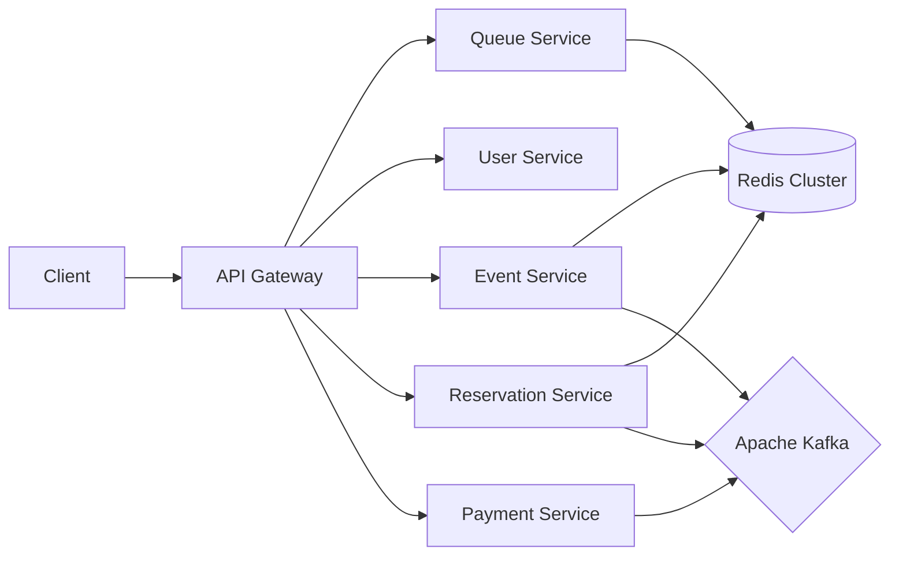

# Ticket Queue

대규모 트래픽이 발생하는 콘서트 예매 환경에서 **데이터 정합성**과 **시스템 안정성**을 보장하기 위해 설계된 마이크로서비스 기반 티켓팅 시스템입니다.

## 1. 프로젝트 개요

유명 아티스트의 콘서트 예매 시 발생하는 트래픽 폭주(Thundering Herd) 상황을 시뮬레이션하고, 이를 기술적으로 해결하는 데 초점을 맞췄습니다.  
단순한 CRUD 기능을 넘어, **대용량 동시성 제어**, **분산 트랜잭션 관리**, **이벤트 기반 아키텍처**를 통해 안정적인 서비스를 제공하는 것을 목표로 합니다.

*   **핵심 과제:**
    *   대기열 시스템을 통한 유량 제어 (Backpressure)
    *   분산 환경에서의 좌석 중복 선점 방지 (Distributed Lock)
    *   서비스 간 데이터 일관성 보장 (SAGA, Outbox Pattern)

## 2. 주요 기능

*   **대기열 시스템 (Virtual Waiting Room):** 접속 순서대로 대기열 토큰을 발급하고, 서버 처리량에 맞춰 순차적으로 입장시키는 유량 제어 시스템
*   **공연 및 좌석 조회:** Redis 캐싱을 활용한 고성능 조회 및 실시간 좌석 등급/상태 확인
*   **좌석 선점 (Temporary Reservation):** 결제 전 5분간 좌석을 선점하며, 동시성 이슈를 원천 차단
*   **결제 및 예매 확정:** 외부 PG사(PortOne) 연동 및 결제 성공 시 비동기 예매 확정 처리
*   **보안 및 인증:** JWT 기반 인증, RTR(Refresh Token Rotation), 본인인증(CI/DI)을 통한 1인 1계정 강제

## 3. 시스템 아키텍처

서비스의 책임과 역할을 명확히 분리하기 위해 MSA(Microservices Architecture)를 채택했습니다.

### 3.1 Architecture Overview

### 3.2 Tech Stack

| Category | Technology | Usage |
|:---:|:---:|:---|
| **Language** | Java 21 | 최신 언어 스펙 활용 |
| **Framework** | Spring Boot 4.0, Spring Cloud | 마이크로서비스 구축 및 Gateway |
| **Database** | PostgreSQL 18 | 서비스별 스키마 분리 (Logical Separation) |
| **Cache/NoSQL** | Redis 7.x | 대기열(Sorted Set), 분산 락, 캐싱 |
| **Messaging** | Apache Kafka 4.x | 서비스 간 비동기 이벤트 통신 (EDA) |
| **Infra** | Docker Compose, LocalStack | 로컬 및 클라우드 환경 통합 |

## 4. 동시성 및 트래픽 처리 전략

티켓팅 시스템의 핵심인 "동시성 제어"를 위해 각 단계별로 다른 전략을 수립했습니다.

### 4.1 대기열 (Flow Control)
*   **문제:** 수만 명의 사용자가 동시에 DB에 접근할 경우 커넥션 고갈 및 서비스 다운 발생
*   **해결:** **Redis Sorted Set**을 활용한 토큰 기반 대기열 구현
    *   `ZADD`로 타임스탬프(Score) 기준 줄 세우기 수행
    *   스케줄러가 1초마다 허용량(Token) 만큼만 진입 허용 (Lua Script로 원자성 보장)
    *   API Gateway에서 유효한 토큰(`X-Queue-Token`)이 없는 요청을 사전에 차단

### 4.2 좌석 선점 (Concurrency Control)
*   **문제:** 마지막 1석을 두고 수백 명이 동시에 "예매하기"를 눌렀을 때 갱신 분실(Lost Update) 발생 가능.
*   **해결:** **Redisson 분산 락(Distributed Lock)** 적용
    *   Key: `seat:hold:{scheduleId}:{seatId}`
    *   Pub/Sub 방식을 사용하여 스핀 락(Spin Lock) 대비 Redis 부하 감소
    *   락 획득 후 DB 상태 변경 및 Redis TTL(5분) 설정을 한 트랜잭션처럼 관리

### 4.3 데이터 일관성 (Distributed Transaction)
*   **문제:** 결제는 성공했으나 예매 서버 장애로 티켓이 발권되지 않는 데이터 불일치 위험
*   **해결:** **SAGA Pattern (Choreography) + Transactional Outbox Pattern**
    1.  **Outbox Pattern:** DB 트랜잭션 커밋과 동시에 `outbox_events` 테이블에 이벤트 저장 (원자성 보장)
    2.  **Publisher:** 별도 Poller가 Outbox 테이블을 읽어 Kafka로 메시지 발행 (At-least-once)
    3.  **Consumer:** 결제 성공 이벤트 수신 시 예매 확정 처리 (Idempotency 보장)
    4.  **Compensation:** 결제 실패 시 보상 트랜잭션을 발동하여 선점된 좌석 해제

## 5. 데이터 모델링

MSA 원칙에 따라 데이터베이스는 물리적으로 단일 인스턴스를 사용하되, 논리적으로 **Schema**를 분리하여 서비스 간 데이터 격리를 실현했습니다.

### 5.1 주요 엔티티 및 상태 흐름
*   **Event Schedule (공연 회차):** `UPCOMING` → `ONGOING` (티켓 오픈) → `ENDED`
*   **Seat (좌석):** `AVAILABLE` → `HOLD` (Redis 선점) → `SOLD` (RDB 확정)
*   **Reservation (예매):** `PENDING` (좌석 선점) → `CONFIRMED` (결제 완료) or `CANCELLED`

### 5.2 ERD 설계 특징
*   서비스 간 직접적인 FK(Foreign Key) 참조를 제거하고 ID만 저장하여 독립성 확보
*   `outbox_events`, `processed_events` 테이블을 통해 메시징 신뢰성 인프라 구축

