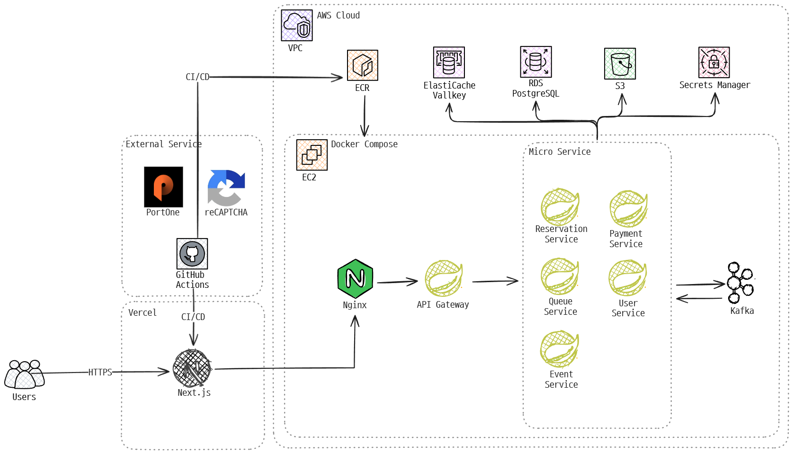

# Ticket Queue
MSA 기반 대규모 트래픽 콘서트 티켓팅 시스템

## 프로젝트 개요

이 프로젝트가 해결하는 핵심 기술 문제는 다음 두 가지입니다:

1. **초당 수천 건 동시 요청 시 좌석 이중 선점 문제 (Race Condition)**
   - 마지막 1석을 두고 수백 명이 동시 예매 시도
   - 분산 환경에서 원자성 보장 필요

2. **결제 성공 후 예매 서비스 장애 시 데이터 정합성 문제 (Partial Failure)**
   - 결제는 성공했지만 예매 미확정 → 돈만 빠지고 티켓 없음
   - 분산 트랜잭션의 최종 일관성 보장 필요

## Team

| Name | Role | 개인 문서 |
|------|------|--------|
|  | Backend / API Gateway, Queue Service, Event Service | [최태권.md](docs/contributions/최태권.md) |
|  | Backend / User Service, Reservation Service, Payment Service | [임현정.md](docs/contributions/임현정.md) |

---
## System Architecture

## 핵심 문제 및 팀 수준의 의사 결정

### Problem 1: Thundering Herd (트래픽 폭주)

**Why hard**
- 인기 콘서트 오픈 시 수만 명이 동시 접속
- 일반적인 웹 서버 DB 커넥션 풀은 수십~수백 개
- 수만 건의 동시 요청이 DB를 직접 치면 커넥션 고갈 → 서비스 다운

**Decision**
- Redis Sorted Set 기반 대기열 시스템
- Lua Script로 원자적 배치 승인 (10명/초)
- 배치 승인된 사용자에게만 Queue Token 발급
- API Gateway에서 Token 검증 후 예매 진입 허용

**Trade-off**
- **장점**: P95 < 100ms 달성, 원자성 보장, 36,000명/시간 처리
- **단점**: Redis SPOF 위험 수용 (비용 대비 Multi-AZ Replication 제외)
- **배제한 대안**: RabbitMQ (P95 요구사항 미충족), DB Queue (락 경합으로 처리량 부족)

### Problem 2: 좌석 이중 선점 (Race Condition)

**Why hard**
- 마지막 1석에 수백 명 동시 요청
- 일반적인 Spin Lock 방식: Redis에 수백 개 스레드가 폴링 → CPU 100% 도달
- DB Lock 방식: 단일 DB에서 병목 발생

**Decision**
- Redisson Pub/Sub 기반 분산 락
- `tryLock(15초 대기, 300초 보유)` - 락 대기 중인 스레드에게만 알림 전송
- TTL 5분으로 자동 해제 (데드락 방지)

**Trade-off**
- **장점**: Spin Lock 대비 Redis 부하 90% 감소, 데드락 자동 복구
- **단점**: 15초 대기 시간으로 사용자 경험 저하 수용 (하지만 대부분 5초 내 해제)
- **배제한 대안**: DB Lock (단일 DB 병목), Spin Lock (Redis CPU 폭주)

### Problem 3: 부분 실패 (Partial Failure)

**Why hard**
- 결제 성공 → 예매 확정 → 좌석 SOLD 플로우에서 중간 장애 가능
- DB 커밋 후 Kafka 발행 전 애플리케이션 장애 시 이벤트 유실
- 분산 환경에서 ACID 트랜잭션 보장 불가

**Decision**
- SAGA Orchestration Pattern (Payment Service가 Orchestrator)
- Transactional Outbox Pattern (이벤트를 DB에 먼저 저장, Poller가 Kafka 발행)
- Consumer 멱등성 보장 (`common.processed_events` 테이블 복합 PK)

**Trade-off**
- **장점**: 이벤트 유실 방지, 최종 일관성 보장, 실패 추적 용이
- **단점**: Outbox Poller 1초 지연 수용, DB 부하 증가 (향후 Debezium CDC 고려)
- **배제한 대안**: Choreography (디버깅 어려움), 2PC (가용성 저하)

## Backend Architecture

### 서비스 선택 이유

6개 MSA 서비스로 분리한 이유:
- **독립 스케일링**: Queue Service만 수평 확장 가능 (대기열 트래픽 집중)
- **장애 격리**: 결제 실패가 대기열 시스템에 영향 없음
- **2인 병렬 개발**: API Gateway/Event/Queue vs User/Reservation/Payment

### 단일 PostgreSQL + Schema Isolation

**선택 이유**:
- 비용 효율성 (6개 DB 인스턴스 운영 비용 vs 단일 인스턴스)
- 로컬 개발 환경 단순화
- 물리 분리 마이그레이션 경로 확보 (스키마 격리 설계 덕분에 코드 변경 없이 가능)

**선택하지 않은 대안**:
- 서비스별 물리 DB 분리: 초기 단계에서 과도한 복잡도
- 공유 DB: 서비스 간 직접 쿼리 허용 시 결합도 증가

### Kafka KRaft 모드

**선택 이유**:
- Zookeeper 운영 부담 제거
- 단일 브로커로 시작, 향후 3브로커 클러스터 확장 가능

## 동시성 & Traffic 전략

### 대기열 시스템 (Queue Service)

- **자료구조**: Redis Sorted Set (`queue:{scheduleId}`)
- **원자적 배치 승인**: Lua Script로 `ZRANGE` + `ZREM` + Token 발급 (10명/초)
- **처리량**: 36,000명/시간
- **용량 제한**: 회차당 최대 50,000명 (초과 시 503)

### 분산 락 (Reservation Service)

- **구현**: Redisson Pub/Sub Lock (`seat:hold:{scheduleId}:{seatId}`)
- **대기/보유 시간**: `tryLock(15초 대기, 300초 보유)`
- **자동 해제**: TTL 5분 만료 시 Redis가 자동 삭제 (데드락 방지)
- **finally 블록**: 애플리케이션 장애 시에도 락 해제 보장

### 좌석 상태 추적 (Event Service + Reservation Service)

- **HOLD 상태**: Redis SET `hold_seats:{scheduleId}` 조회 (O(1))
  - KEYS 명령 O(N) 회피 (Production 환경에서 치명적)
- **SOLD 상태**: Event Service 내부 API `/internal/seats/status/{scheduleId}` 호출
- **AVAILABLE**: HOLD도 SOLD도 아닌 좌석

### 이벤트 정합성 (모든 Consumer 서비스)

1. **Transactional Outbox** (Producer):
   - 비즈니스 로직 + `common.outbox_events` INSERT (동일 트랜잭션)
   - Outbox Poller가 1초마다 미발행 이벤트를 Kafka로 발행 (재시도 3회)

2. **Consumer 멱등성** (Consumer):
   - `common.processed_events` 테이블에 `(event_id, consumer_service)` 복합 PK
   - Consumer 로직 최상단에 먼저 INSERT 시도 (원자적 중복 체크)
   - `DataIntegrityViolationException` 발생 시 이미 처리된 이벤트로 간주하고 종료
   - DB가 Race Condition을 원자적으로 해결 (가장 안전)

### 재시도 전략 (DLQ)

- **재시도 가능**: 지수 백오프 3회 (TimeoutException, 네트워크 오류)
- **재시도 불가**: 즉시 DLQ 이동 (ValidationException, DataIntegrityViolationException)

## Team Constraints

### 의도적 제외 항목 (2인 팀 한계)

우선순위 판단으로 다음 항목들은 제외:
- 물리 DB 분리 (스키마 격리로 마이그레이션 경로 확보)
- Redis Cluster (SPOF 위험 수용, 비용 대비 효과 낮음)
- 모니터링 인프라 (Prometheus/Grafana 설정 시간 vs 코어 로직 구현)
- CI/CD 파이프라인 (수동 배포로 시작, 향후 GitHub Actions 도입)

### 지켜낸 핵심 우선순위

2인 팀에서도 절대 포기하지 않은 영역:
1. **데이터 정합성**: Outbox Pattern + Consumer 멱등성 (P0 요구사항)
2. **동시성 제어**: Redisson 분산 락 (비즈니스 핵심)
3. **장애 복구**: SAGA 보상 트랜잭션 (결제 실패 시 자동 롤백)

## 담당자 별 구현 항목

| 영역 | 담당자 | 상세 문서 |
|------|--------|----------|
| **Traffic Control & Queue Infrastructure** | 최태권 | [최태권.md](docs/contributions/최태권.md) |
| - API Gateway (라우팅, JWT 검증, Circuit Breaker) | | |
| - Queue Service (Redis Sorted Set, Lua Script 배치) | | |
| - Event Service (Kafka Consumer, 좌석 상태 동기화) | | |
| | | |
| **Distributed Transactions & Reservation Logic** | 임현정 | [임현정.md](docs/contributions/임현정.md) |
| - User Service (JWT + RTR 인증, reCAPTCHA) | | |
| - Reservation Service (Redisson 분산 락, Outbox) | | |
| - Payment Service (SAGA Orchestration, PortOne) | | |

## 추후 개선할 사항

트래픽 10배 증가 가정 시 우선 개선 항목:

1. **Outbox Poller → Debezium CDC**
   - 현재: 1초마다 SELECT 쿼리 → DB 부하
   - 개선: PostgreSQL WAL 기반 Change Data Capture → DB 부하 제거
   - 근거: Outbox 테이블 폴링 부하가 병목 가능성 높음

2. **단일 PostgreSQL → 서비스별 물리 분리**
   - 현재: Schema Isolation (논리적 분리)
   - 개선: 각 스키마를 별도 DB 인스턴스로 마이그레이션
   - 근거: 스키마 격리 설계 덕분에 애플리케이션 코드 변경 없이 가능

3. **Redis 단일 노드 → Sentinel/Cluster**
   - 현재: SPOF 위험 수용
   - 개선: Redis Sentinel (자동 Failover) 또는 Cluster (샤딩)
   - 근거: 대기열 시스템 장애 = 전체 서비스 중단

4. **Kafka 단일 브로커 → 3브로커 클러스터**
   - 현재: Replication Factor 1 (데이터 유실 위험)
   - 개선: 3브로커 + RF 3 + Min ISR 2
   - 근거: 이벤트 유실 시 데이터 정합성 깨짐

5. **Consumer Lag 모니터링 + 알람**
   - 현재: Kafka UI 수동 확인
   - 개선: CloudWatch Metrics + Consumer Lag 10,000 초과 시 알람
   - 근거: 이벤트 처리 지연 감지 실패 시 사용자 경험 저하

## 기술 Stack

- **Language**: Kotlin 2.1.0 (JVM 21)
- **Framework**: Spring Boot 3.5.10, Spring Cloud Gateway
- **Database**: PostgreSQL 18 (Schema Isolation)
- **Cache/Queue**: Valkey 8.1.5 (Redis 호환)
- **Messaging**: Apache Kafka 4.1.1 KRaft
- **Distributed Lock**: Redisson 3.40.2
- **Resilience**: Resilience4j 2.2.0

## 문서

- [REQUIREMENTS.md](docs/REQUIREMENTS.md) - 110개 요구사항 (기능 74개 + 비기능 36개)
- [architecture/](docs/architecture/) - 8개 아키텍처 설계 문서
- [specification/](docs/specification/) - 6개 서비스 API 명세
- [contributions/](docs/contributions/) - 개인 기여 문서
