# 📐 아키텍처 설계서

## 문서 정보

| 항목 | 내용 |
|------|------|
| 문서명 | 콘서트 티켓팅 시스템 아키텍처 설계서 |
| 버전 | 1.0.0 |
| 작성일 | 2026-01-11 |
| 최종 수정일 | 2026-01-11 |
| 상태 | Draft |

### 문서 개정 이력

| 버전 | 날짜 | 작성자 | 변경 내용 |
|------|------|--------|----------|
| 1.0.0 | 2026-01-11 | 개발팀 | 초안 작성 |

---

## 목차

1. [문서 개요](#1-문서-개요)
2. [시스템 개요](#2-시스템-개요)
3. [아키텍처 패턴 및 설계 원칙](#3-아키텍처-패턴-및-설계-원칙)
4. [마이크로서비스 구성](#4-마이크로서비스-구성)
5. [인프라 아키텍처](#5-인프라-아키텍처)
6. [데이터 아키텍처](#6-데이터-아키텍처)
7. [메시징 아키텍처](#7-메시징-아키텍처)
8. [API 설계](#8-api-설계)
9. [보안 아키텍처](#9-보안-아키텍처)
10. [대기열 시스템 설계](#10-대기열-시스템-설계)
11. [좌석 예매 시스템 설계](#11-좌석-예매-시스템-설계)
12. [결제 시스템 설계](#12-결제-시스템-설계)
13. [배포 및 CI/CD](#13-배포-및-cicd)
14. [모니터링 및 로깅](#14-모니터링-및-로깅)
15. [성능 최적화 전략](#15-성능-최적화-전략)
16. [테스트 전략](#16-테스트-전략)
17. [운영 계획](#17-운영-계획)
18. [기술 부채 및 개선 사항](#18-기술-부채-및-개선-사항)
19. [부록](#19-부록)

---

## 1. 문서 개요

### 1.1 문서 목적

본 문서는 **콘서트/공연 티켓팅 시스템**의 아키텍처 설계를 정의하고, 시스템의 구조, 컴포넌트 간 상호작용, 기술 스택, 그리고 설계 결정 사항을 문서화합니다.

**주요 목적:**
- 개발팀이 시스템 구조를 명확히 이해하고 일관된 방향으로 개발할 수 있도록 지침 제공
- 마이크로서비스 간 책임과 경계를 명확히 정의하여 개발 충돌 최소화
- 기술적 의사결정의 근거를 문서화하여 향후 유지보수 및 확장 용이성 확보
- 요구사항 명세서([REQUIREMENTS.md](./REQUIREMENTS.md))의 111개 요구사항을 아키텍처로 구현하는 방법 제시

### 1.2 대상 독자

- **개발자 (A개발자, B개발자)**: 실제 구현을 담당하는 백엔드/프론트엔드 개발자
- **아키텍트**: 시스템 설계 및 기술 의사결정 담당자
- **프로젝트 매니저**: 프로젝트 범위 및 일정 관리 담당자
- **DevOps 엔지니어**: 인프라 구축 및 배포 파이프라인 구성 담당자

### 1.3 문서 범위

본 문서는 다음을 포함합니다:
- MSA(Microservices Architecture) 기반 시스템 아키텍처
- 6개 마이크로서비스의 구성 및 상호작용
- AWS 클라우드 인프라 구성 (무료티어 최적화)
- LocalStack 기반 로컬 개발 환경
- 데이터베이스, 캐시, 메시징 시스템 설계
- 보안, 성능, 모니터링 전략

본 문서는 다음을 포함하지 않습니다:
- 프론트엔드 상세 설계 (Next.js 구조는 개요만 포함)
- 상세 API 스펙 (Swagger/OpenAPI 문서로 별도 관리)
- 개발 코딩 컨벤션 (별도 문서로 관리)

### 1.4 아키텍처 설계 원칙

1. **확장성 (Scalability)**
   - 마이크로서비스 아키텍처로 서비스별 독립적 확장 가능
   - Redis 기반 대기열로 대규모 동시 접속 처리 (50,000명)

2. **가용성 (Availability)**
   - Circuit Breaker 패턴으로 장애 전파 방지
   - Redis/RDB 이중화 및 자동 백업
   - 목표: 99.9% 가용성

3. **성능 (Performance)**
   - Redis 캐싱으로 조회 성능 최적화
   - P95 응답 시간 목표 (대기열 진입 < 100ms, 조회 < 50ms)
   - 비동기 이벤트 기반 아키텍처로 응답 시간 단축

4. **보안 (Security)**
   - JWT 기반 인증/인가
   - reCAPTCHA로 봇/매크로 차단
   - AES-256 암호화로 개인정보 보호
   - 본인인증(CI/DI)으로 1인 1계정 강제

5. **데이터 일관성 (Data Consistency)**
   - SAGA 패턴으로 분산 트랜잭션 관리
   - Transactional Outbox 패턴으로 이벤트 발행 신뢰성 보장
   - Redisson 분산 락으로 좌석 선점 동시성 제어

6. **비용 효율성 (Cost Efficiency)**
   - AWS 무료티어 최대 활용
   - 단일 PostgreSQL 인스턴스에 스키마 분리 (논리적 DB per Service)
   - LocalStack으로 로컬 개발 비용 제로
   - CloudWatch 무료 한도 내 모니터링

7. **개발 생산성 (Developer Productivity)**
   - Docker Compose로 로컬 환경 통합 관리
   - GitHub Actions로 CI/CD 자동화
   - 명확한 서비스 경계로 개발 충돌 최소화

### 1.5 기술 스택 개요

| 계층 | 기술 | 용도 |
|------|------|------|
| **Frontend** | Next.js 15+ | React 기반 SSR/CSR |
|  | Vercel | 프론트엔드 배포 플랫폼 |
| **API Gateway** | Spring Cloud Gateway | 통합 진입점, 라우팅, 인증 |
| **Backend** | Spring Boot 3.x | 마이크로서비스 프레임워크 |
|  | Java 21+ | 백엔드 언어 |
| **Database** | PostgreSQL 18 | RDB (단일 인스턴스, 스키마 분리) |
|  | Redis 7.x | 캐시, 대기열, 분산 락 |
| **Messaging** | Apache Kafka 3.x | 이벤트 스트리밍 |
| **Security** | Spring Security | 인증/인가 프레임워크 |
|  | JWT | 토큰 기반 인증 |
|  | reCAPTCHA | 봇 차단 |
| **Resilience** | Resilience4j | Circuit Breaker, Rate Limiter |
| **Infrastructure** | AWS (RDS, ElastiCache, EC2, ALB) | 클라우드 인프라 |
|  | LocalStack | 로컬 AWS 에뮬레이션 |
|  | Docker / Docker Compose | 컨테이너 |
| **CI/CD** | GitHub Actions | 빌드, 테스트, 배포 자동화 |
| **Monitoring** | AWS CloudWatch | 로그, 메트릭, 알람 |
|  | Spring Cloud Sleuth | 분산 추적 |

---

## 2. 시스템 개요

### 2.1 비즈니스 목적 및 배경

**비즈니스 목적:**
대규모 동시 접속이 발생하는 콘서트/공연 티켓 예매 시스템을 안정적으로 운영하며, 공정한 예매 기회를 제공하고 부정 예매(매크로, 중복 가입 등)를 차단합니다.

**핵심 비즈니스 가치:**
- **공정성**: 대기열 시스템으로 선착순 공정성 확보
- **보안성**: 본인인증(CI/DI), CAPTCHA로 1인 1계정 강제 및 봇 차단
- **안정성**: 대규모 트래픽 대응 (공연당 50,000명 대기열, 36,000명/시간 처리)
- **신뢰성**: SAGA 패턴으로 결제-예매 데이터 일관성 보장

**배경:**
- 기존 티켓팅 시스템의 과부하 및 불공정 예매 문제 해결 필요
- MSA 아키텍처로 서비스별 독립 확장 및 장애 격리
- 이벤트 기반 아키텍처로 느슨한 결합 및 확장성 확보

### 2.2 주요 기능 요약

#### 2.2.1 인증 및 회원 관리 (User Service)
- **회원가입**: 약관동의 → CAPTCHA → 본인인증(CI/DI) → 정보입력
- **로그인**: 이메일/비밀번호 + CAPTCHA, JWT 토큰 발급
- **소셜 로그인**: 카카오, 네이버, 구글 OAuth2 지원 (선택)
- **프로필 관리**: 조회, 수정, 비밀번호 변경, 회원 탈퇴

**관련 요구사항**: REQ-AUTH-001 ~ REQ-AUTH-021 (21개)

#### 2.2.2 공연 관리 (Event Service)
- **공연 CRUD**: 생성, 수정, 삭제 (관리자)
- **공연 조회**: 목록 조회 (페이징, 필터링, 검색), 상세 조회
- **좌석 정보 조회**: 등급별(VIP/S/A/B) 좌석 그룹핑 및 가격 조회
- **공연장/홀 관리**: 공연장 및 홀 정보 CRUD
- **좌석 상태 관리**: Kafka 이벤트 수신하여 좌석 상태 업데이트

**관련 요구사항**: REQ-EVT-001 ~ REQ-EVT-031 (24개)

#### 2.2.3 대기열 (Queue Service)
- **대기열 진입**: Redis Sorted Set 기반, 공연별 최대 50,000명
- **대기열 상태 조회**: REST 폴링(5초 권장), 현재 순서 및 예상 대기 시간
- **배치 승인**: 1초마다 10명씩 승인 (Lua 스크립트 원자성 보장)
- **Queue Token 발급**: Reservation Token (qr_xxx), Payment Token (qp_xxx)
- **대기열 만료**: Token TTL 10분, 자동 제거

**관련 요구사항**: REQ-QUEUE-001 ~ REQ-QUEUE-021 (10개)

#### 2.2.4 예매 (Reservation Service)
- **좌석 선점**: Redisson 분산 락, Redis 5분 TTL
- **좌석 변경**: 기존 락 해제 → 신규 락 획득
- **예매 확정**: 결제 성공 이벤트 수신 시 PENDING → CONFIRMED
- **예매 취소**: 사용자 취소 (공연 당일 불가), 보상 트랜잭션 (결제 실패 시)
- **나의 예매 내역**: 사용자별 예매 목록 조회

**관련 요구사항**: REQ-RSV-001 ~ REQ-RSV-013 (12개)

#### 2.2.5 결제 (Payment Service)
- **결제 프로세스**: PortOne 연동, 신용카드 결제
- **결제 상태 관리**: PENDING / SUCCESS / FAILED / REFUNDED
- **멱등성 보장**: paymentKey 기반 중복 방지
- **SAGA 패턴**: 결제 성공 → 예매 확정, 결제 실패 → 예매 취소 (보상 트랜잭션)
- **Kafka 이벤트 발행**: payment.success, payment.failed

**관련 요구사항**: REQ-PAY-001 ~ REQ-PAY-015 (15개)

#### 2.2.6 API Gateway
- **동적 라우팅**: Path 기반 5개 서비스 라우팅
- **JWT 토큰 검증**: 만료/변조 확인, 사용자 정보 전달
- **Rate Limiting**: IP 기반, 사용자 기반 제한
- **Circuit Breaker**: 다운스트림 서비스 장애 격리
- **CORS, 보안 헤더**: 프론트엔드 통신 지원

**관련 요구사항**: REQ-GW-001 ~ REQ-GW-026 (26개)

### 2.3 비기능 요구사항 요약

#### 2.3.1 성능 요구사항
| 항목 | 목표 | 관련 요구사항 |
|------|------|---------------|
| 대기열 진입 | P95 < 100ms | REQ-QUEUE-015 |
| 대기열 조회 | P95 < 50ms | REQ-QUEUE-015 |
| 공연 목록 조회 | P95 < 200ms | REQ-EVT-004 |
| 공연 상세 조회 | P95 < 100ms | REQ-EVT-005 |
| 좌석 정보 조회 | P95 < 300ms | REQ-EVT-006 |
| 대기열 처리량 | 36,000명/시간 (10명/초) | REQ-QUEUE-005 |
| 대기열 용량 | 공연당 최대 50,000명 | REQ-QUEUE-010 |

#### 2.3.2 보안 요구사항
- **인증**: JWT Access/Refresh Token (1시간/7일)
- **암호화**: 비밀번호 BCrypt, 개인정보 AES-256 (선택)
- **본인인증**: PortOne CI/DI로 1인 1계정 강제
- **봇 차단**: reCAPTCHA (회원가입, 로그인)
- **토큰 블랙리스트**: Redis 기반, TTL 관리

#### 2.3.3 가용성 요구사항
- **Redis 가용성**: 99.9%
- **Circuit Breaker**: 실패율 임계값 초과 시 Circuit Open
- **Timeout**: API Gateway 기본 30초, Payment 60초
- **Retry**: GET/PUT/DELETE만 최대 2회 재시도

#### 2.3.4 확장성 요구사항
- **Auto Scaling**: 최소 1, 최대 3 인스턴스
- **서비스별 독립 확장**: MSA 아키텍처
- **Redis Cluster**: 향후 확장 고려 (초기 단일 노드)

### 2.4 시스템 제약사항 및 가정사항

#### 2.4.1 제약사항
1. **비용 제약**: AWS 무료티어 최대 활용, 월 예산 최소화
   - RDS: db.t3.micro (무료티어 750시간/월)
   - ElastiCache: cache.t2.micro (무료티어)
   - EC2: t2.micro (무료티어 750시간/월)
   - CloudWatch: 무료티어 한도 (로그 5GB, 메트릭 10개, 알람 10개)

2. **개발 리소스**: A개발자 (Gateway/Event/Queue), B개발자 (User/Reservation/Payment)

3. **외부 서비스 의존성**:
   - PortOne 테스트 모드 (결제)
   - Google reCAPTCHA v2 (봇 차단)
   - OAuth2 Provider (카카오, 네이버, 구글)

4. **데이터베이스**: 단일 PostgreSQL 인스턴스, 스키마 분리 (비용 절감)

5. **Kafka**: EC2 자체 구축 (MSK 고비용), 초기 단일 브로커

#### 2.4.2 가정사항
1. **트래픽 패턴**:
   - 평상시: 저트래픽
   - 티켓 오픈 시: 순간 50,000명 동시 접속 (공연당)
   - 대기열 처리: 36,000명/시간 (10명/초)

2. **공연 규모**:
   - 동시 진행 공연: 최대 10개
   - 공연당 좌석: 평균 3,000석
   - 공연당 대기열: 최대 50,000명

3. **사용자 행동**:
   - 대기열 상태 폴링: 5초 간격
   - 좌석 선점 후 결제: 5분 이내
   - 1회 예매: 최대 4장

4. **배포 환경**:
   - 로컬 개발: LocalStack + Docker Compose
   - 운영 환경: AWS (단일 리전, 초기 Single-AZ)
   - 프론트엔드: Vercel

---

## 3. 아키텍처 패턴 및 설계 원칙

### 3.1 MSA (Microservices Architecture) 채택 이유

#### 3.1.1 채택 배경
1. **독립적 확장성**:
   - 대기열 서비스는 트래픽 폭증 시 독립적으로 스케일 아웃
   - 결제 서비스는 PG 연동 부하에 따라 별도 확장

2. **장애 격리**:
   - 결제 서비스 장애 시 예매 조회는 정상 작동
   - Circuit Breaker로 장애 전파 방지

3. **기술 스택 유연성**:
   - 서비스별 최적 기술 선택 가능 (향후 확장 고려)
   - Redis 기반 대기열, RDB 기반 예매/결제

4. **개발 생산성**:
   - A개발자 (Gateway/Event/Queue), B개발자 (User/Reservation/Payment) 병렬 개발
   - 명확한 서비스 경계로 충돌 최소화

#### 3.1.2 트레이드오프
- **복잡성 증가**: 분산 트랜잭션, 서비스 간 통신 오버헤드
  - **대응**: SAGA 패턴, Transactional Outbox 패턴으로 관리
- **운영 부담**: 6개 서비스 독립 배포, 모니터링
  - **대응**: Docker Compose, GitHub Actions로 자동화

### 3.2 도메인 주도 설계 (DDD) 적용

#### 3.2.1 Bounded Context 정의
각 마이크로서비스는 하나의 Bounded Context로 설계:

```
┌─────────────────────────────────────────────────────────┐
│  User Context                                           │
│  - 회원, 인증, 프로필                                    │
└─────────────────────────────────────────────────────────┘

┌─────────────────────────────────────────────────────────┐
│  Event Context                                          │
│  - 공연, 공연장, 홀, 좌석                                │
└─────────────────────────────────────────────────────────┘

┌─────────────────────────────────────────────────────────┐
│  Queue Context                                          │
│  - 대기열, 토큰                                         │
└─────────────────────────────────────────────────────────┘

┌─────────────────────────────────────────────────────────┐
│  Reservation Context                                    │
│  - 예매, 좌석 선점                                      │
└─────────────────────────────────────────────────────────┘

┌─────────────────────────────────────────────────────────┐
│  Payment Context                                        │
│  - 결제, 환불                                           │
└─────────────────────────────────────────────────────────┘
```

#### 3.2.2 Aggregate 설계 원칙
- 각 서비스 내 트랜잭션 경계는 Aggregate Root로 관리
- 서비스 간 참조는 ID 기반 (Foreign Key 없음)
- 이벤트 기반 통신으로 느슨한 결합 유지

### 3.3 Event-Driven Architecture (EDA) 패턴

#### 3.3.1 적용 배경
- **비동기 처리**: 결제 성공 후 예매 확정, 좌석 상태 업데이트를 비동기로 처리
- **느슨한 결합**: 서비스 간 직접 호출 최소화, Kafka 이벤트로 통신
- **확장성**: 이벤트 발행/구독 모델로 신규 Consumer 추가 용이

#### 3.3.2 이벤트 플로우 예시

**예매 → 결제 → 확정 플로우:**
```
1. Reservation Service: 좌석 선점 및 예매 생성 (PENDING)
2. User → Payment Service: 결제 요청 (결제하기 버튼 클릭)
3. Payment Service → PortOne: 결제 승인
4. Payment Service → Kafka: payment.success 발행
5. Reservation Service (Consumer): 예매 확정 (CONFIRMED)
6. Event Service (Consumer): 좌석 상태 업데이트 (SOLD)
```

**결제 실패 → 보상 트랜잭션:**
```
1. User → Payment Service: 결제 요청
2. Payment Service → PortOne: 결제 승인 시도
3. PortOne → Payment Service: 결제 실패
4. Payment Service → Kafka: payment.failed 발행
5. Reservation Service (Consumer): 예매 취소 (CANCELLED)
6. Event Service (Consumer): 좌석 선점 해제 (AVAILABLE)
```

### 3.4 SAGA 패턴 (분산 트랜잭션)

#### 3.4.1 오케스트레이션 기반 SAGA
- **Orchestrator**: Payment Service가 SAGA 진행 관리
- **성공 시나리오**:
  1. 결제 요청 → PortOne 결제 성공
  2. Kafka 이벤트 발행 (`payment.success`)
  3. Reservation Service: 예매 확정
  4. Event Service: 좌석 상태 업데이트

- **실패 시나리오 (보상 트랜잭션)**:
  1. 결제 요청 → PortOne 결제 실패
  2. Kafka 이벤트 발행 (`payment.failed`)
  3. Reservation Service: 예매 취소
  4. Event Service: 좌석 선점 해제

**관련 요구사항**: REQ-PAY-011 (SAGA 패턴), REQ-PAY-012 (보상 트랜잭션)

#### 3.4.2 SAGA vs 2PC 선택 이유
- **2PC (Two-Phase Commit)**: 동기식, 블로킹, 가용성 저하
- **SAGA**: 비동기식, 보상 트랜잭션, 가용성 우선
- **선택 근거**: 티켓팅 시스템은 성능/가용성이 중요하므로 SAGA 선택

### 3.5 Transactional Outbox 패턴

#### 3.5.1 적용 배경
- **문제점**: 서비스 상태 변경 후 Kafka 발행 전 장애 발생 시 이벤트 유실
- **해결책**: DB 트랜잭션 내 Outbox 테이블에 이벤트 저장 → Poller/CDC로 Kafka 발행

#### 3.5.2 구현 방안
1. **Outbox 테이블 설계** (`common.outbox_events`):
   ```sql
   CREATE TABLE outbox_events (
     id UUID PRIMARY KEY,
     aggregate_type VARCHAR(255),  -- 'Reservation', 'Payment' 등
     aggregate_id UUID,
     event_type VARCHAR(255),       -- 'ReservationConfirmed', 'PaymentSuccess' 등
     payload JSONB,
     created_at TIMESTAMP,
     published BOOLEAN DEFAULT FALSE,
     published_at TIMESTAMP
   );
   ```

2. **이벤트 발행 프로세스**:
   - 비즈니스 로직 실행 + Outbox INSERT (동일 트랜잭션)
   - Poller (Spring @Scheduled) 또는 CDC (Debezium)가 주기적으로 Outbox 읽어 Kafka 발행
   - 발행 성공 시 `published = TRUE` 업데이트

**관련 요구사항**: REQ-RSV-012 (Transactional Outbox Pattern), REQ-PAY-013 (Kafka 이벤트 발행)

### 3.6 Circuit Breaker 패턴

#### 3.6.1 적용 위치
- **API Gateway**: 다운스트림 서비스 호출 시
- **Payment Service**: PortOne API 호출 시
- **Reservation Service**: Feign 클라이언트로 Queue Service 호출 시

#### 3.6.2 Resilience4j 설정 예시
```yaml
resilience4j.circuitbreaker:
  configs:
    default:
      slidingWindowSize: 100           # 최근 100개 요청 기준
      failureRateThreshold: 50         # 50% 이상 실패 시 Circuit Open
      waitDurationInOpenState: 60s     # Open 상태 60초 유지
      permittedNumberOfCallsInHalfOpenState: 10
  instances:
    paymentService:
      baseConfig: default
      waitDurationInOpenState: 60s     # Payment는 대기 시간 60초
```

**관련 요구사항**: REQ-GW-007 (Circuit Breaker 통합), REQ-PAY-009 (Circuit Breaker)

### 3.7 API Gateway 패턴

#### 3.7.1 책임
- **라우팅**: Path 기반으로 5개 서비스로 라우팅
- **인증**: JWT 토큰 검증
- **Rate Limiting**: IP/사용자 기반 제한
- **보안 헤더**: CORS, XSS 방지, HSTS
- **Circuit Breaker**: 다운스트림 장애 격리

**관련 요구사항**: REQ-GW-001 ~ REQ-GW-026 (26개)

### 3.8 CQRS 패턴 적용 여부 검토

#### 3.8.1 현재 설계
- **Event Service**: Redis 캐싱으로 조회 성능 최적화 (CQRS 유사)
  - 쓰기: RDB (PostgreSQL)
  - 읽기: Redis Cache + RDB Fallback

#### 3.8.2 향후 검토 사항
- **대기열 조회**: Redis Sorted Set (이미 CQRS 패턴과 유사)
- **예매 내역 조회**: 트래픽 증가 시 Read Replica 또는 ElasticSearch 검토
- **현재 판단**: 초기 단계에서는 Redis 캐싱으로 충분, 트래픽 증가 시 CQRS 전면 적용 검토

---

## 4. 마이크로서비스 구성

### 4.1 서비스 맵 다이어그램

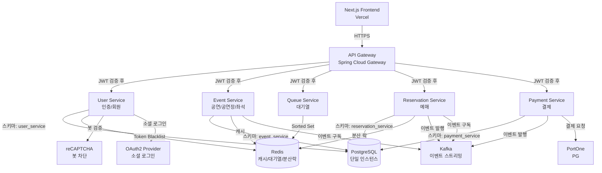

### 4.2 서비스별 책임과 경계

#### 4.2.1 API Gateway Service (담당: A개발자)

**책임:**
- 모든 클라이언트 요청의 단일 진입점
- Path 기반 라우팅으로 각 서비스로 요청 전달
- JWT 토큰 검증 및 사용자 정보 전달
- Rate Limiting (IP, 사용자 기반)
- Circuit Breaker로 장애 격리
- CORS 및 보안 헤더 관리

**주요 엔드포인트:**
- `/auth/**` → User Service
- `/users/**` → User Service
- `/events/**` → Event Service
- `/venues/**` → Event Service
- `/queue/**` → Queue Service
- `/reservations/**` → Reservation Service
- `/payments/**` → Payment Service

**기술 스택:**
- Spring Cloud Gateway 4.x
- Resilience4j (Circuit Breaker, Rate Limiter)
- Spring Security (JWT 검증)

**데이터 저장소:**
- 없음 (Stateless)

**관련 요구사항:** REQ-GW-001 ~ REQ-GW-026 (26개)

---

#### 4.2.2 User Service (담당: B개발자)

**책임:**
- 회원 가입/로그인/로그아웃
- JWT Access/Refresh Token 발급 및 갱신
- 본인인증 (PortOne CI/DI)
- reCAPTCHA 검증
- 소셜 로그인 (OAuth2)
- 프로필 관리 (조회, 수정, 비밀번호 변경, 회원 탈퇴)
- 토큰 블랙리스트 관리 (Redis)

**주요 API:**
- `POST /auth/register` - 회원가입
- `POST /auth/login` - 로그인
- `POST /auth/logout` - 로그아웃
- `POST /auth/refresh` - 토큰 갱신
- `GET /users/me` - 프로필 조회
- `PUT /users/me` - 프로필 수정

**데이터 모델:**
- `users`: 회원 정보 (이메일, 비밀번호 해시, CI, 가입일 등)
- `auth_tokens`: Refresh Token 저장
- `login_history`: 로그인 이력 (선택)

**외부 연동:**
- PortOne (본인인증)
- reCAPTCHA (봇 차단)
- OAuth2 Provider (카카오, 네이버, 구글)

**데이터 저장소:**
- PostgreSQL 스키마: `user_service`
- Redis: 토큰 블랙리스트 (`token:blacklist:{token}`)

**관련 요구사항:** REQ-AUTH-001 ~ REQ-AUTH-021 (21개)

---

#### 4.2.3 Event Service (담당: A개발자)

**책임:**
- 공연 CRUD (관리자)
- 공연 목록 조회 (페이징, 필터링, 검색)
- 공연 상세 조회
- 좌석 정보 조회 (등급별 그룹핑)
- 공연장/홀 관리
- 좌석 초기화 (공연 생성 시)
- Kafka 이벤트 구독하여 좌석 상태 업데이트 (SOLD)
- Redis 캐싱으로 조회 성능 최적화

**주요 API:**
- `POST /events` - 공연 생성 (관리자)
- `GET /events` - 공연 목록 조회
- `GET /events/{id}` - 공연 상세 조회
- `GET /events/{id}/seats` - 좌석 정보 조회
- `POST /venues` - 공연장 생성 (관리자)
- `POST /venues/{venueId}/halls` - 홀 생성 (관리자)

**내부 API (서비스 간 통신 전용):**
- `GET /internal/seats/status/{eventId}` - SOLD 좌석 ID 목록 조회 (Reservation Service용)

**내부 API 상세:**

`GET /internal/seats/status/{eventId}`
- **목적**: Reservation Service가 좌석 상태 조회 시 SOLD 좌석 확인용
- **인증**: 서비스 간 내부 호출 (API Key 또는 서비스 토큰)
- **응답 예시**:
  ```json
  {
    "eventId": "evt_123",
    "soldSeatIds": ["seat_001", "seat_042", "seat_103"]
  }
  ```
- **쿼리**: `SELECT id FROM seats WHERE event_id = ? AND status = 'SOLD'`
- **Rate Limiting**: 불필요 (내부 통신)

**데이터 모델:**
- `events`: 공연 정보
- `venues`: 공연장 정보
- `halls`: 홀 정보 (좌석 템플릿 포함)
- `seats`: 좌석 정보 (eventId, seatNumber, grade, price, status)

**Kafka Consumer:**
- `reservation.events`: 예매 이벤트 수신하여 좌석 상태 SOLD 업데이트
- `payment.events`: 결제 실패 시 좌석 상태 복구

**데이터 저장소:**
- PostgreSQL 스키마: `event_service`
- Redis 캐시:
  - `cache:event:list` - 공연 목록 (TTL: 5분)
  - `cache:event:{eventId}` - 공연 상세 (TTL: 5분)
  - `cache:seats:{eventId}` - 좌석 정보 (TTL: 5분)

**성능 목표:**
- 공연 목록 조회: P95 < 200ms (REQ-EVT-004)
- 공연 상세 조회: P95 < 100ms (REQ-EVT-005)
- 좌석 정보 조회: P95 < 300ms (REQ-EVT-006)

**관련 요구사항:** REQ-EVT-001 ~ REQ-EVT-031 (24개)

---

#### 4.2.4 Queue Service (담당: A개발자)

**책임:**
- 대기열 진입 (Redis Sorted Set, ZADD NX)
- 대기열 상태 조회 (REST 폴링, 5초 권장)
- 배치 승인 (1초마다 10명, Lua 스크립트)
- Queue Token 발급 (Reservation Token, Payment Token)
- 대기열 용량 제한 (공연당 50,000명)
- 사용자당 동시 대기 1개 공연 제한
- Token 만료 처리 (TTL 10분)

**주요 API:**
- `POST /queue/enter` - 대기열 진입
- `GET /queue/status` - 대기열 상태 조회 (Rate Limit: 60회/분)
- `DELETE /queue/leave` - 대기열 이탈 (선택)
- `GET /queue/admin/stats` - 대기열 통계 (관리자, 선택)

**데이터 모델 (Redis):**
- `queue:{eventId}`: Sorted Set (score: timestamp, member: userId)
- `queue:token:{token}`: String (userId, eventId, type) - TTL 10분
- `queue:active:{userId}`: String (eventId) - 중복 대기 방지

**Lua 스크립트 (배치 승인):**
```lua
-- 1초마다 10명 승인
local eventId = KEYS[1]
local count = tonumber(ARGV[1]) or 10
local members = redis.call('ZRANGE', 'queue:' .. eventId, 0, count - 1)
if #members > 0 then
  redis.call('ZREM', 'queue:' .. eventId, unpack(members))
  -- Token 발급 로직
end
return members
```

**데이터 저장소:**
- Redis Sorted Set: 대기열
- Redis String: Token, 중복 방지

**성능 목표:**
- 진입: P95 < 100ms (REQ-QUEUE-015)
- 조회: P95 < 50ms (REQ-QUEUE-015)
- 처리량: 36,000명/시간 (10명/초)

**관련 요구사항:** REQ-QUEUE-001 ~ REQ-QUEUE-021 (10개)

---

#### 4.2.5 Reservation Service (담당: B개발자)

**책임:**
- 좌석 선점 (Redisson 분산 락, Redis 5분 TTL)
- 좌석 변경 (기존 락 해제 → 신규 락 획득)
- 좌석 상태 조회 (Redis HOLD + Event Service Feign 호출로 SOLD 조회)
- 예매 확정 (결제 성공 이벤트 수신)
- 예매 취소 (사용자 요청, 보상 트랜잭션)
- 예매 내역 조회
- 1회 예매 최대 4장 제한
- Queue Token 검증 (Reservation Token)

**주요 API:**
- `GET /reservations/seats/{eventId}` - 좌석 상태 조회
- `POST /reservations/hold` - 좌석 선점
- `PUT /reservations/hold/{reservationId}` - 좌석 변경
- `DELETE /reservations/hold/{reservationId}` - 선점 해제
- `GET /reservations` - 나의 예매 내역
- `DELETE /reservations/{id}` - 예매 취소

**데이터 모델:**
- `reservations`: 예매 정보 (userId, eventId, seatIds, status, createdAt)
  - status: PENDING / CONFIRMED / CANCELLED

**Kafka Producer:**
- `reservation.events`: 예매 취소 시 이벤트 발행

**Kafka Consumer:**
- `payment.events`: 결제 성공 시 예매 확정, 결제 실패 시 예매 취소

**데이터 저장소:**
- PostgreSQL 스키마: `reservation_service`
- Redis 분산 락: `seat:hold:{eventId}:{seatId}` (TTL: 5분)
- Outbox: `common.outbox_events` (선택)

**관련 요구사항:** REQ-RSV-001 ~ REQ-RSV-013 (12개)

---

#### 4.2.6 Payment Service (담당: B개발자)

**책임:**
- 결제 요청 (PortOne 연동)
- PortOne 사전 검증 (Prepare API)
- 결제 승인 및 확인
- 결제 상태 관리 (PENDING/SUCCESS/FAILED/REFUNDED)
- 멱등성 보장 (paymentKey)
- SAGA 오케스트레이션 (결제 성공/실패 분기)
- 보상 트랜잭션 (결제 실패 시 예매 취소 이벤트 발행)
- Queue Token 검증 (Payment Token)
- Circuit Breaker (PortOne API 장애 대응)

**주요 API:**
- `POST /payments` - 결제 요청
- `POST /payments/confirm` - 결제 확인
- `GET /payments/{id}` - 결제 조회
- `GET /payments` - 결제 내역 조회 (선택)

**데이터 모델:**
- `payments`: 결제 정보 (reservationId, amount, paymentKey, status, portone_transaction_id)
  - status: PENDING / SUCCESS / FAILED / REFUNDED

**Kafka Producer:**
- `payment.events`: 결제 성공/실패 이벤트 발행

**외부 연동:**
- PortOne API (Prepare, Confirm)

**Resilience4j 설정:**
- Timeout: 10초 (REQ-PAY-008)
- Circuit Breaker: 실패율 50% 초과 시 Open, 대기 60초 (REQ-PAY-009)

**데이터 저장소:**
- PostgreSQL 스키마: `payment_service`
- Outbox: `common.outbox_events` (필수)

**관련 요구사항:** REQ-PAY-001 ~ REQ-PAY-015 (15개)

---

### 4.3 서비스 간 의존성 및 통신 방식

#### 4.3.1 동기 통신 (REST/Feign)

| 호출자 | 피호출자 | 목적 | 비고 |
|--------|----------|------|------|
| Gateway | All Services | 라우팅 | JWT 검증 후 전달 |
| Reservation | Queue | Token 검증 | Feign, Optional |
| Reservation | Event | SOLD 좌석 조회 | Feign, 내부 API |
| Payment | Queue | Token 검증 | Feign, Optional |

#### 4.3.2 비동기 통신 (Kafka)

| Producer | Topic | Consumer | Event Type |
|----------|-------|----------|------------|
| Reservation | reservation.events | Event | 예매 취소 → 좌석 복구 |
| Payment | payment.events | Reservation | 결제 성공 → 예매 확정 |
| Payment | payment.events | Reservation | 결제 실패 → 예매 취소 |
| Payment | payment.events | Event | 결제 성공 → 좌석 SOLD |

#### 4.3.3 의존성 그래프

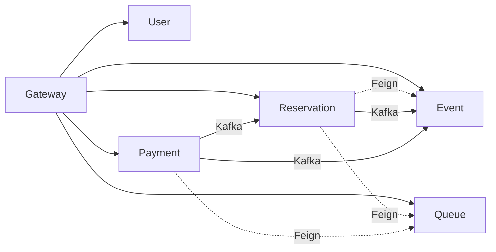

#### 4.3.4 Feign Client 설정

**Reservation Service의 Event Service Client:**

```java
@FeignClient(name = "event-service", url = "${event.service.url:http://event-service:8082}")
public interface EventServiceClient {

    @GetMapping("/internal/seats/status/{eventId}")
    SoldSeatsResponse getSoldSeats(@PathVariable String eventId);

    @GetMapping("/events/{id}/seats")
    List<Seat> getEventSeats(@PathVariable String id);
}
```

**DTO 정의:**

```java
public class SoldSeatsResponse {
    private String eventId;
    private List<String> soldSeatIds;
}
```

**Timeout 설정:**
- Connection Timeout: 2초
- Read Timeout: 3초
- Retry: 1회 (GET 요청만)

**내부 API 라우팅 정책:**
- `/internal/**` 경로는 API Gateway를 통하지 않음
- 서비스 간 직접 호출 (서비스 디스커버리 또는 직접 URL)
- 내부 네트워크에서만 접근 가능

---

### 4.4 서비스별 담당자 매핑

| 서비스 | 담당자 | 주요 책임 |
|--------|--------|----------|
| API Gateway | A개발자 | 라우팅, 인증, Rate Limiting |
| Event Service | A개발자 | 공연/공연장/좌석 관리 |
| Queue Service | A개발자 | 대기열 관리 |
| User Service | B개발자 | 회원/인증 |
| Reservation Service | B개발자 | 예매 관리 |
| Payment Service | B개발자 | 결제 처리 |

---

## 5. 인프라 아키텍처

### 5.1 전체 시스템 아키텍처 다이어그램

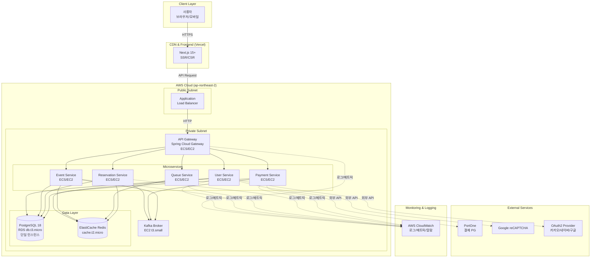

### 5.2 로컬 개발 환경 (LocalStack 기반)

#### 5.2.1 개요
로컬 개발 환경은 **LocalStack**을 사용하여 AWS 서비스를 에뮬레이션하고, **Docker Compose**로 전체 스택을 통합 관리합니다. 이를 통해 개발 비용을 제로로 유지하면서 AWS와 동일한 환경에서 개발할 수 있습니다.

#### 5.2.2 Docker Compose 구성

**`docker-compose.yml` 구조:**
```yaml
version: '3.8'

services:
  # LocalStack (AWS 에뮬레이션)
  localstack:
    image: localstack/localstack:latest
    ports:
      - "4566:4566"  # AWS API Endpoint
    environment:
      - SERVICES=s3,sqs,sns,secretsmanager
      - DEBUG=1
      - DATA_DIR=/tmp/localstack/data
    volumes:
      - "./localstack-data:/tmp/localstack/data"
      - "/var/run/docker.sock:/var/run/docker.sock"

  # PostgreSQL
  postgres:
    image: postgres:18-alpine
    ports:
      - "5432:5432"
    environment:
      POSTGRES_USER: postgres
      POSTGRES_PASSWORD: postgres
      POSTGRES_DB: ticketing
    volumes:
      - postgres-data:/var/lib/postgresql/data
      - ./init-db.sql:/docker-entrypoint-initdb.d/init-db.sql

  # Redis
  redis:
    image: redis:7-alpine
    ports:
      - "6379:6379"
    command: redis-server --appendonly yes
    volumes:
      - redis-data:/data

  # Kafka (Zookeeper + Broker)
  zookeeper:
    image: confluentinc/cp-zookeeper:7.5.0
    environment:
      ZOOKEEPER_CLIENT_PORT: 2181
    ports:
      - "2181:2181"

  kafka:
    image: confluentinc/cp-kafka:7.5.0
    depends_on:
      - zookeeper
    ports:
      - "9092:9092"
    environment:
      KAFKA_BROKER_ID: 1
      KAFKA_ZOOKEEPER_CONNECT: zookeeper:2181
      KAFKA_ADVERTISED_LISTENERS: PLAINTEXT://localhost:9092
      KAFKA_OFFSETS_TOPIC_REPLICATION_FACTOR: 1

  # API Gateway (개발 시 실행)
  gateway:
    build: ./gateway
    ports:
      - "8080:8080"
    environment:
      SPRING_PROFILES_ACTIVE: local
      SPRING_DATASOURCE_URL: jdbc:postgresql://postgres:5432/ticketing
      SPRING_REDIS_HOST: redis
      SPRING_KAFKA_BOOTSTRAP_SERVERS: kafka:9092
    depends_on:
      - postgres
      - redis
      - kafka

  # User Service (개발 시 실행)
  user-service:
    build: ./user-service
    ports:
      - "8081:8081"
    environment:
      SPRING_PROFILES_ACTIVE: local
      SPRING_DATASOURCE_URL: jdbc:postgresql://postgres:5432/ticketing
      SPRING_REDIS_HOST: redis
    depends_on:
      - postgres
      - redis

  # ... 기타 서비스 (Event, Queue, Reservation, Payment)

volumes:
  postgres-data:
  redis-data:
```

#### 5.2.3 초기 DB 스키마 생성

**`init-db.sql`:**
```sql
-- 서비스별 스키마 생성
CREATE SCHEMA IF NOT EXISTS user_service;
CREATE SCHEMA IF NOT EXISTS event_service;
CREATE SCHEMA IF NOT EXISTS reservation_service;
CREATE SCHEMA IF NOT EXISTS payment_service;
CREATE SCHEMA IF NOT EXISTS common;

-- 서비스별 전용 사용자 생성 및 권한 부여
CREATE USER user_svc_user WITH PASSWORD 'user_password';
GRANT ALL PRIVILEGES ON SCHEMA user_service TO user_svc_user;
GRANT ALL PRIVILEGES ON ALL TABLES IN SCHEMA user_service TO user_svc_user;

CREATE USER event_svc_user WITH PASSWORD 'event_password';
GRANT ALL PRIVILEGES ON SCHEMA event_service TO event_svc_user;
GRANT ALL PRIVILEGES ON ALL TABLES IN SCHEMA event_service TO event_svc_user;

CREATE USER reservation_svc_user WITH PASSWORD 'reservation_password';
GRANT ALL PRIVILEGES ON SCHEMA reservation_service TO reservation_svc_user;
GRANT ALL PRIVILEGES ON ALL TABLES IN SCHEMA reservation_service TO reservation_svc_user;

CREATE USER payment_svc_user WITH PASSWORD 'payment_password';
GRANT ALL PRIVILEGES ON SCHEMA payment_service TO payment_svc_user;
GRANT ALL PRIVILEGES ON ALL TABLES IN SCHEMA payment_service TO payment_svc_user;

-- 공통 Outbox 테이블
CREATE TABLE IF NOT EXISTS common.outbox_events (
  id UUID PRIMARY KEY DEFAULT gen_random_uuid(),
  aggregate_type VARCHAR(255) NOT NULL,
  aggregate_id UUID NOT NULL,
  event_type VARCHAR(255) NOT NULL,
  payload JSONB NOT NULL,
  created_at TIMESTAMP NOT NULL DEFAULT NOW(),
  published BOOLEAN NOT NULL DEFAULT FALSE,
  published_at TIMESTAMP
);

CREATE INDEX idx_outbox_published ON common.outbox_events(published, created_at);
```

#### 5.2.4 로컬 → AWS 전환 전략

**전환 최소화 방안:**
1. **환경 변수 기반 설정**:
   - `application-local.yml` (로컬)
   - `application-prod.yml` (AWS)
   - 엔드포인트만 환경변수로 변경 (S3, SQS, SNS 등)

2. **AWS SDK Profile 활용**:
   ```java
   // LocalStack: http://localhost:4566
   // AWS: 기본 엔드포인트 (환경변수로 제어)
   AmazonS3 s3Client = AmazonS3ClientBuilder.standard()
       .withEndpointConfiguration(new AwsClientBuilder.EndpointConfiguration(
           System.getenv("AWS_ENDPOINT_URL"),  // LocalStack: http://localhost:4566
           "ap-northeast-2"
       ))
       .build();
   ```

3. **Testcontainers 활용** (통합 테스트):
   ```java
   @Testcontainers
   class IntegrationTest {
       @Container
       static PostgreSQLContainer<?> postgres = new PostgreSQLContainer<>("postgres:18-alpine");

       @Container
       static GenericContainer<?> redis = new GenericContainer<>("redis:7-alpine")
           .withExposedPorts(6379);
   }
   ```

### 5.3 프론트엔드 인프라

#### 5.3.1 Next.js 애플리케이션 구조

**기술 스택:**
- Next.js 15+ (App Router)
- React 19+
- TypeScript
- Tailwind CSS
- Zustand (상태 관리)

**프로젝트 구조:**
```
ticket-queue-frontend/
├── app/
│   ├── (auth)/
│   │   ├── login/page.tsx
│   │   ├── register/page.tsx
│   ├── (events)/
│   │   ├── events/page.tsx
│   │   ├── events/[id]/page.tsx
│   ├── (queue)/
│   │   ├── queue/[eventId]/page.tsx
│   ├── (reservation)/
│   │   ├── reservations/page.tsx
│   │   ├── reservations/[id]/page.tsx
│   ├── layout.tsx
│   ├── page.tsx
├── components/
│   ├── auth/
│   ├── events/
│   ├── queue/
│   ├── reservation/
├── lib/
│   ├── api/
│   │   ├── auth.ts
│   │   ├── events.ts
│   │   ├── queue.ts
│   │   ├── reservations.ts
│   ├── store/
│   ├── utils/
├── public/
├── next.config.js
├── package.json
```

#### 5.3.2 Vercel 배포 설정

**`vercel.json`:**
```json
{
  "buildCommand": "npm run build",
  "outputDirectory": ".next",
  "framework": "nextjs",
  "regions": ["icn1"],
  "env": {
    "NEXT_PUBLIC_API_URL": "https://api.ticketing.example.com"
  }
}
```

**환경 변수 관리:**
| 환경 | API Gateway URL | 비고 |
|------|-----------------|------|
| Local | `http://localhost:8080` | Docker Compose |
| Staging | `https://api-staging.ticketing.example.com` | 선택 사항 |
| Production | `https://api.ticketing.example.com` | ALB 엔드포인트 |

**Vercel 배포 프로세스:**
1. GitHub 저장소 연동
2. main 브랜치 push 시 자동 배포
3. Preview 배포: PR 생성 시 자동 프리뷰 환경 생성
4. 환경 변수는 Vercel 대시보드에서 관리

#### 5.3.3 API Gateway 연동 설정

**API Client 설정 (`lib/api/client.ts`):**
```typescript
import axios from 'axios';

const apiClient = axios.create({
  baseURL: process.env.NEXT_PUBLIC_API_URL,
  timeout: 30000,
  headers: {
    'Content-Type': 'application/json',
  },
});

// JWT 토큰 자동 추가
apiClient.interceptors.request.use((config) => {
  const token = localStorage.getItem('accessToken');
  if (token) {
    config.headers.Authorization = `Bearer ${token}`;
  }
  return config;
});

// 401 응답 시 토큰 갱신
apiClient.interceptors.response.use(
  (response) => response,
  async (error) => {
    if (error.response?.status === 401) {
      // Token refresh 로직
      const refreshToken = localStorage.getItem('refreshToken');
      if (refreshToken) {
        const { data } = await axios.post(`${process.env.NEXT_PUBLIC_API_URL}/auth/refresh`, {
          refreshToken,
        });
        localStorage.setItem('accessToken', data.accessToken);
        // 원래 요청 재시도
        return apiClient.request(error.config);
      }
    }
    return Promise.reject(error);
  }
);

export default apiClient;
```

### 5.4 AWS 클라우드 인프라 구성 (무료티어/저비용 최적화)

#### 5.4.1 리전 및 가용 영역
- **리전**: `ap-northeast-2` (서울)
- **가용 영역**: 초기 Single-AZ (`ap-northeast-2a`), 향후 Multi-AZ 전환

#### 5.4.2 컴퓨트 (Compute)

**옵션 1: ECS Fargate (권장)**
- **장점**: 서버리스, 오토스케일링 간편, 운영 부담 낮음
- **단점**: 무료티어 없음 (월 약 $30-50)
- **스펙**: 0.5 vCPU, 1GB RAM per task

**옵션 2: EC2 (비용 최적화)**
- **인스턴스 타입**: `t2.micro` (무료티어 750시간/월) 또는 `t3.micro`
- **장점**: 무료티어 활용 가능, 비용 저렴
- **단점**: 서버 관리 필요, 오토스케일링 복잡
- **배포 방안**: 단일 EC2에 모든 서비스 컨테이너 실행 (Docker Compose) 또는 서비스별 EC2 분리

**선택 기준:**
- 초기: EC2 t2.micro로 시작 (무료티어)
- 트래픽 증가 시: ECS Fargate로 마이그레이션

#### 5.4.3 로드 밸런서

**Application Load Balancer (ALB)**
- **무료티어**: 없음 (시간당 $0.0225 + LCU 기준 과금)
- **월 예상 비용**: $16-20
- **대안**: ALB 없이 Route 53 → EC2 직접 연결 (SSL 인증서는 Let's Encrypt)
- **권장**: 초기에는 ALB 사용 (HTTPS, 헬스체크, Path 라우팅)

#### 5.4.4 데이터베이스

**Amazon RDS PostgreSQL**
- **인스턴스**: `db.t3.micro` (무료티어 750시간/월, 20GB 스토리지)
- **버전**: PostgreSQL 18
- **Multi-AZ**: 초기 Single-AZ (무료티어), 향후 Multi-AZ 전환 ($$$)
- **백업**: 자동 백업 1일 보관 (무료), 7일 보관 시 추가 비용
- **모니터링**: Enhanced Monitoring 비활성화 (비용 절감)
- **스토리지**: 범용 SSD (gp3), 20GB (무료티어)

**비용 최적화:**
- Single-AZ 배포
- 백업 보관 기간 최소화 (1일)
- Read Replica 제외 (초기)
- Connection Pooling (서비스별 HikariCP 설정)

#### 5.4.5 캐시 및 메모리 스토어

**Amazon ElastiCache Redis**
- **노드 타입**: `cache.t2.micro` (무료티어 750시간/월) 또는 `cache.t3.micro`
- **버전**: Redis 7.x
- **클러스터 모드**: 비활성화 (단일 노드)
- **Multi-AZ**: 비활성화 (초기)
- **백업**: 자동 백업 비활성화 (비용 절감)

**비용 최적화:**
- 단일 노드 구성
- 백업 비활성화 (Redis 데이터는 휘발성으로 간주)
- Replication 제외 (초기)

#### 5.4.6 메시징

**Kafka on EC2 (자체 구축)**
- **이유**: Amazon MSK는 고비용 (최소 월 $200+)
- **인스턴스**: `t3.small` 1대 (초기), 향후 3대 클러스터 확장
- **월 예상 비용**: $15-20 (t3.small 1대 기준)
- **스토리지**: EBS gp3 100GB

**대안: Amazon SNS/SQS**
- **장점**: 완전 관리형, 무료티어 (SNS: 100만 요청, SQS: 100만 요청)
- **단점**: Kafka의 이벤트 스트리밍 기능 부족, 메시지 순서 보장 어려움
- **결론**: Kafka 유지 권장 (이벤트 스트리밍 필수)

#### 5.4.7 모니터링 및 로깅

**AWS CloudWatch**
- **무료티어**:
  - 로그 수집: 5GB/월
  - 커스텀 메트릭: 10개
  - 알람: 10개
  - API 요청: 100만 건/월
- **전략**: 무료티어 한도 내 운영 (섹션 14에서 상세 설명)

**비용 초과 방지:**
- 로그 보관 기간: 1일
- 핵심 메트릭만 선별 수집 (10개 이내)
- 알람 최소화 (10개 이내)

#### 5.4.8 도메인 및 DNS

**Amazon Route 53**
- **호스팅 영역**: $0.50/월 (1개)
- **DNS 쿼리**: 100만 건당 $0.40
- **헬스 체크**: $0.50/개 (선택 사항)

**비용 최적화:**
- 단일 호스팅 영역
- 헬스 체크 최소화 또는 제외

#### 5.4.9 기타 서비스

**Amazon ECR (컨테이너 레지스트리)**
- **무료티어**: 500MB 스토리지/월
- **전략**: 이미지 최적화 (멀티스테이지 빌드), 불필요한 이미지 삭제

**AWS Secrets Manager vs Parameter Store**
- **Secrets Manager**: $0.40/시크릿/월 (비용 발생)
- **Parameter Store**: 무료 (Standard tier)
- **선택**: Parameter Store 사용 (DB 비밀번호, API 키 등)

### 5.5 비용 최적화 전략

#### 5.5.1 무료티어 활용 체크리스트

| 서비스 | 무료티어 한도 | 초과 시 비용 | 대응 전략 |
|--------|--------------|-------------|----------|
| EC2 | t2.micro 750시간/월 | $0.0116/시간 | 단일 인스턴스 유지 |
| RDS | db.t3.micro 750시간/월, 20GB | $0.017/시간, $0.115/GB | Single-AZ, 백업 최소화 |
| ElastiCache | cache.t2.micro 750시간/월 | $0.017/시간 | 단일 노드 |
| ALB | 없음 | $16-20/월 | 필수 사용 |
| CloudWatch | 로그 5GB, 메트릭 10개, 알람 10개 | $0.50/GB, $0.30/메트릭, $0.10/알람 | 한도 준수 |
| ECR | 500MB | $0.10/GB | 이미지 최적화 |
| Route 53 | 없음 | $0.50/월 | 단일 호스팅 영역 |

**월 예상 비용 (무료티어 최대 활용):**
- EC2 (Kafka): $15-20
- ALB: $16-20
- Route 53: $0.50
- CloudWatch (초과 시): $0-5
- **합계**: $30-45/월

#### 5.5.2 리소스 우선순위

**필수 리소스 (비용 발생 불가피):**
- ALB (HTTPS, Path 라우팅)
- Kafka EC2 (이벤트 스트리밍)
- Route 53 (도메인)

**무료티어 활용 가능:**
- EC2 t2.micro (백엔드 서비스)
- RDS db.t3.micro (데이터베이스)
- ElastiCache cache.t2.micro (Redis)
- CloudWatch (한도 내)

**선택 사항 (제외 또는 최소화):**
- Multi-AZ 배포
- Read Replica
- Enhanced Monitoring
- Auto Scaling (수동 스케일링)
- Staging 환경

#### 5.5.3 Auto Scaling 전략

**초기 설정:**
- 최소 인스턴스: 1개
- 최대 인스턴스: 3개
- Target Tracking: CPU 70%

**비용 절감:**
- 평상시: 1개 인스턴스로 운영
- 티켓 오픈 시: 수동 스케일 아웃 (3개)
- 완전 자동화 시: CloudWatch 알람 기반 스케일링 (비용 주의)

#### 5.5.4 개발/스테이징 환경

**옵션 1: Staging 환경 제외**
- Production 환경만 운영
- 로컬 개발 환경에서 충분한 테스트 진행

**옵션 2: Production 공유**
- 별도 네임스페이스 또는 서브도메인 사용
- 동일 인프라에서 Staging 환경 구성

**옵션 3: 주말 자동 종료**
- AWS Lambda로 주말/야간 Staging 환경 자동 종료
- 월 비용 30% 절감 가능

**권장**: 옵션 1 (Staging 제외), 필요 시 옵션 2

#### 5.5.5 CloudWatch 로그 최적화

**로그 보관 전략:**
- 일반 로그: 1일 보관
- 중요 로그 (에러, 보안): 7일 보관
- 로그 그룹별 필터: DEBUG 로그 제외

**무료 한도 준수:**
- 목표: 5GB/월 이내
- 모니터링: CloudWatch Metrics로 사용량 추적
- 알람: 4GB 도달 시 알림

#### 5.5.6 S3 스토리지 (선택 사항)

**사용 용도:**
- 이미지 업로드 (공연 포스터 등)
- 로그 아카이빙 (CloudWatch → S3)

**비용 최적화:**
- 무료티어: 5GB Standard, 20,000 GET, 2,000 PUT
- Lifecycle Policy: 30일 후 Glacier 이관
- CloudFront 연동 시 추가 비용 발생 (선택 사항)

### 5.6 네트워크 구성 (비용 절감)

#### 5.6.1 VPC 설계

**VPC 구성:**
```
VPC: 10.0.0.0/16 (ticket-queue-vpc)
├── Public Subnet (10.0.1.0/24) - ap-northeast-2a
│   ├── ALB
│   └── NAT Gateway (제외 - 비용 절감)
├── Private Subnet (10.0.10.0/24) - ap-northeast-2a
│   ├── ECS/EC2 (백엔드 서비스)
│   ├── RDS
│   ├── ElastiCache
│   └── Kafka
```

**비용 절감 포인트:**
- **NAT Gateway 제외**: $0.045/시간 + 데이터 전송 비용 (월 $32+)
  - **대안**: Private Subnet 리소스는 VPC Endpoint 또는 Public Subnet 배치
- **Single-AZ**: Multi-AZ 데이터 전송 비용 제거 ($0.01/GB)
- **VPC Peering 최소화**: 필요 시만 구성

#### 5.6.2 Security Group 규칙

**ALB Security Group (alb-sg):**
```
Inbound:
  - 80 (HTTP) from 0.0.0.0/0
  - 443 (HTTPS) from 0.0.0.0/0
Outbound:
  - 8080 to backend-sg (Gateway)
```

**Backend Services Security Group (backend-sg):**
```
Inbound:
  - 8080-8085 from alb-sg
Outbound:
  - 5432 to db-sg (PostgreSQL)
  - 6379 to redis-sg (Redis)
  - 9092 to kafka-sg (Kafka)
  - 443 to 0.0.0.0/0 (외부 API: PortOne, reCAPTCHA)
```

**Database Security Group (db-sg):**
```
Inbound:
  - 5432 from backend-sg
Outbound:
  - 모두 차단
```

**Redis Security Group (redis-sg):**
```
Inbound:
  - 6379 from backend-sg
Outbound:
  - 모두 차단
```

**Kafka Security Group (kafka-sg):**
```
Inbound:
  - 9092 from backend-sg
  - 2181 from backend-sg (Zookeeper)
Outbound:
  - 모두 허용 (클러스터 내부 통신)
```

#### 5.6.3 데이터 전송 비용 최소화

**동일 AZ 내 배치:**
- 모든 리소스를 `ap-northeast-2a` 단일 AZ에 배치
- AZ 간 데이터 전송 비용 제거 ($0.01/GB)

**외부 API 호출 최소화:**
- PortOne, reCAPTCHA 호출 횟수 최소화
- API 응답 캐싱 (가능한 경우)
- 데이터 전송량 압축

**CloudFront 제외 (초기):**
- Vercel CDN으로 정적 리소스 제공
- API는 ALB 직접 연결
- 필요 시 CloudFront 추가 ($0.085/GB)

### 5.7 고가용성 및 확장성 전략 (단계적 적용)

#### 5.7.1 초기 아키텍처 (Single-AZ)

**목표:** 비용 최소화, 기본 가용성 확보

**구성:**
- EC2/ECS: Single-AZ, 1-2 인스턴스
- RDS: Single-AZ, 자동 백업 1일
- ElastiCache: 단일 노드
- Kafka: 단일 브로커

**예상 가용성:** 99.5% (AWS SLA 기준)

**제약사항:**
- AZ 장애 시 서비스 중단
- RDS 장애 시 복구 시간 발생 (Snapshot 기반)
- Redis 장애 시 캐시 손실 (서비스 지속 가능)

#### 5.7.2 성장 단계 (Multi-AZ)

**전환 시점:**
- 월간 활성 사용자 10,000명 이상
- 티켓 오픈 시 동시 접속 100,000명 이상
- 비용 여유 발생 (월 $100+ 가능)

**구성:**
```
VPC: 10.0.0.0/16
├── Public Subnet A (10.0.1.0/24) - ap-northeast-2a
│   └── ALB (Multi-AZ)
├── Public Subnet B (10.0.2.0/24) - ap-northeast-2b
│   └── ALB (Multi-AZ)
├── Private Subnet A (10.0.10.0/24) - ap-northeast-2a
│   ├── ECS/EC2 (백엔드)
│   ├── RDS Primary
│   ├── ElastiCache Primary
│   └── Kafka Broker 1
├── Private Subnet B (10.0.20.0/24) - ap-northeast-2b
│   ├── ECS/EC2 (백엔드)
│   ├── RDS Standby
│   ├── ElastiCache Replica
│   └── Kafka Broker 2
```

**개선 사항:**
- RDS Multi-AZ: 자동 페일오버 (1-2분)
- ElastiCache Replication: 읽기 성능 향상, 장애 대응
- Kafka 3 브로커: Replication Factor 2-3
- ECS/EC2 Auto Scaling: 최소 2, 최대 10

**예상 가용성:** 99.95%

**추가 비용:**
- RDS Multi-AZ: +100% ($34/월)
- ElastiCache Replica: +100% ($24/월)
- Kafka 2대 추가: +$30/월
- NAT Gateway (옵션): +$32/월
- **합계**: +$120-150/월

#### 5.7.3 Auto Scaling 정책

**Target Tracking Scaling:**
```yaml
Target:
  - CPU Utilization: 70%
  - Memory Utilization: 80%
  - ALB Request Count: 1000 req/min per instance

Scale Out:
  - Cooldown: 60초
  - Increment: +1 인스턴스

Scale In:
  - Cooldown: 300초
  - Decrement: -1 인스턴스
```

**Step Scaling (선택 사항):**
```yaml
CPU > 80%:
  - +2 인스턴스 (즉시)
CPU > 90%:
  - +3 인스턴스 (즉시)
CPU < 40%:
  - -1 인스턴스 (5분 후)
```

#### 5.7.4 장애 복구 (Disaster Recovery) 계획

**백업 전략:**
- **RDS**: 자동 백업 1일 보관 (무료), 수동 스냅샷 7일 보관
- **Redis**: 데이터 휘발성, 백업 제외
- **Kafka**: 메시지 보관 기간 3일 (디스크 용량에 따라 조정)

**복구 시나리오:**

| 장애 유형 | RTO (복구 시간) | RPO (데이터 손실) | 복구 절차 |
|----------|----------------|------------------|----------|
| EC2 인스턴스 다운 | 5-10분 | 없음 | Auto Scaling 또는 수동 재시작 |
| RDS Single-AZ 장애 | 30-60분 | 최대 5분 | Snapshot에서 복구 |
| RDS Multi-AZ 장애 | 1-2분 | 없음 | 자동 페일오버 |
| Redis 장애 | 5분 | 캐시 손실 | 재시작, 캐시 재구축 |
| Kafka 브로커 다운 | 1분 | 없음 (Replication) | 자동 Leader 재선출 |
| AZ 전체 장애 | 60-120분 | 최대 5분 | Multi-AZ 전환 후 자동 복구 |

**초기 단계 (Single-AZ) 주의사항:**
- AZ 장애 시 서비스 중단 불가피
- 백업에서 복구 시 다운타임 발생
- **대응**: CloudWatch 알람으로 즉시 감지, 수동 복구

#### 5.7.5 확장성 로드맵

**Phase 1 (현재): 비용 최소화**
- Single-AZ, 최소 리소스
- 수동 스케일링
- 목표 TPS: 100-500

**Phase 2 (6개월): 기본 고가용성**
- Multi-AZ 전환
- Auto Scaling 활성화
- 목표 TPS: 500-2000

**Phase 3 (1년): 성능 최적화**
- Redis Cluster 모드
- Kafka 클러스터 확장 (5 브로커)
- Read Replica 추가
- 목표 TPS: 2000-10000

**Phase 4 (2년): 엔터프라이즈**
- Multi-Region 배포
- CDN 최적화
- Serverless 전환 검토
- 목표 TPS: 10000+

---

## 6. 데이터 아키텍처

### 6.1 데이터베이스 전략

#### 6.1.1 PostgreSQL 18 - 논리적 DB per Service + 물리적 통합

**선택 이유:**
- **비용 효율성**: 단일 RDS 인스턴스로 모든 서비스 지원 (무료티어 활용)
- **MSA 원칙 준수**: 스키마 분리로 서비스별 데이터 격리
- **확장 가능성**: 향후 트래픽 증가 시 물리적 분리 마이그레이션 용이
- **PostgreSQL 18 장점**: 성능 개선, JSON 처리 최적화, 파티셔닝 강화

**아키텍처 원칙:**
```
단일 PostgreSQL 인스턴스
├── user_service 스키마 (User Service 전용)
├── event_service 스키마 (Event Service 전용)
├── reservation_service 스키마 (Reservation Service 전용)
├── payment_service 스키마 (Payment Service 전용)
└── common 스키마 (공통: outbox_events)
```

**서비스 간 데이터 접근 제한:**
- 각 서비스는 자신의 스키마만 접근 가능 (DB 사용자 권한 분리)
- 서비스 간 데이터 필요 시 REST API 또는 Kafka 이벤트로만 통신
- **금지**: 서비스 A가 서비스 B의 스키마에 직접 쿼리

#### 6.1.2 스키마별 DB 사용자 및 권한

**사용자 생성 및 권한 부여:**
```sql
-- User Service 전용 사용자
CREATE USER user_svc_user WITH PASSWORD 'user_strong_password_here';
GRANT USAGE ON SCHEMA user_service TO user_svc_user;
GRANT ALL PRIVILEGES ON ALL TABLES IN SCHEMA user_service TO user_svc_user;
GRANT ALL PRIVILEGES ON ALL SEQUENCES IN SCHEMA user_service TO user_svc_user;
ALTER DEFAULT PRIVILEGES IN SCHEMA user_service GRANT ALL ON TABLES TO user_svc_user;

-- Event Service 전용 사용자
CREATE USER event_svc_user WITH PASSWORD 'event_strong_password_here';
GRANT USAGE ON SCHEMA event_service TO event_svc_user;
GRANT ALL PRIVILEGES ON ALL TABLES IN SCHEMA event_service TO event_svc_user;
GRANT ALL PRIVILEGES ON ALL SEQUENCES IN SCHEMA event_service TO event_svc_user;
ALTER DEFAULT PRIVILEGES IN SCHEMA event_service GRANT ALL ON TABLES TO event_svc_user;

-- Reservation Service 전용 사용자
CREATE USER reservation_svc_user WITH PASSWORD 'reservation_strong_password_here';
GRANT USAGE ON SCHEMA reservation_service TO reservation_svc_user;
GRANT ALL PRIVILEGES ON ALL TABLES IN SCHEMA reservation_service TO reservation_svc_user;
GRANT ALL PRIVILEGES ON ALL SEQUENCES IN SCHEMA reservation_service TO reservation_svc_user;
ALTER DEFAULT PRIVILEGES IN SCHEMA reservation_service GRANT ALL ON TABLES TO reservation_svc_user;

-- Payment Service 전용 사용자
CREATE USER payment_svc_user WITH PASSWORD 'payment_strong_password_here';
GRANT USAGE ON SCHEMA payment_service TO payment_svc_user;
GRANT ALL PRIVILEGES ON ALL TABLES IN SCHEMA payment_service TO payment_svc_user;
GRANT ALL PRIVILEGES ON ALL SEQUENCES IN SCHEMA payment_service TO payment_svc_user;
ALTER DEFAULT PRIVILEGES IN SCHEMA payment_service GRANT ALL ON TABLES TO payment_svc_user;

-- 모든 서비스가 common 스키마 접근 (Outbox)
GRANT USAGE ON SCHEMA common TO user_svc_user, event_svc_user, reservation_svc_user, payment_svc_user;
GRANT ALL PRIVILEGES ON ALL TABLES IN SCHEMA common TO user_svc_user, event_svc_user, reservation_svc_user, payment_svc_user;
```

**Spring Boot application.yml 설정 예시:**
```yaml
# User Service
spring:
  datasource:
    url: jdbc:postgresql://ticketing-db.xxx.ap-northeast-2.rds.amazonaws.com:5432/ticketing
    username: user_svc_user
    password: ${DB_PASSWORD}  # AWS Secrets Manager 또는 환경변수
    schema: user_service  # 기본 스키마 설정
  jpa:
    properties:
      hibernate:
        default_schema: user_service
```

#### 6.1.3 향후 물리적 분리 마이그레이션 계획

**마이그레이션 시점:**
- 월간 활성 사용자 50,000명 이상
- DB CPU 사용률 지속적으로 70% 이상
- 커넥션 풀 고갈 빈번

**마이그레이션 전략:**
1. **Read Replica 추가** (단계 1):
   - 조회 트래픽이 많은 Event Service를 Read Replica로 분리
   - 쓰기: Primary, 읽기: Replica

2. **서비스별 DB 분리** (단계 2):
   - User/Event/Reservation/Payment Service 각각 독립 RDS 인스턴스
   - AWS DMS (Database Migration Service)로 마이그레이션
   - Zero-Downtime 마이그레이션 (Dual Write → Cutover)

### 6.2 ERD (Entity Relationship Diagram)

#### 6.2.1 User Service 스키마 ERD

**스키마: `user_service`**

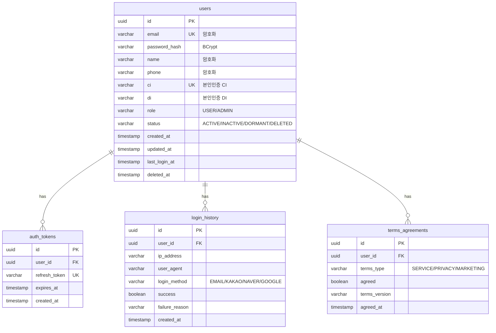

**주요 테이블 설명:**

**`users` 테이블:**
- **id**: UUID Primary Key
- **email**: 이메일 (Unique, AES-256 암호화 - 선택)
- **password_hash**: BCrypt 해시
- **name, phone**: 개인정보 (AES-256 암호화 - 선택)
- **ci, di**: 본인인증 CI/DI (Unique, CI는 1인 1계정 강제)
- **role**: USER / ADMIN
- **status**: ACTIVE / INACTIVE / DORMANT (1년 미접속) / DELETED (Soft Delete)
- **관련 요구사항**: REQ-AUTH-001, REQ-AUTH-014, REQ-AUTH-017, REQ-AUTH-019

**`auth_tokens` 테이블:**
- Refresh Token 저장 (Access Token은 JWT 자체로 검증)
- TTL: 7일
- **관련 요구사항**: REQ-AUTH-009 (토큰 갱신)

**`login_history` 테이블:**
- 로그인 이력 추적 (선택)
- 의심 접속 탐지용
- **관련 요구사항**: REQ-AUTH-020

**`terms_agreements` 테이블:**
- 약관 동의 이력
- 약관 버전 관리
- **관련 요구사항**: REQ-AUTH-002

#### 6.2.2 Event Service 스키마 ERD

**스키마: `event_service`**

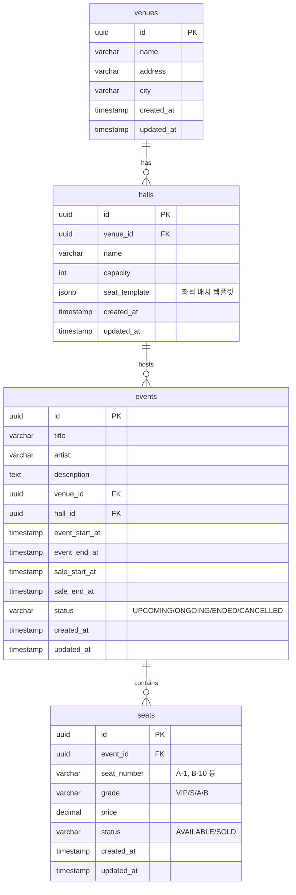

**주요 테이블 설명:**

**`venues` 테이블:**
- 공연장 정보
- **관련 요구사항**: REQ-EVT-010

**`halls` 테이블:**
- 공연장 내 홀 정보
- **seat_template (JSONB)**: 좌석 배치 템플릿 (행/열, 등급 매핑)
  ```json
  {
    "rows": ["A", "B", "C"],
    "seatsPerRow": 20,
    "gradeMapping": {
      "A": "VIP",
      "B": "S",
      "C": "A"
    }
  }
  ```
- **관련 요구사항**: REQ-EVT-013

**`events` 테이블:**
- 공연 정보
- **status**: UPCOMING (판매 전) / ONGOING (판매 중) / ENDED (종료) / CANCELLED (취소)
- **관련 요구사항**: REQ-EVT-001, REQ-EVT-007

**`seats` 테이블:**
- 공연별 좌석 정보
- **status**: AVAILABLE / SOLD (HOLD는 Redis로 관리)
- 공연 생성 시 hall의 seat_template 기반으로 자동 생성
- **인덱스**: `idx_seats_event_status (event_id, status)` - 좌석 조회 성능 최적화
- **관련 요구사항**: REQ-EVT-008, REQ-EVT-019

#### 6.2.3 Reservation Service 스키마 ERD

**스키마: `reservation_service`**

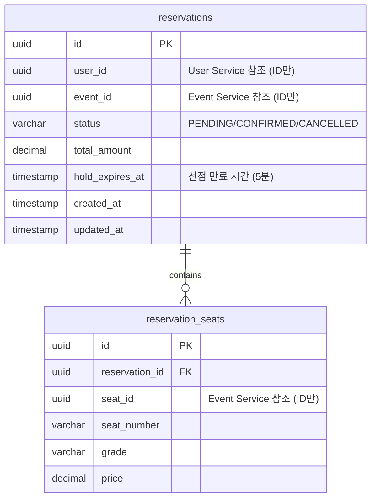

**주요 테이블 설명:**

**`reservations` 테이블:**
- 예매 정보
- **status**:
  - PENDING: 좌석 선점 완료, 결제 대기
  - CONFIRMED: 결제 완료, 예매 확정
  - CANCELLED: 예매 취소
- **hold_expires_at**: 선점 만료 시간 (현재 시간 + 5분)
- **user_id, event_id**: 다른 서비스의 ID만 참조 (FK 없음, MSA 원칙)
- **관련 요구사항**: REQ-RSV-001, REQ-RSV-004, REQ-RSV-006

**`reservation_seats` 테이블:**
- 예매에 포함된 좌석 목록 (1회 최대 4장)
- 좌석 정보 스냅샷 (seat_number, grade, price) - 공연 정보 변경에도 예매 정보 유지
- **관련 요구사항**: REQ-RSV-005

#### 6.2.4 Payment Service 스키마 ERD

**스키마: `payment_service`**

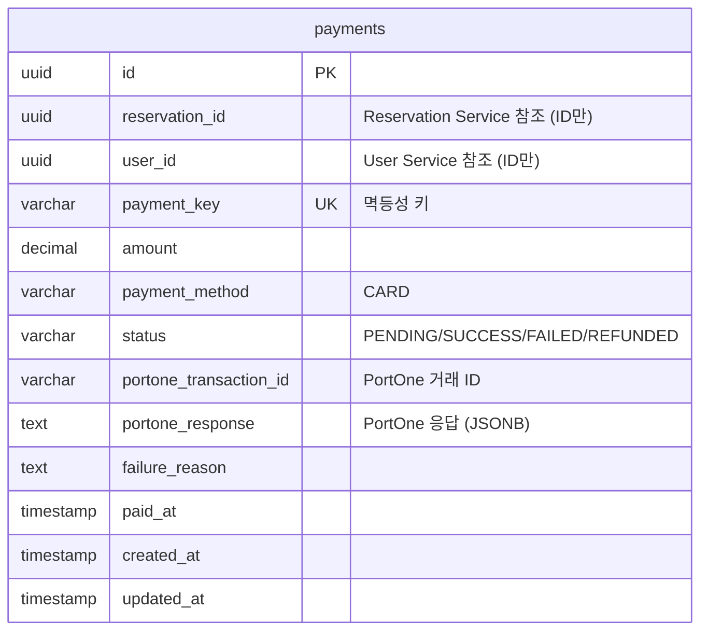

**주요 테이블 설명:**

**`payments` 테이블:**
- 결제 정보
- **payment_key**: 멱등성 키 (클라이언트 생성, Unique)
- **status**:
  - PENDING: 결제 요청 중
  - SUCCESS: 결제 성공
  - FAILED: 결제 실패
  - REFUNDED: 환불 완료
- **portone_transaction_id**: PortOne 거래 ID (결제 조회/취소용)
- **portone_response**: PortOne API 응답 전체 (JSONB, 디버깅/감사용)
- **관련 요구사항**: REQ-PAY-001, REQ-PAY-003, REQ-PAY-004, REQ-PAY-006

#### 6.2.5 공통 스키마 (Transactional Outbox)

**스키마: `common`**

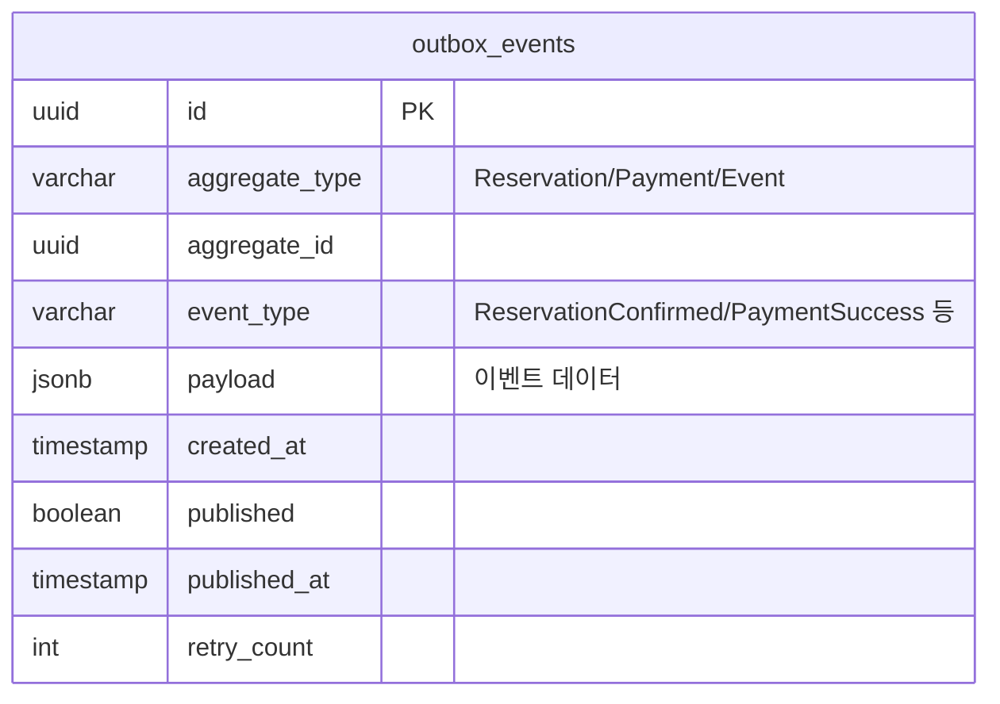

**주요 테이블 설명:**

**`outbox_events` 테이블:**
- Transactional Outbox 패턴 구현
- 비즈니스 로직과 동일 트랜잭션 내 INSERT
- Poller/CDC가 주기적으로 읽어 Kafka 발행
- **aggregate_type**: 이벤트 발행 주체 (Reservation, Payment, Event)
- **event_type**: 이벤트 타입 (ReservationConfirmed, PaymentSuccess, PaymentFailed 등)
- **payload (JSONB)**: 이벤트 데이터
  ```json
  {
    "reservationId": "uuid",
    "userId": "uuid",
    "eventId": "uuid",
    "seatIds": ["uuid1", "uuid2"],
    "totalAmount": 100000,
    "confirmedAt": "2026-01-11T10:00:00Z"
  }
  ```
- **published**: Kafka 발행 여부
- **retry_count**: 발행 실패 시 재시도 횟수
- **인덱스**: `idx_outbox_published_created (published, created_at)` - Poller 성능 최적화
- **관련 요구사항**: REQ-RSV-012, REQ-PAY-013

### 6.3 Redis 아키텍처

#### 6.3.1 Redis 인스턴스 구성

**로컬 개발:**
- Docker Redis 7.x 단일 인스턴스
- 포트: 6379
- Persistence: AOF + RDB

**AWS 운영:**
- ElastiCache Redis 7.x
- 노드 타입: `cache.t2.micro` (무료티어) 또는 `cache.t3.micro`
- 클러스터 모드: 비활성화 (단일 노드)
- Multi-AZ: 비활성화 (초기), 향후 Replication 전환
- 백업: 비활성화 (비용 절감, 데이터 휘발성)

#### 6.3.2 Redis 데이터 모델 설계

**데이터 타입별 용도:**

| Key Pattern | 데이터 타입 | 용도 | TTL | 서비스 |
|-------------|------------|------|-----|--------|
| `queue:{eventId}` | Sorted Set | 대기열 (score: timestamp) | 없음 | Queue |
| `queue:token:{token}` | String | Queue Token (qr_xxx, qp_xxx) | 10분 | Queue |
| `queue:active:{userId}` | String | 사용자 활성 대기열 (중복 방지) | 10분 | Queue |
| `seat:hold:{eventId}:{seatId}` | String | 좌석 선점 락 (userId) | 5분 | Reservation |
| `token:blacklist:{token}` | String | Access Token 블랙리스트 | 1시간 | User |
| `cache:event:list` | String (JSON) | 공연 목록 캐시 | 5분 | Event |
| `cache:event:{eventId}` | Hash | 공연 상세 캐시 | 5분 | Event |
| `cache:seats:{eventId}` | Hash | 좌석 정보 캐시 | 5분 | Event |

#### 6.3.3 대기열 (Queue Service)

**1. Sorted Set - 대기열**

**Key:** `queue:{eventId}`
**타입:** Sorted Set
**Score:** Unix Timestamp (진입 시각)
**Member:** `userId`

```redis
ZADD queue:event-123 1736582400 user-abc
ZADD queue:event-123 1736582401 user-def

# 순위 조회 (0-based)
ZRANK queue:event-123 user-abc  # 결과: 0 (1등)

# 대기열 크기
ZCARD queue:event-123

# 상위 10명 조회
ZRANGE queue:event-123 0 9 WITHSCORES

# 배치 승인 (Lua 스크립트)
EVAL "..." 1 queue:event-123 10
```

**2. String - Queue Token**

**Key:** `queue:token:{token}`
**Value:** JSON (userId, eventId, type, issuedAt)

```redis
SET queue:token:qr_abc123xyz '{"userId":"user-abc","eventId":"event-123","type":"RESERVATION","issuedAt":"2026-01-11T10:00:00Z"}' EX 600

# Token 검증
GET queue:token:qr_abc123xyz
```

**3. String - 중복 대기 방지**

**Key:** `queue:active:{userId}`
**Value:** `eventId`

```redis
SET queue:active:user-abc event-123 EX 600

# 중복 대기 확인
EXISTS queue:active:user-abc
```

**관련 요구사항:** REQ-QUEUE-001, REQ-QUEUE-003, REQ-QUEUE-004, REQ-QUEUE-021

#### 6.3.4 좌석 선점 (Reservation Service)

**분산 락 - Redisson**

**Key:** `seat:hold:{eventId}:{seatId}`
**Value:** `userId`
**TTL:** 5분

```java
// Redisson 분산 락
RLock lock = redissonClient.getLock("seat:hold:event-123:seat-456");
boolean acquired = lock.tryLock(3, 300, TimeUnit.SECONDS);  // waitTime: 3초, leaseTime: 300초

if (acquired) {
    try {
        // 좌석 선점 로직
        // 예매 정보 DB 저장 (PENDING)
    } finally {
        lock.unlock();
    }
} else {
    throw new SeatAlreadyHoldException();
}
```

**수동 락 관리 (대안):**
```redis
# 락 획득 (NX: Not Exists)
SET seat:hold:event-123:seat-456 user-abc NX EX 300

# 락 해제
DEL seat:hold:event-123:seat-456
```

**관련 요구사항:** REQ-RSV-001, REQ-RSV-007

#### 6.3.5 토큰 블랙리스트 (User Service)

**Key:** `token:blacklist:{token}`
**Value:** `1` (존재 여부만 확인)
**TTL:** Access Token 만료 시간 (1시간)

```redis
# 로그아웃 시 블랙리스트 등록
SET token:blacklist:eyJhbGciOiJIUzI1NiIsInR5cCI6IkpXVCJ9... 1 EX 3600

# 토큰 검증 시 블랙리스트 확인
EXISTS token:blacklist:eyJhbGciOiJIUzI1NiIsInR5cCI6IkpXVCJ9...
```

**관련 요구사항:** REQ-AUTH-008, REQ-AUTH-010

#### 6.3.6 캐싱 (Event Service)

**1. 공연 목록 캐시**

**Key:** `cache:event:list:{page}:{size}:{filters}`
**타입:** String (JSON)
**TTL:** 5분 (티켓팅 오픈 시 1분으로 단축)

```redis
SET cache:event:list:0:20:upcoming '[{"id":"event-123","title":"콘서트 A",...}]' EX 300
```

**2. 공연 상세 캐시**

**Key:** `cache:event:{eventId}`
**타입:** Hash
**TTL:** 5분

```redis
HSET cache:event:event-123 title "콘서트 A" artist "아티스트 A" ...
EXPIRE cache:event:event-123 300

# 조회
HGETALL cache:event:event-123
```

**3. 좌석 정보 캐시**

**Key:** `cache:seats:{eventId}`
**타입:** Hash (grade별 그룹핑)
**TTL:** 5분

```redis
HSET cache:seats:event-123 VIP '{"available":50,"price":150000}' S '{"available":100,"price":100000}'
EXPIRE cache:seats:event-123 300
```

**캐시 무효화 전략:**
- 공연/좌석 정보 변경 시 Kafka 이벤트 발행
- Event Service Consumer가 해당 캐시 삭제 (DEL)
- 다음 조회 시 DB에서 재구축 (Cache-Aside 패턴)

**관련 요구사항:** REQ-EVT-017, REQ-EVT-020

#### 6.3.7 TTL 전략

| 데이터 | TTL | 근거 | 관련 요구사항 |
|--------|-----|------|--------------|
| Queue Token | 10분 | 대기열 진입 후 충분한 대기 시간 | REQ-QUEUE-003 |
| 좌석 선점(HOLD) | 5분 | 선점 후 결제까지 여유 시간 | REQ-RSV-007 |
| Access Token 블랙리스트 | 1시간 | Access Token 만료 시간과 동일 | REQ-AUTH-010 |
| 공연 목록/상세 캐시 | 5분 | 적절한 신선도, 오픈 시 1분으로 단축 | REQ-EVT-031 |
| 좌석 정보 캐시 | 5분 | 실시간성 요구, 변경 빈도 고려 | REQ-EVT-017 |

#### 6.3.8 Persistence 전략

**AOF (Append-Only File):**
- **fsync everysec**: 1초마다 디스크 동기화
- 성능과 안정성의 균형
- 최악의 경우 1초 데이터 손실

**RDB (Snapshot):**
- 1시간마다 스냅샷 생성 (메모리 절약)
- 재시작 시 빠른 복구

**설정 예시 (redis.conf):**
```
appendonly yes
appendfsync everysec
save 3600 1    # 1시간마다 1개 이상 키 변경 시 저장
```

**주의:** ElastiCache는 백업 비활성화 (비용 절감), 데이터 손실 시 서비스 로직으로 복구

#### 6.3.9 Cache Stampede 방지

**문제:** 캐시 만료 시 동시 다발적 DB 조회로 DB 과부하

**해결책: Lua 스크립트 락 기반 갱신**

```lua
-- cache_get_or_set.lua
local key = KEYS[1]
local lock_key = key .. ":lock"
local ttl = tonumber(ARGV[1])

local value = redis.call('GET', key)
if value then
    return value
end

local lock = redis.call('SET', lock_key, '1', 'NX', 'EX', 10)
if lock then
    return nil  -- 호출자가 DB 조회 후 캐시 설정
else
    -- 다른 스레드가 이미 갱신 중, 잠시 대기 후 재시도
    redis.call('SLEEP', 0.1)
    return redis.call('GET', key)
end
```

**대안: Probabilistic Early Expiration**
- TTL의 90% 시점에 확률적으로 재갱신 (Beta: 1)
- 동시 만료 회피

**관련 요구사항:** REQ-EVT-027

### 6.4 데이터 일관성 전략

#### 6.4.1 Eventually Consistent 모델

MSA 환경에서 서비스 간 데이터는 **Eventually Consistent** (최종 일관성) 모델을 따릅니다.

**예시: 예매 → 결제 → 확정 플로우**

```
1. Reservation Service: 예매 생성 (PENDING)
2. Payment Service: 결제 성공 → Kafka 이벤트 발행 (payment.success)
3. Reservation Service (Consumer): 예매 확정 (CONFIRMED) - 수 밀리초 ~ 수 초 지연
4. Event Service (Consumer): 좌석 상태 업데이트 (SOLD) - 수 밀리초 ~ 수 초 지연
```

**지연 시간:** 일반적으로 수십 ms ~ 수백 ms, Kafka 장애 시 수 초

**사용자 경험:**
- 결제 완료 후 "예매 처리 중..." 메시지 표시
- 최종 확정 후 "예매 완료!" 표시
- 장시간 미처리 시 알림 또는 재시도

#### 6.4.2 분산 락 (Redisson)

**목적:** 좌석 선점 시 동시성 제어

**Redisson RLock:**
- Redis 기반 분산 락
- Pub/Sub로 락 해제 알림 (대기 중인 스레드 즉시 깨움)
- Watch Dog로 자동 갱신 (데드락 방지)

**Spring Boot 설정:**
```java
@Configuration
public class RedissonConfig {
    @Bean
    public RedissonClient redissonClient() {
        Config config = new Config();
        config.useSingleServer()
            .setAddress("redis://localhost:6379")
            .setConnectionPoolSize(50)
            .setConnectionMinimumIdleSize(10);
        return Redisson.create(config);
    }
}
```

**사용 예시:**
```java
@Service
public class ReservationService {
    @Autowired
    private RedissonClient redissonClient;

    public void holdSeats(UUID eventId, List<UUID> seatIds, UUID userId) {
        List<RLock> locks = new ArrayList<>();
        try {
            // 다중 좌석 락 획득
            for (UUID seatId : seatIds) {
                RLock lock = redissonClient.getLock("seat:hold:" + eventId + ":" + seatId);
                boolean acquired = lock.tryLock(3, 300, TimeUnit.SECONDS);
                if (!acquired) {
                    throw new SeatAlreadyHoldException(seatId);
                }
                locks.add(lock);
            }

            // 비즈니스 로직: 예매 정보 DB 저장 (PENDING)
            reservationRepository.save(reservation);

        } finally {
            // 모든 락 해제
            locks.forEach(RLock::unlock);
        }
    }
}
```

**관련 요구사항:** REQ-RSV-001, REQ-RSV-002

#### 6.4.3 데이터 동기화 메커니즘

**1. Kafka 이벤트 기반 동기화**

```
[Payment Service]
결제 성공 → Outbox INSERT (동일 트랜잭션)
↓
[Outbox Poller]
주기적 폴링 (1초) → Kafka 발행
↓
[Kafka Topic: payment.events]
↓
[Reservation Service Consumer]
예매 확정 (PENDING → CONFIRMED)
↓
[Event Service Consumer]
좌석 상태 업데이트 (AVAILABLE → SOLD)
```

**2. Outbox Poller 구현 예시**

```java
@Component
public class OutboxPoller {
    @Scheduled(fixedDelay = 1000)  // 1초마다
    @Transactional
    public void pollAndPublish() {
        List<OutboxEvent> events = outboxRepository.findTop100ByPublishedFalseOrderByCreatedAtAsc();

        for (OutboxEvent event : events) {
            try {
                // Kafka 발행
                kafkaTemplate.send(getTopic(event), event.getPayload());

                // 발행 성공 표시
                event.setPublished(true);
                event.setPublishedAt(Instant.now());
                outboxRepository.save(event);
            } catch (Exception e) {
                // 재시도 카운트 증가
                event.setRetryCount(event.getRetryCount() + 1);
                outboxRepository.save(event);

                if (event.getRetryCount() > 3) {
                    // Dead Letter Queue로 이동
                    dlqRepository.save(event);
                    outboxRepository.delete(event);
                }
            }
        }
    }
}
```

**3. 멱등성 보장**

Kafka Consumer는 동일 이벤트를 중복 수신할 수 있으므로 멱등성 보장 필수:

```java
@KafkaListener(topics = "payment.events")
public void handlePaymentSuccess(PaymentSuccessEvent event) {
    // 멱등성 체크: payment_key로 중복 처리 방지
    if (paymentRepository.existsByPaymentKey(event.getPaymentKey())) {
        log.info("이미 처리된 결제 이벤트: {}", event.getPaymentKey());
        return;
    }

    // 예매 확정 로직
    Reservation reservation = reservationRepository.findById(event.getReservationId())
        .orElseThrow();
    reservation.confirm();
    reservationRepository.save(reservation);
}
```

**관련 요구사항:** REQ-RSV-012, REQ-PAY-004, REQ-PAY-013

---

## 7. 메시징 아키텍처 (Kafka)

### 7.1 Kafka 클러스터 구성

#### 7.1.1 로컬 개발 환경

**Docker Compose 구성:**
```yaml
services:
  zookeeper:
    image: confluentinc/cp-zookeeper:7.5.0
    environment:
      ZOOKEEPER_CLIENT_PORT: 2181
      ZOOKEEPER_TICK_TIME: 2000
    ports:
      - "2181:2181"

  kafka:
    image: confluentinc/cp-kafka:7.5.0
    depends_on:
      - zookeeper
    ports:
      - "9092:9092"
    environment:
      KAFKA_BROKER_ID: 1
      KAFKA_ZOOKEEPER_CONNECT: zookeeper:2181
      KAFKA_ADVERTISED_LISTENERS: PLAINTEXT://localhost:9092
      KAFKA_OFFSETS_TOPIC_REPLICATION_FACTOR: 1
      KAFKA_TRANSACTION_STATE_LOG_MIN_ISR: 1
      KAFKA_TRANSACTION_STATE_LOG_REPLICATION_FACTOR: 1
      KAFKA_AUTO_CREATE_TOPICS_ENABLE: 'false'
```

**특징:**
- 단일 브로커 구성
- Replication Factor: 1
- 개발 편의를 위한 자동 토픽 생성 비활성화 (명시적 생성 권장)

#### 7.1.2 AWS 운영 환경

**옵션 분석:**

| 옵션 | 장점 | 단점 | 월 비용 |
|------|------|------|---------|
| Amazon MSK | 완전 관리형, 고가용성, 자동 패치 | 고비용 (최소 $200+) | $200+ |
| EC2 자체 Kafka | 비용 효율적, 완전 제어 | 운영 부담, 모니터링 직접 구축 | $15-50 |
| Amazon SNS/SQS | 완전 관리형, 무료티어 | 이벤트 스트리밍 기능 부족 | $0-10 |

**선택: EC2 자체 Kafka 클러스터**

**초기 구성 (비용 최소화):**
- 인스턴스: `t3.small` 1대 (단일 브로커)
- EBS: gp3 100GB
- 가용 영역: ap-northeast-2a (Single-AZ)
- Replication Factor: 1 (단일 브로커이므로)
- **월 비용**: $15-20

**성장 단계 구성 (고가용성):**
- 인스턴스: `t3.small` 3대 (3 브로커 클러스터)
- EBS: gp3 100GB per broker
- 가용 영역: ap-northeast-2a, 2b, 2c (Multi-AZ)
- Replication Factor: 2-3
- **월 비용**: $45-60

**Kafka 설치 및 설정:**
```bash
# EC2 인스턴스에 Kafka 설치
wget https://archive.apache.org/dist/kafka/3.6.0/kafka_2.13-3.6.0.tgz
tar -xzf kafka_2.13-3.6.0.tgz
cd kafka_2.13-3.6.0

# server.properties 설정
broker.id=1
listeners=PLAINTEXT://0.0.0.0:9092
advertised.listeners=PLAINTEXT://ec2-xx-xx-xx-xx.compute.amazonaws.com:9092
log.dirs=/data/kafka-logs
zookeeper.connect=localhost:2181
num.partitions=3
default.replication.factor=1  # 초기 단일 브로커
log.retention.hours=72  # 3일 보관
```

#### 7.1.3 Partition 전략

**기본 설정:**
- 토픽당 파티션 수: 3개
- 파티션 키: `aggregateId` (예: userId, reservationId, paymentId)

**파티션 수 결정 기준:**
- 초기 처리량: 최대 100 TPS (Transaction Per Second)
- 파티션당 처리량: 약 30-50 TPS
- 계산: 100 TPS ÷ 30 TPS = 3-4 파티션

**파티션 키 전략:**
```java
// 같은 userId의 이벤트는 같은 파티션으로 (순서 보장)
ProducerRecord<String, String> record = new ProducerRecord<>(
    "reservation.events",
    reservation.getUserId().toString(),  // Partition Key
    eventJson
);
```

**확장 계획:**
- 트래픽 증가 시 파티션 추가 (최대 10-20개)
- Consumer Group 병렬 처리로 처리량 향상

### 7.2 Topic 설계

#### 7.2.1 Topic 목록

| Topic 명 | Producer | Consumer | 파티션 수 | Replication | 보관 기간 |
|----------|----------|----------|----------|-------------|----------|
| `reservation.events` | Reservation | Event | 3 | 1 (초기) | 3일 |
| `payment.events` | Payment | Reservation, Event | 3 | 1 (초기) | 3일 |
| `seat.events` | Event | - (선택) | 3 | 1 (초기) | 3일 |
| `compensation.events` | Payment | Reservation | 3 | 1 (초기) | 3일 |
| `dlq.reservation` | - | Admin (수동) | 1 | 1 | 7일 |
| `dlq.payment` | - | Admin (수동) | 1 | 1 | 7일 |

#### 7.2.2 Topic 상세 설명

**1. `reservation.events` - 예매 이벤트**

**Producer:** Reservation Service
**Consumer:** Event Service
**용도:** 예매 취소 시 좌석 상태 복구

**이벤트 타입:**
- `ReservationCancelled`: 예매 취소 (사용자 또는 보상 트랜잭션)

**예제 메시지:**
```json
{
  "eventId": "uuid",
  "eventType": "ReservationCancelled",
  "aggregateId": "reservation-uuid",
  "userId": "user-uuid",
  "eventIdRef": "event-uuid",
  "seatIds": ["seat-uuid-1", "seat-uuid-2"],
  "cancelledAt": "2026-01-11T10:00:00Z",
  "reason": "USER_REQUEST"
}
```

**2. `payment.events` - 결제 이벤트**

**Producer:** Payment Service
**Consumer:** Reservation Service, Event Service
**용도:** 결제 성공/실패 시 예매 확정/취소, 좌석 상태 업데이트

**이벤트 타입:**
- `PaymentSuccess`: 결제 성공
- `PaymentFailed`: 결제 실패

**예제 메시지 (PaymentSuccess):**
```json
{
  "eventId": "uuid",
  "eventType": "PaymentSuccess",
  "aggregateId": "payment-uuid",
  "paymentKey": "payment-key-123",
  "reservationId": "reservation-uuid",
  "userId": "user-uuid",
  "amount": 200000,
  "paidAt": "2026-01-11T10:00:00Z",
  "portoneTransactionId": "imp_123456"
}
```

**예제 메시지 (PaymentFailed):**
```json
{
  "eventId": "uuid",
  "eventType": "PaymentFailed",
  "aggregateId": "payment-uuid",
  "paymentKey": "payment-key-123",
  "reservationId": "reservation-uuid",
  "userId": "user-uuid",
  "amount": 200000,
  "failureReason": "INSUFFICIENT_BALANCE",
  "failedAt": "2026-01-11T10:00:00Z"
}
```

**3. `seat.events` - 좌석 이벤트 (선택)**

**Producer:** Event Service
**Consumer:** 없음 (모니터링/감사용)
**용도:** 좌석 상태 변경 이력 추적 (선택 사항)

**4. `compensation.events` - 보상 트랜잭션 이벤트 (선택)**

**Producer:** Payment Service
**Consumer:** Reservation Service
**용도:** SAGA 패턴의 보상 트랜잭션 명시적 관리

**이벤트 타입:**
- `CompensateReservation`: 예매 취소 보상

#### 7.2.3 Topic 생성 스크립트

```bash
# reservation.events
kafka-topics.sh --create \
  --bootstrap-server localhost:9092 \
  --topic reservation.events \
  --partitions 3 \
  --replication-factor 1 \
  --config retention.ms=259200000  # 3일 (72시간)

# payment.events
kafka-topics.sh --create \
  --bootstrap-server localhost:9092 \
  --topic payment.events \
  --partitions 3 \
  --replication-factor 1 \
  --config retention.ms=259200000

# DLQ
kafka-topics.sh --create \
  --bootstrap-server localhost:9092 \
  --topic dlq.reservation \
  --partitions 1 \
  --replication-factor 1 \
  --config retention.ms=604800000  # 7일
```

### 7.3 Producer/Consumer 매핑

#### 7.3.1 서비스별 Producer

| 서비스 | 발행 Topic | 발행 시점 | 비고 |
|--------|-----------|----------|------|
| Reservation | `reservation.events` | 예매 취소 시 | Outbox 패턴 |
| Payment | `payment.events` | 결제 성공/실패 시 | Outbox 패턴 |

#### 7.3.2 서비스별 Consumer

| 서비스 | 구독 Topic | 처리 내용 | Consumer Group |
|--------|-----------|----------|----------------|
| Reservation | `payment.events` | 결제 성공 → 예매 확정, 결제 실패 → 예매 취소 | `reservation-payment-consumer` |
| Event | `payment.events` | 결제 성공 → 좌석 상태 SOLD | `event-payment-consumer` |
| Event | `reservation.events` | 예매 취소 → 좌석 상태 AVAILABLE | `event-reservation-consumer` |

#### 7.3.3 이벤트 플로우 다이어그램

**성공 시나리오:**
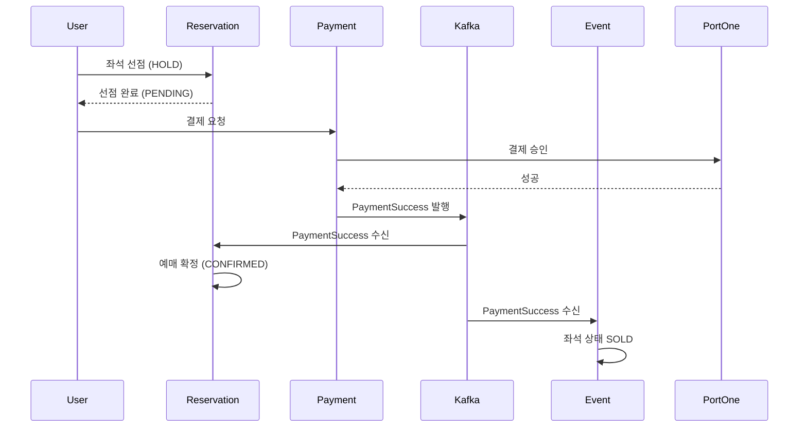

**실패 시나리오 (보상 트랜잭션):**
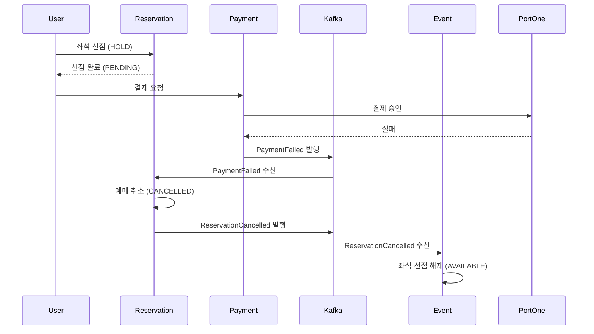

### 7.4 Event Schema 정의

#### 7.4.1 공통 이벤트 구조

모든 이벤트는 다음 공통 필드를 포함합니다:

```json
{
  "eventId": "uuid",             // 이벤트 고유 ID (멱등성 키)
  "eventType": "string",         // 이벤트 타입
  "aggregateId": "uuid",         // Aggregate ID (Reservation/Payment)
  "aggregateType": "string",     // Aggregate 타입 ("Reservation", "Payment")
  "version": "string",           // 이벤트 스키마 버전 (v1, v2)
  "timestamp": "ISO8601",        // 이벤트 발생 시각
  "metadata": {
    "correlationId": "uuid",     // 요청 추적 ID
    "causationId": "uuid",       // 원인 이벤트 ID
    "userId": "uuid"             // 사용자 ID
  },
  "payload": {}                  // 이벤트별 데이터
}
```

#### 7.4.2 이벤트 버전 관리

**전략:** Semantic Versioning (v1, v2, v3)

**하위 호환성 유지:**
- 필드 추가: 호환 가능 (Consumer는 무시)
- 필드 삭제: 호환 불가 (새 버전 발행, v1 → v2)
- 필드 타입 변경: 호환 불가 (새 버전 발행)

**Consumer 버전 처리:**
```java
@KafkaListener(topics = "payment.events")
public void handlePaymentEvent(String message) {
    JsonNode event = objectMapper.readTree(message);
    String version = event.get("version").asText();

    switch (version) {
        case "v1":
            handlePaymentEventV1(event);
            break;
        case "v2":
            handlePaymentEventV2(event);
            break;
        default:
            throw new UnsupportedVersionException(version);
    }
}
```

**관련 요구사항:** REQ-PAY-013, REQ-RSV-011

### 7.5 Dead Letter Queue (DLQ) 처리

#### 7.5.1 DLQ 사용 시나리오

**Consumer 처리 실패 시 DLQ로 이동:**
- 비즈니스 로직 예외 (데이터 무결성 오류 등)
- 일시적 오류 아님 (재시도해도 실패)
- 3회 재시도 후에도 실패

**일시적 오류는 재시도:**
- DB 커넥션 타임아웃
- 네트워크 오류
- 재시도 가능한 예외

#### 7.5.2 DLQ 구현

**Spring Kafka ErrorHandler:**
```java
@Configuration
public class KafkaConsumerConfig {

    @Bean
    public DefaultErrorHandler errorHandler(KafkaTemplate<String, String> kafkaTemplate) {
        // 재시도 정책: 지수 백오프
        BackOff backOff = new ExponentialBackOffWithMaxRetries(3);
        backOff.setInitialInterval(1000);  // 1초
        backOff.setMultiplier(2.0);        // 2배씩 증가
        backOff.setMaxInterval(10000);     // 최대 10초

        DefaultErrorHandler errorHandler = new DefaultErrorHandler(
            (record, exception) -> {
                // 3회 재시도 후 DLQ로 이동
                String dlqTopic = "dlq." + record.topic().split("\\.")[0];
                kafkaTemplate.send(dlqTopic, record.key(), record.value());
                log.error("메시지를 DLQ로 이동: {}", dlqTopic, exception);
            },
            backOff
        );

        // 재시도 가능한 예외
        errorHandler.addRetryableExceptions(
            DataAccessException.class,
            TimeoutException.class
        );

        // 재시도 불가능한 예외 (즉시 DLQ)
        errorHandler.addNotRetryableExceptions(
            ValidationException.class,
            IllegalArgumentException.class
        );

        return errorHandler;
    }
}
```

#### 7.5.3 DLQ 모니터링 및 재처리

**DLQ 모니터링:**
- CloudWatch Metric: DLQ 메시지 수
- 알람: DLQ 메시지 10개 이상 시 알림

**재처리 프로세스:**
1. DLQ 메시지 조회 (Kafka Consumer 또는 CLI)
2. 원인 분석 (로그, 예외 메시지)
3. 데이터 수정 또는 코드 수정
4. 수동 재발행 (원본 토픽으로)

**재발행 스크립트 예시:**
```bash
# DLQ 메시지 읽기
kafka-console-consumer.sh \
  --bootstrap-server localhost:9092 \
  --topic dlq.payment \
  --from-beginning \
  --max-messages 10 > dlq_messages.txt

# 수정 후 원본 토픽으로 재발행
kafka-console-producer.sh \
  --bootstrap-server localhost:9092 \
  --topic payment.events < fixed_messages.txt
```

**관련 요구사항:** REQ-EVT-024

### 7.6 멱등성 보장 메커니즘

#### 7.6.1 Producer 멱등성

**Kafka Producer 설정:**
```java
@Configuration
public class KafkaProducerConfig {
    @Bean
    public ProducerFactory<String, String> producerFactory() {
        Map<String, Object> config = new HashMap<>();
        config.put(ProducerConfig.BOOTSTRAP_SERVERS_CONFIG, "localhost:9092");
        config.put(ProducerConfig.KEY_SERIALIZER_CLASS_CONFIG, StringSerializer.class);
        config.put(ProducerConfig.VALUE_SERIALIZER_CLASS_CONFIG, StringSerializer.class);

        // 멱등성 활성화
        config.put(ProducerConfig.ENABLE_IDEMPOTENCE_CONFIG, true);
        config.put(ProducerConfig.ACKS_CONFIG, "all");
        config.put(ProducerConfig.RETRIES_CONFIG, Integer.MAX_VALUE);
        config.put(ProducerConfig.MAX_IN_FLIGHT_REQUESTS_PER_CONNECTION, 5);

        return new DefaultKafkaProducerFactory<>(config);
    }
}
```

**특징:**
- 네트워크 오류로 재전송해도 중복 메시지 방지
- Broker가 자동으로 중복 감지 (Producer ID + Sequence Number)

#### 7.6.2 Consumer 멱등성

**문제:** Kafka는 At-least-once 전달 보장 → Consumer가 동일 메시지 중복 수신 가능

**해결책: 이벤트 ID 기반 중복 처리 방지**

**방법 1: DB Unique Constraint (권장)**
```java
@Entity
@Table(name = "processed_events")
public class ProcessedEvent {
    @Id
    @Column(name = "event_id")
    private UUID eventId;  // Unique

    @Column(name = "event_type")
    private String eventType;

    @Column(name = "processed_at")
    private Instant processedAt;
}

@KafkaListener(topics = "payment.events")
@Transactional
public void handlePaymentSuccess(PaymentSuccessEvent event) {
    // 멱등성 체크: event_id로 중복 방지
    if (processedEventRepository.existsById(event.getEventId())) {
        log.info("이미 처리된 이벤트: {}", event.getEventId());
        return;
    }

    // 비즈니스 로직
    Reservation reservation = reservationRepository.findById(event.getReservationId())
        .orElseThrow();
    reservation.confirm();
    reservationRepository.save(reservation);

    // 처리 완료 기록 (동일 트랜잭션)
    processedEventRepository.save(new ProcessedEvent(event.getEventId(), event.getEventType()));
}
```

**방법 2: Redis Set (빠른 조회)**
```java
@KafkaListener(topics = "payment.events")
public void handlePaymentSuccess(PaymentSuccessEvent event) {
    String key = "processed:event:" + event.getEventId();

    // Redis SETNX (Set if Not Exists)
    Boolean isNew = redisTemplate.opsForValue().setIfAbsent(key, "1", Duration.ofDays(7));

    if (Boolean.FALSE.equals(isNew)) {
        log.info("이미 처리된 이벤트: {}", event.getEventId());
        return;
    }

    // 비즈니스 로직
    // ...
}
```

**방법 3: paymentKey/reservationId 기반 (도메인 키)**
```java
@KafkaListener(topics = "payment.events")
@Transactional
public void handlePaymentSuccess(PaymentSuccessEvent event) {
    // paymentKey로 중복 처리 방지
    if (paymentRepository.existsByPaymentKey(event.getPaymentKey())) {
        log.info("이미 처리된 결제: {}", event.getPaymentKey());
        return;
    }

    // 비즈니스 로직
    // ...
}
```

**관련 요구사항:** REQ-PAY-004, REQ-PAY-010

### 7.7 At-least-once vs Exactly-once 전달 보장

#### 7.7.1 Kafka 전달 보장 수준

| 전달 보장 | 설명 | 장점 | 단점 | 적용 |
|----------|------|------|------|------|
| At-most-once | 메시지 손실 가능, 중복 없음 | 빠름 | 데이터 손실 | 비적용 |
| At-least-once | 중복 가능, 손실 없음 | 신뢰성 | 멱등성 처리 필요 | **적용** |
| Exactly-once | 중복 없음, 손실 없음 | 완벽한 신뢰성 | 복잡도 높음, 성능 저하 | 선택 |

#### 7.7.2 현재 아키텍처: At-least-once + Consumer 멱등성

**선택 이유:**
- Exactly-once는 Kafka Streams 또는 트랜잭션 API 필요 (복잡도 증가)
- At-least-once + Consumer 멱등성으로 충분한 신뢰성 확보
- 성능과 복잡도의 균형

**Consumer 설정:**
```yaml
spring:
  kafka:
    consumer:
      enable-auto-commit: false  # 수동 커밋
      isolation-level: read_committed
    listener:
      ack-mode: MANUAL_IMMEDIATE
```

**수동 커밋 예시:**
```java
@KafkaListener(topics = "payment.events")
public void handlePaymentSuccess(ConsumerRecord<String, String> record, Acknowledgment ack) {
    try {
        PaymentSuccessEvent event = objectMapper.readValue(record.value(), PaymentSuccessEvent.class);

        // 멱등성 체크 + 비즈니스 로직
        handlePaymentSuccessIdempotent(event);

        // 처리 완료 후 커밋
        ack.acknowledge();
    } catch (Exception e) {
        log.error("이벤트 처리 실패, 재시도 예정", e);
        // 커밋하지 않음 → 재시도
    }
}
```

#### 7.7.3 Exactly-once 전환 계획 (향후)

**전환 시점:**
- 데이터 정합성 이슈 빈번 발생
- 멱등성 처리 복잡도 증가
- 트랜잭션 보장 필수 요구사항 추가

**Kafka Transactional API 사용:**
```java
// Producer
@Bean
public ProducerFactory<String, String> transactionalProducerFactory() {
    Map<String, Object> config = new HashMap<>();
    // ... 기본 설정
    config.put(ProducerConfig.TRANSACTIONAL_ID_CONFIG, "payment-producer");
    return new DefaultKafkaProducerFactory<>(config);
}

// Consumer
@Transactional("kafkaTransactionManager")
@KafkaListener(topics = "payment.events")
public void handlePaymentSuccess(PaymentSuccessEvent event) {
    // DB 트랜잭션 + Kafka 커밋이 원자적으로 처리
}
```

**트레이드오프:**
- 장점: Exactly-once 보장
- 단점: 성능 10-30% 저하, 설정 복잡도 증가

---

## 8. API 설계

### 8.1 API Gateway 라우팅 규칙

**Path 기반 라우팅 매핑:**

| Path Pattern | 대상 서비스 | Port | 비고 |
|-------------|-----------|------|------|
| `/auth/**` | User Service | 8081 | 회원가입, 로그인, 로그아웃, 토큰 갱신 |
| `/users/**` | User Service | 8081 | 프로필 관리 |
| `/events/**` | Event Service | 8082 | 공연 조회, 좌석 정보 (공개 + 인증) |
| `/venues/**` | Event Service | 8082 | 공연장/홀 관리 (관리자) |
| `/queue/**` | Queue Service | 8083 | 대기열 진입, 상태 조회 |
| `/reservations/**` | Reservation Service | 8084 | 예매 관리 |
| `/payments/**` | Payment Service | 8085 | 결제 처리 |

**공개 엔드포인트 (인증 불필요):**
- `POST /auth/register`
- `POST /auth/login`
- `GET /events`, `GET /events/{id}`
- `GET /venues`

**인증 필수 엔드포인트:**
- `/auth/logout`, `/auth/refresh`
- `/users/**`
- `/queue/**`, `/reservations/**`, `/payments/**`

**관리자 전용 엔드포인트:**
- `POST /events`, `PUT /events/{id}`, `DELETE /events/{id}`
- `POST /venues`, `PUT /venues/{id}`
- `GET /queue/admin/stats`

**관련 요구사항:** REQ-GW-001 (동적 라우팅), REQ-GW-003 (공개 엔드포인트), REQ-GW-020 (Admin 권한)

### 8.2 주요 API 엔드포인트 목록

#### 8.2.1 인증/회원 API (User Service)

| Method | Endpoint | 설명 | 인증 | Rate Limit |
|--------|----------|------|------|-----------|
| POST | `/auth/register` | 회원가입 | 불필요 | 10/분 (IP) |
| POST | `/auth/login` | 로그인 | 불필요 | 10/분 (IP) |
| POST | `/auth/logout` | 로그아웃 | 필수 | 200/분 (사용자) |
| POST | `/auth/refresh` | 토큰 갱신 | Refresh Token | 200/분 (사용자) |
| GET | `/users/me` | 프로필 조회 | 필수 | 200/분 (사용자) |
| PUT | `/users/me` | 프로필 수정 | 필수 | 100/분 (사용자) |

**관련 요구사항:** REQ-AUTH-001 ~ REQ-AUTH-021

#### 8.2.2 공연 관리 API (Event Service)

| Method | Endpoint | 설명 | 인증 | Rate Limit |
|--------|----------|------|------|-----------|
| GET | `/events` | 공연 목록 조회 | 불필요 | 300/분 (IP) |
| GET | `/events/{id}` | 공연 상세 조회 | 불필요 | 300/분 (IP) |
| GET | `/events/{id}/seats` | 좌석 정보 조회 | 필수 | 200/분 (사용자) |
| POST | `/events` | 공연 생성 | 관리자 | - |
| PUT | `/events/{id}` | 공연 수정 | 관리자 | - |
| POST | `/venues` | 공연장 생성 | 관리자 | - |
| GET | `/internal/seats/status/{eventId}` | SOLD 좌석 ID 조회 (내부 전용) | 불필요 (내부) | - |

**참고:** `/internal/**` 경로는 API Gateway를 거치지 않고 서비스 간 직접 호출됩니다.

**관련 요구사항:** REQ-EVT-001 ~ REQ-EVT-006

#### 8.2.3 대기열 API (Queue Service)

| Method | Endpoint | 설명 | 인증 | Rate Limit |
|--------|----------|------|------|-----------|
| POST | `/queue/enter` | 대기열 진입 | 필수 | 100/분 (사용자) |
| GET | `/queue/status` | 대기열 상태 조회 | 필수 | 60/분 (사용자) |
| DELETE | `/queue/leave` | 대기열 이탈 | 필수 | 100/분 (사용자) |

**관련 요구사항:** REQ-QUEUE-001, REQ-QUEUE-002, REQ-QUEUE-014

#### 8.2.4 예매 API (Reservation Service)

| Method | Endpoint | 설명 | 인증 | Rate Limit |
|--------|----------|------|------|-----------|
| GET | `/reservations/seats/{eventId}` | 좌석 상태 조회 | 필수 | 200/분 (사용자) |
| POST | `/reservations/hold` | 좌석 선점 | 필수 + Queue Token | 20/분 (사용자) |
| PUT | `/reservations/hold/{id}` | 좌석 변경 | 필수 | 20/분 (사용자) |
| GET | `/reservations` | 나의 예매 내역 | 필수 | 200/분 (사용자) |
| DELETE | `/reservations/{id}` | 예매 취소 | 필수 | 20/분 (사용자) |

**관련 요구사항:** REQ-RSV-001 ~ REQ-RSV-009

#### 8.2.5 결제 API (Payment Service)

| Method | Endpoint | 설명 | 인증 | Rate Limit |
|--------|----------|------|------|-----------|
| POST | `/payments` | 결제 요청 | 필수 + Queue Token | 20/분 (사용자) |
| POST | `/payments/confirm` | 결제 확인 | 필수 | 20/분 (사용자) |
| GET | `/payments/{id}` | 결제 조회 | 필수 | 200/분 (사용자) |
| GET | `/payments` | 결제 내역 | 필수 | 200/분 (사용자) |

**관련 요구사항:** REQ-PAY-001 ~ REQ-PAY-015

### 8.3 API Rate Limiting 정책

**엔드포인트별 제한:**

| 엔드포인트 | IP 기반 | 사용자 기반 | 비고 |
|-----------|---------|-----------|------|
| 읽기 (GET 공개) | 300/분 | - | 공연 목록/상세 조회 |
| 로그인 | 10/분 | - | 무차별 대입 공격 방지 |
| 대기열 상태 조회 | - | 60/분 | 폴링 제한 |
| 예매/결제 | 50/분 | 20/분 | 어뷰징 방지 |
| 기타 | 100/분 | 200/분 | 일반 API |

**구현:** Resilience4j RateLimiter + Redis 기반 분산 Rate Limiter

**관련 요구사항:** REQ-GW-005, REQ-GW-006, REQ-QUEUE-014

---

## 9. 보안 아키텍처

### 9.1 JWT 인증/인가 플로우

**Access Token:**
- 유효기간: 1시간
- 포함 정보: userId, email, role (USER/ADMIN)
- 서명 알고리즘: HS256 (HMAC-SHA256)

**Refresh Token:**
- 유효기간: 7일
- DB 저장 (auth_tokens 테이블)
- Rotation (RTR) 적용 검토

**토큰 블랙리스트:**
- 로그아웃 시 Access Token을 Redis에 블랙리스트 등록
- TTL: 토큰 만료 시간 (1시간)

**API Gateway 검증 플로우:**
```
1. 클라이언트 → Gateway: Authorization: Bearer {token}
2. Gateway: JWT 서명 검증, 만료 확인
3. Gateway: Redis 블랙리스트 확인
4. Gateway: 사용자 정보 추출 (userId, role)
5. Gateway → 다운스트림: X-User-Id, X-User-Role 헤더 추가
```

**관련 요구사항:** REQ-AUTH-006, REQ-AUTH-009, REQ-AUTH-010, REQ-AUTH-011, REQ-GW-002

### 9.2 본인인증 및 CAPTCHA

**PortOne 본인인증 (CI/DI):**
- 회원가입 시 필수
- CI (Connecting Information): 1인 1계정 강제
- 테스트 모드 사용

**reCAPTCHA:**
- 회원가입, 로그인 시 검증
- v2 Checkbox 방식

**관련 요구사항:** REQ-AUTH-003, REQ-AUTH-004

### 9.3 암호화 전략

**비밀번호:** BCrypt (Cost Factor: 10-12)
**개인정보 (선택):** AES-256-GCM (email, phone, CI)
**통신:** HTTPS/TLS 1.3

**관련 요구사항:** REQ-AUTH-014, REQ-AUTH-019

### 9.4 CORS 정책

**허용 Origin:** `https://ticketing.vercel.app` (프론트엔드)
**허용 메서드:** GET, POST, PUT, DELETE, OPTIONS
**허용 헤더:** Authorization, Content-Type, X-Queue-Token
**인증정보 포함:** credentials: true

**관련 요구사항:** REQ-GW-004

---

## 10. 대기열 시스템 설계

### 10.1 Redis Sorted Set 기반 대기열

**구조:**
- Key: `queue:{eventId}`
- Score: Unix Timestamp (진입 시각)
- Member: userId

**진입 플로우:**
1. 중복 대기 확인: `EXISTS queue:active:{userId}`
2. 용량 확인: `ZCARD queue:{eventId}` < 50,000
3. 대기열 진입: `ZADD queue:{eventId} NX {timestamp} {userId}`
4. Active 표시: `SET queue:active:{userId} {eventId} EX 600`
5. Queue Token 발급: `qr_xxx` (Reservation Token)

**관련 요구사항:** REQ-QUEUE-001, REQ-QUEUE-010, REQ-QUEUE-021

### 10.2 배치 승인 로직 (Lua 스크립트)

**스케줄러:** 1초마다 10명 승인 (36,000명/시간)

```lua
local queue_key = KEYS[1]
local count = tonumber(ARGV[1]) or 10

-- 상위 N명 조회
local members = redis.call('ZRANGE', queue_key, 0, count - 1)

if #members == 0 then
  return {}
end

-- 대기열에서 제거
redis.call('ZREM', queue_key, unpack(members))

-- Token 발급 (별도 로직)
return members
```

**관련 요구사항:** REQ-QUEUE-005

### 10.3 Queue Token 이중 모델

**Reservation Token (qr_xxx):**
- 좌석 선점 시 검증
- TTL: 10분

**Payment Token (qp_xxx):**
- 결제 시 검증
- TTL: 10분
- Reservation Token 승인 후 발급

**관련 요구사항:** REQ-QUEUE-004, REQ-GW-021

---

## 11. 좌석 예매 시스템 설계

### 11.1 좌석 선점 메커니즘 (Redisson 분산 락)

**프로세스:**
1. Queue Token 검증: `GET queue:token:qr_xxx`
2. 좌석 락 획득: `RLock.tryLock("seat:hold:{eventId}:{seatId}", 3초, 300초)`
3. 예매 정보 저장: `reservations` 테이블 (PENDING)
4. Payment Token 발급 요청

**TTL:** 5분 (300초)

**관련 요구사항:** REQ-RSV-001, REQ-RSV-007

### 11.2 좌석 상태 관리

| 상태 | 저장 위치 | 의미 |
|------|----------|------|
| HOLD | Redis (분산 락) | 선점 중 (5분) |
| SOLD | RDB (seats.status) | 결제 완료 |
| AVAILABLE | - | HOLD도 SOLD도 아님 |

**조회 로직:**

1. **Event Service에서 SOLD 좌석 조회 (Feign 호출)**:
   ```java
   // Feign Client
   List<String> soldSeatIds = eventServiceClient.getSoldSeats(eventId);
   ```

2. **Redis에서 HOLD 좌석 조회**:
   ```java
   // Redis keys pattern: seat:hold:{eventId}:{seatId}
   Set<String> holdSeatIds = redisTemplate.keys("seat:hold:" + eventId + ":*")
       .stream()
       .map(key -> key.split(":")[3])  // Extract seatId
       .collect(Collectors.toSet());
   ```

3. **Event Service에서 전체 좌석 조회** (또는 클라이언트가 이미 가지고 있음):
   ```java
   List<Seat> allSeats = eventServiceClient.getEventSeats(eventId);
   ```

4. **좌석 상태 병합**:
   ```java
   return allSeats.stream()
       .map(seat -> {
           if (soldSeatIds.contains(seat.getId())) {
               seat.setStatus("SOLD");
           } else if (holdSeatIds.contains(seat.getId())) {
               seat.setStatus("HOLD");
           } else {
               seat.setStatus("AVAILABLE");
           }
           return seat;
       })
       .collect(Collectors.toList());
   ```

**관련 요구사항:** REQ-RSV-003, REQ-EVT-008

### 11.3 예매 확정 플로우 (Kafka Consumer)

**이벤트 수신:** `payment.events` (PaymentSuccess)

**처리 로직:**
1. 멱등성 체크: paymentKey 중복 확인
2. 예매 상태 변경: PENDING → CONFIRMED
3. Outbox 이벤트 발행: ReservationConfirmed (Event Service로 전파)

**관련 요구사항:** REQ-RSV-004, REQ-RSV-011

---

## 12. 결제 시스템 설계

### 12.1 PortOne 통합 아키텍처

**결제 프로세스:**
1. **결제 정보 생성:** Payment 레코드 생성 (PENDING)
2. **PortOne Prepare API:** 금액 사전 검증 등록
3. **클라이언트 결제:** PortOne JS SDK로 결제 UI 호출
4. **PortOne Confirm API:** 결제 승인 확인 및 금액 검증
5. **결제 완료:** Payment 상태 SUCCESS, Kafka 이벤트 발행

**Timeout:** 10초 (REQ-PAY-008)
**Circuit Breaker:** 실패율 50% 초과 시 Open, 대기 60초 (REQ-PAY-009)

**관련 요구사항:** REQ-PAY-001, REQ-PAY-006, REQ-PAY-007, REQ-PAY-010

### 12.2 SAGA 패턴 구현

**성공 시나리오:**
```
Payment (Orchestrator)
├─ PortOne 결제 성공
├─ Kafka: PaymentSuccess 발행
├─ Reservation Consumer: 예매 확정 (CONFIRMED)
└─ Event Consumer: 좌석 상태 SOLD
```

**실패 시나리오 (보상 트랜잭션):**
```
Payment (Orchestrator)
├─ PortOne 결제 실패
├─ Kafka: PaymentFailed 발행
├─ Reservation Consumer: 예매 취소 (CANCELLED)
└─ Event Consumer: 좌석 선점 해제 (AVAILABLE)
```

**관련 요구사항:** REQ-PAY-011, REQ-PAY-012

### 12.3 멱등성 보장 (paymentKey)

**paymentKey:** 클라이언트가 생성한 UUID (Unique)

**중복 방지:**
```java
if (paymentRepository.existsByPaymentKey(paymentKey)) {
    Payment existing = paymentRepository.findByPaymentKey(paymentKey);
    return existing;  // 중복 요청, 기존 결과 반환
}
```

**관련 요구사항:** REQ-PAY-004, REQ-PAY-010

---

## 13. 배포 및 CI/CD

### 13.1 배포 전략

**초기:** Rolling Update (비용 효율적)
**성장 단계:** Blue-Green 배포

### 13.2 CI/CD 파이프라인

**GitHub Actions 워크플로우:**
1. 트리거: `main` 브랜치 push
2. 빌드: Maven/Gradle 빌드, 테스트 실행
3. 도커 이미지: 멀티스테이지 빌드로 최적화
4. ECR 푸시: AWS ECR에 이미지 업로드
5. ECS 배포: ECS Task Definition 업데이트, 서비스 재배포

**무료티어:** GitHub Actions 2000분/월

### 13.3 로컬 개발 환경

**Docker Compose:** 전체 스택 (PostgreSQL, Redis, Kafka, 서비스)
**Hot Reload:** Spring DevTools
**LocalStack:** AWS 서비스 에뮬레이션

### 13.4 Graceful Shutdown

**설정:**
```yaml
spring:
  lifecycle:
    timeout-per-shutdown-phase: 30s
server:
  shutdown: graceful
```

**프로세스:**
1. ALB 헬스체크 실패 응답
2. 신규 요청 거부
3. 진행 중 요청 완료 대기 (최대 30초)
4. 종료

**관련 요구사항:** REQ-GW-026

---

## 14. 모니터링 및 로깅

### 14.1 CloudWatch 통합

**로그 수집:** 5GB/월 무료티어 활용
**로그 보관:** 1일 (중요 로그만 7일)
**JSON 구조화:** 파싱 용이

### 14.2 핵심 메트릭 (무료티어 10개 이내)

1. API Gateway: 요청 수, 응답 시간, 에러율
2. 대기열: 대기 인원, 승인률
3. 예매: 선점 성공/실패율
4. 결제: 성공/실패율
5. RDS: CPU, 메모리, 커넥션 수
6. Redis: 메모리 사용량, Hit Rate

### 14.3 알람 설정 (무료티어 10개)

1. 서비스 다운 (헬스체크 실패)
2. 에러율 5% 이상
3. RDS CPU 80% 이상
4. Redis 메모리 80% 이상

### 14.4 분산 추적

**Spring Cloud Sleuth:** Request ID 전파
**CloudWatch Logs Insights:** 로그 조회 및 분석

---

## 15. 성능 최적화 전략

### 15.1 Redis 캐싱

**Cache-Aside 패턴:** 조회 시 캐시 확인 → 없으면 DB 조회 → 캐시 저장
**TTL:** 공연 목록/상세 5분, 오픈 시 1분으로 동적 조정
**Cache Stampede 방지:** Lua 스크립트 락

**관련 요구사항:** REQ-EVT-017, REQ-EVT-027, REQ-EVT-031

### 15.2 DB 쿼리 최적화

**인덱스 전략:**
- `seats (event_id, status)`
- `reservations (user_id, status)`
- `outbox_events (published, created_at)`

**N+1 문제 해결:** JPA Fetch Join

### 15.3 API 최적화

**Response 압축:** gzip (1KB 이상)
**페이징:** 기본 20개, 최대 100개

---

## 16. 테스트 전략

### 16.1 단위 테스트

JUnit 5, Mockito, AssertJ
**목표 커버리지:** 70% 이상

### 16.2 통합 테스트

Testcontainers (PostgreSQL, Redis, Kafka)
Spring Boot Test

### 16.3 E2E 테스트 시나리오

**주요 플로우:**
1. 회원가입 → 로그인 → 대기열 진입 → 좌석 선택 → 결제 → 예매 확정

### 16.4 성능 테스트

**도구:** JMeter, Gatling
**시나리오:**
- 대기열 동시성 테스트 (50,000명)
- 좌석 선점 경쟁 테스트
- 결제 처리량 테스트

---

## 16. 테스트 전략

_(이 섹션은 다음 작업 단계에서 상세 작성 예정)_

---

## 17. 운영 계획

### 17.1 SLA/SLO 정의

| 항목 | 목표 | 측정 방법 |
|------|------|----------|
| 가용성 | 99.5% (초기), 99.9% (Multi-AZ 전환 후) | CloudWatch Uptime |
| 응답 시간 (P95) | 대기열 진입 < 100ms, 조회 < 50ms | CloudWatch Metrics |
| 처리량 | 36,000명/시간 (대기열 승인) | Kafka Consumer Lag |
| Redis 가용성 | 99.9% | ElastiCache Metrics |

### 17.2 장애 대응 프로세스

**장애 등급:**
- **P0 (Critical)**: 서비스 전체 다운, 즉시 대응
- **P1 (High)**: 주요 기능 불가 (결제, 예매), 1시간 내 대응
- **P2 (Medium)**: 일부 기능 불가, 4시간 내 대응
- **P3 (Low)**: 경미한 오류, 24시간 내 대응

**On-call 체계:** 주/야간 교대 (개발자 2명 순환)

### 17.3 백업 및 복구

**RDS 백업:**
- 자동 백업: 1일 보관 (무료)
- 수동 스냅샷: 주요 배포 전 생성, 7일 보관

**복구 절차:**
1. 최신 스냅샷 확인
2. 새 RDS 인스턴스로 복구
3. 엔드포인트 변경 (또는 DNS 업데이트)
4. 서비스 재시작

**RTO/RPO:**
- RTO (복구 시간): 30-60분 (Single-AZ), 1-2분 (Multi-AZ)
- RPO (데이터 손실): 최대 5분

### 17.4 용량 계획

**트래픽 예측:**
- 평상시: 100 TPS
- 티켓 오픈: 1,000 TPS (순간 5,000 TPS)

**리소스 증설 기준:**
- RDS CPU 70% 지속 → Read Replica 추가 또는 인스턴스 업그레이드
- Redis 메모리 70% → 인스턴스 업그레이드
- EC2 CPU 70% → Auto Scaling 또는 수동 스케일 아웃

**비용 모니터링:**
- AWS Cost Explorer로 월별 비용 추적
- 알람: 예상 비용 초과 시 알림

---

## 18. 기술 부채 및 개선 사항

### 18.1 알려진 제약사항

1. **단일 RDS 인스턴스:**
   - 서비스별 물리적 DB 분리 미구현
   - 향후 트래픽 증가 시 병목 가능

2. **Single-AZ 배포:**
   - AZ 장애 시 서비스 중단
   - 초기 비용 절감을 위한 선택

3. **Kafka 단일 브로커:**
   - 브로커 다운 시 이벤트 처리 중단
   - 향후 3 브로커 클러스터로 확장 필요

4. **수동 스케일링:**
   - Auto Scaling 미적용 (비용 절감)
   - 트래픽 예측 필요

### 18.2 향후 개선 계획

**Phase 1 (6개월):**
- Multi-AZ 전환 (RDS, Redis, Kafka)
- Auto Scaling 적용
- Read Replica 추가

**Phase 2 (1년):**
- 서비스별 물리적 DB 분리
- ElasticSearch 도입 (예매 내역 검색)
- CDN 최적화 (정적 리소스)

**Phase 3 (2년):**
- Multi-Region 배포
- Serverless 전환 검토 (Lambda, Aurora Serverless)
- AI 기반 부정 예매 탐지

### 18.3 기술 검토 항목

| 항목 | 현재 | 검토 사항 | 우선순위 |
|------|------|----------|---------|
| CQRS 패턴 | 부분 적용 (Redis 캐싱) | 전면 적용 검토 | Medium |
| Event Sourcing | 미적용 | 이벤트 히스토리 추적 | Low |
| GraphQL | 미적용 | REST API 대체 검토 | Low |
| gRPC | 미적용 | 서비스 간 통신 성능 향상 | Medium |
| Kubernetes | ECS/EC2 | 오케스트레이션 개선 | Low |
| Service Mesh | 미적용 | Istio, Linkerd 검토 | Low |

---

## 19. 부록

### 19.1 용어 정의 (Glossary)

| 용어 | 정의 |
|------|------|
| MSA | Microservices Architecture, 마이크로서비스 아키텍처 |
| SAGA | 분산 트랜잭션 패턴, 오케스트레이션 또는 코레오그래피 방식 |
| Outbox Pattern | 이벤트 발행 신뢰성을 보장하는 패턴, DB 트랜잭션과 메시지 발행을 원자적으로 처리 |
| CI/DI | 본인인증 정보, Connecting Information / Duplication Information |
| Queue Token | 대기열 통과 인증 토큰, Reservation Token (qr_xxx), Payment Token (qp_xxx) |
| Sorted Set | Redis 자료구조, Score 기반 정렬된 집합 |
| Redisson | Redis 기반 Java 클라이언트, 분산 락, 분산 자료구조 지원 |
| PortOne | 결제 PG (Payment Gateway), 구 아임포트 |
| reCAPTCHA | Google의 봇 차단 서비스 |
| LocalStack | AWS 서비스 로컬 에뮬레이터 |
| CloudWatch | AWS 모니터링 및 로깅 서비스 |
| ElastiCache | AWS 관리형 Redis/Memcached 서비스 |
| RDS | AWS 관리형 관계형 데이터베이스 서비스 |
| P95 | 95th Percentile, 전체 요청 중 95%가 해당 시간 이내 응답 |
| TPS | Transactions Per Second, 초당 트랜잭션 수 |
| SLA | Service Level Agreement, 서비스 수준 협약 |
| SLO | Service Level Objective, 서비스 수준 목표 |
| RTO | Recovery Time Objective, 목표 복구 시간 |
| RPO | Recovery Point Objective, 목표 복구 시점 (데이터 손실 허용 범위) |

### 19.2 참고 문서 및 링크

**요구사항 명세서:**
- [REQUIREMENTS.md](./REQUIREMENTS.md) - 111개 요구사항 정의

**기술 문서:**
- Spring Cloud Gateway: https://spring.io/projects/spring-cloud-gateway
- Spring Boot 3.x: https://spring.io/projects/spring-boot
- PostgreSQL 18: https://www.postgresql.org/docs/18/
- Redis 7.x: https://redis.io/docs/
- Apache Kafka 3.x: https://kafka.apache.org/documentation/
- Redisson: https://redisson.org/
- Resilience4j: https://resilience4j.readme.io/

**외부 서비스:**
- PortOne: https://portone.io/
- Google reCAPTCHA: https://www.google.com/recaptcha/
- Vercel: https://vercel.com/docs

**AWS 문서:**
- RDS PostgreSQL: https://docs.aws.amazon.com/rds/
- ElastiCache Redis: https://docs.aws.amazon.com/elasticache/
- ECS: https://docs.aws.amazon.com/ecs/
- CloudWatch: https://docs.aws.amazon.com/cloudwatch/
- LocalStack: https://docs.localstack.cloud/

**패턴 및 아키텍처:**
- SAGA 패턴: https://microservices.io/patterns/data/saga.html
- Transactional Outbox: https://microservices.io/patterns/data/transactional-outbox.html
- Event-Driven Architecture: https://martinfowler.com/articles/201701-event-driven.html

### 19.3 아키텍처 결정 기록 (ADR)

**ADR-001: PostgreSQL 단일 인스턴스 + 스키마 분리 선택**
- **날짜:** 2026-01-11
- **상태:** 승인됨
- **컨텍스트:** 비용 최소화하면서 MSA 원칙 준수
- **결정:** 논리적 DB per Service + 물리적 통합
- **결과:** 무료티어 활용, 향후 물리적 분리 가능
- **대안:** 서비스별 독립 RDS (비용 $170+/월)

**ADR-002: EC2 기반 Kafka 선택**
- **날짜:** 2026-01-11
- **상태:** 승인됨
- **컨텍스트:** MSK는 최소 월 $200+로 고비용
- **결정:** EC2 자체 Kafka 클러스터 구축
- **결과:** 월 $15-60, 운영 부담 증가
- **대안:** Amazon SNS/SQS (이벤트 스트리밍 기능 부족), MSK (고비용)

**ADR-003: At-least-once + Consumer 멱등성 선택**
- **날짜:** 2026-01-11
- **상태:** 승인됨
- **컨텍스트:** Exactly-once는 복잡도 증가
- **결정:** At-least-once 전달 보장 + Consumer 멱등성 처리
- **결과:** 신뢰성 확보, 구현 단순
- **대안:** Kafka Transactional API (성능 10-30% 저하)

**ADR-004: Redisson 분산 락 선택**
- **날짜:** 2026-01-11
- **상태:** 승인됨
- **컨텍스트:** 좌석 선점 동시성 제어 필요
- **결정:** Redisson RLock 사용
- **결과:** 안정적인 분산 락, Pub/Sub로 대기 최적화
- **대안:** Redis SET NX (수동 구현, Watch Dog 없음), ZooKeeper (과도한 의존성)

### 19.4 다이어그램 범례 및 표기법

**Mermaid 다이어그램 범례:**

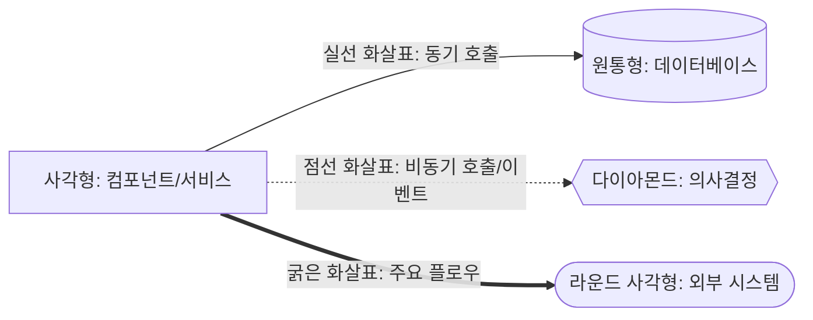

**시퀀스 다이어그램 표기:**
- `→`: 동기 호출 (Request-Response)
- `-->>`: 비동기 응답
- `-->|메시지|`: 호출 시 메시지

**ERD 표기:**
- `PK`: Primary Key
- `FK`: Foreign Key
- `UK`: Unique Key
- `||--o{`: One-to-Many 관계
- `||--||`: One-to-One 관계

**상태 다이어그램 표기:**
- 원: 상태
- 화살표: 전이 (이벤트/조건)

---

## 문서 종료

이 아키텍처 설계서는 요구사항 명세서(REQUIREMENTS.md)의 111개 요구사항을 기반으로 작성되었습니다. 실제 구현 시 이 문서를 참조하여 일관된 아키텍처를 유지하시기 바랍니다.

**문서 버전:** 1.0.0
**최종 수정일:** 2026-01-11
**작성자:** 개발팀 (A개발자, B개발자)
**문의:** GitHub Issues
