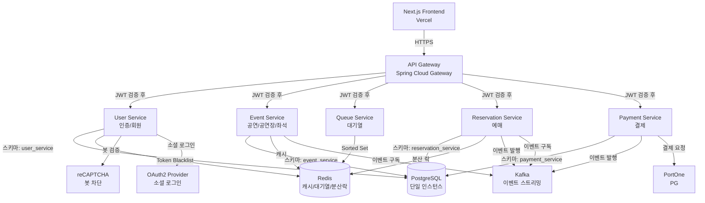
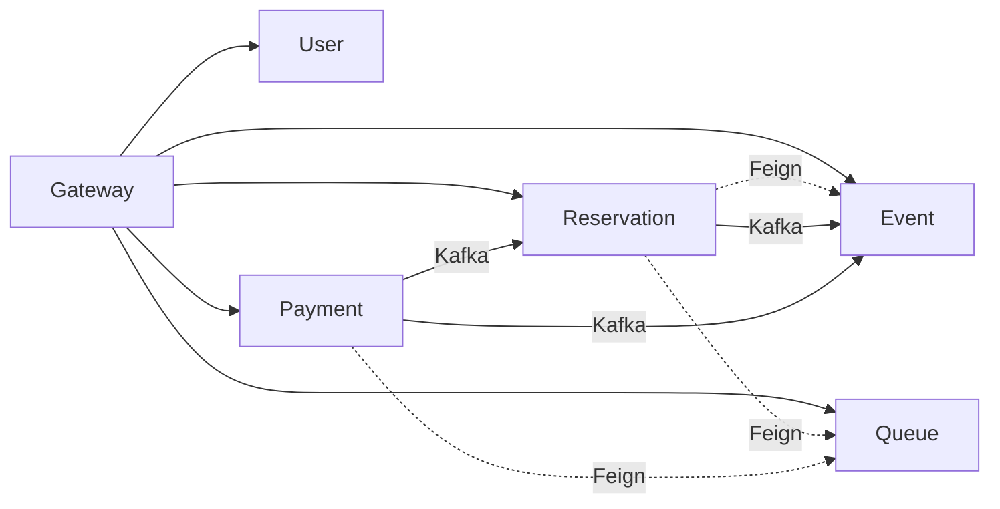

# 마이크로서비스 구성

## 1. 마이크로서비스 구성

### 1.1 서비스 맵 다이어그램



### 1.2 서비스별 책임과 경계

#### 1.2.1 API Gateway Service (담당: A개발자)

**책임:**
- 모든 클라이언트 요청의 단일 진입점
- Path 기반 라우팅으로 각 서비스로 요청 전달
- JWT 토큰 검증 및 사용자 정보 전달
- Rate Limiting (IP, 사용자 기반)
- Circuit Breaker로 장애 격리
- CORS 및 보안 헤더 관리

**주요 엔드포인트:**
- `/auth/**` → User Service
- `/users/**` → User Service
- `/events/**` → Event Service
- `/venues/**` → Event Service
- `/queue/**` → Queue Service
- `/reservations/**` → Reservation Service
- `/payments/**` → Payment Service

**기술 스택:**
- Spring Cloud Gateway 4.x
- Resilience4j (Circuit Breaker, Rate Limiter)
- Spring Security (JWT 검증)

**데이터 저장소:**
- 없음 (Stateless)

**관련 요구사항:** REQ-GW-001 ~ REQ-GW-026 (26개)

---

#### 1.2.2 User Service (담당: B개발자)

**책임:**
- 회원 가입/로그인/로그아웃
- JWT Access/Refresh Token 발급 및 갱신
- 본인인증 (PortOne CI/DI)
- reCAPTCHA 검증
- 소셜 로그인 (OAuth2)
- 프로필 관리 (조회, 수정, 비밀번호 변경, 회원 탈퇴)
- 토큰 블랙리스트 관리 (Redis)

**주요 API:**
- `POST /auth/register` - 회원가입
- `POST /auth/login` - 로그인
- `POST /auth/logout` - 로그아웃
- `POST /auth/refresh` - 토큰 갱신
- `GET /users/me` - 프로필 조회
- `PUT /users/me` - 프로필 수정

**데이터 모델:**
- `users`: 회원 정보 (이메일, 비밀번호 해시, CI, 가입일 등)
- `auth_tokens`: Refresh Token 저장
- `login_history`: 로그인 이력 (선택)

**외부 연동:**
- PortOne (본인인증)
- reCAPTCHA (봇 차단)
- OAuth2 Provider (카카오, 네이버, 구글)

**데이터 저장소:**
- PostgreSQL 스키마: `user_service`
- Redis: 토큰 블랙리스트 (`token:blacklist:{token}`)

**관련 요구사항:** REQ-AUTH-001 ~ REQ-AUTH-021 (21개)

---

#### 1.2.3 Event Service (담당: A개발자)

**책임:**
- 공연 CRUD (관리자)
- 공연 목록 조회 (페이징, 필터링, 검색)
- 공연 상세 조회
- 좌석 정보 조회 (등급별 그룹핑)
- 공연장/홀 관리
- 좌석 초기화 (공연 생성 시)
- Kafka 이벤트 구독하여 좌석 상태 업데이트 (SOLD)
- Redis 캐싱으로 조회 성능 최적화

**주요 API:**
- `POST /events` - 공연 생성 (관리자)
- `GET /events` - 공연 목록 조회
- `GET /events/{id}` - 공연 상세 조회
- `GET /events/{id}/seats` - 좌석 정보 조회
- `POST /venues` - 공연장 생성 (관리자)
- `POST /venues/{venueId}/halls` - 홀 생성 (관리자)

**내부 API (서비스 간 통신 전용):**
- `GET /internal/seats/status/{eventId}` - SOLD 좌석 ID 목록 조회 (Reservation Service용)

**내부 API 상세:**

`GET /internal/seats/status/{eventId}`
- **목적**: Reservation Service가 좌석 상태 조회 시 SOLD 좌석 확인용
- **인증**: 서비스 간 내부 호출 (API Key 또는 서비스 토큰)
- **응답 예시**:
  ```json
  {
    "eventId": "evt_123",
    "soldSeatIds": ["seat_001", "seat_042", "seat_103"]
  }
  ```
- **쿼리**: `SELECT id FROM seats WHERE event_id = ? AND status = 'SOLD'`
- **Rate Limiting**: 불필요 (내부 통신)

**데이터 모델:**
- `events`: 공연 정보
- `venues`: 공연장 정보
- `halls`: 홀 정보 (좌석 템플릿 포함)
- `seats`: 좌석 정보 (eventId, seatNumber, grade, price, status)

**Kafka Consumer:**
- `reservation.events` - 예매 이벤트 수신
  - ReservationConfirmed: 좌석 상태 SOLD 업데이트 (RDB)
  - ReservationCancelled: Redis hold_seats 정리

**데이터 저장소:**
- PostgreSQL 스키마: `event_service`
- Redis 캐시:
  - `cache:event:list` - 공연 목록 (TTL: 5분)
  - `cache:event:{eventId}` - 공연 상세 (TTL: 5분)
  - `cache:seats:{eventId}` - 좌석 정보 (TTL: 5분)

**성능 목표:**
- 공연 목록 조회: P95 < 200ms (REQ-EVT-004)
- 공연 상세 조회: P95 < 100ms (REQ-EVT-005)
- 좌석 정보 조회: P95 < 300ms (REQ-EVT-006)

**관련 요구사항:** REQ-EVT-001 ~ REQ-EVT-031 (24개)

---

#### 1.2.4 Queue Service (담당: A개발자)

**책임:**
- 대기열 진입 (Redis Sorted Set, ZADD NX)
- 대기열 상태 조회 (REST 폴링, 5초 권장)
- 배치 승인 (1초마다 10명, Lua 스크립트)
- Queue Token 발급 (Reservation Token, Payment Token)
- 대기열 용량 제한 (공연당 50,000명)
- 사용자당 동시 대기 1개 공연 제한
- Token 만료 처리 (TTL 10분)

**주요 API:**
- `POST /queue/enter` - 대기열 진입
- `GET /queue/status` - 대기열 상태 조회 (Rate Limit: 60회/분)
- `DELETE /queue/leave` - 대기열 이탈 (선택)
- `GET /queue/admin/stats` - 대기열 통계 (관리자, 선택)

**데이터 모델 (Redis):**
- `queue:{eventId}`: Sorted Set (score: timestamp, member: userId)
- `queue:token:{token}`: String (userId, eventId, type) - TTL 10분
- `queue:active:{userId}`: String (eventId) - 중복 대기 방지

**Lua 스크립트 (배치 승인):**
```lua
-- 1초마다 10명 승인
local eventId = KEYS[1]
local count = tonumber(ARGV[1]) or 10
local members = redis.call('ZRANGE', 'queue:' .. eventId, 0, count - 1)
if #members > 0 then
  redis.call('ZREM', 'queue:' .. eventId, unpack(members))
  -- Token 발급 로직
end
return members
```

**데이터 저장소:**
- Redis Sorted Set: 대기열
- Redis String: Token, 중복 방지

**성능 목표:**
- 진입: P95 < 100ms (REQ-QUEUE-015)
- 조회: P95 < 50ms (REQ-QUEUE-015)
- 처리량: 36,000명/시간 (10명/초)

**관련 요구사항:** REQ-QUEUE-001 ~ REQ-QUEUE-021 (10개)

---

#### 1.2.5 Reservation Service (담당: B개발자)

**책임:**
- 좌석 선점 (Redisson 분산 락, Redis 5분 TTL)
- 좌석 변경 (기존 락 해제 → 신규 락 획득)
- 좌석 상태 조회 (Redis HOLD + Event Service Feign 호출로 SOLD 조회)
- 예매 확정 (결제 성공 이벤트 수신)
- 예매 취소 (사용자 요청, 보상 트랜잭션)
- 예매 내역 조회
- 1회 예매 최대 4장 제한
- Queue Token 검증 (Reservation Token)

**주요 API:**
- `GET /reservations/seats/{eventId}` - 좌석 상태 조회
- `POST /reservations/hold` - 좌석 선점
- `PUT /reservations/hold/{reservationId}` - 좌석 변경
- `DELETE /reservations/hold/{reservationId}` - 선점 해제
- `GET /reservations` - 나의 예매 내역
- `DELETE /reservations/{id}` - 예매 취소

**데이터 모델:**
- `reservations`: 예매 정보 (userId, eventId, seatIds, status, createdAt)
  - status: PENDING / CONFIRMED / CANCELLED

**Kafka Producer:**
- `reservation.events`: 예매 취소 시 이벤트 발행

**Kafka Consumer:**
- `payment.events`: 결제 성공 시 예매 확정, 결제 실패 시 예매 취소

**데이터 저장소:**
- PostgreSQL 스키마: `reservation_service`
- Redis 분산 락: `seat:hold:{eventId}:{seatId}` (TTL: 5분)
- Outbox: `common.outbox_events` (필수) ✅

**Outbox Pattern 필수 적용 근거:**
- Reservation Service: ReservationCancelled 이벤트 유실 시 좌석 HOLD 미해제
- Payment Service: PaymentSuccess 이벤트 유실 시 예매 PENDING 상태 고착
- 두 서비스 모두 이벤트 발행 실패 시 데이터 불일치 발생 (P0 위험)

**관련 요구사항:** REQ-RSV-001 ~ REQ-RSV-013 (12개)

---

#### 1.2.6 Payment Service (담당: B개발자)

**책임:**
- 결제 요청 (PortOne 연동)
- PortOne 사전 검증 (Prepare API)
- 결제 승인 및 확인
- 결제 상태 관리 (PENDING/SUCCESS/FAILED/REFUNDED)
- 멱등성 보장 (paymentKey)
- SAGA 오케스트레이션 (결제 성공/실패 분기)
- 보상 트랜잭션 (결제 실패 시 예매 취소 이벤트 발행)
- Queue Token 검증 (Payment Token)
- Circuit Breaker (PortOne API 장애 대응)

**주요 API:**
- `POST /payments` - 결제 요청
- `POST /payments/confirm` - 결제 확인
- `GET /payments/{id}` - 결제 조회
- `GET /payments` - 결제 내역 조회 (선택)

**데이터 모델:**
- `payments`: 결제 정보 (reservationId, amount, paymentKey, status, portone_transaction_id)
  - status: PENDING / SUCCESS / FAILED / REFUNDED

**Kafka Producer:**
- `payment.events`: 결제 성공/실패 이벤트 발행

**외부 연동:**
- PortOne API (Prepare, Confirm)

**Resilience4j 설정:**
- Timeout: 10초 (REQ-PAY-008)
- Circuit Breaker: 실패율 50% 초과 시 Open, 대기 60초 (REQ-PAY-009)

**데이터 저장소:**
- PostgreSQL 스키마: `payment_service`
- Outbox: `common.outbox_events` (필수) ✅

**Outbox Pattern 필수 적용 근거:**
- Reservation Service: ReservationCancelled 이벤트 유실 시 좌석 HOLD 미해제
- Payment Service: PaymentSuccess 이벤트 유실 시 예매 PENDING 상태 고착
- 두 서비스 모두 이벤트 발행 실패 시 데이터 불일치 발생

**관련 요구사항:** REQ-PAY-001 ~ REQ-PAY-015 (15개)

---

### 1.3 서비스 간 의존성 및 통신 방식

#### 1.3.1 동기 통신 (REST/Feign)

| 호출자 | 피호출자 | 목적 | 비고 |
|--------|----------|------|------|
| Gateway | All Services | 라우팅 | JWT 검증 후 전달 |
| Reservation | Queue | Token 검증 | Feign, Optional |
| Reservation | Event | SOLD 좌석 조회 | Feign, 내부 API |
| Payment | Queue | Token 검증 | Feign, Optional |

#### 1.3.2 비동기 통신 (Kafka)

| Producer | Topic | Consumer | Event Type |
|----------|-------|----------|------------|
| Reservation | reservation.events | Event | ReservationConfirmed → 좌석 SOLD 업데이트 |
| Reservation | reservation.events | Event | ReservationCancelled → 좌석 복구 |
| Payment | payment.events | Reservation | PaymentSuccess → 예매 확정 |
| Payment | payment.events | Reservation | PaymentFailed → 예매 취소 |

#### 1.3.3 의존성 그래프



#### 1.3.4 Feign Client 설정

**Reservation Service의 Event Service Client:**

```java
@FeignClient(name = "event-service", url = "${event.service.url:http://event-service:8082}")
public interface EventServiceClient {

    @GetMapping("/internal/seats/status/{eventId}")
    SoldSeatsResponse getSoldSeats(@PathVariable String eventId);

    @GetMapping("/events/{id}/seats")
    List<Seat> getEventSeats(@PathVariable String id);
}
```

**DTO 정의:**

```java
public class SoldSeatsResponse {
    private String eventId;
    private List<String> soldSeatIds;
}
```

**Timeout 설정:**
- Connection Timeout: 2초
- Read Timeout: 3초
- Retry: 1회 (GET 요청만)

**내부 API 라우팅 정책:**
- `/internal/**` 경로는 API Gateway를 통하지 않음
- 서비스 간 직접 호출 (서비스 디스커버리 또는 직접 URL)
- 내부 네트워크에서만 접근 가능

---

### 1.4 서비스별 담당자 매핑

| 서비스 | 담당자 | 주요 책임 |
|--------|--------|----------|
| API Gateway | A개발자 | 라우팅, 인증, Rate Limiting |
| Event Service | A개발자 | 공연/공연장/좌석 관리 |
| Queue Service | A개발자 | 대기열 관리 |
| User Service | B개발자 | 회원/인증 |
| Reservation Service | B개발자 | 예매 관리 |
| Payment Service | B개발자 | 결제 처리 |
