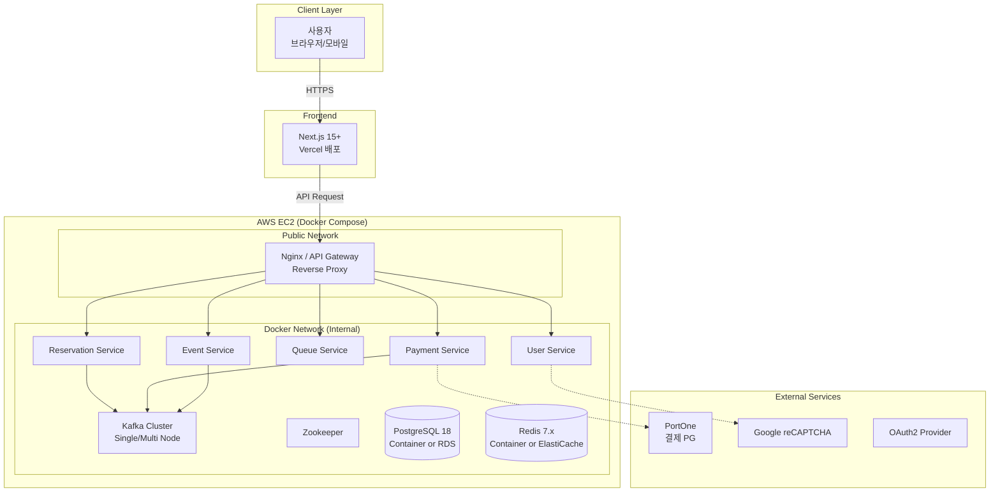

# 인프라 및 배포 아키텍처

## 1. 인프라 아키텍처

### 1.1 전체 시스템 아키텍처 다이어그램 (포트폴리오 최적화)

**핵심 전략:**
- **인프라 간소화:** 복잡한 VPC/Subnet 관리 대신 **Docker Compose**로 모든 서비스를 통합 배포합니다.
- **운영 비용 최소화:** EC2 1대에 모든 컴포넌트(Kafka, Redis, DB, Apps)를 컨테이너로 실행합니다.
- **포트폴리오 집중:** 인프라 구성보다는 **Kafka/Redis 활용 능력**과 **애플리케이션 아키텍처**를 보여주는 데 집중합니다.



### 1.2 로컬 및 운영 환경 통합 (Docker Compose)

#### 1.2.1 개요
로컬 개발 환경과 운영(AWS EC2) 환경을 **Docker Compose** 하나로 통일하여 관리합니다. 이는 2인 규모 팀에서 복잡한 배포 파이프라인을 구축하는 시간을 절약하고, 개발에 집중할 수 있게 합니다.

#### 1.2.2 Docker Compose 구성 (`docker-compose.yml`)

```yaml
version: '3.8'

services:
  # --- Infrastructure ---
  
  postgres:
    image: postgres:18-alpine
    environment:
      POSTGRES_USER: ${DB_USER}
      POSTGRES_PASSWORD: ${DB_PASSWORD}
      POSTGRES_DB: ticketing
    volumes:
      - postgres-data:/var/lib/postgresql/data
    ports:
      - "5432:5432"
    networks:
      - ticketing-net

  redis:
    image: redis:7-alpine
    command: redis-server --appendonly yes
    ports:
      - "6379:6379"
    volumes:
      - redis-data:/data
    networks:
      - ticketing-net

  # Kafka Setup (Simplified for Portfolio)
  zookeeper:
    image: confluentinc/cp-zookeeper:7.5.0
    environment:
      ZOOKEEPER_CLIENT_PORT: 2181
      ZOOKEEPER_TICK_TIME: 2000
    networks:
      - ticketing-net

  kafka:
    image: confluentinc/cp-kafka:7.5.0
    depends_on:
      - zookeeper
    ports:
      - "9092:9092"
    environment:
      KAFKA_BROKER_ID: 1
      KAFKA_ZOOKEEPER_CONNECT: zookeeper:2181
      KAFKA_ADVERTISED_LISTENERS: PLAINTEXT://kafka:29092,PLAINTEXT_HOST://localhost:9092
      KAFKA_LISTENER_SECURITY_PROTOCOL_MAP: PLAINTEXT:PLAINTEXT,PLAINTEXT_HOST:PLAINTEXT
      KAFKA_INTER_BROKER_LISTENER_NAME: PLAINTEXT
      KAFKA_OFFSETS_TOPIC_REPLICATION_FACTOR: 1
    networks:
      - ticketing-net

  # --- Microservices ---

  gateway-service:
    image: ${ECR_REGISTRY}/gateway-service:latest
    ports:
      - "8080:8080"
    environment:
      SPRING_PROFILES_ACTIVE: prod
      SPRING_DATASOURCE_URL: jdbc:postgresql://postgres:5432/ticketing
      SPRING_REDIS_HOST: redis
      SPRING_KAFKA_BOOTSTRAP_SERVERS: kafka:29092
    depends_on:
      - postgres
      - redis
      - kafka
    networks:
      - ticketing-net

  # User, Event, Queue, Reservation, Payment Services...
  # (유사한 설정으로 추가)

networks:
  ticketing-net:
    driver: bridge

volumes:
  postgres-data:
  redis-data:
```

### 1.3 AWS 배포 전략 (EC2 + Docker)

#### 1.3.1 배포 프로세스 (단순화)
복잡한 Blue/Green이나 ECS 오케스트레이션 대신, 검증된 이미지를 EC2에서 실행하는 방식입니다.

1.  **Github Actions**: 코드 빌드 및 Docker Image 생성 -> AWS ECR Push.
2.  **EC2 접속**: SSH를 통해 EC2 인스턴스에 접속 (또는 Systems Manager).
3.  **Deploy Script 실행**:
    ```bash
    # deploy.sh
    docker-compose pull
    docker-compose up -d
    docker image prune -f
    ```

#### 1.3.2 네트워크 구성 (단순화)
- **VPC**: Default VPC 사용 (또는 단일 Custom VPC).
- **Subnet**: **All Public Subnet**.
  - NAT Gateway 비용($30+/월) 절감.
  - 외부 통신(PortOne, OAuth) 구성 복잡도 제거.
- **Security Group**:
  - Inbound: 80/443 (Web), 22 (SSH - 내 IP만).
  - Outbound: All Open.
  - 내부 DB/Redis 포트는 외부 노출 차단 (Docker Network 내부 통신).

### 1.4 비용 최적화 (MVP 기준)

| 항목 | 스펙 | 월 예상 비용 | 비고 |
|------|------|-------------|------|
| **EC2** | t3.medium / large | $30 - $60 | 모든 컨테이너 실행용 (Spot Instance 활용 시 절감 가능) |
| **RDS** | (Optional) db.t3.micro | $15 | 데이터 안정성을 위해 DB만 분리 가능 |
| **Route 53** | 도메인 | $0.5 | |
| **NAT Gateway** | **제거** | **$0** | Public Subnet 사용으로 비용 절감 |
| **Kafka** | **Docker 내장** | **$0** | EC2 리소스 공유 |

---

## 2. 모니터링 (포트폴리오용)

AWS CloudWatch 비용을 아끼고, 시각적인 포트폴리오 효과를 위해 **오픈소스 모니터링 스택**을 Docker Compose에 포함합니다.

1.  **Kafka UI**: `provectus/kafka-ui` 이미지 사용. Kafka 토픽, 메시지 흐름을 면접관에게 시각적으로 시연 가능.
2.  **Prometheus & Grafana**: (선택) 기본적인 JVM 메트릭 및 시스템 리소스 모니터링.

### 2.1 Kafka UI 구성 예시
```yaml
  kafka-ui:
    image: provectuslabs/kafka-ui:latest
    ports:
      - "8090:8080"
    environment:
      KAFKA_CLUSTERS_0_NAME: local
      KAFKA_CLUSTERS_0_BOOTSTRAPSERVERS: kafka:29092
    networks:
      - ticketing-net
```