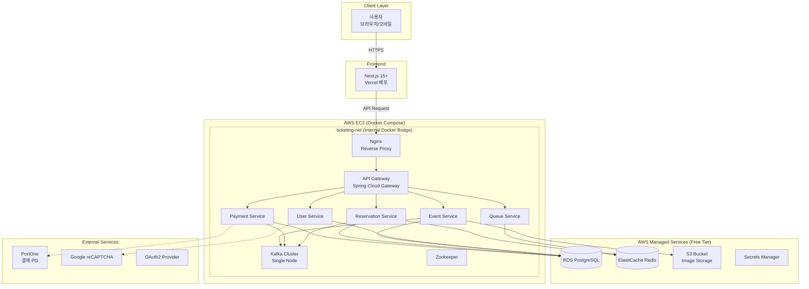

# 인프라 및 배포 아키텍처

## 1. 인프라 아키텍처

### 1.1 전체 시스템 아키텍처 다이어그램 (포트폴리오 최적화)

**핵심 전략:**
- **인프라 효율화:** AWS Free Tier Managed Service(RDS, ElastiCache)를 적극 활용하여 관리 포인트를 줄이고 안정성을 확보합니다.
- **비용 최적화:** EC2 1대에 MSA 서비스와 Kafka를 Docker Compose로 통합 배포하여 컴퓨팅 비용을 최소화합니다.
- **보안 강화:** Secrets Manager를 통해 운영 환경의 민감 정보를 안전하게 관리합니다.



### 1.2 로컬 및 운영 환경 통합 (Docker Compose)

#### 1.2.1 개요
로컬 개발 환경과 운영(AWS EC2) 환경을 **Docker Compose**를 기반으로 구성합니다.

*   **로컬 개발(Local):** **LocalStack**을 활용하여 S3, Secrets Manager 등 AWS 클라우드 서비스를 모사하고, DB와 Redis는 Docker 컨테이너로 실행합니다.
*   **운영 환경(Production):** `docker-compose.yml`에서는 애플리케이션 서비스만 구동하며, DB/Redis/S3 등은 **AWS Managed Service (RDS, ElastiCache, S3)**를 바라보도록 환경변수를 설정합니다.

#### 1.2.2 Docker Compose 구성 (`docker-compose.yml`)

```yaml
version: '3.8'

services:
  # --- Infrastructure (Local Only) ---
  # 운영 배포 시에는 주석 처리하거나 profiles를 사용하여 제외
  
  # AWS Service Mocking (S3, Secrets Manager)
  localstack:
    image: localstack/localstack:3.0
    profiles: ["local"]
    ports:
      - "4566:4566"
    environment:
      - SERVICES=s3,secretsmanager
      - DEBUG=1
    volumes:
      - "./.localstack:/var/lib/localstack"
      - "/var/run/docker.sock:/var/run/docker.sock"

  postgres:
    image: postgres:18-alpine
    profiles: ["local"]
    # ... 설정 생략 ...

  redis:
    image: redis:7-alpine
    profiles: ["local"]
    # ... 설정 생략 ...

  # Kafka Setup (Common)
  zookeeper:
    image: confluentinc/cp-zookeeper:7.5.0
    # ...

  kafka:
    image: confluentinc/cp-kafka:7.5.0
    # ...

  # --- Microservices ---

  gateway-service:
    image: ${ECR_REGISTRY}/gateway-service:latest
    ports:
      - "8080:8080"
    environment:
      SPRING_PROFILES_ACTIVE: prod
      # 운영 환경에서는 AWS RDS/ElastiCache Endpoint 주입
      SPRING_DATASOURCE_URL: ${RDS_ENDPOINT}
      SPRING_REDIS_HOST: ${REDIS_ENDPOINT}
      SPRING_KAFKA_BOOTSTRAP_SERVERS: kafka:29092
    depends_on:
      - kafka
    networks:
      - ticketing-net

  # User, Event, Queue, Reservation, Payment Services...
```

### 1.3 AWS 배포 전략 (EC2 + Docker)

#### 1.3.1 배포 프로세스 (단순화)
복잡한 Blue/Green이나 ECS 오케스트레이션 대신, 검증된 이미지를 EC2에서 실행하는 방식입니다.

1.  **Github Actions**: 코드 빌드 및 Docker Image 생성 -> AWS ECR Push.
2.  **EC2 접속**: SSH를 통해 EC2 인스턴스에 접속 (또는 Systems Manager).
3.  **Deploy Script 실행**:
    ```bash
    # deploy.sh
    # AWS Secrets Manager에서 환경변수(.env) 로드
    aws secretsmanager get-secret-value ... > .env
    
    docker-compose pull
    docker-compose up -d
    docker image prune -f
    ```

#### 1.3.2 구성 상세
- **ALB (Application Load Balancer) 미사용**:
    - 비용 절감 및 구조 단순화를 위해 ALB 없이 **EC2 내 Nginx**가 Reverse Proxy 역할을 수행하며, 내부의 **Spring Cloud Gateway**로 트래픽을 전달합니다.
- **S3 (Simple Storage Service)**:
    - 공연 포스터, 좌석 배치도 등 정적 이미지는 EC2 스토리지가 아닌 S3 버킷에 저장하여 확장성을 확보합니다.
- **Secrets Manager**:
    - DB 접속 정보, API Key 등 민감 정보는 코드나 Docker Image에 포함하지 않고 Secrets Manager를 통해 런타임에 주입합니다.

#### 1.3.3 네트워크 구성
- **VPC**: Default VPC 사용.
- **Subnet**: **All Public Subnet** (NAT Gateway 비용 절감).
- **Security Group**:
    - Inbound: 80/443 (Web), 22 (SSH - 내 IP만).
    - Outbound: All Open.
    - RDS/ElastiCache SG: EC2 SG에서의 접근만 허용.

### 1.4 비용 최적화 (MVP 기준)

| 항목 | 스펙 | 월 예상 비용 | 비고 |
|------|------|-------------|------|
| **EC2** | t3.medium / large | $30 - $60 | App + Kafka 실행 (Spot Instance 활용 시 절감 가능) |
| **RDS** | db.t3.micro | Free Tier | PostgreSQL (12개월 무료) |
| **ElastiCache** | cache.t2.micro | Free Tier | Redis (12개월 무료) |
| **S3** | Standard | Free Tier | 5GB 스토리지, 20,000 GET 요청 무료 |
| **Secrets Manager** | - | $0.4 / Secret | 시크릿 개수당 과금 (저비용) |
| **Kafka** | **Docker 내장** | **$0** | EC2 리소스 공유 |
| **NAT Gateway** | **제거** | **$0** | Public Subnet 사용으로 비용 절감 |
| **ALB** | **제거** | **$0** | Nginx 대체 |

---

## 2. 모니터링 (포트폴리오용)

AWS CloudWatch 비용을 아끼고, 시각적인 포트폴리오 효과를 위해 **오픈소스 모니터링 스택**을 Docker Compose에 포함합니다.

1.  **Kafka UI**: `provectus/kafka-ui` 이미지 사용. Kafka 토픽, 메시지 흐름을 면접관에게 시각적으로 시연 가능.
2.  **Prometheus & Grafana**: (선택) 기본적인 JVM 메트릭 및 시스템 리소스 모니터링.

### 2.1 Kafka UI 구성 예시
```yaml
  kafka-ui:
    image: provectuslabs/kafka-ui:latest
    ports:
      - "8090:8080"
    environment:
      KAFKA_CLUSTERS_0_NAME: local
      KAFKA_CLUSTERS_0_BOOTSTRAPSERVERS: kafka:29092
    networks:
      - ticketing-net
```
