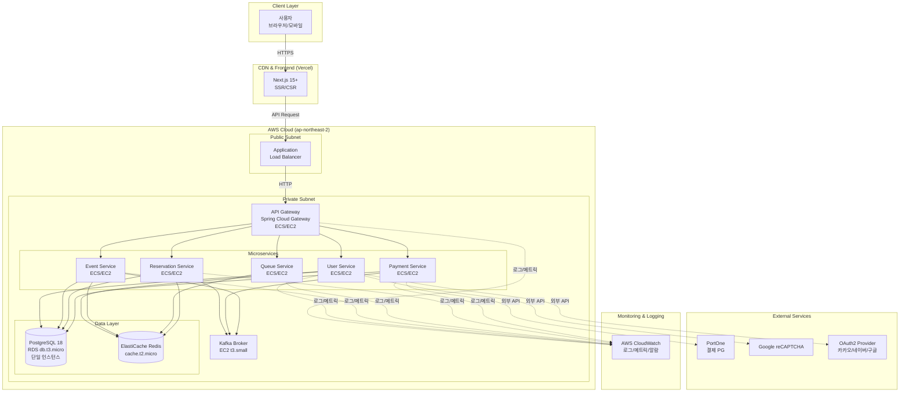

# 인프라 및 배포 아키텍처

## 1. 인프라 아키텍처

### 1.1 전체 시스템 아키텍처 다이어그램



### 1.2 로컬 개발 환경 (LocalStack 기반)

#### 1.2.1 개요
로컬 개발 환경은 **LocalStack**을 사용하여 AWS 서비스를 에뮬레이션하고, **Docker Compose**로 전체 스택을 통합 관리합니다. 이를 통해 개발 비용을 제로로 유지하면서 AWS와 동일한 환경에서 개발할 수 있습니다.

#### 1.2.2 Docker Compose 구성

**`docker-compose.yml` 구조:**
```yaml
version: '3.8'

services:
  # LocalStack (AWS 에뮬레이션)
  localstack:
    image: localstack/localstack:latest
    ports:
      - "4566:4566"  # AWS API Endpoint
    environment:
      - SERVICES=s3,sqs,sns,secretsmanager
      - DEBUG=1
      - DATA_DIR=/tmp/localstack/data
    volumes:
      - "./localstack-data:/tmp/localstack/data"
      - "/var/run/docker.sock:/var/run/docker.sock"

  # PostgreSQL
  postgres:
    image: postgres:18-alpine
    ports:
      - "5432:5432"
    environment:
      POSTGRES_USER: postgres
      POSTGRES_PASSWORD: postgres
      POSTGRES_DB: ticketing
    volumes:
      - postgres-data:/var/lib/postgresql/data
      - ./init-db.sql:/docker-entrypoint-initdb.d/init-db.sql

  # Redis
  redis:
    image: redis:7-alpine
    ports:
      - "6379:6379"
    command: redis-server --appendonly yes
    volumes:
      - redis-data:/data

  # Kafka (Zookeeper + Broker)
  zookeeper:
    image: confluentinc/cp-zookeeper:7.5.0
    environment:
      ZOOKEEPER_CLIENT_PORT: 2181
    ports:
      - "2181:2181"

  kafka:
    image: confluentinc/cp-kafka:7.5.0
    depends_on:
      - zookeeper
    ports:
      - "9092:9092"
    environment:
      KAFKA_BROKER_ID: 1
      KAFKA_ZOOKEEPER_CONNECT: zookeeper:2181
      KAFKA_ADVERTISED_LISTENERS: PLAINTEXT://localhost:9092
      KAFKA_OFFSETS_TOPIC_REPLICATION_FACTOR: 1

  # API Gateway (개발 시 실행)
  gateway:
    build: ./gateway
    ports:
      - "8080:8080"
    environment:
      SPRING_PROFILES_ACTIVE: local
      SPRING_DATASOURCE_URL: jdbc:postgresql://postgres:5432/ticketing
      SPRING_REDIS_HOST: redis
      SPRING_KAFKA_BOOTSTRAP_SERVERS: kafka:9092
    depends_on:
      - postgres
      - redis
      - kafka

  # User Service (개발 시 실행)
  user-service:
    build: ./user-service
    ports:
      - "8081:8081"
    environment:
      SPRING_PROFILES_ACTIVE: local
      SPRING_DATASOURCE_URL: jdbc:postgresql://postgres:5432/ticketing
      SPRING_REDIS_HOST: redis
    depends_on:
      - postgres
      - redis

  # ... 기타 서비스 (Event, Queue, Reservation, Payment)

volumes:
  postgres-data:
  redis-data:
```

#### 1.2.3 초기 DB 스키마 생성

**`init-db.sql`:**
```sql
-- 서비스별 스키마 생성
CREATE SCHEMA IF NOT EXISTS user_service;
CREATE SCHEMA IF NOT EXISTS event_service;
CREATE SCHEMA IF NOT EXISTS reservation_service;
CREATE SCHEMA IF NOT EXISTS payment_service;
CREATE SCHEMA IF NOT EXISTS common;

-- 서비스별 전용 사용자 생성 및 권한 부여
CREATE USER user_svc_user WITH PASSWORD 'user_password';
GRANT ALL PRIVILEGES ON SCHEMA user_service TO user_svc_user;
GRANT ALL PRIVILEGES ON ALL TABLES IN SCHEMA user_service TO user_svc_user;

CREATE USER event_svc_user WITH PASSWORD 'event_password';
GRANT ALL PRIVILEGES ON SCHEMA event_service TO event_svc_user;
GRANT ALL PRIVILEGES ON ALL TABLES IN SCHEMA event_service TO event_svc_user;

CREATE USER reservation_svc_user WITH PASSWORD 'reservation_password';
GRANT ALL PRIVILEGES ON SCHEMA reservation_service TO reservation_svc_user;
GRANT ALL PRIVILEGES ON ALL TABLES IN SCHEMA reservation_service TO reservation_svc_user;

CREATE USER payment_svc_user WITH PASSWORD 'payment_password';
GRANT ALL PRIVILEGES ON SCHEMA payment_service TO payment_svc_user;
GRANT ALL PRIVILEGES ON ALL TABLES IN SCHEMA payment_service TO payment_svc_user;

-- 공통 Outbox 테이블
CREATE TABLE IF NOT EXISTS common.outbox_events (
  id UUID PRIMARY KEY DEFAULT gen_random_uuid(),
  aggregate_type VARCHAR(255) NOT NULL,
  aggregate_id UUID NOT NULL,
  event_type VARCHAR(255) NOT NULL,
  payload JSONB NOT NULL,
  created_at TIMESTAMP NOT NULL DEFAULT NOW(),
  published BOOLEAN NOT NULL DEFAULT FALSE,
  published_at TIMESTAMP
);

CREATE INDEX idx_outbox_published ON common.outbox_events(published, created_at);
```

#### 1.2.4 로컬 → AWS 전환 전략

**전환 최소화 방안:**
1. **환경 변수 기반 설정**:
   - `application-local.yml` (로컬)
   - `application-prod.yml` (AWS)
   - 엔드포인트만 환경변수로 변경 (S3, SQS, SNS 등)

2. **AWS SDK Profile 활용**:
   ```java
   // LocalStack: http://localhost:4566
   // AWS: 기본 엔드포인트 (환경변수로 제어)
   AmazonS3 s3Client = AmazonS3ClientBuilder.standard()
       .withEndpointConfiguration(new AwsClientBuilder.EndpointConfiguration(
           System.getenv("AWS_ENDPOINT_URL"),  // LocalStack: http://localhost:4566
           "ap-northeast-2"
       ))
       .build();
   ```

3. **Testcontainers 활용** (통합 테스트):
   ```java
   @Testcontainers
   class IntegrationTest {
       @Container
       static PostgreSQLContainer<?> postgres = new PostgreSQLContainer<>("postgres:18-alpine");

       @Container
       static GenericContainer<?> redis = new GenericContainer<>("redis:7-alpine")
           .withExposedPorts(6379);
   }
   ```

### 1.3 프론트엔드 인프라

#### 1.3.1 Next.js 애플리케이션 구조

**기술 스택:**
- Next.js 15+ (App Router)
- React 19+
- TypeScript
- Tailwind CSS
- Zustand (상태 관리)

**프로젝트 구조:**
```
ticket-queue-frontend/
├── app/
│   ├── (auth)/
│   │   ├── login/page.tsx
│   │   ├── register/page.tsx
│   ├── (events)/
│   │   ├── events/page.tsx
│   │   ├── events/[id]/page.tsx
│   ├── (queue)/
│   │   ├── queue/[eventId]/page.tsx
│   ├── (reservation)/
│   │   ├── reservations/page.tsx
│   │   ├── reservations/[id]/page.tsx
│   ├── layout.tsx
│   ├── page.tsx
├── components/
│   ├── auth/
│   ├── events/
│   ├── queue/
│   ├── reservation/
├── lib/
│   ├── api/
│   │   ├── auth.ts
│   │   ├── events.ts
│   │   ├── queue.ts
│   │   ├── reservations.ts
│   ├── store/
│   ├── utils/
├── public/
├── next.config.js
├── package.json
```

#### 1.3.2 Vercel 배포 설정

**`vercel.json`:**
```json
{
  "buildCommand": "npm run build",
  "outputDirectory": ".next",
  "framework": "nextjs",
  "regions": ["icn1"],
  "env": {
    "NEXT_PUBLIC_API_URL": "https://api.ticketing.example.com"
  }
}
```

**환경 변수 관리:**
| 환경 | API Gateway URL | 비고 |
|------|-----------------|------|
| Local | `http://localhost:8080` | Docker Compose |
| Staging | `https://api-staging.ticketing.example.com` | 선택 사항 |
| Production | `https://api.ticketing.example.com` | ALB 엔드포인트 |

**Vercel 배포 프로세스:**
1. GitHub 저장소 연동
2. main 브랜치 push 시 자동 배포
3. Preview 배포: PR 생성 시 자동 프리뷰 환경 생성
4. 환경 변수는 Vercel 대시보드에서 관리

#### 1.3.3 API Gateway 연동 설정

**API Client 설정 (`lib/api/client.ts`):**
```typescript
import axios from 'axios';

const apiClient = axios.create({
  baseURL: process.env.NEXT_PUBLIC_API_URL,
  timeout: 30000,
  headers: {
    'Content-Type': 'application/json',
  },
});

// JWT 토큰 자동 추가
apiClient.interceptors.request.use((config) => {
  const token = localStorage.getItem('accessToken');
  if (token) {
    config.headers.Authorization = `Bearer ${token}`;
  }
  return config;
});

// 401 응답 시 토큰 갱신
apiClient.interceptors.response.use(
  (response) => response,
  async (error) => {
    if (error.response?.status === 401) {
      // Token refresh 로직
      const refreshToken = localStorage.getItem('refreshToken');
      if (refreshToken) {
        const { data } = await axios.post(`${process.env.NEXT_PUBLIC_API_URL}/auth/refresh`, {
          refreshToken,
        });
        localStorage.setItem('accessToken', data.accessToken);
        // 원래 요청 재시도
        return apiClient.request(error.config);
      }
    }
    return Promise.reject(error);
  }
);

export default apiClient;
```

### 1.4 AWS 클라우드 인프라 구성 (무료티어/저비용 최적화)

#### 1.4.1 리전 및 가용 영역
- **리전**: `ap-northeast-2` (서울)
- **가용 영역**: 초기 Single-AZ (`ap-northeast-2a`), 향후 Multi-AZ 전환

#### 1.4.2 컴퓨트 (Compute)

**옵션 1: ECS Fargate (권장)**
- **장점**: 서버리스, 오토스케일링 간편, 운영 부담 낮음
- **단점**: 무료티어 없음 (월 약 $30-50)
- **스펙**: 0.5 vCPU, 1GB RAM per task

**옵션 2: EC2 (비용 최적화)**
- **인스턴스 타입**: `t2.micro` (무료티어 750시간/월) 또는 `t3.micro`
- **장점**: 무료티어 활용 가능, 비용 저렴
- **단점**: 서버 관리 필요, 오토스케일링 복잡
- **배포 방안**: 단일 EC2에 모든 서비스 컨테이너 실행 (Docker Compose) 또는 서비스별 EC2 분리

**선택 기준:**
- 초기: EC2 t2.micro로 시작 (무료티어)
- 트래픽 증가 시: ECS Fargate로 마이그레이션

#### 1.4.3 로드 밸런서

**Application Load Balancer (ALB)**
- **무료티어**: 없음 (시간당 $0.0225 + LCU 기준 과금)
- **월 예상 비용**: $16-20
- **대안**: ALB 없이 Route 53 → EC2 직접 연결 (SSL 인증서는 Let's Encrypt)
- **권장**: 초기에는 ALB 사용 (HTTPS, 헬스체크, Path 라우팅)

#### 1.4.4 데이터베이스

**Amazon RDS PostgreSQL**
- **인스턴스**: `db.t3.micro` (무료티어 750시간/월, 20GB 스토리지)
- **버전**: PostgreSQL 18
- **Multi-AZ**: 초기 Single-AZ (무료티어), 향후 Multi-AZ 전환 ($$$)
- **백업**: 자동 백업 1일 보관 (무료), 7일 보관 시 추가 비용
- **모니터링**: Enhanced Monitoring 비활성화 (비용 절감)
- **스토리지**: 범용 SSD (gp3), 20GB (무료티어)

**비용 최적화:**
- Single-AZ 배포
- 백업 보관 기간 최소화 (1일)
- Read Replica 제외 (초기)
- Connection Pooling (서비스별 HikariCP 설정)

#### 1.4.5 캐시 및 메모리 스토어

**Amazon ElastiCache Redis**
- **노드 타입**: `cache.t2.micro` (무료티어 750시간/월) 또는 `cache.t3.micro`
- **버전**: Redis 7.x
- **클러스터 모드**: 비활성화 (단일 노드)
- **Multi-AZ**: 비활성화 (초기)
- **백업**: 자동 백업 비활성화 (비용 절감)

**비용 최적화:**
- 단일 노드 구성
- 백업 비활성화 (Redis 데이터는 휘발성으로 간주)
- Replication 제외 (초기)

#### 1.4.6 메시징

**Kafka on EC2 (자체 구축)**
- **이유**: Amazon MSK는 고비용 (최소 월 $200+)
- **인스턴스**: `t3.small` 1대 (초기), 향후 3대 클러스터 확장
- **월 예상 비용**: $15-20 (t3.small 1대 기준)
- **스토리지**: EBS gp3 100GB

**대안: Amazon SNS/SQS**
- **장점**: 완전 관리형, 무료티어 (SNS: 100만 요청, SQS: 100만 요청)
- **단점**: Kafka의 이벤트 스트리밍 기능 부족, 메시지 순서 보장 어려움
- **결론**: Kafka 유지 권장 (이벤트 스트리밍 필수)

#### 1.4.7 모니터링 및 로깅

**AWS CloudWatch**
- **무료티어**:
  - 로그 수집: 5GB/월
  - 커스텀 메트릭: 10개
  - 알람: 10개
  - API 요청: 100만 건/월
- **전략**: 무료티어 한도 내 운영 (섹션 14에서 상세 설명)

**비용 초과 방지:**
- 로그 보관 기간: 1일
- 핵심 메트릭만 선별 수집 (10개 이내)
- 알람 최소화 (10개 이내)

#### 1.4.8 도메인 및 DNS

**Amazon Route 53**
- **호스팅 영역**: $0.50/월 (1개)
- **DNS 쿼리**: 100만 건당 $0.40
- **헬스 체크**: $0.50/개 (선택 사항)

**비용 최적화:**
- 단일 호스팅 영역
- 헬스 체크 최소화 또는 제외

#### 1.4.9 기타 서비스

**Amazon ECR (컨테이너 레지스트리)**
- **무료티어**: 500MB 스토리지/월
- **전략**: 이미지 최적화 (멀티스테이지 빌드), 불필요한 이미지 삭제

**AWS Secrets Manager vs Parameter Store**
- **Secrets Manager**: $0.40/시크릿/월 (비용 발생)
- **Parameter Store**: 무료 (Standard tier)
- **선택**: Parameter Store 사용 (DB 비밀번호, API 키 등)

### 1.5 비용 최적화 전략

#### 1.5.1 무료티어 활용 체크리스트

| 서비스 | 무료티어 한도 | 초과 시 비용 | 대응 전략 |
|--------|--------------|-------------|----------|
| EC2 | t2.micro 750시간/월 | $0.0116/시간 | 단일 인스턴스 유지 |
| RDS | db.t3.micro 750시간/월, 20GB | $0.017/시간, $0.115/GB | Single-AZ, 백업 최소화 |
| ElastiCache | cache.t2.micro 750시간/월 | $0.017/시간 | 단일 노드 |
| ALB | 없음 | $16-20/월 | 필수 사용 |
| CloudWatch | 로그 5GB, 메트릭 10개, 알람 10개 | $0.50/GB, $0.30/메트릭, $0.10/알람 | 한도 준수 |
| ECR | 500MB | $0.10/GB | 이미지 최적화 |
| Route 53 | 없음 | $0.50/월 | 단일 호스팅 영역 |

**월 예상 비용 (무료티어 최대 활용):**
- EC2 (Kafka): $15-20
- ALB: $16-20
- Route 53: $0.50
- CloudWatch (초과 시): $0-5
- **합계**: $30-45/월

#### 1.5.2 리소스 우선순위

**필수 리소스 (비용 발생 불가피):**
- ALB (HTTPS, Path 라우팅)
- Kafka EC2 (이벤트 스트리밍)
- Route 53 (도메인)

**무료티어 활용 가능:**
- EC2 t2.micro (백엔드 서비스)
- RDS db.t3.micro (데이터베이스)
- ElastiCache cache.t2.micro (Redis)
- CloudWatch (한도 내)

**선택 사항 (제외 또는 최소화):**
- Multi-AZ 배포
- Read Replica
- Enhanced Monitoring
- Auto Scaling (수동 스케일링)
- Staging 환경

#### 1.5.3 Auto Scaling 전략

**초기 설정:**
- 최소 인스턴스: 1개
- 최대 인스턴스: 3개
- Target Tracking: CPU 70%

**비용 절감:**
- 평상시: 1개 인스턴스로 운영
- 티켓 오픈 시: 수동 스케일 아웃 (3개)
- 완전 자동화 시: CloudWatch 알람 기반 스케일링 (비용 주의)

#### 1.5.4 개발/스테이징 환경

**옵션 1: Staging 환경 제외**
- Production 환경만 운영
- 로컬 개발 환경에서 충분한 테스트 진행

**옵션 2: Production 공유**
- 별도 네임스페이스 또는 서브도메인 사용
- 동일 인프라에서 Staging 환경 구성

**옵션 3: 주말 자동 종료**
- AWS Lambda로 주말/야간 Staging 환경 자동 종료
- 월 비용 30% 절감 가능

**권장**: 옵션 1 (Staging 제외), 필요 시 옵션 2

#### 1.5.5 CloudWatch 로그 최적화

**로그 보관 전략:**
- 일반 로그: 1일 보관
- 중요 로그 (에러, 보안): 7일 보관
- 로그 그룹별 필터: DEBUG 로그 제외

**무료 한도 준수:**
- 목표: 5GB/월 이내
- 모니터링: CloudWatch Metrics로 사용량 추적
- 알람: 4GB 도달 시 알림

#### 1.5.6 S3 스토리지 (선택 사항)

**사용 용도:**
- 이미지 업로드 (공연 포스터 등)
- 로그 아카이빙 (CloudWatch → S3)

**비용 최적화:**
- 무료티어: 5GB Standard, 20,000 GET, 2,000 PUT
- Lifecycle Policy: 30일 후 Glacier 이관
- CloudFront 연동 시 추가 비용 발생 (선택 사항)

### 1.6 네트워크 구성 (비용 절감)

#### 1.6.1 VPC 설계

**VPC 구성:**
```
VPC: 10.0.0.0/16 (ticket-queue-vpc)
├── Public Subnet (10.0.1.0/24) - ap-northeast-2a
│   ├── ALB
│   └── NAT Gateway (제외 - 비용 절감)
├── Private Subnet (10.0.10.0/24) - ap-northeast-2a
│   ├── ECS/EC2 (백엔드 서비스)
│   ├── RDS
│   ├── ElastiCache
│   └── Kafka
```

**비용 절감 포인트:**
- **NAT Gateway 제외**: $0.045/시간 + 데이터 전송 비용 (월 $32+)
  - **대안**: Private Subnet 리소스는 VPC Endpoint 또는 Public Subnet 배치
- **Single-AZ**: Multi-AZ 데이터 전송 비용 제거 ($0.01/GB)
- **VPC Peering 최소화**: 필요 시만 구성

#### 1.6.2 Security Group 규칙

**ALB Security Group (alb-sg):**
```
Inbound:
  - 80 (HTTP) from 0.0.0.0/0
  - 443 (HTTPS) from 0.0.0.0/0
Outbound:
  - 8080 to backend-sg (Gateway)
```

**Backend Services Security Group (backend-sg):**
```
Inbound:
  - 8080-8085 from alb-sg
Outbound:
  - 5432 to db-sg (PostgreSQL)
  - 6379 to redis-sg (Redis)
  - 9092 to kafka-sg (Kafka)
  - 443 to 0.0.0.0/0 (외부 API: PortOne, reCAPTCHA)
```

**Database Security Group (db-sg):**
```
Inbound:
  - 5432 from backend-sg
Outbound:
  - 모두 차단
```

**Redis Security Group (redis-sg):**
```
Inbound:
  - 6379 from backend-sg
Outbound:
  - 모두 차단
```

**Kafka Security Group (kafka-sg):**
```
Inbound:
  - 9092 from backend-sg
  - 2181 from backend-sg (Zookeeper)
Outbound:
  - 모두 허용 (클러스터 내부 통신)
```

#### 1.6.3 데이터 전송 비용 최소화

**동일 AZ 내 배치:**
- 모든 리소스를 `ap-northeast-2a` 단일 AZ에 배치
- AZ 간 데이터 전송 비용 제거 ($0.01/GB)

**외부 API 호출 최소화:**
- PortOne, reCAPTCHA 호출 횟수 최소화
- API 응답 캐싱 (가능한 경우)
- 데이터 전송량 압축

**CloudFront 제외 (초기):**
- Vercel CDN으로 정적 리소스 제공
- API는 ALB 직접 연결
- 필요 시 CloudFront 추가 ($0.085/GB)

### 1.7 고가용성 및 확장성 전략 (단계적 적용)

#### 1.7.1 초기 아키텍처 (Single-AZ)

**목표:** 비용 최소화, 기본 가용성 확보

**구성:**
- EC2/ECS: Single-AZ, 1-2 인스턴스
- RDS: Single-AZ, 자동 백업 1일
- ElastiCache: 단일 노드
- Kafka: 단일 브로커

**예상 가용성:** 99.5% (AWS SLA 기준)

**제약사항:**
- AZ 장애 시 서비스 중단
- RDS 장애 시 복구 시간 발생 (Snapshot 기반)
- Redis 장애 시 캐시 손실 (서비스 지속 가능)

#### 1.7.2 성장 단계 (Multi-AZ)

**전환 시점:**
- 월간 활성 사용자 10,000명 이상
- 티켓 오픈 시 동시 접속 100,000명 이상
- 비용 여유 발생 (월 $100+ 가능)

**구성:**
```
VPC: 10.0.0.0/16
├── Public Subnet A (10.0.1.0/24) - ap-northeast-2a
│   └── ALB (Multi-AZ)
├── Public Subnet B (10.0.2.0/24) - ap-northeast-2b
│   └── ALB (Multi-AZ)
├── Private Subnet A (10.0.10.0/24) - ap-northeast-2a
│   ├── ECS/EC2 (백엔드)
│   ├── RDS Primary
│   ├── ElastiCache Primary
│   └── Kafka Broker 1
├── Private Subnet B (10.0.20.0/24) - ap-northeast-2b
│   ├── ECS/EC2 (백엔드)
│   ├── RDS Standby
│   ├── ElastiCache Replica
│   └── Kafka Broker 2
```

**개선 사항:**
- RDS Multi-AZ: 자동 페일오버 (1-2분)
- ElastiCache Replication: 읽기 성능 향상, 장애 대응
- Kafka 3 브로커: Replication Factor 2-3
- ECS/EC2 Auto Scaling: 최소 2, 최대 10

**예상 가용성:** 99.95%

**추가 비용:**
- RDS Multi-AZ: +100% ($34/월)
- ElastiCache Replica: +100% ($24/월)
- Kafka 2대 추가: +$30/월
- NAT Gateway (옵션): +$32/월
- **합계**: +$120-150/월

#### 1.7.3 Auto Scaling 정책

**Target Tracking Scaling:**
```yaml
Target:
  - CPU Utilization: 70%
  - Memory Utilization: 80%
  - ALB Request Count: 1000 req/min per instance

Scale Out:
  - Cooldown: 60초
  - Increment: +1 인스턴스

Scale In:
  - Cooldown: 300초
  - Decrement: -1 인스턴스
```

**Step Scaling (선택 사항):**
```yaml
CPU > 80%:
  - +2 인스턴스 (즉시)
CPU > 90%:
  - +3 인스턴스 (즉시)
CPU < 40%:
  - -1 인스턴스 (5분 후)
```

#### 1.7.4 장애 복구 (Disaster Recovery) 계획

**백업 전략:**
- **RDS**: 자동 백업 1일 보관 (무료), 수동 스냅샷 7일 보관
- **Redis**: 데이터 휘발성, 백업 제외
- **Kafka**: 메시지 보관 기간 3일 (디스크 용량에 따라 조정)

**복구 시나리오:**

| 장애 유형 | RTO (복구 시간) | RPO (데이터 손실) | 복구 절차 |
|----------|----------------|------------------|----------|
| EC2 인스턴스 다운 | 5-10분 | 없음 | Auto Scaling 또는 수동 재시작 |
| RDS Single-AZ 장애 | 30-60분 | 최대 5분 | Snapshot에서 복구 |
| RDS Multi-AZ 장애 | 1-2분 | 없음 | 자동 페일오버 |
| Redis 장애 | 5분 | 캐시 손실 | 재시작, 캐시 재구축 |
| Kafka 브로커 다운 | 1분 | 없음 (Replication) | 자동 Leader 재선출 |
| AZ 전체 장애 | 60-120분 | 최대 5분 | Multi-AZ 전환 후 자동 복구 |

**초기 단계 (Single-AZ) 주의사항:**
- AZ 장애 시 서비스 중단 불가피
- 백업에서 복구 시 다운타임 발생
- **대응**: CloudWatch 알람으로 즉시 감지, 수동 복구

#### 1.7.5 확장성 로드맵

**Phase 1 (현재): 비용 최소화**
- Single-AZ, 최소 리소스
- 수동 스케일링
- 목표 TPS: 100-500

**Phase 2 (6개월): 기본 고가용성**
- Multi-AZ 전환
- Auto Scaling 활성화
- 목표 TPS: 500-2000

**Phase 3 (1년): 성능 최적화**
- Redis Cluster 모드
- Kafka 클러스터 확장 (5 브로커)
- Read Replica 추가
- 목표 TPS: 2000-10000

**Phase 4 (2년): 엔터프라이즈**
- Multi-Region 배포
- CDN 최적화
- Serverless 전환 검토
- 목표 TPS: 10000+

---

## 2. 배포 및 CI/CD

### 2.1 배포 전략

**초기:** Rolling Update (비용 효율적)
**성장 단계:** Blue-Green 배포

### 2.2 CI/CD 파이프라인

**GitHub Actions 워크플로우:**
1. 트리거: `main` 브랜치 push
2. 빌드: Maven/Gradle 빌드, 테스트 실행
3. 도커 이미지: 멀티스테이지 빌드로 최적화
4. ECR 푸시: AWS ECR에 이미지 업로드
5. ECS 배포: ECS Task Definition 업데이트, 서비스 재배포

**무료티어:** GitHub Actions 2000분/월

### 2.3 로컬 개발 환경

**Docker Compose:** 전체 스택 (PostgreSQL, Redis, Kafka, 서비스)
**Hot Reload:** Spring DevTools
**LocalStack:** AWS 서비스 에뮬레이션

### 2.4 Graceful Shutdown

**설정:**
```yaml
spring:
  lifecycle:
    timeout-per-shutdown-phase: 30s
server:
  shutdown: graceful
```

**프로세스:**
1. ALB 헬스체크 실패 응답
2. 신규 요청 거부
3. 진행 중 요청 완료 대기 (최대 30초)
4. 종료

**관련 요구사항:** REQ-GW-026
