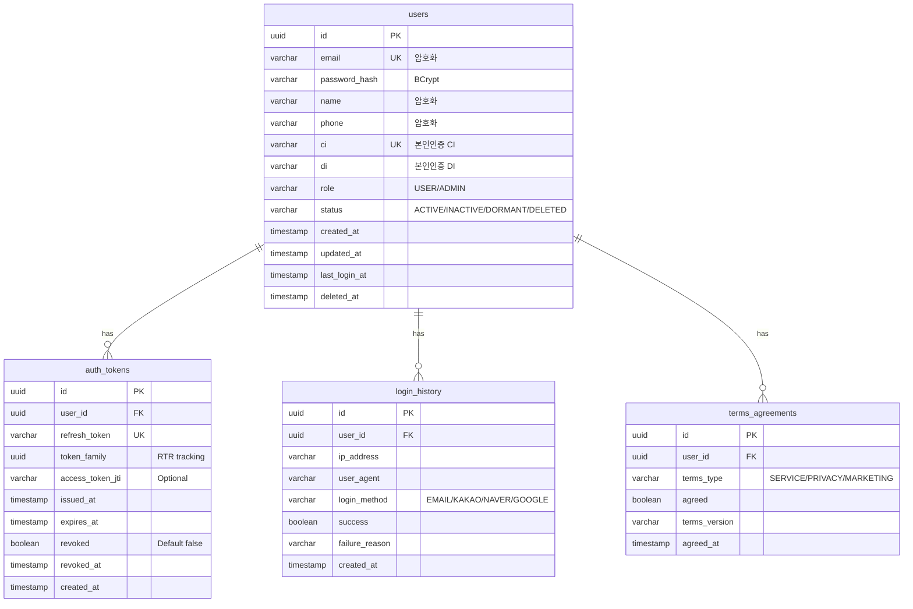
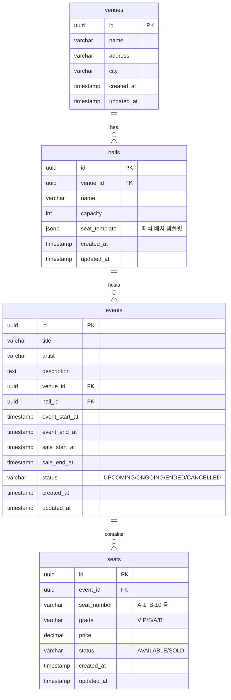
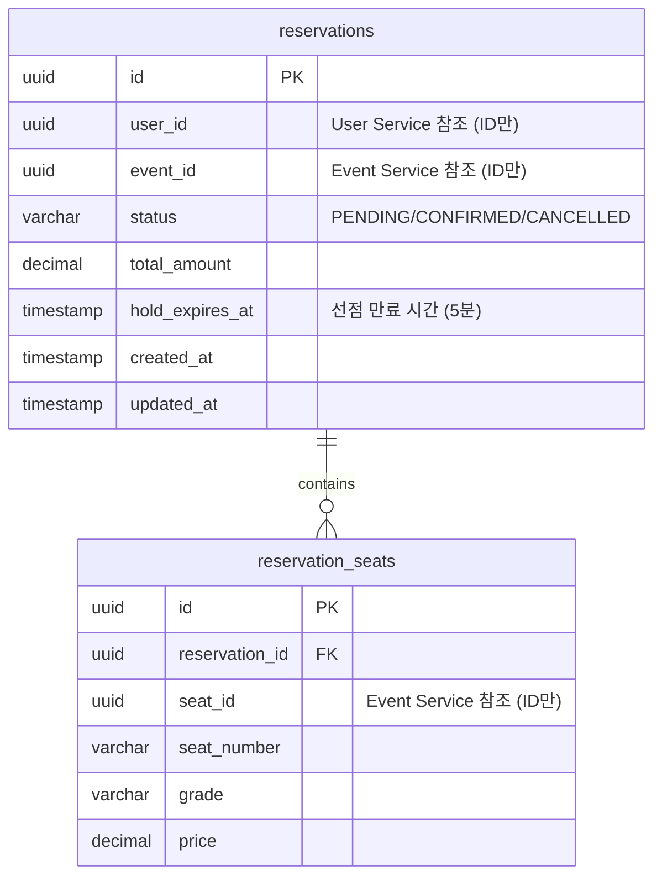
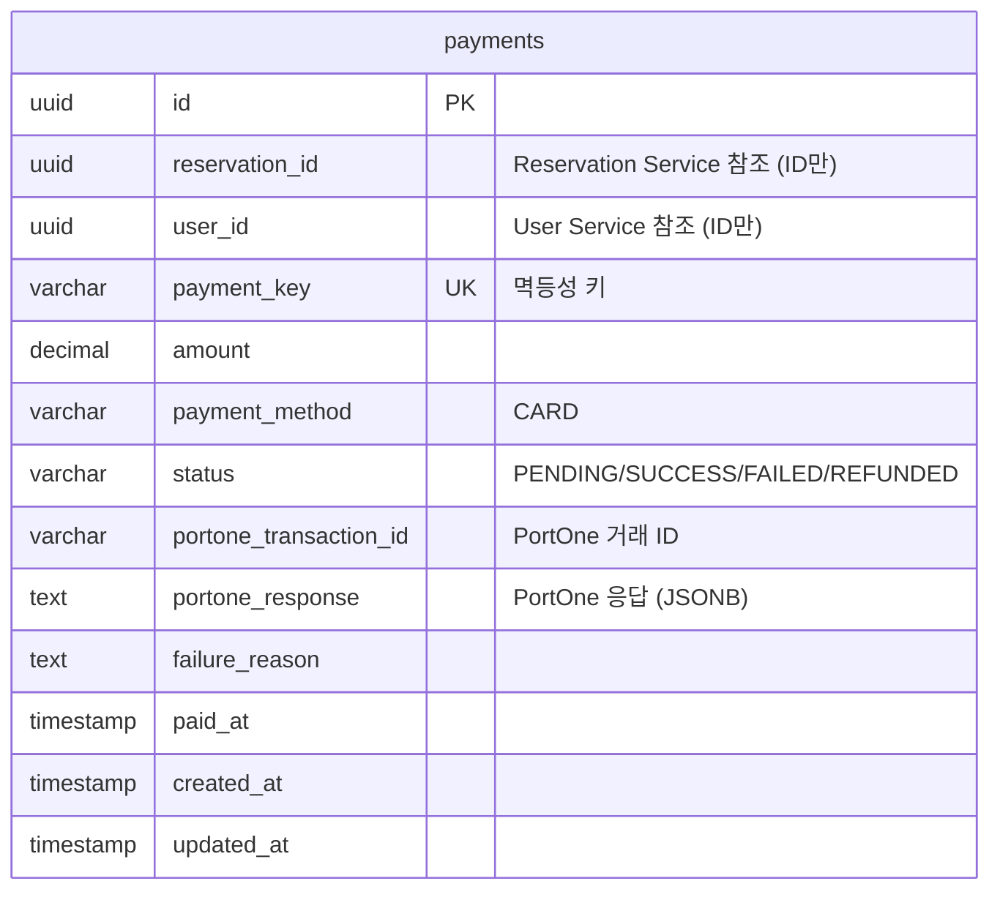
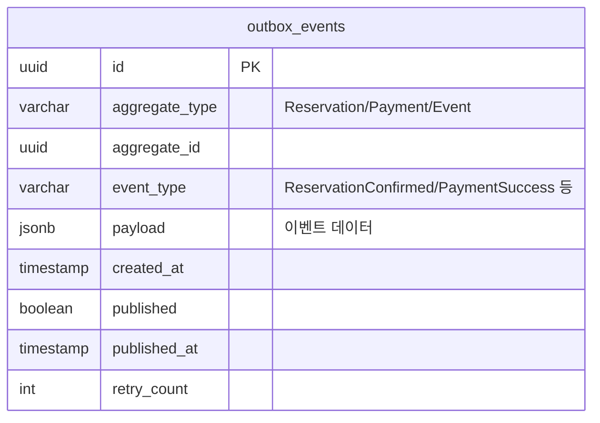

# 데이터 아키텍처

## 1. 데이터 아키텍처

### 1.1 데이터베이스 전략

#### 1.1.1 PostgreSQL 18 - 논리적 DB per Service + 물리적 통합

**선택 이유:**
- **비용 효율성**: 단일 RDS 인스턴스로 모든 서비스 지원 (무료티어 활용)
- **MSA 원칙 준수**: 스키마 분리로 서비스별 데이터 격리
- **확장 가능성**: 향후 트래픽 증가 시 물리적 분리 마이그레이션 용이
- **PostgreSQL 18 장점**: 성능 개선, JSON 처리 최적화, 파티셔닝 강화

**아키텍처 원칙:**
```
단일 PostgreSQL 인스턴스
├── user_service 스키마 (User Service 전용)
├── event_service 스키마 (Event Service 전용)
├── reservation_service 스키마 (Reservation Service 전용)
├── payment_service 스키마 (Payment Service 전용)
└── common 스키마 (공통: outbox_events)
```

**서비스 간 데이터 접근 제한:**
- 각 서비스는 자신의 스키마만 접근 가능 (DB 사용자 권한 분리)
- 서비스 간 데이터 필요 시 REST API 또는 Kafka 이벤트로만 통신
- **금지**: 서비스 A가 서비스 B의 스키마에 직접 쿼리

#### 1.1.2 스키마별 DB 사용자 및 권한

**사용자 생성 및 권한 부여:**
```sql
-- User Service 전용 사용자
CREATE USER user_svc_user WITH PASSWORD 'user_strong_password_here';
GRANT USAGE ON SCHEMA user_service TO user_svc_user;
GRANT ALL PRIVILEGES ON ALL TABLES IN SCHEMA user_service TO user_svc_user;
GRANT ALL PRIVILEGES ON ALL SEQUENCES IN SCHEMA user_service TO user_svc_user;
ALTER DEFAULT PRIVILEGES IN SCHEMA user_service GRANT ALL ON TABLES TO user_svc_user;

-- Event Service 전용 사용자
CREATE USER event_svc_user WITH PASSWORD 'event_strong_password_here';
GRANT USAGE ON SCHEMA event_service TO event_svc_user;
GRANT ALL PRIVILEGES ON ALL TABLES IN SCHEMA event_service TO event_svc_user;
GRANT ALL PRIVILEGES ON ALL SEQUENCES IN SCHEMA event_service TO event_svc_user;
ALTER DEFAULT PRIVILEGES IN SCHEMA event_service GRANT ALL ON TABLES TO event_svc_user;

-- Reservation Service 전용 사용자
CREATE USER reservation_svc_user WITH PASSWORD 'reservation_strong_password_here';
GRANT USAGE ON SCHEMA reservation_service TO reservation_svc_user;
GRANT ALL PRIVILEGES ON ALL TABLES IN SCHEMA reservation_service TO reservation_svc_user;
GRANT ALL PRIVILEGES ON ALL SEQUENCES IN SCHEMA reservation_service TO reservation_svc_user;
ALTER DEFAULT PRIVILEGES IN SCHEMA reservation_service GRANT ALL ON TABLES TO reservation_svc_user;

-- Payment Service 전용 사용자
CREATE USER payment_svc_user WITH PASSWORD 'payment_strong_password_here';
GRANT USAGE ON SCHEMA payment_service TO payment_svc_user;
GRANT ALL PRIVILEGES ON ALL TABLES IN SCHEMA payment_service TO payment_svc_user;
GRANT ALL PRIVILEGES ON ALL SEQUENCES IN SCHEMA payment_service TO payment_svc_user;
ALTER DEFAULT PRIVILEGES IN SCHEMA payment_service GRANT ALL ON TABLES TO payment_svc_user;

-- 모든 서비스가 common 스키마 접근 (Outbox)
GRANT USAGE ON SCHEMA common TO user_svc_user, event_svc_user, reservation_svc_user, payment_svc_user;
GRANT ALL PRIVILEGES ON ALL TABLES IN SCHEMA common TO user_svc_user, event_svc_user, reservation_svc_user, payment_svc_user;
```

**Spring Boot application.yml 설정 예시:**
```yaml
# User Service
spring:
  datasource:
    url: jdbc:postgresql://ticketing-db.xxx.ap-northeast-2.rds.amazonaws.com:5432/ticketing
    username: user_svc_user
    password: ${DB_PASSWORD}  # AWS Secrets Manager 또는 환경변수
    schema: user_service  # 기본 스키마 설정
    hikari:
      maximum-pool-size: 5          # 6 services × 5 = 30 connections (< RDS free tier limit)
      minimum-idle: 2
      connection-timeout: 30000      # 30 seconds
      idle-timeout: 600000           # 10 minutes
      max-lifetime: 1800000          # 30 minutes
      leak-detection-threshold: 60000  # Detect 1+ min leaks
  jpa:
    properties:
      hibernate:
        default_schema: user_service
```

**HikariCP 설정 이유:**
- 6개 서비스 × 5 connections = 30개 (RDS t2.micro 무료티어 제한 고려)
- Auto Scaling 시 커넥션 고갈 방지
- 커넥션 누수 감지로 장기 트랜잭션 모니터링

#### 1.1.3 향후 물리적 분리 마이그레이션 계획

**마이그레이션 시점:**
- 월간 활성 사용자 50,000명 이상
- DB CPU 사용률 지속적으로 70% 이상
- 커넥션 풀 고갈 빈번

**마이그레이션 전략:**
1. **Read Replica 추가** (단계 1):
   - 조회 트래픽이 많은 Event Service를 Read Replica로 분리
   - 쓰기: Primary, 읽기: Replica

2. **서비스별 DB 분리** (단계 2):
   - User/Event/Reservation/Payment Service 각각 독립 RDS 인스턴스
   - AWS DMS (Database Migration Service)로 마이그레이션
   - Zero-Downtime 마이그레이션 (Dual Write → Cutover)

### 1.2 ERD (Entity Relationship Diagram)

#### 1.2.1 User Service 스키마 ERD

**스키마: `user_service`**



**주요 테이블 설명:**

**`users` 테이블:**
- **id**: UUID Primary Key
- **email**: 이메일 (Unique, AES-256 암호화 - 선택)
- **password_hash**: BCrypt 해시
- **name, phone**: 개인정보 (AES-256 암호화 - 선택)
- **ci, di**: 본인인증 CI/DI (Unique, CI는 1인 1계정 강제)
- **role**: USER / ADMIN
- **status**: ACTIVE / INACTIVE / DORMANT (1년 미접속) / DELETED (Soft Delete)
- **관련 요구사항**: REQ-AUTH-001, REQ-AUTH-014, REQ-AUTH-017, REQ-AUTH-019

**`auth_tokens` 테이블:** ✅
- **refresh_token**: Refresh Token (Unique, 7일 TTL)
- **token_family**: RTR (Refresh Token Rotation) 추적용 UUID - 동일 세션 토큰 그룹핑
- **access_token_jti**: Access Token의 JTI (JWT ID) - 선택적 추적
- **issued_at**: 토큰 발급 시각
- **revoked**: 폐기 여부 (기본 false, RTR 시 true로 변경)
- **revoked_at**: 폐기 시각 (탈취 감지 시 token_family 전체 무효화)
- **Refresh Token Rotation (RTR) 필수 구현**
  - 매 토큰 갱신 시 신규 Refresh Token 발급 및 기존 토큰 폐기
  - 폐기된 토큰 재사용 시 해당 token_family 전체 무효화 (보안 강화)
- **관련 요구사항**: REQ-AUTH-009 (토큰 갱신), REQ-AUTH-012 (RTR)

**SQL Schema:**
```sql
CREATE TABLE user_service.auth_tokens (
    id UUID PRIMARY KEY DEFAULT gen_random_uuid(),
    user_id UUID NOT NULL REFERENCES user_service.users(id) ON DELETE CASCADE,
    refresh_token VARCHAR(500) NOT NULL UNIQUE,
    token_family UUID NOT NULL,
    access_token_jti VARCHAR(100),
    issued_at TIMESTAMP NOT NULL DEFAULT now(),
    expires_at TIMESTAMP NOT NULL,
    revoked BOOLEAN DEFAULT false,
    revoked_at TIMESTAMP,
    created_at TIMESTAMP DEFAULT now()
);

CREATE INDEX idx_user_tokens ON user_service.auth_tokens(user_id, revoked);
CREATE INDEX idx_token_family ON user_service.auth_tokens(token_family);
```

**`login_history` 테이블:**
- 로그인 이력 추적 (선택)
- 의심 접속 탐지용
- **관련 요구사항**: REQ-AUTH-020

**`terms_agreements` 테이블:**
- 약관 동의 이력
- 약관 버전 관리
- **관련 요구사항**: REQ-AUTH-002

#### 1.2.2 Event Service 스키마 ERD

**스키마: `event_service`**



**주요 테이블 설명:**

**`venues` 테이블:**
- 공연장 정보
- **관련 요구사항**: REQ-EVT-010

**`halls` 테이블:**
- 공연장 내 홀 정보
- **seat_template (JSONB)**: 좌석 배치 템플릿 (행/열, 등급 매핑)
  ```json
  {
    "rows": ["A", "B", "C"],
    "seatsPerRow": 20,
    "gradeMapping": {
      "A": "VIP",
      "B": "S",
      "C": "A"
    }
  }
  ```
- **관련 요구사항**: REQ-EVT-013

**설계 검토 노트 (장기 유지보수):**

현재 `seat_template` JSONB 설계는 단순 공연장에 적합하나, 복잡한 좌석 배치(스탠딩, VIP 라운지, 장애인석 등)에는 한계가 있음.

**현재 제약사항:**
- 균일한 행/열 구조만 지원 (불규칙 배치 불가)
- 등급별 가격 차등이 행 단위로만 가능
- 좌석 예외 처리 어려움 (기둥, 시야 제한석 등)

**향후 개선 방향 (트래픽 안정화 후 검토):**

1. **좌석 배치 정규화 (별도 테이블)**
```sql
CREATE TABLE event_service.seat_layouts (
    id UUID PRIMARY KEY,
    hall_id UUID NOT NULL REFERENCES halls(id),
    row_label VARCHAR(5) NOT NULL,
    seat_number INT NOT NULL,
    x_position INT,  -- 시각적 배치 좌표
    y_position INT,
    grade VARCHAR(10),
    accessible BOOLEAN DEFAULT false,  -- 장애인석
    view_restricted BOOLEAN DEFAULT false,
    UNIQUE (hall_id, row_label, seat_number)
);
```

2. **또는 더 유연한 JSONB 스키마**
```json
{
  "layout_type": "grid",  // or "irregular"
  "sections": [
    {
      "name": "VIP",
      "seats": [
        {"row": "A", "number": 1, "x": 100, "y": 50, "accessible": false}
      ]
    }
  ]
}
```

**전환 조건 (정량화):**
- 공연장 수 > 10개이고 불규칙 배치 요청 > 3건
- 또는 고객 요구사항으로 명시적 지정 시

**현재 판단:** MVP에서는 현재 JSONB 구조 유지, 실제 사용 패턴 수집 후 결정

**`events` 테이블:**
- 공연 정보
- **status**: UPCOMING (판매 전) / ONGOING (판매 중) / ENDED (종료) / CANCELLED (취소)
- **관련 요구사항**: REQ-EVT-001, REQ-EVT-007

**`seats` 테이블:**
- 공연별 좌석 정보
- **status**: AVAILABLE / SOLD (HOLD는 Redis로 관리)
- 공연 생성 시 hall의 seat_template 기반으로 자동 생성
- **인덱스**: `idx_seats_event_status (event_id, status)` - 좌석 조회 성능 최적화
- **관련 요구사항**: REQ-EVT-008, REQ-EVT-019

#### 1.2.3 Reservation Service 스키마 ERD

**스키마: `reservation_service`**



**주요 테이블 설명:**

**`reservations` 테이블:**
- 예매 정보
- **status**:
  - PENDING: 좌석 선점 완료, 결제 대기
  - CONFIRMED: 결제 완료, 예매 확정
  - CANCELLED: 예매 취소
- **hold_expires_at**: 선점 만료 시간 (현재 시간 + 5분)
- **user_id, event_id**: 다른 서비스의 ID만 참조 (FK 없음, MSA 원칙)
- **관련 요구사항**: REQ-RSV-001, REQ-RSV-004, REQ-RSV-006

**`reservation_seats` 테이블:**
- 예매에 포함된 좌석 목록 (1회 최대 4장)
- 좌석 정보 스냅샷 (seat_number, grade, price) - 공연 정보 변경에도 예매 정보 유지
- **관련 요구사항**: REQ-RSV-005

#### 1.2.4 Payment Service 스키마 ERD

**스키마: `payment_service`**



**주요 테이블 설명:**

**`payments` 테이블:**
- 결제 정보
- **payment_key**: 멱등성 키 (클라이언트 생성, Unique)
- **status**:
  - PENDING: 결제 요청 중
  - SUCCESS: 결제 성공
  - FAILED: 결제 실패
  - REFUNDED: 환불 완료
- **portone_transaction_id**: PortOne 거래 ID (결제 조회/취소용)
- **portone_response**: PortOne API 응답 전체 (JSONB, 디버깅/감사용)
- **관련 요구사항**: REQ-PAY-001, REQ-PAY-003, REQ-PAY-004, REQ-PAY-006

#### 1.2.5 공통 스키마 (Transactional Outbox)

**스키마: `common`**



**주요 테이블 설명:**

**`outbox_events` 테이블:**
- Transactional Outbox 패턴 구현
- 비즈니스 로직과 동일 트랜잭션 내 INSERT
- Poller/CDC가 주기적으로 읽어 Kafka 발행
- **aggregate_type**: 이벤트 발행 주체 (Reservation, Payment, Event)
- **event_type**: 이벤트 타입 (ReservationConfirmed, PaymentSuccess, PaymentFailed 등)
- **payload (JSONB)**: 이벤트 데이터
  ```json
  {
    "reservationId": "uuid",
    "userId": "uuid",
    "eventId": "uuid",
    "seatIds": ["uuid1", "uuid2"],
    "totalAmount": 100000,
    "confirmedAt": "2026-01-11T10:00:00Z"
  }
  ```
- **published**: Kafka 발행 여부
- **retry_count**: 발행 실패 시 재시도 횟수
- **인덱스**: `idx_outbox_published_created (published, created_at)` - Poller 성능 최적화
- **관련 요구사항**: REQ-RSV-012, REQ-PAY-013

### 1.3 Redis 아키텍처

#### 1.3.1 Redis 인스턴스 구성

**로컬 개발:**
- Docker Redis 7.x 단일 인스턴스
- 포트: 6379
- Persistence: AOF + RDB

**AWS 운영:**
- ElastiCache Redis 7.x
- 노드 타입: `cache.t2.micro` (무료티어) 또는 `cache.t3.micro`
- 클러스터 모드: 비활성화 (단일 노드)
- Multi-AZ: 비활성화 (초기), 향후 Replication 전환
- 백업: 비활성화 (비용 절감, 데이터 휘발성)

#### 1.3.2 Redis 데이터 모델 설계

**데이터 타입별 용도:**

| Key Pattern | 데이터 타입 | 용도 | TTL | 서비스 |
|-------------|------------|------|-----|--------|
| `queue:{eventId}` | Sorted Set | 대기열 (score: timestamp) | 없음 | Queue |
| `queue:token:{token}` | String | Queue Token (qr_xxx, qp_xxx) | 10분 | Queue |
| `queue:active:{userId}` | String | 사용자 활성 대기열 (중복 방지) | 10분 | Queue |
| `seat:hold:{eventId}:{seatId}` | String | 좌석 선점 락 (userId) | 5분 | Reservation |
| `token:blacklist:{token}` | String | Access Token 블랙리스트 | 1시간 | User |
| `cache:event:list` | String (JSON) | 공연 목록 캐시 | 5분 | Event |
| `cache:event:{eventId}` | Hash | 공연 상세 캐시 | 5분 | Event |
| `cache:seats:{eventId}` | Hash | 좌석 정보 캐시 | 5분 | Event |

#### 1.3.3 대기열 (Queue Service)

**1. Sorted Set - 대기열**

**Key:** `queue:{eventId}`
**타입:** Sorted Set
**Score:** Unix Timestamp (진입 시각)
**Member:** `userId`

```redis
ZADD queue:event-123 1736582400 user-abc
ZADD queue:event-123 1736582401 user-def

# 순위 조회 (0-based)
ZRANK queue:event-123 user-abc  # 결과: 0 (1등)

# 대기열 크기
ZCARD queue:event-123

# 상위 10명 조회
ZRANGE queue:event-123 0 9 WITHSCORES

# 배치 승인 (Lua 스크립트)
EVAL "..." 1 queue:event-123 10
```

**2. String - Queue Token**

**Key:** `queue:token:{token}`
**Value:** JSON (userId, eventId, type, issuedAt)

```redis
SET queue:token:qr_abc123xyz '{"userId":"user-abc","eventId":"event-123","type":"RESERVATION","issuedAt":"2026-01-11T10:00:00Z"}' EX 600

# Token 검증
GET queue:token:qr_abc123xyz
```

**3. String - 중복 대기 방지**

**Key:** `queue:active:{userId}`
**Value:** `eventId`

```redis
SET queue:active:user-abc event-123 EX 600

# 중복 대기 확인
EXISTS queue:active:user-abc
```

**관련 요구사항:** REQ-QUEUE-001, REQ-QUEUE-003, REQ-QUEUE-004, REQ-QUEUE-021

#### 1.3.4 좌석 선점 (Reservation Service)

**분산 락 - Redisson**

**Key:** `seat:hold:{eventId}:{seatId}`
**Value:** `userId`
**TTL:** 5분

```java
// Redisson 분산 락
RLock lock = redissonClient.getLock("seat:hold:event-123:seat-456");

// ✅ Fixed: waitTime increased to 15s to handle high-concurrency scenarios
// (36,000 queue admits/hour = peak seat selection traffic)
boolean acquired = lock.tryLock(15, 300, TimeUnit.SECONDS);  // waitTime: 15초, leaseTime: 300초

if (acquired) {
    try {
        // ✅ Fixed: Use Redis SET to track held seats instead of KEYS command
        redisTemplate.opsForSet().add("held_seats:event-123", "seat-456");

        // 좌석 선점 로직
        // 예매 정보 DB 저장 (PENDING)
    } finally {
        lock.unlock();
        redisTemplate.opsForSet().remove("held_seats:event-123", "seat-456");
    }
} else {
    throw new SeatAlreadyHoldException();
}

// HOLD 상태 조회 (KEYS 대신 SET 사용)
Set<String> holdSeatIds = redisTemplate.opsForSet().members("held_seats:event-123");
```

**수동 락 관리 (대안):**
```redis
# 락 획득 (NX: Not Exists)
SET seat:hold:event-123:seat-456 user-abc NX EX 300

# 락 해제
DEL seat:hold:event-123:seat-456
```

**관련 요구사항:** REQ-RSV-001, REQ-RSV-007

#### 1.3.5 토큰 블랙리스트 (User Service)

**Key:** `token:blacklist:{token}`
**Value:** `1` (존재 여부만 확인)
**TTL:** Access Token 만료 시간 (1시간)

```redis
# 로그아웃 시 블랙리스트 등록
SET token:blacklist:eyJhbGciOiJIUzI1NiIsInR5cCI6IkpXVCJ9... 1 EX 3600

# 토큰 검증 시 블랙리스트 확인
EXISTS token:blacklist:eyJhbGciOiJIUzI1NiIsInR5cCI6IkpXVCJ9...
```

**관련 요구사항:** REQ-AUTH-008, REQ-AUTH-010

#### 1.3.6 캐싱 (Event Service)

**1. 공연 목록 캐시**

**Key:** `cache:event:list:{page}:{size}:{filters}`
**타입:** String (JSON)
**TTL:** 5분 (티켓팅 오픈 시 1분으로 단축)

```redis
SET cache:event:list:0:20:upcoming '[{"id":"event-123","title":"콘서트 A",...}]' EX 300
```

**2. 공연 상세 캐시**

**Key:** `cache:event:{eventId}`
**타입:** Hash
**TTL:** 5분

```redis
HSET cache:event:event-123 title "콘서트 A" artist "아티스트 A" ...
EXPIRE cache:event:event-123 300

# 조회
HGETALL cache:event:event-123
```

**3. 좌석 정보 캐시**

**Key:** `cache:seats:{eventId}`
**타입:** Hash (grade별 그룹핑)
**TTL:** 5분

```redis
HSET cache:seats:event-123 VIP '{"available":50,"price":150000}' S '{"available":100,"price":100000}'
EXPIRE cache:seats:event-123 300
```

**캐시 무효화 전략:**
- 공연/좌석 정보 변경 시 Kafka 이벤트 발행
- Event Service Consumer가 해당 캐시 삭제 (DEL)
- 다음 조회 시 DB에서 재구축 (Cache-Aside 패턴)

**관련 요구사항:** REQ-EVT-017, REQ-EVT-020

#### 1.3.7 TTL 전략

| 데이터 | TTL | 근거 | 관련 요구사항 |
|--------|-----|------|--------------|
| Queue Token | 10분 | 대기열 진입 후 충분한 대기 시간 | REQ-QUEUE-003 |
| 좌석 선점(HOLD) | 5분 | 선점 후 결제까지 여유 시간 | REQ-RSV-007 |
| Access Token 블랙리스트 | 1시간 | Access Token 만료 시간과 동일 | REQ-AUTH-010 |
| 공연 목록/상세 캐시 | 5분 | 적절한 신선도, 오픈 시 1분으로 단축 | REQ-EVT-031 |
| 좌석 정보 캐시 | 5분 | 실시간성 요구, 변경 빈도 고려 | REQ-EVT-017 |

#### 1.3.8 Persistence 전략

**AOF (Append-Only File):**
- **fsync everysec**: 1초마다 디스크 동기화
- 성능과 안정성의 균형
- 최악의 경우 1초 데이터 손실

**RDB (Snapshot):**
- 1시간마다 스냅샷 생성 (메모리 절약)
- 재시작 시 빠른 복구

**설정 예시 (redis.conf):**
```
appendonly yes
appendfsync everysec
save 3600 1    # 1시간마다 1개 이상 키 변경 시 저장
```

**주의:** ElastiCache는 백업 비활성화 (비용 절감), 데이터 손실 시 서비스 로직으로 복구

#### 1.3.9 Cache Stampede 방지

**문제:** 캐시 만료 시 동시 다발적 DB 조회로 DB 과부하

**해결책: Redisson 분산 락 기반 갱신** ✅

```lua
-- cache_get_or_set.lua (Simplified)
local key = KEYS[1]
local value = redis.call('GET', key)
if value then
    return value
else
    return nil  -- Client handles lock acquisition
end
```

**Java 구현: Redisson Lock으로 Cache Stampede 방지**

```java
// Cache Stampede Prevention with Redisson Lock
public String getCachedEvent(String eventId) {
    String cacheKey = "cache:event:" + eventId;
    String value = redisTemplate.opsForValue().get(cacheKey);

    if (value != null) {
        return value;
    }

    // Lock to prevent stampede
    RLock lock = redisson.getLock(cacheKey + ":lock");
    try {
        boolean acquired = lock.tryLock(5, 10, TimeUnit.SECONDS);
        if (!acquired) {
            // Wait and retry (another thread is loading)
            Thread.sleep(100);
            return redisTemplate.opsForValue().get(cacheKey);  // Try again
        }

        // Double-check after acquiring lock
        value = redisTemplate.opsForValue().get(cacheKey);
        if (value != null) {
            return value;
        }

        // Load from DB and cache
        value = eventRepository.findById(eventId).toString();
        redisTemplate.opsForValue().set(cacheKey, value, Duration.ofMinutes(5));
        return value;
    } catch (InterruptedException e) {
        Thread.currentThread().interrupt();
        throw new CacheException("Interrupted while waiting for cache", e);
    } finally {
        if (lock.isHeldByCurrentThread()) {
            lock.unlock();
        }
    }
}
```

**대안: Probabilistic Early Expiration**
- TTL의 90% 시점에 확률적으로 재갱신 (Beta: 1)
- 동시 만료 회피

**변경 이유:**
- Redis에는 SLEEP 명령이 존재하지 않음 (Lua 스크립트 실행 시 에러 발생)
- Redisson Lock을 사용하면 동일한 stampede 방지 효과 + 안전한 재시도 로직

**관련 요구사항:** REQ-EVT-027

### 1.4 데이터 일관성 전략

#### 1.4.1 Eventually Consistent 모델

MSA 환경에서 서비스 간 데이터는 **Eventually Consistent** (최종 일관성) 모델을 따릅니다.

**예시: 예매 → 결제 → 확정 플로우**

```
1. Reservation Service: 예매 생성 (PENDING)
2. Payment Service: 결제 성공 → Kafka 이벤트 발행 (payment.success)
3. Reservation Service (Consumer): 예매 확정 (CONFIRMED) - 수 밀리초 ~ 수 초 지연
4. Event Service (Consumer): 좌석 상태 업데이트 (SOLD) - 수 밀리초 ~ 수 초 지연
```

**지연 시간:** 일반적으로 수십 ms ~ 수백 ms, Kafka 장애 시 수 초

**사용자 경험:**
- 결제 완료 후 "예매 처리 중..." 메시지 표시
- 최종 확정 후 "예매 완료!" 표시
- 장시간 미처리 시 알림 또는 재시도

#### 1.4.2 분산 락 (Redisson)

**목적:** 좌석 선점 시 동시성 제어

**Redisson RLock:**
- Redis 기반 분산 락
- Pub/Sub로 락 해제 알림 (대기 중인 스레드 즉시 깨움)
- Watch Dog로 자동 갱신 (데드락 방지)

**Spring Boot 설정:**
```java
@Configuration
public class RedissonConfig {
    @Bean
    public RedissonClient redissonClient() {
        Config config = new Config();
        config.useSingleServer()
            .setAddress("redis://localhost:6379")
            .setConnectionPoolSize(50)
            .setConnectionMinimumIdleSize(10);
        return Redisson.create(config);
    }
}
```

**사용 예시:**
```java
@Service
public class ReservationService {
    @Autowired
    private RedissonClient redissonClient;

    public void holdSeats(UUID eventId, List<UUID> seatIds, UUID userId) {
        List<RLock> locks = new ArrayList<>();
        try {
            // 다중 좌석 락 획득
            for (UUID seatId : seatIds) {
                RLock lock = redissonClient.getLock("seat:hold:" + eventId + ":" + seatId);
                boolean acquired = lock.tryLock(3, 300, TimeUnit.SECONDS);
                if (!acquired) {
                    throw new SeatAlreadyHoldException(seatId);
                }
                locks.add(lock);
            }

            // 비즈니스 로직: 예매 정보 DB 저장 (PENDING)
            reservationRepository.save(reservation);

        } finally {
            // 모든 락 해제
            locks.forEach(RLock::unlock);
        }
    }
}
```

**관련 요구사항:** REQ-RSV-001, REQ-RSV-002

#### 1.4.3 데이터 동기화 메커니즘

**1. Kafka 이벤트 기반 동기화**

```
[Payment Service]
결제 성공 → Outbox INSERT (동일 트랜잭션)
↓
[Outbox Poller]
주기적 폴링 (1초) → Kafka 발행
↓
[Kafka Topic: payment.events]
↓
[Reservation Service Consumer]
예매 확정 (PENDING → CONFIRMED)
↓
[Event Service Consumer]
좌석 상태 업데이트 (AVAILABLE → SOLD)
```

**2. Outbox Poller 구현 예시**

```java
@Component
public class OutboxPoller {

    @Scheduled(fixedDelay = 1000)  // 1초마다
    public void pollAndPublish() {
        // ✅ Fixed: Read in transaction, publish outside
        List<OutboxEvent> events = fetchUnpublishedEvents();

        for (OutboxEvent event : events) {
            publishEventWithCallback(event);
        }
    }

    @Transactional(readOnly = true)
    private List<OutboxEvent> fetchUnpublishedEvents() {
        return outboxRepository.findTop100ByPublishedFalseOrderByCreatedAtAsc();
    }

    private void publishEventWithCallback(OutboxEvent event) {
        kafkaTemplate.send(getTopic(event), event.getPayload())
            .addCallback(
                success -> markAsPublished(event),
                failure -> handlePublishFailure(event, failure)
            );
    }

    @Transactional
    private void markAsPublished(OutboxEvent event) {
        event.setPublished(true);
        event.setPublishedAt(Instant.now());
        outboxRepository.save(event);
    }

    @Transactional
    private void handlePublishFailure(OutboxEvent event, Throwable e) {
        event.setRetryCount(event.getRetryCount() + 1);
        event.setLastError(e.getMessage());

        if (event.getRetryCount() > 3) {
            dlqRepository.save(DLQEvent.from(event));
            outboxRepository.delete(event);
        } else {
            outboxRepository.save(event);
        }
    }
}
```

**변경 이유:**
- Kafka send는 비동기이므로 callback으로 성공/실패 처리
- 각 작업을 독립적인 트랜잭션으로 분리 (장기 락 방지)
- Kafka 실패를 정확하게 감지하고 재시도 로직 실행

**3. 멱등성 보장**

Kafka Consumer는 동일 이벤트를 중복 수신할 수 있으므로 멱등성 보장 필수:

```java
@KafkaListener(topics = "payment.events")
public void handlePaymentSuccess(PaymentSuccessEvent event) {
    // 멱등성 체크: payment_key로 중복 처리 방지
    if (paymentRepository.existsByPaymentKey(event.getPaymentKey())) {
        log.info("이미 처리된 결제 이벤트: {}", event.getPaymentKey());
        return;
    }

    // 예매 확정 로직
    Reservation reservation = reservationRepository.findById(event.getReservationId())
        .orElseThrow();
    reservation.confirm();
    reservationRepository.save(reservation);
}
```

**관련 요구사항:** REQ-RSV-012, REQ-PAY-004, REQ-PAY-013

#### 1.4.4 Outbox Poller 고가용성 전략 (Multi-Instance)

**과제:** Outbox Poller를 다중 인스턴스로 실행 시 동일 이벤트 중복 처리 방지

**해결책 1: FOR UPDATE SKIP LOCKED (권장)**

```java
@Scheduled(fixedDelay = 1000)
@Transactional
public void pollAndPublish() {
    List<OutboxEvent> events = outboxRepository.findUnpublishedEventsWithLock(100);

    for (OutboxEvent event : events) {
        try {
            kafkaTemplate.send(event.getTopic(), event.getPayload()).get(5, TimeUnit.SECONDS);
            event.markAsPublished();
            outboxRepository.save(event);
        } catch (Exception e) {
            event.incrementRetry();
            if (event.getRetryCount() >= 3) {
                event.markAsFailed();
            }
            outboxRepository.save(event);
        }
    }
}
```

**Repository 쿼리:**
```java
@Query(value = "SELECT * FROM common.outbox_events " +
               "WHERE published = false AND retry_count < 3 " +
               "ORDER BY created_at ASC " +
               "LIMIT :limit " +
               "FOR UPDATE SKIP LOCKED", nativeQuery = true)
List<OutboxEvent> findUnpublishedEventsWithLock(@Param("limit") int limit);
```

**동작 원리:**
- `FOR UPDATE`: 선택된 행에 배타적 락 설정
- `SKIP LOCKED`: 이미 락된 행은 건너뛰고 다음 행 선택
- 결과: 각 Poller 인스턴스가 서로 다른 이벤트 처리 (자동 분산)

**해결책 2: Redisson 분산 락 (대안)**

```java
@Scheduled(fixedDelay = 1000)
public void pollAndPublish() {
    RLock lock = redissonClient.getLock("outbox:poller:lock");

    if (lock.tryLock()) {
        try {
            // Outbox 처리 로직 (위와 동일)
        } finally {
            lock.unlock();
        }
    }
    // 락 획득 실패 시 다음 스케줄까지 대기
}
```

**비교:**

| 방식 | 장점 | 단점 | 권장 |
|------|------|------|------|
| FOR UPDATE SKIP LOCKED | DB 네이티브, 추가 의존성 없음, 자동 분산 | PostgreSQL 9.5+ 필요 | ✅ 권장 |
| Redisson 분산 락 | Redis 기반, 명시적 제어 | 락 획득 경쟁, 처리량 제한 (단일 인스턴스) | 차선책 |

**운영 고려사항:**
- Auto Scaling 시 Poller 인스턴스 수 제한 (최대 3-5개 권장)
- CloudWatch Metric: `outbox.events.lag` (미발행 이벤트 수 > 100 알람)
- DLQ 모니터링: 3회 재시도 실패 이벤트는 `failed=true`로 표시, 별도 알람 발송

**관련 요구사항:** REQ-RSV-012, REQ-PAY-013
