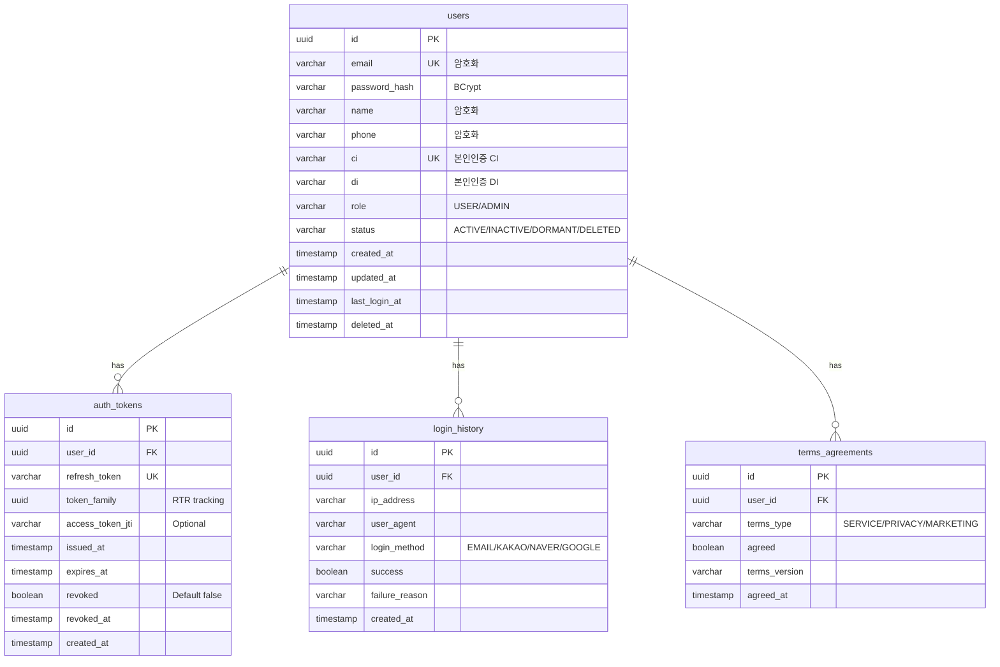
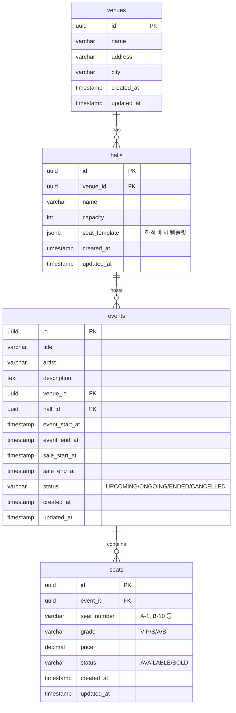
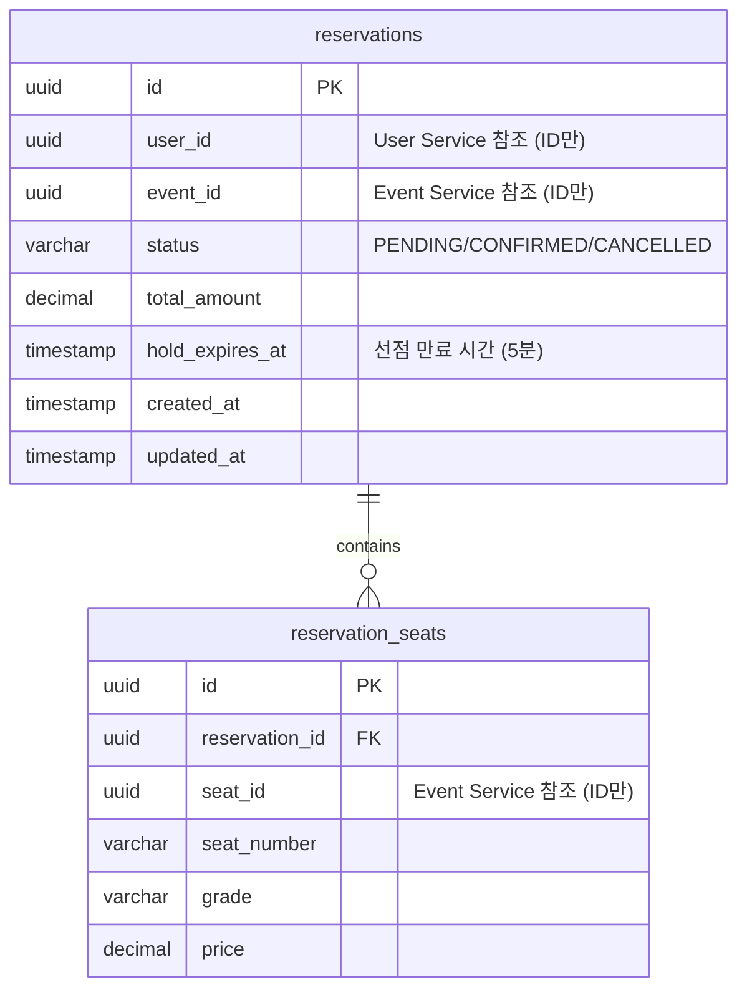
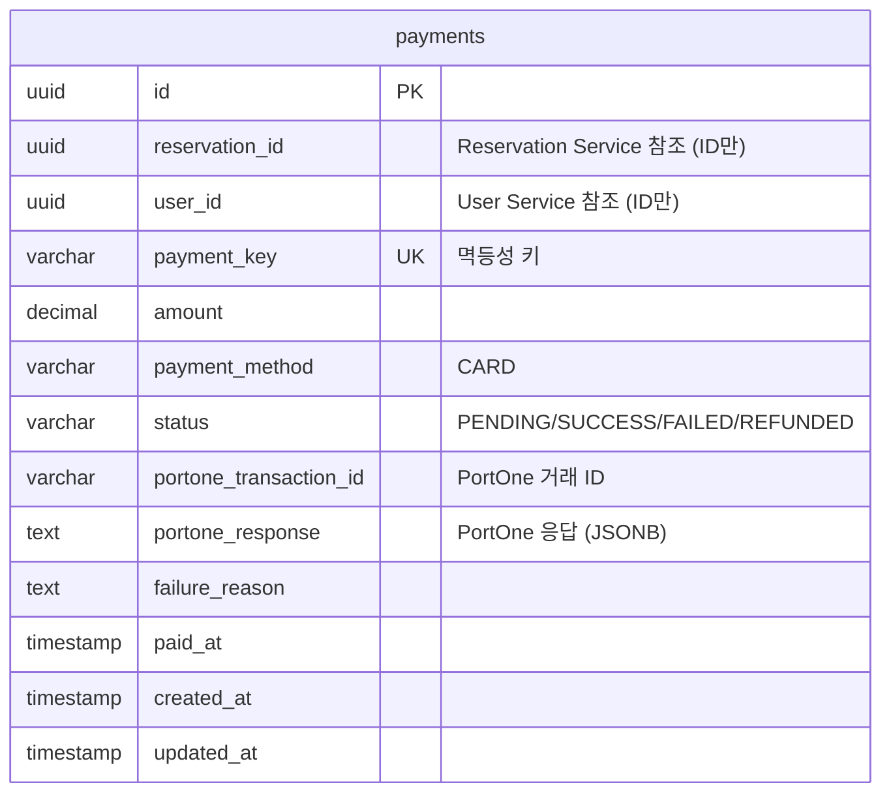
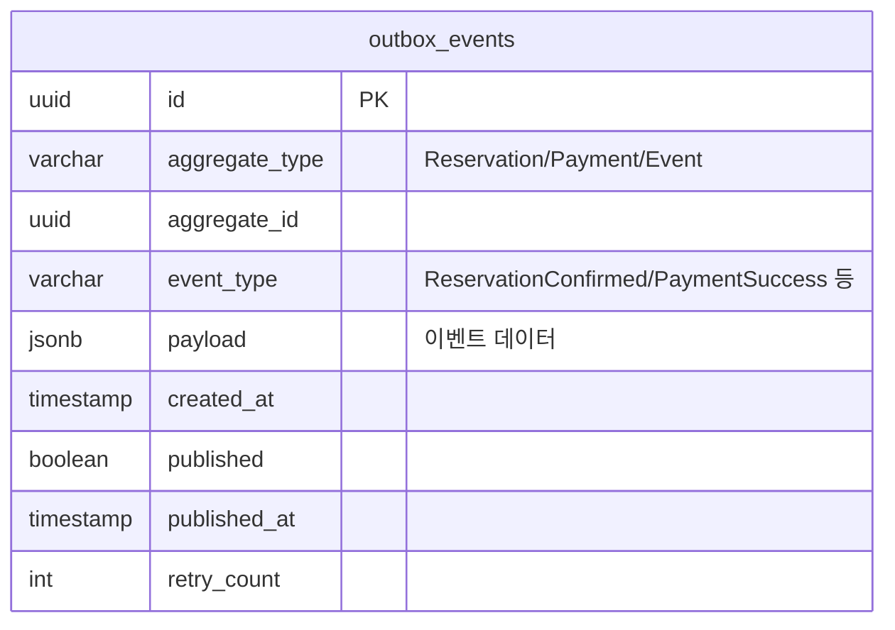

# 데이터 아키텍처

## 목차

- [1. 데이터 아키텍처](#1-데이터-아키텍처)
  - [1.1 데이터베이스 전략](#11-데이터베이스-전략)
    - [1.1.1 PostgreSQL 18 - 논리적 DB per Service + 물리적 통합](#111-postgresql-18---논리적-db-per-service--물리적-통합)
    - [1.1.2 스키마별 DB 사용자 및 권한](#112-스키마별-db-사용자-및-권한)
    - [1.1.3 향후 물리적 분리 마이그레이션 계획](#113-향후-물리적-분리-마이그레이션-계획)
  - [1.2 ERD (Entity Relationship Diagram)](#12-erd-entity-relationship-diagram)
    - [1.2.1 User Service 스키마 ERD](#121-user-service-스키마-erd)
    - [1.2.2 Event Service 스키마 ERD](#122-event-service-스키마-erd)
    - [1.2.3 Reservation Service 스키마 ERD](#123-reservation-service-스키마-erd)
    - [1.2.4 Payment Service 스키마 ERD](#124-payment-service-스키마-erd)
    - [1.2.5 공통 스키마 (Transactional Outbox)](#125-공통-스키마-transactional-outbox)
  - [1.3 Redis 아키텍처](#13-redis-아키텍처)
    - [1.3.1 Redis 인스턴스 구성](#131-redis-인스턴스-구성)
    - [1.3.2 Redis 데이터 모델 설계](#132-redis-데이터-모델-설계)
    - [1.3.3 대기열 (Queue Service)](#133-대기열-queue-service)
    - [1.3.4 좌석 선점 (Reservation Service)](#134-좌석-선점-reservation-service)
    - [1.3.5 토큰 블랙리스트 (User Service)](#135-토큰-블랙리스트-user-service)
    - [1.3.6 캐싱 (Event Service)](#136-캐싱-event-service)
    - [1.3.7 TTL 전략](#137-ttl-전략)
    - [1.3.8 Persistence 전략](#138-persistence-전략)
    - [1.3.9 Cache Stampede 방지](#139-cache-stampede-방지)
  - [1.4 데이터 일관성 전략](#14-데이터-일관성-전략)
    - [1.4.1 Eventually Consistent 모델](#141-eventually-consistent-모델)
    - [1.4.2 분산 락 (Redisson)](#142-분산-락-redisson)
    - [1.4.3 데이터 동기화 메커니즘](#143-데이터-동기화-메커니즘)
    - [1.4.4 Outbox Poller 고가용성 전략 (Multi-Instance)](#144-outbox-poller-고가용성-전략-multi-instance)

---

## 1. 데이터 아키텍처

### 1.1 데이터베이스 전략

#### 1.1.1 PostgreSQL 18 - 논리적 DB per Service + 물리적 통합

**선택 이유:**
- **비용 효율성**: 단일 RDS 인스턴스로 모든 서비스 지원 (무료티어 활용)
- **MSA 원칙 준수**: 스키마 분리로 서비스별 데이터 격리
- **확장 가능성**: 향후 트래픽 증가 시 물리적 분리 마이그레이션 용이
- **PostgreSQL 18 장점**: 성능 개선, JSON 처리 최적화, 파티셔닝 강화

**아키텍처 원칙:**
```
단일 PostgreSQL 인스턴스
├── user_service 스키마 (User Service 전용)
├── event_service 스키마 (Event Service 전용)
├── reservation_service 스키마 (Reservation Service 전용)
├── payment_service 스키마 (Payment Service 전용)
└── common 스키마 (공통: outbox_events)
```

**서비스 간 데이터 접근 제한:**
- 각 서비스는 자신의 스키마만 접근 가능 (DB 사용자 권한 분리)
- 서비스 간 데이터 필요 시 REST API 또는 Kafka 이벤트로만 통신
- **금지**: 서비스 A가 서비스 B의 스키마에 직접 쿼리

#### 1.1.2 스키마별 DB 사용자 및 권한

**사용자 생성 및 권한 부여:**
```sql
-- User Service 전용 사용자
CREATE USER user_svc_user WITH PASSWORD 'user_strong_password_here';
GRANT USAGE ON SCHEMA user_service TO user_svc_user;
GRANT ALL PRIVILEGES ON ALL TABLES IN SCHEMA user_service TO user_svc_user;
GRANT ALL PRIVILEGES ON ALL SEQUENCES IN SCHEMA user_service TO user_svc_user;
ALTER DEFAULT PRIVILEGES IN SCHEMA user_service GRANT ALL ON TABLES TO user_svc_user;

-- Event Service 전용 사용자
CREATE USER event_svc_user WITH PASSWORD 'event_strong_password_here';
GRANT USAGE ON SCHEMA event_service TO event_svc_user;
GRANT ALL PRIVILEGES ON ALL TABLES IN SCHEMA event_service TO event_svc_user;
GRANT ALL PRIVILEGES ON ALL SEQUENCES IN SCHEMA event_service TO event_svc_user;
ALTER DEFAULT PRIVILEGES IN SCHEMA event_service GRANT ALL ON TABLES TO event_svc_user;

-- Reservation Service 전용 사용자
CREATE USER reservation_svc_user WITH PASSWORD 'reservation_strong_password_here';
GRANT USAGE ON SCHEMA reservation_service TO reservation_svc_user;
GRANT ALL PRIVILEGES ON ALL TABLES IN SCHEMA reservation_service TO reservation_svc_user;
GRANT ALL PRIVILEGES ON ALL SEQUENCES IN SCHEMA reservation_service TO reservation_svc_user;
ALTER DEFAULT PRIVILEGES IN SCHEMA reservation_service GRANT ALL ON TABLES TO reservation_svc_user;

-- Payment Service 전용 사용자
CREATE USER payment_svc_user WITH PASSWORD 'payment_strong_password_here';
GRANT USAGE ON SCHEMA payment_service TO payment_svc_user;
GRANT ALL PRIVILEGES ON ALL TABLES IN SCHEMA payment_service TO payment_svc_user;
GRANT ALL PRIVILEGES ON ALL SEQUENCES IN SCHEMA payment_service TO payment_svc_user;
ALTER DEFAULT PRIVILEGES IN SCHEMA payment_service GRANT ALL ON TABLES TO payment_svc_user;

-- 모든 서비스가 common 스키마 접근 (Outbox)
GRANT USAGE ON SCHEMA common TO user_svc_user, event_svc_user, reservation_svc_user, payment_svc_user;
GRANT ALL PRIVILEGES ON ALL TABLES IN SCHEMA common TO user_svc_user, event_svc_user, reservation_svc_user, payment_svc_user;
```

**Spring Boot application.yml 설정 예시:**
```yaml
# User Service
spring:
  datasource:
    url: jdbc:postgresql://ticketing-db.xxx.ap-northeast-2.rds.amazonaws.com:5432/ticketing
    username: user_svc_user
    password: ${DB_PASSWORD}  # AWS Secrets Manager 또는 환경변수
    schema: user_service  # 기본 스키마 설정
    hikari:
      maximum-pool-size: 5          # 6 services × 5 = 30 connections (< RDS free tier limit)
      minimum-idle: 2
      connection-timeout: 30000      # 30 seconds
      idle-timeout: 600000           # 10 minutes
      max-lifetime: 1800000          # 30 minutes
      leak-detection-threshold: 60000  # Detect 1+ min leaks
  jpa:
    properties:
      hibernate:
        default_schema: user_service
```

**HikariCP 설정 이유:**
- 6개 서비스 × 5 connections = 30개 (RDS t2.micro 무료티어 제한 고려)
- Auto Scaling 시 커넥션 고갈 방지
- 커넥션 누수 감지로 장기 트랜잭션 모니터링

#### 1.1.3 향후 물리적 분리 마이그레이션 계획

**마이그레이션 시점:**
- 월간 활성 사용자 50,000명 이상
- DB CPU 사용률 지속적으로 70% 이상
- 커넥션 풀 고갈 빈번

**마이그레이션 전략:**
1. **Read Replica 추가** (단계 1):
   - 조회 트래픽이 많은 Event Service를 Read Replica로 분리
   - 쓰기: Primary, 읽기: Replica

2. **서비스별 DB 분리** (단계 2):
   - User/Event/Reservation/Payment Service 각각 독립 RDS 인스턴스
   - AWS DMS (Database Migration Service)로 마이그레이션
   - Zero-Downtime 마이그레이션 (Dual Write → Cutover)

### 1.2 ERD (Entity Relationship Diagram)

#### 1.2.1 User Service 스키마 ERD

**스키마: `user_service`**



**주요 테이블 설명:**

**`users` 테이블:**
- **id**: UUID Primary Key
- **email**: 이메일 (Unique, AES-256 암호화 - 선택)
- **password_hash**: BCrypt 해시
- **name, phone**: 개인정보 (AES-256 암호화 - 선택)
- **ci, di**: 본인인증 CI/DI (Unique, CI는 1인 1계정 강제)
- **role**: USER / ADMIN
- **status**: ACTIVE / INACTIVE / DORMANT (1년 미접속) / DELETED (Soft Delete)
- **관련 요구사항**: REQ-AUTH-001, REQ-AUTH-014, REQ-AUTH-017, REQ-AUTH-019

**SQL Schema:**
```sql
-- 스키마 및 확장 생성
CREATE SCHEMA IF NOT EXISTS user_service;
CREATE EXTENSION IF NOT EXISTS "uuid-ossp";
CREATE EXTENSION IF NOT EXISTS "pgcrypto";  -- AES-256 암호화용 (선택)

-- users 테이블
CREATE TABLE user_service.users (
    id UUID PRIMARY KEY DEFAULT gen_random_uuid(),
    email VARCHAR(255) NOT NULL,
    password_hash VARCHAR(255) NOT NULL,
    name VARCHAR(100),
    phone VARCHAR(20),
    ci VARCHAR(88) UNIQUE,  -- PortOne CI (Base64 인코딩, 88자)
    di VARCHAR(64),         -- PortOne DI
    role VARCHAR(10) NOT NULL DEFAULT 'USER',
    status VARCHAR(20) NOT NULL DEFAULT 'ACTIVE',
    created_at TIMESTAMP NOT NULL DEFAULT now(),
    updated_at TIMESTAMP NOT NULL DEFAULT now(),
    last_login_at TIMESTAMP,
    deleted_at TIMESTAMP,

    CONSTRAINT chk_users_role CHECK (role IN ('USER', 'ADMIN')),
    CONSTRAINT chk_users_status CHECK (status IN ('ACTIVE', 'INACTIVE', 'DORMANT', 'DELETED'))
);

-- 인덱스
CREATE UNIQUE INDEX idx_users_email ON user_service.users(email) WHERE deleted_at IS NULL;
CREATE UNIQUE INDEX idx_users_ci ON user_service.users(ci) WHERE ci IS NOT NULL;
CREATE INDEX idx_users_status_created ON user_service.users(status, created_at);
CREATE INDEX idx_users_last_login ON user_service.users(last_login_at) WHERE status = 'ACTIVE';

-- updated_at 자동 업데이트 트리거
CREATE OR REPLACE FUNCTION user_service.update_timestamp()
RETURNS TRIGGER AS $$
BEGIN
    NEW.updated_at = now();
    RETURN NEW;
END;
$$ LANGUAGE plpgsql;

CREATE TRIGGER trg_users_updated_at
BEFORE UPDATE ON user_service.users
FOR EACH ROW EXECUTE FUNCTION user_service.update_timestamp();

-- 테이블 코멘트
COMMENT ON TABLE user_service.users IS '회원 정보. Soft Delete 방식 사용 (deleted_at).';
COMMENT ON COLUMN user_service.users.ci IS 'PortOne 본인인증 CI. 1인 1계정 강제용 (Unique).';
COMMENT ON COLUMN user_service.users.email IS '이메일. AES-256 암호화 선택 가능 (pgcrypto 사용).';
```

**암호화 전략 (선택사항):**
- **컬럼**: email, phone, ci (개인정보)
- **방법**: AES-256-GCM
- **키 관리**: AWS Secrets Manager 또는 KMS
- **쿼리 예시**:
  ```sql
  -- 암호화 저장
  INSERT INTO users (email) VALUES (pgp_sym_encrypt('user@example.com', :encryption_key));

  -- 복호화 조회
  SELECT pgp_sym_decrypt(email::bytea, :encryption_key) AS email FROM users WHERE id = :user_id;
  ```
- **성능 영향**: 조회 쿼리 10-30% 느려짐. WHERE 절 암호화 컬럼은 인덱스 활용 불가.

**`auth_tokens` 테이블:** ✅
- **refresh_token**: Refresh Token (Unique, 7일 TTL)
- **token_family**: RTR (Refresh Token Rotation) 추적용 UUID - 동일 세션 토큰 그룹핑
- **access_token_jti**: Access Token의 JTI (JWT ID) - 선택적 추적
- **issued_at**: 토큰 발급 시각
- **revoked**: 폐기 여부 (기본 false, RTR 시 true로 변경)
- **revoked_at**: 폐기 시각 (탈취 감지 시 token_family 전체 무효화)
- **Refresh Token Rotation (RTR) 필수 구현**
  - 매 토큰 갱신 시 신규 Refresh Token 발급 및 기존 토큰 폐기
  - 폐기된 토큰 재사용 시 해당 token_family 전체 무효화 (보안 강화)
- **관련 요구사항**: REQ-AUTH-009 (토큰 갱신), REQ-AUTH-012 (RTR)

**SQL Schema:**
```sql
-- auth_tokens 테이블
CREATE TABLE user_service.auth_tokens (
    id UUID PRIMARY KEY DEFAULT gen_random_uuid(),
    user_id UUID NOT NULL REFERENCES user_service.users(id) ON DELETE CASCADE,
    refresh_token VARCHAR(500) NOT NULL UNIQUE,
    token_family UUID NOT NULL,
    access_token_jti VARCHAR(100),
    issued_at TIMESTAMP NOT NULL DEFAULT now(),
    expires_at TIMESTAMP NOT NULL,
    revoked BOOLEAN DEFAULT false,
    revoked_at TIMESTAMP,
    created_at TIMESTAMP DEFAULT now(),

    CONSTRAINT chk_tokens_expires CHECK (expires_at > issued_at),
    CONSTRAINT chk_tokens_revoked CHECK (
        (revoked = false AND revoked_at IS NULL) OR
        (revoked = true AND revoked_at IS NOT NULL)
    )
);

-- 인덱스
CREATE INDEX idx_auth_tokens_user_revoked ON user_service.auth_tokens(user_id, revoked) WHERE revoked = false;
CREATE INDEX idx_auth_tokens_family ON user_service.auth_tokens(token_family);
CREATE INDEX idx_auth_tokens_expires ON user_service.auth_tokens(expires_at) WHERE revoked = false;

-- 테이블 코멘트
COMMENT ON TABLE user_service.auth_tokens IS 'Refresh Token 관리. RTR (Refresh Token Rotation) 지원.';
COMMENT ON COLUMN user_service.auth_tokens.token_family IS 'RTR 추적용 UUID. 동일 세션 토큰 그룹핑.';
```

**`login_history` 테이블:**
- 로그인 이력 추적 (선택)
- 의심 접속 탐지용
- **관련 요구사항**: REQ-AUTH-020

**SQL Schema:**
```sql
-- login_history 테이블
CREATE TABLE user_service.login_history (
    id UUID PRIMARY KEY DEFAULT gen_random_uuid(),
    user_id UUID NOT NULL REFERENCES user_service.users(id) ON DELETE CASCADE,
    ip_address VARCHAR(45),  -- IPv6 지원 (최대 45자)
    user_agent TEXT,
    login_method VARCHAR(20) NOT NULL,
    success BOOLEAN NOT NULL,
    failure_reason VARCHAR(100),
    created_at TIMESTAMP NOT NULL DEFAULT now(),

    CONSTRAINT chk_login_method CHECK (login_method IN ('EMAIL', 'KAKAO', 'NAVER', 'GOOGLE'))
);

-- 인덱스
CREATE INDEX idx_login_history_user_created ON user_service.login_history(user_id, created_at DESC);
CREATE INDEX idx_login_history_ip ON user_service.login_history(ip_address, created_at DESC);
CREATE INDEX idx_login_history_created ON user_service.login_history(created_at DESC);

-- 테이블 코멘트
COMMENT ON TABLE user_service.login_history IS '로그인 이력. 의심 접속 탐지 및 보안 감사용.';

-- 파티셔닝 고려 (대용량 데이터 시)
COMMENT ON TABLE user_service.login_history IS '파티셔닝 고려: 월별 파티셔닝 (created_at 기준). 예: login_history_2026_01';
```

**`terms_agreements` 테이블:**
- 약관 동의 이력
- 약관 버전 관리
- **관련 요구사항**: REQ-AUTH-002

**SQL Schema:**
```sql
-- terms_agreements 테이블
CREATE TABLE user_service.terms_agreements (
    id UUID PRIMARY KEY DEFAULT gen_random_uuid(),
    user_id UUID NOT NULL REFERENCES user_service.users(id) ON DELETE CASCADE,
    terms_type VARCHAR(20) NOT NULL,
    agreed BOOLEAN NOT NULL,
    terms_version VARCHAR(20) NOT NULL,
    agreed_at TIMESTAMP NOT NULL DEFAULT now(),

    CONSTRAINT chk_terms_type CHECK (terms_type IN ('SERVICE', 'PRIVACY', 'MARKETING')),
    CONSTRAINT uk_terms_user_type_version UNIQUE (user_id, terms_type, terms_version)
);

-- 인덱스
CREATE INDEX idx_terms_user_type ON user_service.terms_agreements(user_id, terms_type);
CREATE INDEX idx_terms_version ON user_service.terms_agreements(terms_version, created_at);

-- 테이블 코멘트
COMMENT ON TABLE user_service.terms_agreements IS '약관 동의 이력. 버전 관리 지원.';
COMMENT ON COLUMN user_service.terms_agreements.terms_version IS '약관 버전. 예: v1.0, v1.1';
```

#### 1.2.2 Event Service 스키마 ERD

**스키마: `event_service`**



**주요 테이블 설명:**

**`venues` 테이블:**
- 공연장 정보
- **관련 요구사항**: REQ-EVT-010

**SQL Schema:**
```sql
-- 스키마 생성
CREATE SCHEMA IF NOT EXISTS event_service;

-- venues 테이블
CREATE TABLE event_service.venues (
    id UUID PRIMARY KEY DEFAULT gen_random_uuid(),
    name VARCHAR(200) NOT NULL,
    address TEXT NOT NULL,
    city VARCHAR(100),
    created_at TIMESTAMP NOT NULL DEFAULT now(),
    updated_at TIMESTAMP NOT NULL DEFAULT now()
);

-- 인덱스
CREATE INDEX idx_venues_city ON event_service.venues(city);
CREATE INDEX idx_venues_name ON event_service.venues(name);

-- updated_at 트리거 (user_service 함수 재사용)
CREATE TRIGGER trg_venues_updated_at
BEFORE UPDATE ON event_service.venues
FOR EACH ROW EXECUTE FUNCTION user_service.update_timestamp();

-- 테이블 코멘트
COMMENT ON TABLE event_service.venues IS '공연장 정보. 위치 기반 검색 지원.';
```

**`halls` 테이블:**
- 공연장 내 홀 정보
- **seat_template (JSONB)**: 좌석 배치 템플릿 (행/열, 등급 매핑)
  ```json
  {
    "rows": ["A", "B", "C"],
    "seatsPerRow": 20,
    "gradeMapping": {
      "A": "VIP",
      "B": "S",
      "C": "A"
    }
  }
  ```
- **관련 요구사항**: REQ-EVT-013

**설계 검토 노트 (장기 유지보수):**

현재 `seat_template` JSONB 설계는 단순 공연장에 적합하나, 복잡한 좌석 배치(스탠딩, VIP 라운지, 장애인석 등)에는 한계가 있음.

**현재 제약사항:**
- 균일한 행/열 구조만 지원 (불규칙 배치 불가)
- 등급별 가격 차등이 행 단위로만 가능
- 좌석 예외 처리 어려움 (기둥, 시야 제한석 등)

**향후 개선 방향 (트래픽 안정화 후 검토):**

1. **좌석 배치 정규화 (별도 테이블)**
```sql
CREATE TABLE event_service.seat_layouts (
    id UUID PRIMARY KEY,
    hall_id UUID NOT NULL REFERENCES halls(id),
    row_label VARCHAR(5) NOT NULL,
    seat_number INT NOT NULL,
    x_position INT,  -- 시각적 배치 좌표
    y_position INT,
    grade VARCHAR(10),
    accessible BOOLEAN DEFAULT false,  -- 장애인석
    view_restricted BOOLEAN DEFAULT false,
    UNIQUE (hall_id, row_label, seat_number)
);
```

2. **또는 더 유연한 JSONB 스키마**
```json
{
  "layout_type": "grid",  // or "irregular"
  "sections": [
    {
      "name": "VIP",
      "seats": [
        {"row": "A", "number": 1, "x": 100, "y": 50, "accessible": false}
      ]
    }
  ]
}
```

**전환 조건 (정량화):**
- 공연장 수 > 10개이고 불규칙 배치 요청 > 3건
- 또는 고객 요구사항으로 명시적 지정 시

**현재 판단:** MVP에서는 현재 JSONB 구조 유지, 실제 사용 패턴 수집 후 결정

**SQL Schema:**
```sql
-- halls 테이블
CREATE TABLE event_service.halls (
    id UUID PRIMARY KEY DEFAULT gen_random_uuid(),
    venue_id UUID NOT NULL REFERENCES event_service.venues(id) ON DELETE RESTRICT,
    name VARCHAR(200) NOT NULL,
    capacity INT NOT NULL,
    seat_template JSONB NOT NULL,
    created_at TIMESTAMP NOT NULL DEFAULT now(),
    updated_at TIMESTAMP NOT NULL DEFAULT now(),

    CONSTRAINT chk_halls_capacity CHECK (capacity > 0),
    CONSTRAINT uk_halls_venue_name UNIQUE (venue_id, name)
);

-- 인덱스
CREATE INDEX idx_halls_venue ON event_service.halls(venue_id);
CREATE INDEX idx_halls_seat_template ON event_service.halls USING GIN (seat_template);

-- updated_at 트리거
CREATE TRIGGER trg_halls_updated_at
BEFORE UPDATE ON event_service.halls
FOR EACH ROW EXECUTE FUNCTION user_service.update_timestamp();

-- 테이블 코멘트
COMMENT ON TABLE event_service.halls IS '공연장 홀 정보. JSONB 좌석 템플릿 사용.';
COMMENT ON COLUMN event_service.halls.seat_template IS '좌석 배치 템플릿: {"rows": ["A","B"], "seatsPerRow": 20, "gradeMapping": {"A": "VIP"}}';
```

**`events` 테이블:**
- 공연 정보
- **status**: UPCOMING (판매 전) / ONGOING (판매 중) / ENDED (종료) / CANCELLED (취소)
- **관련 요구사항**: REQ-EVT-001, REQ-EVT-007

**SQL Schema:**
```sql
-- events 테이블
CREATE TABLE event_service.events (
    id UUID PRIMARY KEY DEFAULT gen_random_uuid(),
    title VARCHAR(300) NOT NULL,
    artist VARCHAR(200) NOT NULL,
    description TEXT,
    venue_id UUID NOT NULL REFERENCES event_service.venues(id) ON DELETE RESTRICT,
    hall_id UUID NOT NULL REFERENCES event_service.halls(id) ON DELETE RESTRICT,
    event_start_at TIMESTAMP NOT NULL,
    event_end_at TIMESTAMP NOT NULL,
    sale_start_at TIMESTAMP NOT NULL,
    sale_end_at TIMESTAMP NOT NULL,
    status VARCHAR(20) NOT NULL DEFAULT 'UPCOMING',
    created_at TIMESTAMP NOT NULL DEFAULT now(),
    updated_at TIMESTAMP NOT NULL DEFAULT now(),

    CONSTRAINT chk_events_status CHECK (status IN ('UPCOMING', 'ONGOING', 'ENDED', 'CANCELLED')),
    CONSTRAINT chk_events_time CHECK (event_start_at < event_end_at),
    CONSTRAINT chk_events_sale_time CHECK (sale_start_at < sale_end_at)
);

-- 인덱스
CREATE INDEX idx_events_status_sale_start ON event_service.events(status, sale_start_at);
CREATE INDEX idx_events_venue_date ON event_service.events(venue_id, event_start_at);
CREATE INDEX idx_events_artist ON event_service.events(artist);
CREATE INDEX idx_events_sale_start ON event_service.events(sale_start_at) WHERE status = 'UPCOMING';

-- 전문 검색 인덱스 (선택)
CREATE INDEX idx_events_fts ON event_service.events
    USING gin(to_tsvector('korean', title || ' ' || artist));

-- updated_at 트리거
CREATE TRIGGER trg_events_updated_at
BEFORE UPDATE ON event_service.events
FOR EACH ROW EXECUTE FUNCTION user_service.update_timestamp();

-- 테이블 코멘트
COMMENT ON TABLE event_service.events IS '공연 정보. 티켓팅 판매 일정 관리.';
COMMENT ON COLUMN event_service.events.status IS 'UPCOMING: 판매 전, ONGOING: 판매 중, ENDED: 종료, CANCELLED: 취소';
```

**`seats` 테이블:**
- 공연별 좌석 정보
- **status**: AVAILABLE / SOLD (HOLD는 Redis로 관리)
- 공연 생성 시 hall의 seat_template 기반으로 자동 생성
- **인덱스**: `idx_seats_event_status (event_id, status)` - 좌석 조회 성능 최적화
- **관련 요구사항**: REQ-EVT-008, REQ-EVT-019

**SQL Schema:**
```sql
-- seats 테이블
CREATE TABLE event_service.seats (
    id UUID PRIMARY KEY DEFAULT gen_random_uuid(),
    event_id UUID NOT NULL REFERENCES event_service.events(id) ON DELETE CASCADE,
    seat_number VARCHAR(10) NOT NULL,  -- "A-1", "B-10" 등
    grade VARCHAR(10) NOT NULL,
    price DECIMAL(10, 0) NOT NULL,
    status VARCHAR(20) NOT NULL DEFAULT 'AVAILABLE',
    created_at TIMESTAMP NOT NULL DEFAULT now(),
    updated_at TIMESTAMP NOT NULL DEFAULT now(),

    CONSTRAINT chk_seats_grade CHECK (grade IN ('VIP', 'S', 'A', 'B')),
    CONSTRAINT chk_seats_status CHECK (status IN ('AVAILABLE', 'SOLD')),
    CONSTRAINT chk_seats_price CHECK (price >= 0),
    CONSTRAINT uk_seats_event_number UNIQUE (event_id, seat_number)
);

-- 핵심 인덱스 (조회 성능 최적화)
CREATE INDEX idx_seats_event_status ON event_service.seats(event_id, status);
CREATE INDEX idx_seats_grade_price ON event_service.seats(grade, price);
CREATE INDEX idx_seats_event_grade ON event_service.seats(event_id, grade);

-- updated_at 트리거
CREATE TRIGGER trg_seats_updated_at
BEFORE UPDATE ON event_service.seats
FOR EACH ROW EXECUTE FUNCTION user_service.update_timestamp();

-- 테이블 코멘트
COMMENT ON TABLE event_service.seats IS '공연별 좌석 재고. HOLD 상태는 Redis로 관리 (seat:hold:{eventId}:{seatId}).';
COMMENT ON COLUMN event_service.seats.status IS 'AVAILABLE: 판매 가능, SOLD: 판매 완료. HOLD는 Redis 분산 락.';
COMMENT ON TABLE event_service.seats IS '파티셔닝 고려: 10M rows 초과 시 event_id 기준 파티셔닝 검토.';
```

#### 1.2.3 Reservation Service 스키마 ERD

**스키마: `reservation_service`**



**주요 테이블 설명:**

**`reservations` 테이블:**
- 예매 정보
- **status**:
  - PENDING: 좌석 선점 완료, 결제 대기
  - CONFIRMED: 결제 완료, 예매 확정
  - CANCELLED: 예매 취소
- **hold_expires_at**: 선점 만료 시간 (현재 시간 + 5분)
- **user_id, event_id**: 다른 서비스의 ID만 참조 (FK 없음, MSA 원칙)
- **관련 요구사항**: REQ-RSV-001, REQ-RSV-004, REQ-RSV-006

**SQL Schema:**
```sql
-- 스키마 생성
CREATE SCHEMA IF NOT EXISTS reservation_service;

-- reservations 테이블
CREATE TABLE reservation_service.reservations (
    id UUID PRIMARY KEY DEFAULT gen_random_uuid(),
    user_id UUID NOT NULL,  -- FK 없음 (MSA 원칙)
    event_id UUID NOT NULL,  -- FK 없음
    status VARCHAR(20) NOT NULL DEFAULT 'PENDING',
    total_amount DECIMAL(10, 0) NOT NULL,
    hold_expires_at TIMESTAMP NOT NULL,
    created_at TIMESTAMP NOT NULL DEFAULT now(),
    updated_at TIMESTAMP NOT NULL DEFAULT now(),

    CONSTRAINT chk_reservations_status CHECK (status IN ('PENDING', 'CONFIRMED', 'CANCELLED')),
    CONSTRAINT chk_reservations_amount CHECK (total_amount >= 0)
);

-- 인덱스
CREATE INDEX idx_reservations_user_status ON reservation_service.reservations(user_id, status);
CREATE INDEX idx_reservations_event_created ON reservation_service.reservations(event_id, created_at DESC);
CREATE INDEX idx_reservations_hold_expires ON reservation_service.reservations(hold_expires_at)
    WHERE status = 'PENDING';  -- 부분 인덱스 (만료 처리용)
CREATE INDEX idx_reservations_status_created ON reservation_service.reservations(status, created_at DESC);

-- updated_at 트리거
CREATE TRIGGER trg_reservations_updated_at
BEFORE UPDATE ON reservation_service.reservations
FOR EACH ROW EXECUTE FUNCTION user_service.update_timestamp();

-- 테이블 코멘트
COMMENT ON TABLE reservation_service.reservations IS '예매 정보. user_id/event_id는 FK 없음 (MSA 원칙).';
COMMENT ON COLUMN reservation_service.reservations.hold_expires_at IS '선점 만료 시간 (현재 + 5분). 배치 작업으로 자동 취소.';
```

**만료 예매 자동 취소 배치:**
- **실행 주기**: 1분마다
- **SQL**:
  ```sql
  UPDATE reservation_service.reservations
  SET status = 'CANCELLED', updated_at = now()
  WHERE status = 'PENDING' AND hold_expires_at < now()
  RETURNING id;  -- 취소된 ID 반환 → ReservationCancelled 이벤트 발행
  ```
- **Outbox 발행**: ReservationCancelled 이벤트 (seat 해제 트리거)

**`reservation_seats` 테이블:**
- 예매에 포함된 좌석 목록 (1회 최대 4장)
- 좌석 정보 스냅샷 (seat_number, grade, price) - 공연 정보 변경에도 예매 정보 유지
- **관련 요구사항**: REQ-RSV-005

**SQL Schema:**
```sql
-- reservation_seats 테이블
CREATE TABLE reservation_service.reservation_seats (
    id UUID PRIMARY KEY DEFAULT gen_random_uuid(),
    reservation_id UUID NOT NULL REFERENCES reservation_service.reservations(id) ON DELETE CASCADE,
    seat_id UUID NOT NULL,  -- Event Service 참조 (FK 없음)
    seat_number VARCHAR(10) NOT NULL,  -- 스냅샷
    grade VARCHAR(10) NOT NULL,  -- 스냅샷
    price DECIMAL(10, 0) NOT NULL,  -- 스냅샷

    CONSTRAINT chk_reservation_seats_price CHECK (price >= 0)
);

-- 인덱스
CREATE INDEX idx_reservation_seats_reservation ON reservation_service.reservation_seats(reservation_id);
CREATE INDEX idx_reservation_seats_seat ON reservation_service.reservation_seats(seat_id);

-- 테이블 코멘트
COMMENT ON TABLE reservation_service.reservation_seats IS '예매 좌석 스냅샷. 공연 정보 변경 시에도 예매 정보 유지.';
```

#### 1.2.4 Payment Service 스키마 ERD

**스키마: `payment_service`**



**주요 테이블 설명:**

**`payments` 테이블:**
- 결제 정보
- **payment_key**: 멱등성 키 (클라이언트 생성, Unique)
- **status**:
  - PENDING: 결제 요청 중
  - SUCCESS: 결제 성공
  - FAILED: 결제 실패
  - REFUNDED: 환불 완료
- **portone_transaction_id**: PortOne 거래 ID (결제 조회/취소용)
- **portone_response**: PortOne API 응답 전체 (JSONB, 디버깅/감사용)
- **관련 요구사항**: REQ-PAY-001, REQ-PAY-003, REQ-PAY-004, REQ-PAY-006

**SQL Schema:**
```sql
-- 스키마 생성
CREATE SCHEMA IF NOT EXISTS payment_service;

-- payments 테이블
CREATE TABLE payment_service.payments (
    id UUID PRIMARY KEY DEFAULT gen_random_uuid(),
    reservation_id UUID NOT NULL,  -- FK 없음 (MSA 원칙)
    user_id UUID NOT NULL,  -- FK 없음
    payment_key VARCHAR(200) NOT NULL UNIQUE,  -- 멱등성 키
    amount DECIMAL(10, 0) NOT NULL,
    payment_method VARCHAR(20) NOT NULL DEFAULT 'CARD',
    status VARCHAR(20) NOT NULL DEFAULT 'PENDING',
    portone_transaction_id VARCHAR(100),
    portone_response JSONB,
    failure_reason TEXT,
    paid_at TIMESTAMP,
    created_at TIMESTAMP NOT NULL DEFAULT now(),
    updated_at TIMESTAMP NOT NULL DEFAULT now(),

    CONSTRAINT chk_payments_status CHECK (status IN ('PENDING', 'SUCCESS', 'FAILED', 'REFUNDED')),
    CONSTRAINT chk_payments_amount CHECK (amount >= 0),
    CONSTRAINT chk_payments_method CHECK (payment_method IN ('CARD'))
);

-- 인덱스
CREATE UNIQUE INDEX idx_payments_payment_key ON payment_service.payments(payment_key);
CREATE INDEX idx_payments_reservation ON payment_service.payments(reservation_id);
CREATE INDEX idx_payments_user_created ON payment_service.payments(user_id, created_at DESC);
CREATE INDEX idx_payments_status_created ON payment_service.payments(status, created_at DESC);
CREATE INDEX idx_payments_portone_response ON payment_service.payments USING GIN (portone_response);

-- updated_at 트리거
CREATE TRIGGER trg_payments_updated_at
BEFORE UPDATE ON payment_service.payments
FOR EACH ROW EXECUTE FUNCTION user_service.update_timestamp();

-- 테이블 코멘트
COMMENT ON TABLE payment_service.payments IS '결제 정보. payment_key로 멱등성 보장.';
COMMENT ON COLUMN payment_service.payments.payment_key IS '클라이언트 생성 멱등성 키. 중복 결제 방지.';
COMMENT ON COLUMN payment_service.payments.portone_response IS 'PortOne API 응답 전체 (JSONB). 디버깅 및 감사용.';
```

**PortOne 응답 저장 전략:**
- **보관 기간**: 7년 (금융 거래 기록 보관 의무)
- **JSONB 저장**: 전체 API 응답 저장 (감사 추적, 분쟁 해결)
- **쿼리 예시**:
  ```sql
  -- PortOne transaction_id 조회
  SELECT portone_response->>'transactionId' AS transaction_id
  FROM payment_service.payments
  WHERE id = :payment_id;

  -- 특정 응답 코드 검색
  SELECT * FROM payment_service.payments
  WHERE portone_response->>'code' = 'INSUFFICIENT_FUNDS';
  ```

#### 1.2.5 공통 스키마 (Transactional Outbox)

**스키마: `common`**



**주요 테이블 설명:**

**`outbox_events` 테이블:**
- Transactional Outbox 패턴 구현
- 비즈니스 로직과 동일 트랜잭션 내 INSERT
- Poller/CDC가 주기적으로 읽어 Kafka 발행
- **aggregate_type**: 이벤트 발행 주체 (Reservation, Payment, Event)
- **event_type**: 이벤트 타입 (ReservationConfirmed, PaymentSuccess, PaymentFailed 등)
- **payload (JSONB)**: 이벤트 데이터
  ```json
  {
    "reservationId": "uuid",
    "userId": "uuid",
    "eventId": "uuid",
    "seatIds": ["uuid1", "uuid2"],
    "totalAmount": 100000,
    "confirmedAt": "2026-01-11T10:00:00Z"
  }
  ```
- **published**: Kafka 발행 여부
- **retry_count**: 발행 실패 시 재시도 횟수
- **인덱스**: `idx_outbox_published_created (published, created_at)` - Poller 성능 최적화
- **관련 요구사항**: REQ-RSV-012, REQ-PAY-013

**SQL Schema:**
```sql
-- 스키마 생성
CREATE SCHEMA IF NOT EXISTS common;

-- outbox_events 테이블
CREATE TABLE common.outbox_events (
    id UUID PRIMARY KEY DEFAULT gen_random_uuid(),
    aggregate_type VARCHAR(50) NOT NULL,  -- Reservation, Payment, Event
    aggregate_id UUID NOT NULL,
    event_type VARCHAR(100) NOT NULL,
    payload JSONB NOT NULL,
    created_at TIMESTAMP NOT NULL DEFAULT now(),
    published BOOLEAN DEFAULT false,
    published_at TIMESTAMP,
    retry_count INT DEFAULT 0,
    last_error TEXT,

    CONSTRAINT chk_outbox_retry CHECK (retry_count >= 0 AND retry_count <= 10)
);

-- 성능 최적화 인덱스 (Poller용)
CREATE INDEX idx_outbox_published_created ON common.outbox_events(published, created_at)
    WHERE published = false AND retry_count < 3;
CREATE INDEX idx_outbox_aggregate ON common.outbox_events(aggregate_type, aggregate_id);

-- 테이블 코멘트
COMMENT ON TABLE common.outbox_events IS 'Transactional Outbox 패턴. 이벤트 발행 신뢰성 보장.';
COMMENT ON COLUMN common.outbox_events.payload IS '이벤트 데이터 (JSONB). 예: {"reservationId": "uuid", "userId": "uuid"}';
```

**Outbox 정리 배치 작업:**
- **실행 주기**: 매일 02:00 UTC
- **SQL**:
  ```sql
  -- 발행 완료된 오래된 이벤트 삭제 (7일 보관)
  DELETE FROM common.outbox_events
  WHERE published = true AND published_at < now() - INTERVAL '7 days';
  ```

**`processed_events` 테이블:**
- Kafka Consumer 멱등성 보장
- event_id 중복 시 DataIntegrityViolationException 발생
- **관련 요구사항**: REQ-PAY-004, REQ-PAY-010

**SQL Schema:**
```sql
-- processed_events 테이블
CREATE TABLE common.processed_events (
    event_id UUID PRIMARY KEY,
    event_type VARCHAR(100) NOT NULL,
    aggregate_id UUID NOT NULL,
    consumer_service VARCHAR(50) NOT NULL,  -- 'reservation', 'event', 'payment'
    processed_at TIMESTAMP NOT NULL DEFAULT now(),

    CONSTRAINT uk_processed_event_consumer UNIQUE (event_id, consumer_service)
);

-- 인덱스
CREATE INDEX idx_processed_events_aggregate ON common.processed_events(aggregate_id, event_type);
CREATE INDEX idx_processed_events_processed_at ON common.processed_events(processed_at);

-- 테이블 코멘트
COMMENT ON TABLE common.processed_events IS 'Kafka Consumer 멱등성 보장. event_id 중복 시 Constraint Violation.';
```

**정리 배치 작업:**
- **실행 주기**: 매일 02:00 UTC
- **SQL**:
  ```sql
  -- 30일 이상 된 처리 기록 삭제
  DELETE FROM common.processed_events
  WHERE processed_at < now() - INTERVAL '30 days';
  ```

### 1.2.6 인덱스 전략 종합

이 섹션에서는 PostgreSQL에서 사용하는 다양한 인덱스 타입, 크기 추정, 유지보수 전략을 정리합니다.

#### 1.2.6.1 인덱스 타입별 사용 가이드

**B-tree 인덱스 (기본)**
- **용도**: Equality (=), Range (<, >, BETWEEN), ORDER BY, MIN/MAX
- **특징**: 대부분의 쿼리에 적합한 범용 인덱스
- **예시**:
  ```sql
  -- 단일 컬럼 인덱스
  CREATE INDEX idx_users_email ON user_service.users(email);

  -- 복합 인덱스 (왼쪽부터 순서대로 사용)
  CREATE INDEX idx_reservations_user_status ON reservation_service.reservations(user_id, status);
  -- 사용 가능: WHERE user_id = ? AND status = ?
  -- 사용 가능: WHERE user_id = ?
  -- 사용 불가: WHERE status = ? (첫 컬럼 없음)
  ```
- **관련 요구사항**: REQ-EVT-004, REQ-RSV-002, REQ-PAY-005

**GIN 인덱스 (Generalized Inverted Index)**
- **용도**: JSONB, 배열, 전문 검색(Full-Text Search)
- **특징**: 쓰기 느림, 읽기 빠름, 크기 큼
- **예시**:
  ```sql
  -- JSONB 인덱스
  CREATE INDEX idx_halls_seat_template ON event_service.halls USING GIN (seat_template);
  -- 쿼리: WHERE seat_template @> '{"gradeMapping": {"A": "VIP"}}'

  -- 전문 검색 인덱스
  CREATE INDEX idx_events_fts ON event_service.events
    USING GIN(to_tsvector('korean', title || ' ' || artist));
  -- 쿼리: WHERE to_tsvector('korean', title || ' ' || artist) @@ to_tsquery('korean', '방탄소년단')
  ```
- **관련 요구사항**: REQ-EVT-003, REQ-EVT-013

**부분 인덱스 (Partial Index)**
- **용도**: WHERE 조건이 자주 사용되는 쿼리 최적화
- **특징**: 인덱스 크기 축소, 유지보수 비용 감소
- **예시**:
  ```sql
  -- PENDING 예매만 인덱싱 (만료 처리용)
  CREATE INDEX idx_reservations_hold_expires ON reservation_service.reservations(hold_expires_at)
    WHERE status = 'PENDING';

  -- 활성 사용자만 인덱싱
  CREATE INDEX idx_users_last_login ON user_service.users(last_login_at)
    WHERE status = 'ACTIVE';

  -- 미발행 Outbox 이벤트만 인덱싱 (Poller용)
  CREATE INDEX idx_outbox_published_created ON common.outbox_events(published, created_at)
    WHERE published = false AND retry_count < 3;
  ```
- **장점**:
  - 인덱스 크기 70-90% 감소 (조건에 따라)
  - 쓰기 성능 향상 (조건 외 행은 인덱스 미업데이트)
- **관련 요구사항**: REQ-RSV-006, REQ-RSV-012

**커버링 인덱스 (Covering Index)**
- **용도**: SELECT 컬럼을 모두 인덱스에 포함 (Index-Only Scan)
- **특징**: 테이블 접근 불필요 → 성능 대폭 향상
- **예시** (PostgreSQL 11+):
  ```sql
  -- INCLUDE 절 사용 (비키 컬럼 포함)
  CREATE INDEX idx_users_email_name ON user_service.users(email) INCLUDE (name);
  -- 쿼리: SELECT name FROM users WHERE email = 'test@example.com'
  -- 결과: Index-Only Scan (테이블 접근 없음)

  CREATE INDEX idx_reservations_user_amount ON reservation_service.reservations(user_id, status)
    INCLUDE (total_amount, created_at);
  -- 쿼리: SELECT total_amount, created_at FROM reservations WHERE user_id = ? AND status = 'CONFIRMED'
  ```
- **주의사항**: 인덱스 크기 증가, 쓰기 성능 저하 (trade-off)
- **적용 우선순위**: 조회 빈도 > 1000회/분 AND SELECT 컬럼 < 3개

**유니크 인덱스 (Unique Index)**
- **용도**: 데이터 무결성 보장 + 조회 성능 향상
- **예시**:
  ```sql
  -- 중복 방지 + 빠른 조회
  CREATE UNIQUE INDEX idx_payments_payment_key ON payment_service.payments(payment_key);
  CREATE UNIQUE INDEX idx_users_ci ON user_service.users(ci) WHERE ci IS NOT NULL;
  ```
- **장점**: B-tree 인덱스보다 조회 속도 약간 빠름 (유일성 보장)

#### 1.2.6.2 인덱스 크기 추정 및 유지보수 계획

**테이블별 예상 행 수 및 인덱스 크기**

| 테이블 | 1년 후 행 수 | 3년 후 행 수 | 주요 인덱스 수 | 예상 인덱스 크기 (3년) |
|--------|-------------|-------------|--------------|---------------------|
| `users` | 100,000 | 300,000 | 4 | 50 MB |
| `auth_tokens` | 200,000 | 600,000 | 3 | 80 MB |
| `login_history` | 5,000,000 | 15,000,000 | 2 | 1.2 GB |
| `events` | 1,000 | 3,000 | 4 | 2 MB |
| `seats` | 5,000,000 | 15,000,000 | 3 | 1.5 GB |
| `reservations` | 2,000,000 | 6,000,000 | 4 | 600 MB |
| `reservation_seats` | 6,000,000 | 18,000,000 | 2 | 900 MB |
| `payments` | 2,000,000 | 6,000,000 | 5 | 700 MB |
| `outbox_events` | 100,000 (순환) | 100,000 (순환) | 2 | 30 MB |
| `processed_events` | 500,000 (순환) | 500,000 (순환) | 2 | 80 MB |
| **총합** | **~20M rows** | **~60M rows** | **35개** | **~5.1 GB** |

**크기 계산 근거:**
- UUID 컬럼: 16 bytes
- TIMESTAMP: 8 bytes
- VARCHAR(100): 평균 50 bytes
- 인덱스 오버헤드: 데이터 크기의 약 30-40%

**인덱스 모니터링 쿼리**

```sql
-- 인덱스 크기 및 사용률 조회
SELECT
    schemaname,
    tablename,
    indexname,
    pg_size_pretty(pg_relation_size(indexrelid)) AS index_size,
    idx_scan AS index_scans,
    idx_tup_read AS tuples_read,
    idx_tup_fetch AS tuples_fetched
FROM pg_stat_user_indexes
WHERE schemaname IN ('user_service', 'event_service', 'reservation_service', 'payment_service', 'common')
ORDER BY pg_relation_size(indexrelid) DESC;

-- 사용되지 않는 인덱스 탐지 (idx_scan = 0)
SELECT
    schemaname || '.' || tablename AS table,
    indexname,
    pg_size_pretty(pg_relation_size(indexrelid)) AS index_size
FROM pg_stat_user_indexes
WHERE idx_scan = 0
  AND indexrelname NOT LIKE 'pg_toast%'
  AND schemaname IN ('user_service', 'event_service', 'reservation_service', 'payment_service', 'common')
ORDER BY pg_relation_size(indexrelid) DESC;

-- 인덱스 Bloat (팽창) 확인
SELECT
    schemaname,
    tablename,
    indexname,
    pg_size_pretty(pg_relation_size(indexrelid)) AS index_size,
    round(100 * pg_relation_size(indexrelid) / pg_relation_size(indrelid)) AS index_ratio_pct
FROM pg_stat_user_indexes
WHERE schemaname IN ('user_service', 'event_service', 'reservation_service', 'payment_service', 'common')
  AND pg_relation_size(indexrelid) > 10485760  -- 10MB 이상만
ORDER BY pg_relation_size(indexrelid) DESC;
```

**인덱스 유지보수 전략**

1. **REINDEX 스케줄**
   - **시기**: 분기별 또는 Bloat 50% 초과 시
   - **방법**: `REINDEX INDEX CONCURRENTLY idx_name` (무중단)
   - **대상**:
     - 쓰기 빈도가 높은 테이블의 인덱스 (`reservations`, `payments`, `outbox_events`)
     - 크기 > 500MB 인덱스
   - **주의**: `CONCURRENTLY` 사용 시 실패 시 INVALID 상태 → 재실행 필요

2. **VACUUM 및 ANALYZE**
   - **자동**: PostgreSQL Autovacuum 활성화 (기본)
   - **수동**: 대량 INSERT/DELETE 후 즉시 실행
   ```sql
   VACUUM ANALYZE reservation_service.reservations;
   ANALYZE event_service.seats;  -- 통계만 업데이트
   ```

3. **인덱스 삭제 기준**
   - `idx_scan = 0` (3개월 이상 미사용)
   - 중복 인덱스 (예: `(a, b)` 인덱스가 있으면 `(a)` 단독 인덱스 불필요)
   - 쿼리 플랜 검증 후 삭제 (DROP INDEX CONCURRENTLY 사용)

4. **파티셔닝 고려 시점** (향후)
   - `login_history`: 월별 파티셔닝 (1년 > 50M rows 시)
   - `seats`: event_id 기준 파티셔닝 (10M rows 초과 시)
   - 파티셔닝 적용 시 로컬 인덱스 vs 글로벌 인덱스 선택 필요

#### 1.2.6.3 주요 쿼리 패턴 → 인덱스 매핑

**User Service**

| 쿼리 패턴 | 사용 인덱스 | 예상 성능 (P95) | 설명 |
|----------|------------|----------------|------|
| `SELECT * FROM users WHERE email = ? AND deleted_at IS NULL` | `idx_users_email` (Unique, Partial) | < 5ms | 로그인, 이메일 조회 |
| `SELECT * FROM users WHERE ci = ?` | `idx_users_ci` (Unique, Partial) | < 5ms | 본인인증 중복 체크 |
| `SELECT * FROM auth_tokens WHERE user_id = ? AND revoked = false` | `idx_auth_tokens_user_revoked` | < 10ms | Refresh Token 조회 |
| `SELECT * FROM login_history WHERE user_id = ? ORDER BY created_at DESC LIMIT 10` | `idx_login_history_user_created` | < 15ms | 로그인 이력 조회 |

**Event Service**

| 쿼리 패턴 | 사용 인덱스 | 예상 성능 (P95) | 설명 |
|----------|------------|----------------|------|
| `SELECT * FROM events WHERE status = 'ONGOING' AND sale_start_at < now() ORDER BY event_start_at` | `idx_events_status_sale_start` | < 50ms | 공연 목록 조회 (캐시 미스 시) |
| `SELECT * FROM events WHERE artist = '방탄소년단'` | `idx_events_artist` | < 30ms | 아티스트별 공연 검색 |
| `SELECT * FROM seats WHERE event_id = ? AND status = 'AVAILABLE'` | `idx_seats_event_status` | < 100ms | 좌석 조회 (캐시 미스 시) |
| `SELECT * FROM seats WHERE event_id = ? AND grade = 'VIP'` | `idx_seats_event_grade` | < 80ms | 등급별 좌석 필터 |

**Reservation Service**

| 쿼리 패턴 | 사용 인덱스 | 예상 성능 (P95) | 설명 |
|----------|------------|----------------|------|
| `SELECT * FROM reservations WHERE user_id = ? AND status = 'CONFIRMED' ORDER BY created_at DESC` | `idx_reservations_user_status` | < 20ms | 나의 예매 내역 |
| `UPDATE reservations SET status = 'CANCELLED' WHERE status = 'PENDING' AND hold_expires_at < now()` | `idx_reservations_hold_expires` (Partial) | < 500ms | 만료 예매 배치 처리 |
| `SELECT * FROM reservation_seats WHERE reservation_id = ?` | `idx_reservation_seats_reservation` | < 10ms | 예매 상세 조회 |

**Payment Service**

| 쿼리 패턴 | 사용 인덱스 | 예상 성능 (P95) | 설명 |
|----------|------------|----------------|------|
| `SELECT * FROM payments WHERE payment_key = ?` | `idx_payments_payment_key` (Unique) | < 5ms | 멱등성 체크 (결제 중복 방지) |
| `SELECT * FROM payments WHERE reservation_id = ?` | `idx_payments_reservation` | < 10ms | 예매별 결제 조회 |
| `SELECT * FROM payments WHERE user_id = ? ORDER BY created_at DESC LIMIT 20` | `idx_payments_user_created` | < 20ms | 사용자별 결제 이력 |
| `SELECT portone_response->>'transactionId' FROM payments WHERE status = 'FAILED'` | `idx_payments_status_created` + GIN | < 50ms | 실패 결제 분석 |

**Common Schema (Outbox + 멱등성)**

| 쿼리 패턴 | 사용 인덱스 | 예상 성능 (P95) | 설명 |
|----------|------------|----------------|------|
| `SELECT * FROM outbox_events WHERE published = false AND retry_count < 3 ORDER BY created_at LIMIT 100 FOR UPDATE SKIP LOCKED` | `idx_outbox_published_created` (Partial) | < 30ms | Outbox Poller (1초마다 실행) |
| `INSERT INTO processed_events (event_id, ...) VALUES (?, ...)` | `uk_processed_event_consumer` (Unique) | < 5ms | Consumer 멱등성 체크 (중복 시 Exception) |

**EXPLAIN ANALYZE 예시**

```sql
-- 좌석 조회 쿼리 (가장 빈번한 쿼리)
EXPLAIN (ANALYZE, BUFFERS)
SELECT seat_number, grade, price, status
FROM event_service.seats
WHERE event_id = 'uuid-here' AND status = 'AVAILABLE';

-- 예상 플랜:
-- Index Scan using idx_seats_event_status on seats (cost=0.43..123.45 rows=500 width=50) (actual time=0.05..2.30 rows=480 loops=1)
--   Index Cond: ((event_id = 'uuid-here'::uuid) AND (status = 'AVAILABLE'::varchar))
--   Buffers: shared hit=15
-- Planning Time: 0.12 ms
-- Execution Time: 2.45 ms
```

**인덱스 효과 측정**

- **Before Index**: Sequential Scan (전체 테이블 스캔) → 50-200ms
- **After Index**: Index Scan → 2-10ms
- **성능 향상**: 10-100배 (테이블 크기에 비례)

**쿼리 최적화 체크리스트**

1. **WHERE 절 첫 컬럼이 인덱스 첫 컬럼과 일치하는가?**
   - 예: `idx_reservations_user_status(user_id, status)` → `WHERE user_id = ?` ✅
   - 예: `idx_reservations_user_status(user_id, status)` → `WHERE status = ?` ❌ (인덱스 미사용)

2. **OR 연산자 대신 IN 또는 UNION 사용하는가?**
   - ❌ `WHERE user_id = ? OR user_id = ?` (인덱스 부분 사용)
   - ✅ `WHERE user_id IN (?, ?)` (인덱스 풀 사용)

3. **함수 적용 시 인덱스 무효화 주의**
   - ❌ `WHERE LOWER(email) = ?` (인덱스 미사용)
   - ✅ `WHERE email = ?` (이메일 저장 시 소문자로 정규화)
   - 또는: 함수 기반 인덱스 `CREATE INDEX idx_users_email_lower ON users(LOWER(email))`

4. **LIKE 패턴 최적화**
   - ✅ `WHERE email LIKE 'test%'` (인덱스 사용 가능)
   - ❌ `WHERE email LIKE '%test%'` (인덱스 미사용 → Full-Text Search 사용)

**관련 요구사항**: REQ-EVT-004, REQ-EVT-005, REQ-EVT-006, REQ-RSV-002, REQ-PAY-005

---

### 1.3 Redis 아키텍처

#### 1.3.1 Redis 인스턴스 구성

**로컬 개발:**
- Docker Redis 7.x 단일 인스턴스
- 포트: 6379
- Persistence: AOF + RDB

**AWS 운영:**
- ElastiCache Redis 7.x
- 노드 타입: `cache.t2.micro` (무료티어) 또는 `cache.t3.micro`
- 클러스터 모드: 비활성화 (단일 노드)
- Multi-AZ: 비활성화 (초기), 향후 Replication 전환
- 백업: 비활성화 (비용 절감, 데이터 휘발성)

#### 1.3.2 Redis 데이터 모델 설계

**데이터 타입별 용도:**

| Key Pattern | 데이터 타입 | 용도 | TTL | 서비스 |
|-------------|------------|------|-----|--------|
| `queue:{eventId}` | Sorted Set | 대기열 (score: timestamp) | 없음 | Queue |
| `queue:token:{token}` | String | Queue Token (qr_xxx, qp_xxx) | 10분 | Queue |
| `queue:active:{userId}` | String | 사용자 활성 대기열 (중복 방지) | 10분 | Queue |
| `seat:hold:{eventId}:{seatId}` | String | 좌석 선점 락 (userId) | 5분 | Reservation |
| `token:blacklist:{token}` | String | Access Token 블랙리스트 | 1시간 | User |
| `cache:event:list` | String (JSON) | 공연 목록 캐시 | 5분 | Event |
| `cache:event:{eventId}` | Hash | 공연 상세 캐시 | 5분 | Event |
| `cache:seats:{eventId}` | Hash | 좌석 정보 캐시 | 5분 | Event |

#### 1.3.3 대기열 (Queue Service)

**1. Sorted Set - 대기열**

**Key:** `queue:{eventId}`
**타입:** Sorted Set
**Score:** Unix Timestamp (진입 시각)
**Member:** `userId`

```redis
ZADD queue:event-123 1736582400 user-abc
ZADD queue:event-123 1736582401 user-def

# 순위 조회 (0-based)
ZRANK queue:event-123 user-abc  # 결과: 0 (1등)

# 대기열 크기
ZCARD queue:event-123

# 상위 10명 조회
ZRANGE queue:event-123 0 9 WITHSCORES

# 배치 승인 (Lua 스크립트)
EVAL "..." 1 queue:event-123 10
```

**2. String - Queue Token**

**Key:** `queue:token:{token}`
**Value:** JSON (userId, eventId, type, issuedAt)

```redis
SET queue:token:qr_abc123xyz '{"userId":"user-abc","eventId":"event-123","type":"RESERVATION","issuedAt":"2026-01-11T10:00:00Z"}' EX 600

# Token 검증
GET queue:token:qr_abc123xyz
```

**3. String - 중복 대기 방지**

**Key:** `queue:active:{userId}`
**Value:** `eventId`

```redis
SET queue:active:user-abc event-123 EX 600

# 중복 대기 확인
EXISTS queue:active:user-abc
```

**관련 요구사항:** REQ-QUEUE-001, REQ-QUEUE-003, REQ-QUEUE-004, REQ-QUEUE-021

#### 1.3.4 좌석 선점 (Reservation Service)

**분산 락 - Redisson**

**Key:** `seat:hold:{eventId}:{seatId}`
**Value:** `userId`
**TTL:** 5분

```java
// Redisson 분산 락
RLock lock = redissonClient.getLock("seat:hold:event-123:seat-456");

// ✅ Fixed: waitTime increased to 15s to handle high-concurrency scenarios
// (36,000 queue admits/hour = peak seat selection traffic)
boolean acquired = lock.tryLock(15, 300, TimeUnit.SECONDS);  // waitTime: 15초, leaseTime: 300초

if (acquired) {
    try {
        // ✅ Fixed: Use Redis SET to track held seats instead of KEYS command
        redisTemplate.opsForSet().add("held_seats:event-123", "seat-456");

        // 좌석 선점 로직
        // 예매 정보 DB 저장 (PENDING)
    } finally {
        lock.unlock();
        redisTemplate.opsForSet().remove("held_seats:event-123", "seat-456");
    }
} else {
    throw new SeatAlreadyHoldException();
}

// HOLD 상태 조회 (KEYS 대신 SET 사용)
Set<String> holdSeatIds = redisTemplate.opsForSet().members("held_seats:event-123");
```

**수동 락 관리 (대안):**
```redis
# 락 획득 (NX: Not Exists)
SET seat:hold:event-123:seat-456 user-abc NX EX 300

# 락 해제
DEL seat:hold:event-123:seat-456
```

**관련 요구사항:** REQ-RSV-001, REQ-RSV-007

#### 1.3.5 토큰 블랙리스트 (User Service)

**Key:** `token:blacklist:{token}`
**Value:** `1` (존재 여부만 확인)
**TTL:** Access Token 만료 시간 (1시간)

```redis
# 로그아웃 시 블랙리스트 등록
SET token:blacklist:eyJhbGciOiJIUzI1NiIsInR5cCI6IkpXVCJ9... 1 EX 3600

# 토큰 검증 시 블랙리스트 확인
EXISTS token:blacklist:eyJhbGciOiJIUzI1NiIsInR5cCI6IkpXVCJ9...
```

**관련 요구사항:** REQ-AUTH-008, REQ-AUTH-010

#### 1.3.6 캐싱 (Event Service)

**1. 공연 목록 캐시**

**Key:** `cache:event:list:{page}:{size}:{filters}`
**타입:** String (JSON)
**TTL:** 5분 (티켓팅 오픈 시 1분으로 단축)

```redis
SET cache:event:list:0:20:upcoming '[{"id":"event-123","title":"콘서트 A",...}]' EX 300
```

**2. 공연 상세 캐시**

**Key:** `cache:event:{eventId}`
**타입:** Hash
**TTL:** 5분

```redis
HSET cache:event:event-123 title "콘서트 A" artist "아티스트 A" ...
EXPIRE cache:event:event-123 300

# 조회
HGETALL cache:event:event-123
```

**3. 좌석 정보 캐시**

**Key:** `cache:seats:{eventId}`
**타입:** Hash (grade별 그룹핑)
**TTL:** 5분

```redis
HSET cache:seats:event-123 VIP '{"available":50,"price":150000}' S '{"available":100,"price":100000}'
EXPIRE cache:seats:event-123 300
```

**캐시 무효화 전략:**
- 공연/좌석 정보 변경 시 Kafka 이벤트 발행
- Event Service Consumer가 해당 캐시 삭제 (DEL)
- 다음 조회 시 DB에서 재구축 (Cache-Aside 패턴)

**관련 요구사항:** REQ-EVT-017, REQ-EVT-020

#### 1.3.7 TTL 전략

| 데이터 | TTL | 근거 | 관련 요구사항 |
|--------|-----|------|--------------|
| Queue Token | 10분 | 대기열 진입 후 충분한 대기 시간 | REQ-QUEUE-003 |
| 좌석 선점(HOLD) | 5분 | 선점 후 결제까지 여유 시간 | REQ-RSV-007 |
| Access Token 블랙리스트 | 1시간 | Access Token 만료 시간과 동일 | REQ-AUTH-010 |
| 공연 목록/상세 캐시 | 5분 | 적절한 신선도, 오픈 시 1분으로 단축 | REQ-EVT-031 |
| 좌석 정보 캐시 | 5분 | 실시간성 요구, 변경 빈도 고려 | REQ-EVT-017 |

#### 1.3.8 Persistence 전략

Redis Persistence는 AOF와 RDB 두 가지 방식을 모두 사용하여 데이터 내구성을 보장합니다.

**1. AOF (Append-Only File) - 주 전략**

**특징:**
- 모든 쓰기 명령을 파일에 추가 (append)
- 재시작 시 명령을 재실행하여 복구
- 데이터 손실 최소화 (최대 1초)

**설정:**
```conf
# AOF 활성화
appendonly yes

# fsync 정책: everysec (권장)
# - always: 모든 쓰기마다 fsync (가장 안전, 느림)
# - everysec: 1초마다 fsync (균형)
# - no: OS에 맡김 (빠름, 위험)
appendfsync everysec

# AOF 재작성 (Rewrite) 설정
auto-aof-rewrite-percentage 100  # 현재 크기의 2배가 되면 재작성
auto-aof-rewrite-min-size 64mb   # 최소 64MB 이상일 때만 재작성

# AOF 로드 시 손상된 부분 무시 (주의: 데이터 손실 가능)
aof-load-truncated yes
```

**AOF 재작성 (Rewrite):**
- 목적: AOF 파일 크기 축소 (중복 명령 제거)
- 예시: `SET key1 value1` → `SET key1 value2` → 최종 `SET key1 value2`만 저장
- 자동: `auto-aof-rewrite-percentage` 임계값 초과 시
- 수동: `BGREWRITEAOF` 명령

**2. RDB (Snapshot) - 보조 전략**

**특징:**
- 특정 시점의 메모리 스냅샷 저장
- 재시작 시 빠른 복구 (AOF보다 로드 속도 10-100배 빠름)
- 데이터 손실 가능 (마지막 스냅샷 이후 데이터)

**설정:**
```conf
# RDB 스냅샷 조건 (OR 관계)
save 3600 1       # 1시간마다 최소 1개 키 변경 시
save 300 100      # 5분마다 최소 100개 키 변경 시
save 60 10000     # 1분마다 최소 10,000개 키 변경 시

# 스냅샷 실패 시 쓰기 중단 (데이터 보호)
stop-writes-on-bgsave-error yes

# RDB 파일 압축 (CPU vs 디스크 trade-off)
rdbcompression yes

# RDB 파일 체크섬 검증
rdbchecksum yes

# RDB 파일 이름
dbfilename dump.rdb

# 저장 경로
dir /var/lib/redis
```

**3. 하이브리드 전략 (권장)**

AOF와 RDB를 함께 사용하면:
- **재시작 속도**: RDB로 빠른 복구 (대부분의 데이터)
- **데이터 손실 최소화**: AOF로 최근 1초 데이터 복구
- **디스크 효율**: RDB는 압축률 높음

**Redis 시작 시 로드 순서:**
1. AOF 파일 존재 시: AOF 우선 로드 (더 최신 데이터)
2. AOF 없으면: RDB 로드
3. 둘 다 없으면: 빈 상태로 시작

**4. 메모리 관리 (Maxmemory Policy)**

```conf
# 최대 메모리 설정 (ElastiCache는 자동 설정)
maxmemory 512mb

# Eviction 정책: TTL 있는 키만 LRU로 제거 (권장)
maxmemory-policy volatile-lru

# 대안:
# - allkeys-lru: 모든 키 LRU (캐시 전용)
# - volatile-ttl: TTL 짧은 순서대로 제거
# - noeviction: 메모리 가득 시 쓰기 거부 (에러 반환)
```

**5. 데이터 복구 절차**

**시나리오 1: AOF 파일 손상**

```bash
# 1. AOF 파일 손상 확인 (Redis 시작 실패 시)
redis-check-aof /var/lib/redis/appendonly.aof

# 출력 예시:
# AOF analyzed, error detected at line 12345

# 2. 손상된 부분 제거 (자동 복구)
redis-check-aof --fix /var/lib/redis/appendonly.aof

# 3. Redis 재시작
systemctl restart redis

# 4. 데이터 확인
redis-cli DBSIZE
redis-cli --scan --count 100
```

**시나리오 2: RDB 파일 복원 (백업으로부터)**

```bash
# 1. Redis 중지
systemctl stop redis

# 2. 백업 파일 복사
cp /backup/dump-2026-01-11.rdb /var/lib/redis/dump.rdb
chown redis:redis /var/lib/redis/dump.rdb

# 3. Redis 시작
systemctl start redis

# 4. 데이터 검증
redis-cli INFO keyspace
# 출력: db0:keys=10000,expires=500
```

**시나리오 3: Cold Start (Redis 빈 상태)**

Redis가 빈 상태로 시작된 경우 데이터 복구 전략:

| 데이터 유형 | 복구 방법 | 우선순위 | 예상 시간 |
|------------|---------|---------|----------|
| **대기열** | 사용자 재진입 안내, Kafka 이벤트로 재구축 불가 | P3 | - |
| **좌석 HOLD** | DB의 PENDING 예매로 간접 복구 (5분 TTL) | P2 | 자동 |
| **캐시** | 첫 조회 시 DB에서 자동 로드 (Cache-Aside) | P1 | 1-2분 |
| **Token** | 사용자 재로그인 요청 | P3 | - |
| **Blacklist** | DB의 Refresh Token 무효화 상태로 보완 | P2 | 수동 |

**복구 우선순위:**
1. **P1 (즉시)**: 캐시 웜업 스크립트 실행
   ```bash
   # 캐시 웜업: 상위 100개 공연 조회
   for eventId in $(psql -t -c "SELECT id FROM event_service.events LIMIT 100"); do
       curl -X GET "http://event-service/events/$eventId"
   done
   ```

2. **P2 (1시간 이내)**: 좌석 HOLD 정합성 확인
   ```sql
   -- PENDING 예매 중 만료되지 않은 건 확인
   SELECT id, hold_expires_at FROM reservation_service.reservations
   WHERE status = 'PENDING' AND hold_expires_at > now();
   ```

3. **P3 (허용)**: 대기열/Token 손실 허용 (사용자 재진입)

**시나리오 4: AWS ElastiCache 백업 복원**

ElastiCache에서는 백업이 비활성화되어 있지만, 향후 활성화 시:

```bash
# AWS CLI로 스냅샷 생성
aws elasticache create-snapshot \
    --replication-group-id ticket-queue-redis \
    --snapshot-name manual-backup-20260112

# 스냅샷으로부터 복원 (새 클러스터 생성)
aws elasticache create-cache-cluster \
    --cache-cluster-id ticket-queue-redis-restored \
    --snapshot-name manual-backup-20260112
```

**6. ElastiCache 설정 (AWS 환경)**

**로컬 개발 (Docker):**
```yaml
# docker-compose.yml
redis:
  image: redis:7-alpine
  command: >
    redis-server
    --appendonly yes
    --appendfsync everysec
    --save 3600 1
    --save 300 100
    --save 60 10000
    --maxmemory 512mb
    --maxmemory-policy volatile-lru
  volumes:
    - redis-data:/data
```

**AWS 운영 (ElastiCache):**
- **Parameter Group**: `default.redis7`에서 복사하여 커스텀 생성
- **주요 파라미터**:
  - `maxmemory-policy`: `volatile-lru`
  - `timeout`: `300` (5분, idle connection close)
  - `tcp-keepalive`: `300` (connection health check)
- **백업**: 초기 비활성화 → 운영 안정화 후 활성화 검토
- **Multi-AZ**: 비활성화 → 트래픽 증가 시 Replication 전환

**7. 모니터링 메트릭**

```bash
# AOF 재작성 진행 상황
redis-cli INFO persistence | grep aof_rewrite

# RDB 저장 성공/실패 확인
redis-cli INFO persistence | grep rdb_last_save

# 메모리 사용률 (Eviction 발생 전 확인)
redis-cli INFO memory | grep used_memory_human

# Evicted keys 모니터링 (0이 이상적)
redis-cli INFO stats | grep evicted_keys
```

**CloudWatch 알람 (향후):**
- `DatabaseMemoryUsagePercentage` > 80%: RDB 저장 실패 가능성
- `ReplicationLag` > 5초: Replica 추가 시 (Multi-AZ)

**8. 장애 영향 및 대응**

| 장애 유형 | 데이터 손실 | 복구 시간 | 서비스 영향 |
|----------|----------|---------|-----------|
| AOF 손상 | 최대 1초 | 1-5분 | 대기열/캐시 재구축 |
| RDB 손상 | AOF 있으면 무시 가능 | 즉시 | 없음 |
| 디스크 Full | 쓰기 차단 | 디스크 정리 후 즉시 | 신규 예매 불가 |
| Redis 프로세스 크래시 | 최대 1초 (AOF) | 10-30초 | 짧은 중단 |
| 인스턴스 장애 | AOF+RDB 모두 손실 시 전체 | Cold Start (1-2분) | 캐시 재구축 필요 |

**관련 요구사항:** REQ-QUEUE-005, REQ-RSV-007, REQ-EVT-017

---

#### 1.3.9 Cache Stampede 방지

**문제:** 캐시 만료 시 동시 다발적 DB 조회로 DB 과부하

**해결책: Redisson 분산 락 기반 갱신** ✅

```lua
-- cache_get_or_set.lua (Simplified)
local key = KEYS[1]
local value = redis.call('GET', key)
if value then
    return value
else
    return nil  -- Client handles lock acquisition
end
```

**Java 구현: Redisson Lock으로 Cache Stampede 방지**

```java
// Cache Stampede Prevention with Redisson Lock
public String getCachedEvent(String eventId) {
    String cacheKey = "cache:event:" + eventId;
    String value = redisTemplate.opsForValue().get(cacheKey);

    if (value != null) {
        return value;
    }

    // Lock to prevent stampede
    RLock lock = redisson.getLock(cacheKey + ":lock");
    try {
        boolean acquired = lock.tryLock(5, 10, TimeUnit.SECONDS);
        if (!acquired) {
            // Wait and retry (another thread is loading)
            Thread.sleep(100);
            return redisTemplate.opsForValue().get(cacheKey);  // Try again
        }

        // Double-check after acquiring lock
        value = redisTemplate.opsForValue().get(cacheKey);
        if (value != null) {
            return value;
        }

        // Load from DB and cache
        value = eventRepository.findById(eventId).toString();
        redisTemplate.opsForValue().set(cacheKey, value, Duration.ofMinutes(5));
        return value;
    } catch (InterruptedException e) {
        Thread.currentThread().interrupt();
        throw new CacheException("Interrupted while waiting for cache", e);
    } finally {
        if (lock.isHeldByCurrentThread()) {
            lock.unlock();
        }
    }
}
```

**대안: Probabilistic Early Expiration**
- TTL의 90% 시점에 확률적으로 재갱신 (Beta: 1)
- 동시 만료 회피

**변경 이유:**
- Redis에는 SLEEP 명령이 존재하지 않음 (Lua 스크립트 실행 시 에러 발생)
- Redisson Lock을 사용하면 동일한 stampede 방지 효과 + 안전한 재시도 로직

**관련 요구사항:** REQ-EVT-027

#### 1.3.10 메모리 사용량 추정

이 섹션에서는 Redis 메모리 사용량을 추정하고, ElastiCache 인스턴스 크기 선정 근거를 제시합니다.

**데이터 유형별 메모리 계산**

1. **대기열 (Sorted Set)**
   ```
   Key: queue:{eventId} (40 bytes)
   Sorted Set 오버헤드: 64 bytes per entry

   Entry당 크기:
   - Member (userId): 36 bytes (UUID)
   - Score (timestamp): 8 bytes
   - Overhead: 64 bytes
   = 108 bytes/entry

   추정:
   - 동시 대기열: 10개 공연
   - 대기열당 인원: 50,000명
   - 총: 10 × 50,000 × 108 bytes = 54 MB
   ```

2. **Queue Token (String)**
   ```
   Key: queue:token:{token} (60 bytes)
   Value (JSON): ~200 bytes

   추정:
   - 동시 활성 토큰: 10,000개 (10분 TTL)
   - 총: 10,000 × 260 bytes = 2.6 MB
   ```

3. **좌석 선점 락 (String)**
   ```
   Key: seat:hold:{eventId}:{seatId} (80 bytes)
   Value (userId): 36 bytes

   추정:
   - 동시 HOLD 좌석: 1,000개 (5분 TTL, 최대 4장/인 × 250명)
   - 총: 1,000 × 116 bytes = 116 KB
   ```

4. **held_seats Set (Set)**
   ```
   Key: held_seats:{eventId} (50 bytes)
   Member (seatId): 36 bytes per seat

   추정:
   - 동시 10개 공연 × 1,000 좌석: 10,000 seats
   - 총: 10 × (50 + 1,000 × 36) = 360 KB
   ```

5. **캐시 (Event Service)**
   ```
   공연 목록 캐시:
   - Key: 20개 (페이지별)
   - Value: ~2 KB per page
   - 총: 40 KB

   공연 상세 캐시 (Hash):
   - 100개 공연 × 5 KB = 500 KB

   좌석 정보 캐시 (Hash):
   - 10개 활성 공연 × 10 KB = 100 KB

   캐시 합계: 640 KB
   ```

6. **토큰 블랙리스트 (String)**
   ```
   Key: token:blacklist:{token} (200 bytes)
   Value: 1 byte

   추정:
   - 시간당 로그아웃: 100명
   - 1시간 TTL → 최대 100개 동시 존재
   - 총: 100 × 201 bytes = 20 KB
   ```

**총 메모리 사용량 추정**

| 데이터 유형 | 추정 크기 | 비고 |
|------------|---------|------|
| 대기열 (Sorted Set) | 54 MB | 피크 시 50,000명 × 10개 공연 |
| Queue Token | 2.6 MB | 10분 TTL |
| 좌석 선점 락 | 116 KB | 5분 TTL, 1,000개 동시 |
| held_seats Set | 360 KB | HOLD 상태 추적 |
| 캐시 (Event Service) | 640 KB | 공연 목록/상세/좌석 |
| 토큰 블랙리스트 | 20 KB | 1시간 TTL |
| **총 예상 (피크)** | **~58 MB** | 여유 고려: 100 MB |
| **권장 인스턴스** | **cache.t2.micro** | 555 MB 메모리 → 충분함 |

**크기 계산 근거:**
- UUID: 36 bytes (문자열 형태 저장)
- Timestamp: 8 bytes
- JSON 오버헤드: ~20-30% 추가
- Redis 메타데이터: Key당 ~50-80 bytes

**메모리 모니터링**

```bash
# Redis 메모리 사용량 조회
redis-cli INFO memory

# 출력 예시:
# used_memory_human: 58.3M
# used_memory_peak_human: 65.2M
# maxmemory_human: 512.00M
# mem_fragmentation_ratio: 1.15

# 키 개수 확인
redis-cli DBSIZE

# 데이터 타입별 메모리 분석 (redis-cli --bigkeys)
redis-cli --bigkeys --i 0.1

# 특정 패턴 메모리 사용량 (redis-memory-for-key 플러그인 필요)
redis-cli --memkeys --pattern "queue:*"
```

**CloudWatch 메트릭 (ElastiCache)**

| 메트릭 | 임계값 | 알람 |
|--------|-------|------|
| `DatabaseMemoryUsagePercentage` | > 80% | Warning |
| `EngineCPUUtilization` | > 70% | Warning |
| `CurrConnections` | > 500 | Info |
| `Evictions` | > 10/min | Critical |
| `CacheHits / (CacheHits + CacheMisses)` | < 90% | Info |

**메모리 부족 시 대응**

1. **즉시 조치**: `maxmemory-policy` 변경
   ```bash
   CONFIG SET maxmemory-policy allkeys-lru
   # 또는 volatile-lru (TTL 있는 키만 evict)
   ```

2. **단기 조치**: 불필요 키 삭제
   ```bash
   # 오래된 Queue Token 정리
   redis-cli --scan --pattern "queue:token:*" | xargs redis-cli DEL

   # 만료된 캐시 정리
   redis-cli --scan --pattern "cache:*" | xargs redis-cli TTL | awk '$2 < 0 {print $1}' | xargs redis-cli DEL
   ```

3. **장기 조치**: 인스턴스 업그레이드
   - `cache.t2.micro` (555 MB) → `cache.t3.small` (1.37 GB)
   - 비용: 월 $12.41 → $24.82 (약 2배)

**메모리 최적화 전략**

1. **TTL 단축**: 캐시 TTL 5분 → 3분 (메모리 40% 감소)
2. **Value 압축**: JSON 대신 MessagePack 또는 Protobuf (30-50% 감소)
3. **Lazy Expiration**: `EXPIRE` 대신 `EXPIREAT` 사용 (정확한 만료)
4. **대기열 크기 제한**: 공연당 최대 50,000명 (REQ-QUEUE-010)

**Cold Start 복구 시나리오**

Redis가 빈 상태로 재시작된 경우:
- **대기열**: 손실 허용 (사용자 재진입 안내)
- **좌석 HOLD**: 손실 허용 (5분 TTL, DB의 PENDING 예매로 복구)
- **캐시**: 자연 재구축 (첫 조회 시 DB에서 로드)
- **Token**: 사용자 재로그인 필요

**관련 요구사항:** REQ-QUEUE-005, REQ-QUEUE-010, REQ-RSV-007, REQ-EVT-017

#### 1.3.11 모니터링 및 장애 대응

이 섹션에서는 Redis 운영을 위한 포괄적인 모니터링 전략과 장애 시나리오별 대응 절차를 정의합니다.

**1. 핵심 모니터링 메트릭**

**메모리 관련 메트릭**

| 메트릭 | 수집 방법 | 정상 범위 | Warning 임계값 | Critical 임계값 | 조치 |
|--------|---------|----------|---------------|---------------|------|
| `DatabaseMemoryUsagePercentage` | CloudWatch (ElastiCache) | < 60% | > 80% | > 90% | 인스턴스 업그레이드 |
| `used_memory_human` | `INFO memory` | < 300 MB | > 400 MB | > 500 MB | 메모리 정리 |
| `mem_fragmentation_ratio` | `INFO memory` | 1.0 - 1.5 | > 2.0 | > 3.0 | Redis 재시작 |
| `evicted_keys` | `INFO stats` | 0 | > 10/min | > 100/min | maxmemory 증가 |

**성능 관련 메트릭**

| 메트릭 | 수집 방법 | 정상 범위 | Warning 임계값 | Critical 임계값 | 조치 |
|--------|---------|----------|---------------|---------------|------|
| `EngineCPUUtilization` | CloudWatch | < 50% | > 70% | > 90% | 쿼리 최적화 |
| `NetworkBytesIn/Out` | CloudWatch | < 5 MB/s | > 10 MB/s | > 20 MB/s | 네트워크 병목 확인 |
| `CurrConnections` | `INFO clients` | < 300 | > 500 | > 1000 | Connection Leak 조사 |
| `blocked_clients` | `INFO clients` | 0 | > 10 | > 50 | BLPOP/BRPOP 확인 |

**가용성 관련 메트릭**

| 메트릭 | 수집 방법 | 정상 범위 | Warning 임계값 | Critical 임계값 | 조치 |
|--------|---------|----------|---------------|---------------|------|
| `CacheHitRate` | `keyspace_hits / (keyspace_hits + keyspace_misses)` | > 95% | < 90% | < 80% | 캐시 전략 재검토 |
| `ReplicationLag` (향후 Multi-AZ 시) | CloudWatch | < 1초 | > 5초 | > 10초 | 네트워크/부하 확인 |
| `is_master` | `INFO replication` | Yes | - | No | Failover 발생 |

**데이터 품질 메트릭**

| 메트릭 | 수집 방법 | 정상 범위 | Warning 임계값 | Critical 임계값 | 조치 |
|--------|---------|----------|---------------|---------------|------|
| `redis.queue.length` | `ZCARD queue:{eventId}` | < 30,000 | > 40,000 | > 50,000 | 대기열 제한 초과 |
| `redis.held_seats.count` | `SCARD held_seats:{eventId}` | < 3,000 | > 5,000 | > 10,000 | 좌석 HOLD 누적 |
| `expired_keys` | `INFO stats` | 지속적 증가 | 0 (24시간) | - | TTL 미작동 |

**2. CloudWatch 커스텀 메트릭 수집**

**Spring Boot Micrometer 설정:**

```java
@Configuration
public class RedisMetricsConfig {

    @Autowired
    private RedisTemplate<String, String> redisTemplate;

    @Autowired
    private MeterRegistry meterRegistry;

    @Scheduled(fixedRate = 60000)  // 1분마다
    public void collectRedisMetrics() {
        // 대기열 크기 (최대 10개 공연)
        List<String> eventIds = getActiveEventIds();  // DB 또는 캐시에서 조회
        for (String eventId : eventIds) {
            Long queueSize = redisTemplate.opsForZSet().zCard("queue:" + eventId);
            meterRegistry.gauge("redis.queue.length",
                Tags.of("event_id", eventId),
                queueSize != null ? queueSize : 0);
        }

        // HOLD 좌석 수
        for (String eventId : eventIds) {
            Long heldSeatsCount = redisTemplate.opsForSet().size("held_seats:" + eventId);
            meterRegistry.gauge("redis.held_seats.count",
                Tags.of("event_id", eventId),
                heldSeatsCount != null ? heldSeatsCount : 0);
        }

        // Redis INFO 메트릭
        Properties info = (Properties) redisTemplate.execute(
            (RedisCallback<Object>) connection -> connection.info()
        );

        // 메모리 사용량
        String usedMemory = info.getProperty("used_memory");
        meterRegistry.gauge("redis.memory.used_bytes", Long.parseLong(usedMemory));

        // Cache Hit Rate
        long keyspaceHits = Long.parseLong(info.getProperty("keyspace_hits", "0"));
        long keyspaceMisses = Long.parseLong(info.getProperty("keyspace_misses", "0"));
        double hitRate = (keyspaceHits + keyspaceMisses) == 0 ? 0 :
            (double) keyspaceHits / (keyspaceHits + keyspaceMisses) * 100;
        meterRegistry.gauge("redis.cache.hit_rate", hitRate);

        // Evicted Keys
        long evictedKeys = Long.parseLong(info.getProperty("evicted_keys", "0"));
        meterRegistry.counter("redis.evicted_keys").increment(evictedKeys);
    }
}
```

**3. 알람 규칙 정의**

**P0 (Critical) 알람 - 즉시 대응 필요**

| 알람명 | 조건 | 알림 채널 | 대응 |
|--------|------|----------|------|
| `RedisMemoryOver90` | `DatabaseMemoryUsagePercentage` > 90% for 2분 | PagerDuty + Slack | 긴급 메모리 정리 또는 인스턴스 업그레이드 |
| `RedisDown` | ElastiCache 인스턴스 응답 없음 | PagerDuty + Slack + SMS | Failover 확인, 백업 복원 |
| `RedisEvictionHigh` | `evicted_keys` > 100/min for 5분 | PagerDuty + Slack | Maxmemory 증가 |
| `RedisConnectionExhausted` | `CurrConnections` > 1000 | Slack | Connection Leak 조사 |

**P1 (Warning) 알람 - 1시간 이내 대응**

| 알람명 | 조건 | 알림 채널 | 대응 |
|--------|------|----------|------|
| `RedisMemoryOver80` | `DatabaseMemoryUsagePercentage` > 80% for 5분 | Slack | 메모리 사용 추세 분석 |
| `RedisCacheHitRateLow` | Cache Hit Rate < 90% for 10분 | Slack | 캐시 전략 재검토 |
| `RedisQueueOverflow` | `redis.queue.length` > 40,000 | Slack | 대기열 승인 속도 확인 |
| `RedisReplicationLag` (향후) | `ReplicationLag` > 5초 for 5분 | Slack | 네트워크 또는 Replica 부하 확인 |

**P2 (Info) 알람 - 다음 근무일 대응**

| 알람명 | 조건 | 알림 채널 | 대응 |
|--------|------|----------|------|
| `RedisCPUOver70` | `EngineCPUUtilization` > 70% for 10분 | Email | 쿼리 패턴 최적화 |
| `RedisFragmentationHigh` | `mem_fragmentation_ratio` > 2.0 | Email | Redis 재시작 고려 |
| `RedisHeldSeatsHigh` | `redis.held_seats.count` > 5,000 | Email | HOLD TTL 확인 |

**4. 장애 시나리오별 대응 절차**

**시나리오 1: OOM (Out of Memory) - Memory > 90%**

**증상:**
- `DatabaseMemoryUsagePercentage` > 90%
- `evicted_keys` 급증
- 애플리케이션 쓰기 실패 (OOM error)

**긴급 조치 (5분 이내):**
```bash
# 1. Eviction 정책 변경 (임시)
redis-cli CONFIG SET maxmemory-policy allkeys-lru

# 2. 불필요 키 즉시 삭제
redis-cli --scan --pattern "cache:*" | head -1000 | xargs redis-cli DEL
redis-cli --scan --pattern "queue:token:*" | head -500 | xargs redis-cli DEL

# 3. TTL 짧은 키 강제 만료
redis-cli --scan --pattern "*" | while read key; do
    ttl=$(redis-cli TTL "$key")
    if [ "$ttl" -lt 60 ]; then
        redis-cli DEL "$key"
    fi
done
```

**단기 조치 (1시간 이내):**
- 메모리 사용 패턴 분석: `redis-cli --bigkeys`
- 대기열 크기 제한 검증 (50,000명/공연)
- 애플리케이션 로그에서 대량 쓰기 원인 조사

**장기 조치 (24시간 이내):**
- ElastiCache 인스턴스 업그레이드: `cache.t2.micro` → `cache.t3.small`
- 캐시 TTL 단축 검토: 5분 → 3분

**시나리오 2: Connection 고갈 - CurrConnections > 1000**

**증상:**
- 애플리케이션에서 `JedisConnectionException` 발생
- `CurrConnections` > 1000

**긴급 조치:**
```bash
# 1. Idle Connection 확인
redis-cli CLIENT LIST | grep -c "idle="

# 2. Idle > 300초 연결 강제 종료
redis-cli CONFIG SET timeout 60  # 1분 idle 시 자동 종료

# 3. 특정 클라이언트 강제 종료 (주의!)
redis-cli CLIENT LIST | grep "idle=600" | awk '{print $2}' | cut -d= -f2 | xargs -I {} redis-cli CLIENT KILL ID {}
```

**근본 원인 분석:**
1. HikariCP 설정 확인: `maximum-pool-size` 과다 설정
2. Connection Leak 조사: Spring Data Redis `@Transactional` 누락
3. 애플리케이션 인스턴스 수 확인: 인스턴스당 100 connection → 10개 인스턴스 = 1000

**장기 조치:**
```yaml
# application.yml 수정
spring:
  data:
    redis:
      lettuce:
        pool:
          max-active: 50  # 100 → 50으로 축소
          max-idle: 25
          min-idle: 10
```

**시나리오 3: Cache Hit Rate < 80%**

**증상:**
- `keyspace_hits / (keyspace_hits + keyspace_misses)` < 80%
- DB 쿼리 증가
- 응답 시간 증가

**조사:**
```bash
# 1. Cache Miss 패턴 분석
redis-cli MONITOR | grep "GET cache:" | head -100

# 2. TTL 설정 확인
redis-cli --scan --pattern "cache:*" | while read key; do
    echo "$key: $(redis-cli TTL $key)"
done | grep -- "-2"  # TTL 없는 키

# 3. 캐시 크기 확인
redis-cli --scan --pattern "cache:*" | wc -l
```

**개선 조치:**
1. **TTL 너무 짧은 경우**: 5분 → 10분으로 연장 (트래픽 패턴 고려)
2. **캐시 키 불일치**: 애플리케이션 코드에서 키 생성 로직 검증
3. **Eviction 발생**: 메모리 부족으로 자주 사용되는 캐시도 삭제됨 → 메모리 증설

**시나리오 4: Redis Replication Lag (향후 Multi-AZ 적용 시)**

**증상:**
- `ReplicationLag` > 5초
- Replica에서 읽은 데이터가 오래됨

**조사:**
```bash
# Master 확인
redis-cli -h master INFO replication | grep master_repl_offset

# Replica 확인
redis-cli -h replica INFO replication | grep slave_repl_offset

# Lag 계산: master_offset - slave_offset
```

**조치:**
1. **네트워크 문제**: VPC Peering 또는 Cross-AZ 대역폭 확인
2. **Replica 부하**: Read-Only 쿼리가 Replica CPU 100% → Replica 인스턴스 업그레이드
3. **Master 쓰기 폭증**: 대기열 승인 배치 크기 축소 (10명 → 5명)

**5. Runbook 링크 (향후 작성)**

| 시나리오 | Runbook 위치 | 담당자 |
|----------|------------|--------|
| Redis OOM 대응 | `docs/runbooks/redis-oom.md` | A개발자 |
| Connection 고갈 | `docs/runbooks/redis-connection.md` | A개발자 |
| Failover 절차 (Multi-AZ) | `docs/runbooks/redis-failover.md` | DevOps |
| Cold Start 복구 | `docs/runbooks/redis-cold-start.md` | A개발자, B개발자 |

**6. 정기 점검 체크리스트**

**일간 (자동화 권장):**
- [ ] `DatabaseMemoryUsagePercentage` < 80%
- [ ] `CacheHitRate` > 90%
- [ ] `evicted_keys` = 0
- [ ] `blocked_clients` = 0

**주간:**
- [ ] `redis-cli --bigkeys` 실행하여 Hot Key 확인
- [ ] CloudWatch 알람 히스토리 검토
- [ ] 대기열 크기 트렌드 분석 (공연별)

**월간:**
- [ ] AOF 파일 크기 확인 (재작성 필요 여부)
- [ ] Connection Pool 설정 재검토
- [ ] ElastiCache 인스턴스 크기 적정성 평가
- [ ] Replication 전환 필요성 검토 (트래픽 증가 시)

**관련 요구사항:** REQ-QUEUE-015, REQ-EVT-006, REQ-RSV-007, REQ-MON-001 (가정)

---

### 1.4 데이터 일관성 전략

#### 1.4.1 Eventually Consistent 모델

MSA 환경에서 서비스 간 데이터는 **Eventually Consistent** (최종 일관성) 모델을 따릅니다.

**예시: 예매 → 결제 → 확정 플로우**

```
1. Reservation Service: 예매 생성 (PENDING)
2. Payment Service: 결제 성공 → Kafka 이벤트 발행 (payment.success)
3. Reservation Service (Consumer): 예매 확정 (CONFIRMED) - 수 밀리초 ~ 수 초 지연
4. Event Service (Consumer): 좌석 상태 업데이트 (SOLD) - 수 밀리초 ~ 수 초 지연
```

**지연 시간:** 일반적으로 수십 ms ~ 수백 ms, Kafka 장애 시 수 초

**사용자 경험:**
- 결제 완료 후 "예매 처리 중..." 메시지 표시
- 최종 확정 후 "예매 완료!" 표시
- 장시간 미처리 시 알림 또는 재시도

#### 1.4.2 분산 락 (Redisson)

**목적:** 좌석 선점 시 동시성 제어

**Redisson RLock:**
- Redis 기반 분산 락
- Pub/Sub로 락 해제 알림 (대기 중인 스레드 즉시 깨움)
- Watch Dog로 자동 갱신 (데드락 방지)

**Spring Boot 설정:**
```java
@Configuration
public class RedissonConfig {
    @Bean
    public RedissonClient redissonClient() {
        Config config = new Config();
        config.useSingleServer()
            .setAddress("redis://localhost:6379")
            .setConnectionPoolSize(50)
            .setConnectionMinimumIdleSize(10);
        return Redisson.create(config);
    }
}
```

**사용 예시:**
```java
@Service
public class ReservationService {
    @Autowired
    private RedissonClient redissonClient;

    public void holdSeats(UUID eventId, List<UUID> seatIds, UUID userId) {
        List<RLock> locks = new ArrayList<>();
        try {
            // 다중 좌석 락 획득
            for (UUID seatId : seatIds) {
                RLock lock = redissonClient.getLock("seat:hold:" + eventId + ":" + seatId);
                boolean acquired = lock.tryLock(3, 300, TimeUnit.SECONDS);
                if (!acquired) {
                    throw new SeatAlreadyHoldException(seatId);
                }
                locks.add(lock);
            }

            // 비즈니스 로직: 예매 정보 DB 저장 (PENDING)
            reservationRepository.save(reservation);

        } finally {
            // 모든 락 해제
            locks.forEach(RLock::unlock);
        }
    }
}
```

**Red Lock 미사용 이유:**
- 단일 Redis 인스턴스 사용 → Redisson RLock으로 충분
- Multi-Master Redis Cluster 전환 시 Red Lock 고려

**관련 요구사항:** REQ-RSV-001, REQ-RSV-002

**분산 락 실패 시나리오 및 대응**

**시나리오 1: Lock 획득 타임아웃 (waitTime 초과)**

**발생 조건:**
- `tryLock(waitTime, leaseTime, TimeUnit)` 호출 시 waitTime 내에 락 획득 실패
- 다른 사용자가 이미 해당 좌석을 선점 중 (5분 HOLD)

**코드 동작:**
```java
RLock lock = redissonClient.getLock("seat:hold:event-123:seat-456");

// waitTime: 15초, leaseTime: 300초 (5분)
boolean acquired = lock.tryLock(15, 300, TimeUnit.SECONDS);

if (!acquired) {
    // 15초 동안 락 획득 실패
    throw new SeatAlreadyHoldException("좌석이 이미 선점되었습니다");
}
```

**사용자 응답:**
- HTTP Status: 409 Conflict
- 메시지: "선택한 좌석이 이미 다른 사용자가 선점 중입니다. 다른 좌석을 선택해 주세요."

**모니터링:**
```java
@Aspect
public class LockMetricsAspect {
    @Autowired
    private MeterRegistry meterRegistry;

    @Around("@annotation(DistributedLock)")
    public Object measureLockAcquisition(ProceedingJoinPoint joinPoint) throws Throwable {
        long startTime = System.currentTimeMillis();
        boolean lockAcquired = false;

        try {
            Object result = joinPoint.proceed();
            lockAcquired = true;
            return result;
        } catch (SeatAlreadyHoldException e) {
            lockAcquired = false;
            throw e;
        } finally {
            long duration = System.currentTimeMillis() - startTime;

            // P95 latency 추적
            meterRegistry.timer("lock.acquisition.latency",
                Tags.of("success", String.valueOf(lockAcquired))
            ).record(duration, TimeUnit.MILLISECONDS);

            // 실패 카운터
            if (!lockAcquired) {
                meterRegistry.counter("lock.acquisition.failed").increment();
            }
        }
    }
}
```

**CloudWatch 알람:**
- `lock.acquisition.latency.p95` > 1000ms: Warning
- `lock.acquisition.failed.rate` > 30%: Warning (경쟁 과다)

**시나리오 2: Redis 연결 끊김 (Network Partition)**

**발생 조건:**
- Redis와 애플리케이션 간 네트워크 단절
- ElastiCache 인스턴스 장애

**코드 동작:**
```java
try {
    boolean acquired = lock.tryLock(15, 300, TimeUnit.SECONDS);
} catch (RedisConnectionException e) {
    // Redis 연결 실패
    log.error("Redis connection failed during lock acquisition", e);
    throw new ServiceUnavailableException("일시적 오류가 발생했습니다. 잠시 후 다시 시도해 주세요.");
}
```

**락 자동 해제:**
- leaseTime 만료 시 Redis가 자동으로 키 삭제 (TTL)
- 다른 사용자가 해당 좌석 선점 가능

**사용자 응답:**
- HTTP Status: 503 Service Unavailable
- 메시지: "일시적 오류가 발생했습니다. 잠시 후 다시 시도해 주세요."

**Circuit Breaker 적용:**
```java
@Configuration
public class RedisCircuitBreakerConfig {
    @Bean
    public CircuitBreakerRegistry circuitBreakerRegistry() {
        CircuitBreakerConfig config = CircuitBreakerConfig.custom()
            .failureRateThreshold(50)  // 실패율 50% 초과 시 Open
            .waitDurationInOpenState(Duration.ofSeconds(60))
            .slidingWindowSize(100)
            .build();

        return CircuitBreakerRegistry.of(config);
    }
}

@Service
public class ReservationService {
    @CircuitBreaker(name = "redisLock", fallbackMethod = "holdSeatsFallback")
    public void holdSeats(UUID eventId, List<UUID> seatIds, UUID userId) {
        // 분산 락 로직
    }

    // Fallback: DB-level Pessimistic Lock으로 전환 (대안)
    public void holdSeatsFallback(UUID eventId, List<UUID> seatIds, UUID userId, Exception e) {
        log.warn("Redis lock failed, falling back to DB pessimistic lock", e);
        // SELECT ... FOR UPDATE (DB lock)
        seatRepository.findByIdWithLock(seatIds);
    }
}
```

**시나리오 3: 애플리케이션 크래시 (락 미해제)**

**발생 조건:**
- 락 획득 후 애플리케이션 크래시 (OOM, 강제 종료 등)
- `finally` 블록 실행 안 됨 → `unlock()` 호출 안 됨

**Redisson Watch Dog 동작:**
- 락 획득 시 자동으로 Watch Dog 스레드 시작
- leaseTime의 1/3마다 TTL 갱신 (예: 300초 → 100초마다 갱신)
- 애플리케이션 크래시 시 Watch Dog 중지 → TTL 자동 만료 → 락 해제

**타임라인:**
```
00:00 - Lock 획득 (TTL: 300초)
01:40 - Watch Dog 1차 갱신 (TTL: 300초로 재설정)
02:00 - 애플리케이션 크래시 (Watch Dog 중지)
02:00 - TTL 카운트다운 시작 (300초)
07:00 - TTL 만료 → Lock 자동 해제 (5분 후)
```

**최대 락 점유 시간:** leaseTime = 5분 (300초)

**수동 복구:**
```bash
# 특정 좌석 락 강제 해제 (긴급 상황)
redis-cli DEL seat:hold:event-123:seat-456
redis-cli SREM held_seats:event-123 seat-456
```

**예방책:**
- leaseTime 설정 필수 (무한 대기 방지)
- 모든 락 획득 후 `try-finally`로 `unlock()` 보장
- 애플리케이션 Graceful Shutdown 구현

**분산 락 모니터링 메트릭**

| 메트릭 | 수집 방법 | 정상 범위 | Warning 임계값 | Critical 임계값 | 조치 |
|--------|---------|----------|---------------|---------------|------|
| `lock.acquisition.latency.p50` | Micrometer Timer | < 50ms | > 100ms | > 500ms | Redis 부하 확인 |
| `lock.acquisition.latency.p95` | Micrometer Timer | < 200ms | > 1000ms | > 3000ms | Redisson Connection Pool 증설 |
| `lock.hold.time.p95` | 커스텀 메트릭 | < 2000ms | > 3000ms | > 5000ms | 비즈니스 로직 최적화 |
| `lock.contention.rate` | 실패 / 전체 시도 | < 10% | > 30% | > 50% | 좌석 배치 조정 또는 대기열 속도 조정 |
| `lock.timeout.count` | Counter | 0 | > 100/시간 | > 1000/시간 | waitTime 증가 검토 |

**락 보유 시간 추적:**
```java
public void holdSeats(UUID eventId, List<UUID> seatIds, UUID userId) {
    long lockAcquiredTime = System.currentTimeMillis();
    List<RLock> locks = new ArrayList<>();

    try {
        // 락 획득 로직
        for (UUID seatId : seatIds) {
            RLock lock = redissonClient.getLock("seat:hold:" + eventId + ":" + seatId);
            boolean acquired = lock.tryLock(15, 300, TimeUnit.SECONDS);
            if (!acquired) {
                throw new SeatAlreadyHoldException(seatId);
            }
            locks.add(lock);
        }

        // 비즈니스 로직
        reservationRepository.save(reservation);

    } finally {
        long lockHoldTime = System.currentTimeMillis() - lockAcquiredTime;

        // 락 보유 시간 기록
        meterRegistry.timer("lock.hold.time").record(lockHoldTime, TimeUnit.MILLISECONDS);

        // 모든 락 해제
        locks.forEach(lock -> {
            if (lock.isHeldByCurrentThread()) {
                lock.unlock();
            }
        });
    }
}
```

**분산 락 디버깅 절차**

**1. 특정 좌석 락 상태 확인**

```bash
# 락 존재 여부
redis-cli EXISTS seat:hold:event-123:seat-456
# 결과: 1 (존재), 0 (없음)

# 락 소유자 (userId 또는 Redisson UUID)
redis-cli GET seat:hold:event-123:seat-456
# 결과: user-abc

# 락 TTL 확인
redis-cli TTL seat:hold:event-123:seat-456
# 결과: 280 (4분 40초 남음), -1 (TTL 없음, 문제!), -2 (키 없음)
```

**2. 모든 HOLD 락 조회**

```bash
# 특정 공연의 모든 HOLD 좌석
redis-cli SMEMBERS held_seats:event-123
# 결과: seat-456, seat-789, ...

# 모든 공연의 HOLD 락 (SCAN 사용, KEYS 금지!)
redis-cli --scan --pattern "seat:hold:*" --count 1000

# HOLD 락 개수 확인
redis-cli --scan --pattern "seat:hold:*" | wc -l
```

**3. 락 경쟁 (Contention) 분석**

애플리케이션 로그에서 `SeatAlreadyHoldException` 빈도 확인:
```bash
# 최근 1시간 락 경쟁 횟수
grep "SeatAlreadyHoldException" /var/log/reservation-service.log | grep "$(date '+%Y-%m-%d %H')" | wc -l

# 경쟁이 가장 많은 좌석 Top 10
grep "SeatAlreadyHoldException" /var/log/reservation-service.log | grep -oP 'seat-\w+' | sort | uniq -c | sort -rn | head -10
```

**CloudWatch Insights 쿼리:**
```
fields @timestamp, @message, eventId, seatId
| filter @message like /SeatAlreadyHoldException/
| stats count() as failCount by eventId, seatId
| sort failCount desc
| limit 20
```

**4. 락 데드락 탐지**

```bash
# TTL 없는 락 찾기 (Watch Dog 실패 의심)
redis-cli --scan --pattern "seat:hold:*" | while read key; do
    ttl=$(redis-cli TTL "$key")
    if [ "$ttl" -eq "-1" ]; then
        echo "WARNING: $key has no TTL (deadlock risk)"
    fi
done
```

**5. 긴급: 모든 락 강제 해제** (주의!)

```bash
# 특정 공연의 모든 HOLD 락 삭제 (공연 취소 시)
redis-cli --scan --pattern "seat:hold:event-123:*" | xargs redis-cli DEL
redis-cli DEL held_seats:event-123

# 모든 HOLD 락 삭제 (긴급 상황만)
redis-cli --scan --pattern "seat:hold:*" | xargs redis-cli DEL
redis-cli --scan --pattern "held_seats:*" | xargs redis-cli DEL
```

**6. Redisson Connection Pool 모니터링**

```java
@Scheduled(fixedRate = 60000)  // 1분마다
public void monitorRedissonConnectionPool() {
    Config config = redissonClient.getConfig();
    SingleServerConfig serverConfig = config.useSingleServer();

    int poolSize = serverConfig.getConnectionPoolSize();
    int minIdle = serverConfig.getConnectionMinimumIdleSize();

    log.info("Redisson Pool - Size: {}, MinIdle: {}", poolSize, minIdle);

    // 메트릭 수집
    meterRegistry.gauge("redisson.pool.size", poolSize);
    meterRegistry.gauge("redisson.pool.min_idle", minIdle);
}
```

**7. 락 관련 로그 레벨 조정**

```yaml
# application.yml
logging:
  level:
    org.redisson: DEBUG  # Redisson 상세 로그
    com.example.reservation.service: DEBUG  # 예매 서비스 락 로직
```

**주요 로그 패턴:**
- `Lock acquired: seat:hold:event-123:seat-456 by user-abc`
- `Lock released: seat:hold:event-123:seat-456 after 1200ms`
- `Lock timeout: failed to acquire lock for seat-456 after 15000ms`

**분산 락 Best Practices**

1. **Always set leaseTime**: 무한 대기 방지 (권장: 5분)
2. **Always unlock in finally**: 크래시 외에는 항상 해제 보장
3. **Use tryLock, not lock**: 타임아웃으로 데드락 방지
4. **Monitor lock contention**: 경쟁률 30% 초과 시 시스템 재설계 검토
5. **Graceful Shutdown**: Spring Boot `@PreDestroy`로 활성 락 정리
6. **Multi-Lock Pattern**: 다중 좌석 선점 시 원자적 획득 (All-or-Nothing)

**Multi-Lock 예시 (원자적 다중 락):**
```java
// ❌ Bad: 순차 획득 → 부분 실패 시 롤백 복잡
for (UUID seatId : seatIds) {
    RLock lock = redissonClient.getLock("seat:hold:" + eventId + ":" + seatId);
    lock.tryLock(15, 300, TimeUnit.SECONDS);
}

// ✅ Good: Redisson MultiLock (원자적 다중 락)
RLock[] locks = seatIds.stream()
    .map(seatId -> redissonClient.getLock("seat:hold:" + eventId + ":" + seatId))
    .toArray(RLock[]::new);

RLock multiLock = redissonClient.getMultiLock(locks);
boolean acquired = multiLock.tryLock(15, 300, TimeUnit.SECONDS);

if (!acquired) {
    throw new SeatsAlreadyHoldException();  // 모든 좌석 획득 실패
}
```

**관련 요구사항:** REQ-RSV-001, REQ-RSV-002, REQ-RSV-007, REQ-RSV-011

---

#### 1.4.3 데이터 동기화 메커니즘

**1. Kafka 이벤트 기반 동기화**

```
[Payment Service]
결제 성공 → Outbox INSERT (동일 트랜잭션)
↓
[Outbox Poller]
주기적 폴링 (1초) → Kafka 발행
↓
[Kafka Topic: payment.events]
↓
[Reservation Service Consumer]
예매 확정 (PENDING → CONFIRMED)
↓
[Event Service Consumer]
좌석 상태 업데이트 (AVAILABLE → SOLD)
```

**2. Outbox Poller 구현 예시**

```java
@Component
public class OutboxPoller {

    @Scheduled(fixedDelay = 1000)  // 1초마다
    public void pollAndPublish() {
        // ✅ Fixed: Read in transaction, publish outside
        List<OutboxEvent> events = fetchUnpublishedEvents();

        for (OutboxEvent event : events) {
            publishEventWithCallback(event);
        }
    }

    @Transactional(readOnly = true)
    private List<OutboxEvent> fetchUnpublishedEvents() {
        return outboxRepository.findTop100ByPublishedFalseOrderByCreatedAtAsc();
    }

    private void publishEventWithCallback(OutboxEvent event) {
        kafkaTemplate.send(getTopic(event), event.getPayload())
            .addCallback(
                success -> markAsPublished(event),
                failure -> handlePublishFailure(event, failure)
            );
    }

    @Transactional
    private void markAsPublished(OutboxEvent event) {
        event.setPublished(true);
        event.setPublishedAt(Instant.now());
        outboxRepository.save(event);
    }

    @Transactional
    private void handlePublishFailure(OutboxEvent event, Throwable e) {
        event.setRetryCount(event.getRetryCount() + 1);
        event.setLastError(e.getMessage());

        if (event.getRetryCount() > 3) {
            dlqRepository.save(DLQEvent.from(event));
            outboxRepository.delete(event);
        } else {
            outboxRepository.save(event);
        }
    }
}
```

**변경 이유:**
- Kafka send는 비동기이므로 callback으로 성공/실패 처리
- 각 작업을 독립적인 트랜잭션으로 분리 (장기 락 방지)
- Kafka 실패를 정확하게 감지하고 재시도 로직 실행

**3. 멱등성 보장**

Kafka Consumer는 동일 이벤트를 중복 수신할 수 있으므로 멱등성 보장 필수:

```java
@KafkaListener(topics = "payment.events")
public void handlePaymentSuccess(PaymentSuccessEvent event) {
    // 멱등성 체크: payment_key로 중복 처리 방지
    if (paymentRepository.existsByPaymentKey(event.getPaymentKey())) {
        log.info("이미 처리된 결제 이벤트: {}", event.getPaymentKey());
        return;
    }

    // 예매 확정 로직
    Reservation reservation = reservationRepository.findById(event.getReservationId())
        .orElseThrow();
    reservation.confirm();
    reservationRepository.save(reservation);
}
```

**관련 요구사항:** REQ-RSV-012, REQ-PAY-004, REQ-PAY-013

#### 1.4.4 Outbox Poller 고가용성 전략 (Multi-Instance)

**과제:** Outbox Poller를 다중 인스턴스로 실행 시 동일 이벤트 중복 처리 방지

**해결책 1: FOR UPDATE SKIP LOCKED (권장)**

```java
@Scheduled(fixedDelay = 1000)
@Transactional
public void pollAndPublish() {
    List<OutboxEvent> events = outboxRepository.findUnpublishedEventsWithLock(100);

    for (OutboxEvent event : events) {
        try {
            kafkaTemplate.send(event.getTopic(), event.getPayload()).get(5, TimeUnit.SECONDS);
            event.markAsPublished();
            outboxRepository.save(event);
        } catch (Exception e) {
            event.incrementRetry();
            if (event.getRetryCount() >= 3) {
                event.markAsFailed();
            }
            outboxRepository.save(event);
        }
    }
}
```

**Repository 쿼리:**
```java
@Query(value = "SELECT * FROM common.outbox_events " +
               "WHERE published = false AND retry_count < 3 " +
               "ORDER BY created_at ASC " +
               "LIMIT :limit " +
               "FOR UPDATE SKIP LOCKED", nativeQuery = true)
List<OutboxEvent> findUnpublishedEventsWithLock(@Param("limit") int limit);
```

**동작 원리:**
- `FOR UPDATE`: 선택된 행에 배타적 락 설정
- `SKIP LOCKED`: 이미 락된 행은 건너뛰고 다음 행 선택
- 결과: 각 Poller 인스턴스가 서로 다른 이벤트 처리 (자동 분산)

**해결책 2: Redisson 분산 락 (대안)**

```java
@Scheduled(fixedDelay = 1000)
public void pollAndPublish() {
    RLock lock = redissonClient.getLock("outbox:poller:lock");

    if (lock.tryLock()) {
        try {
            // Outbox 처리 로직 (위와 동일)
        } finally {
            lock.unlock();
        }
    }
    // 락 획득 실패 시 다음 스케줄까지 대기
}
```

**비교:**

| 방식 | 장점 | 단점 | 권장 |
|------|------|------|------|
| FOR UPDATE SKIP LOCKED | DB 네이티브, 추가 의존성 없음, 자동 분산 | PostgreSQL 9.5+ 필요 | ✅ 권장 |
| Redisson 분산 락 | Redis 기반, 명시적 제어 | 락 획득 경쟁, 처리량 제한 (단일 인스턴스) | 차선책 |

**운영 고려사항:**
- Auto Scaling 시 Poller 인스턴스 수 제한 (최대 3-5개 권장)
- CloudWatch Metric: `outbox.events.lag` (미발행 이벤트 수 > 100 알람)
- DLQ 모니터링: 3회 재시도 실패 이벤트는 `failed=true`로 표시, 별도 알람 발송

**관련 요구사항:** REQ-RSV-012, REQ-PAY-013

#### 1.4.5 Outbox Pattern 장애 시나리오 및 대응

이 섹션에서는 Outbox Pattern 운영 중 발생 가능한 장애 시나리오와 대응 방법을 정의합니다.

**시나리오 1: Kafka 브로커 장애**

**발생 조건:**
- Kafka 브로커 다운 (단일 노드 또는 클러스터 전체)
- Kafka 네트워크 파티션
- Topic이 존재하지 않음

**Outbox Poller 동작:**
```java
private void publishEventWithCallback(OutboxEvent event) {
    try {
        // Kafka send는 비동기, get()으로 동기 대기 (타임아웃 5초)
        kafkaTemplate.send(getTopic(event), event.getPayload())
            .get(5, TimeUnit.SECONDS);

        markAsPublished(event);
    } catch (ExecutionException | TimeoutException e) {
        // Kafka 브로커 응답 없음 또는 타임아웃
        handlePublishFailure(event, e);
    }
}

@Transactional
private void handlePublishFailure(OutboxEvent event, Throwable e) {
    event.setRetryCount(event.getRetryCount() + 1);
    event.setLastError(e.getMessage());

    if (event.getRetryCount() >= 3) {
        // DLQ 이동
        dlqRepository.save(DLQEvent.from(event));
        outboxRepository.delete(event);
        log.error("Outbox event moved to DLQ after 3 retries: {}", event.getId());
    } else {
        // 재시도 대기열에 유지
        outboxRepository.save(event);
        log.warn("Outbox event retry {}/3: {}", event.getRetryCount(), event.getId());
    }
}
```

**재시도 전략:**
1. **1차 재시도** (1초 후): Poller 다음 주기에 자동 재시도
2. **2차 재시도** (2초 후): 지수 백오프 적용 가능 (선택)
3. **3차 재시도** (3초 후): 최종 시도
4. **실패 시**: DLQ 이동 (Dead Letter Queue)

**지수 백오프 적용 (선택):**
```java
@Transactional
private void handlePublishFailure(OutboxEvent event, Throwable e) {
    int retryCount = event.getRetryCount() + 1;
    event.setRetryCount(retryCount);
    event.setLastError(e.getMessage());

    if (retryCount >= 3) {
        dlqRepository.save(DLQEvent.from(event));
        outboxRepository.delete(event);
    } else {
        // 지수 백오프: 1초, 2초, 4초
        long backoffMs = (long) Math.pow(2, retryCount - 1) * 1000;
        event.setNextRetryAt(Instant.now().plusMillis(backoffMs));
        outboxRepository.save(event);
    }
}

// Poller 쿼리 수정
@Query("SELECT e FROM OutboxEvent e WHERE e.published = false " +
       "AND e.retryCount < 3 " +
       "AND (e.nextRetryAt IS NULL OR e.nextRetryAt <= :now) " +
       "ORDER BY e.createdAt ASC")
List<OutboxEvent> findUnpublishedEventsWithRetry(@Param("now") Instant now, Pageable pageable);
```

**복구 절차:**

1. **Kafka 복구 확인:**
   ```bash
   # Kafka 브로커 상태 확인
   kafka-topics.sh --bootstrap-server localhost:9092 --list

   # Consumer Group Lag 확인
   kafka-consumer-groups.sh --bootstrap-server localhost:9092 --describe --group reservation-consumer
   ```

2. **Outbox 백로그 확인:**
   ```sql
   -- 미발행 이벤트 수 조회
   SELECT COUNT(*) FROM common.outbox_events WHERE published = false AND retry_count < 3;

   -- 가장 오래된 미발행 이벤트
   SELECT id, event_type, created_at, retry_count
   FROM common.outbox_events
   WHERE published = false
   ORDER BY created_at ASC
   LIMIT 10;
   ```

3. **DLQ 수동 재발행:**
   ```sql
   -- DLQ 이벤트 조회
   SELECT * FROM common.dlq_events ORDER BY created_at DESC LIMIT 100;

   -- DLQ → Outbox 복원 (수동)
   INSERT INTO common.outbox_events (aggregate_type, aggregate_id, event_type, payload, created_at)
   SELECT aggregate_type, aggregate_id, event_type, payload, created_at
   FROM common.dlq_events
   WHERE id = 'uuid-here';

   DELETE FROM common.dlq_events WHERE id = 'uuid-here';
   ```

**CloudWatch 알람:**
- `outbox.events.unpublished` > 100: Warning (Kafka 장애 의심)
- `outbox.dlq.count` > 10: Critical (DLQ 누적)

**시나리오 2: 메시지 크기 초과 (Message Too Large)**

**발생 조건:**
- Kafka `message.max.bytes` 설정 초과 (기본 1MB)
- Outbox payload에 대용량 데이터 포함 (예: 전체 공연 정보 + 1000개 좌석 데이터)

**증상:**
```
org.apache.kafka.common.errors.RecordTooLargeException:
The message is 1500000 bytes when serialized which is larger than the maximum request size you have configured with the max.request.size configuration.
```

**해결책 1: Payload 압축 (Gzip)**

**Producer 설정:**
```yaml
# application.yml
spring:
  kafka:
    producer:
      compression-type: gzip  # 또는 snappy, lz4
      properties:
        max.request.size: 2097152  # 2MB (기본 1MB → 증가)
```

**효과:**
- JSON payload 압축률: 약 70-80% (1MB → 200-300KB)
- CPU 사용량 소폭 증가

**해결책 2: S3 저장 후 URL 전송**

**대용량 Payload 처리:**
```java
public void publishLargeEvent(OutboxEvent event) {
    String payload = event.getPayload();

    if (payload.length() > 500_000) {  // 500KB 초과 시
        // S3에 저장
        String s3Key = "events/" + event.getId() + ".json";
        s3Client.putObject(BUCKET_NAME, s3Key, payload);

        // URL만 Kafka로 전송
        String payloadUrl = "s3://" + BUCKET_NAME + "/" + s3Key;
        event.setPayload("{\"payloadUrl\":\"" + payloadUrl + "\"}");
    }

    kafkaTemplate.send(getTopic(event), event.getPayload());
}

// Consumer에서 S3 URL 처리
@KafkaListener(topics = "payment.events")
public void handlePaymentSuccess(String message) {
    JsonNode json = objectMapper.readTree(message);

    if (json.has("payloadUrl")) {
        String s3Url = json.get("payloadUrl").asText();
        String actualPayload = s3Client.getObjectAsString(parseS3Url(s3Url));
        // 실제 payload 처리
    } else {
        // 일반 payload 처리
    }
}
```

**해결책 3: Payload 분할 (Chunking)**

```java
public void publishChunkedEvent(OutboxEvent event) {
    String payload = event.getPayload();
    int chunkSize = 500_000;  // 500KB

    if (payload.length() > chunkSize) {
        String eventId = UUID.randomUUID().toString();
        int chunks = (int) Math.ceil((double) payload.length() / chunkSize);

        for (int i = 0; i < chunks; i++) {
            int start = i * chunkSize;
            int end = Math.min(start + chunkSize, payload.length());
            String chunk = payload.substring(start, end);

            ChunkedEvent chunkedEvent = new ChunkedEvent(eventId, i, chunks, chunk);
            kafkaTemplate.send(getTopic(event), objectMapper.writeValueAsString(chunkedEvent));
        }
    } else {
        kafkaTemplate.send(getTopic(event), payload);
    }
}
```

**시나리오 3: Serialization 오류 (JSON 직렬화 실패)**

**발생 조건:**
- Outbox payload에 직렬화 불가능한 데이터 포함 (순환 참조, 특수 문자)
- JSON 스키마 불일치

**증상:**
```java
com.fasterxml.jackson.databind.JsonMappingException:
Infinite recursion (StackOverflowError) detected
```

**예방책:**

1. **순환 참조 방지:**
   ```java
   @JsonIgnoreProperties({"parent", "children"})  // 순환 참조 필드 무시
   public class EventDto {
       private String id;
       private String title;
       // ...
   }
   ```

2. **Outbox 저장 전 검증:**
   ```java
   @Transactional
   public void saveReservationWithOutbox(Reservation reservation) {
       // 비즈니스 로직
       reservationRepository.save(reservation);

       // Outbox 이벤트 생성
       ReservationCreatedEvent event = ReservationCreatedEvent.from(reservation);

       // JSON 직렬화 검증
       try {
           String payload = objectMapper.writeValueAsString(event);
           OutboxEvent outboxEvent = new OutboxEvent("Reservation", reservation.getId(), "ReservationCreated", payload);
           outboxRepository.save(outboxEvent);
       } catch (JsonProcessingException e) {
           log.error("Failed to serialize event: {}", event, e);
           throw new EventSerializationException("이벤트 직렬화 실패", e);
       }
   }
   ```

3. **ErrorHandler에서 즉시 DLQ 이동:**
   ```java
   @Transactional
   private void handlePublishFailure(OutboxEvent event, Throwable e) {
       // Serialization 오류는 재시도 불가능 → 즉시 DLQ
       if (e instanceof JsonProcessingException || e instanceof SerializationException) {
           dlqRepository.save(DLQEvent.from(event));
           outboxRepository.delete(event);
           log.error("Serialization error, moved to DLQ: {}", event.getId(), e);
           return;
       }

       // 기타 오류는 재시도
       event.setRetryCount(event.getRetryCount() + 1);
       // ...
   }
   ```

**시나리오 4: Outbox 테이블 Bloat (과도한 누적)**

**발생 조건:**
- Poller 장애로 미발행 이벤트 누적
- 정리 배치 작업 미실행

**증상:**
```sql
-- Outbox 테이블 크기 확인
SELECT pg_size_pretty(pg_relation_size('common.outbox_events'));
-- 결과: 500 MB (정상: < 50 MB)

-- 미발행 이벤트 수
SELECT COUNT(*) FROM common.outbox_events WHERE published = false;
-- 결과: 100,000 (정상: < 1,000)
```

**대응:**

1. **Poller 복구 우선:**
   - Kafka 연결 확인
   - Poller 로그 확인 (`OutboxPoller` 클래스)
   - Poller 재시작

2. **임시 Poller 추가 실행:**
   ```bash
   # Docker 컨테이너로 임시 Poller 실행
   docker run -e SPRING_PROFILES_ACTIVE=poller-only reservation-service:latest
   ```

3. **긴급: 오래된 이벤트 수동 발행:**
   ```java
   @RestController
   @RequestMapping("/admin/outbox")
   public class OutboxAdminController {

       @PostMapping("/manual-publish")
       public ResponseEntity<String> manualPublish(@RequestParam int limit) {
           List<OutboxEvent> events = outboxRepository.findTop(limit)
               .stream()
               .filter(e -> !e.isPublished() && e.getRetryCount() < 3)
               .toList();

           int publishedCount = 0;
           for (OutboxEvent event : events) {
               try {
                   kafkaTemplate.send(event.getTopic(), event.getPayload()).get(10, TimeUnit.SECONDS);
                   event.setPublished(true);
                   outboxRepository.save(event);
                   publishedCount++;
               } catch (Exception e) {
                   log.error("Manual publish failed: {}", event.getId(), e);
               }
           }

           return ResponseEntity.ok("Published " + publishedCount + " events");
       }
   }
   ```

**장기 조치:**
- Outbox 정리 배치 작업 활성화 확인 (매일 02:00 UTC)
- CloudWatch 알람 설정: `outbox.events.unpublished` > 100

**시나리오 5: Consumer 처리 지연 (Kafka Lag)**

**발생 조건:**
- Consumer 인스턴스 수 부족
- Consumer 처리 로직 느림 (DB 쿼리, 외부 API 호출)

**증상:**
```bash
# Consumer Group Lag 확인
kafka-consumer-groups.sh --bootstrap-server localhost:9092 --describe --group reservation-consumer

# 출력 예시:
# TOPIC           PARTITION  CURRENT-OFFSET  LOG-END-OFFSET  LAG
# payment.events  0          1000            10000           9000  # Lag 9000 (문제!)
```

**대응:**

1. **Consumer 인스턴스 증설:**
   ```yaml
   # application.yml
   spring:
     kafka:
       consumer:
         concurrency: 3  # 파티션 수와 동일하게 설정
   ```

2. **Consumer 처리 최적화:**
   - Batch 처리: 1개씩 → 10개씩
   - DB 쿼리 최적화: N+1 문제 해결
   - 불필요한 외부 API 호출 제거

3. **파티션 수 증가:**
   ```bash
   # Topic 파티션 3개 → 6개로 증가
   kafka-topics.sh --bootstrap-server localhost:9092 \
       --alter --topic payment.events --partitions 6
   ```

**모니터링:**
- `kafka.consumer.lag` > 1000: Warning
- `kafka.consumer.lag` > 10000: Critical

**관련 요구사항:** REQ-RSV-012, REQ-PAY-013, REQ-PAY-010 (멱등성)

#### 1.4.6 데이터 정합성 검증 쿼리

이 섹션에서는 분산 시스템에서 발생 가능한 데이터 불일치를 탐지하기 위한 SQL 쿼리와 정기 검증 절차를 정의합니다.

**1. PENDING 예매 고착 탐지**

**목적:** 5분 이상 PENDING 상태로 남아있는 예매 탐지 (정상적으로는 5분 내에 취소되어야 함)

```sql
-- PENDING 예매 고착 탐지 (hold_expires_at 만료되었으나 여전히 PENDING)
SELECT
    r.id AS reservation_id,
    r.user_id,
    r.event_id,
    r.status,
    r.hold_expires_at,
    r.created_at,
    now() - r.created_at AS age,
    now() - r.hold_expires_at AS expired_duration
FROM reservation_service.reservations r
WHERE r.status = 'PENDING'
  AND r.hold_expires_at < now()
ORDER BY r.created_at ASC
LIMIT 100;
```

**결과 해석:**
- 정상: 0건 (만료 배치 작업이 정상 동작)
- Warning: 1-10건 (배치 작업 지연 의심)
- Critical: 10건 이상 (배치 작업 장애 또는 DB 락 문제)

**대응:**
```sql
-- 수동 취소 처리
UPDATE reservation_service.reservations
SET status = 'CANCELLED', updated_at = now()
WHERE status = 'PENDING' AND hold_expires_at < now();

-- Outbox 이벤트 수동 발행 (Kafka로 알림)
INSERT INTO common.outbox_events (aggregate_type, aggregate_id, event_type, payload, created_at)
SELECT
    'Reservation',
    id,
    'ReservationCancelled',
    json_build_object(
        'reservationId', id,
        'reason', 'expired',
        'cancelledAt', now()
    )::text,
    now()
FROM reservation_service.reservations
WHERE status = 'CANCELLED' AND updated_at > now() - INTERVAL '1 minute';
```

**2. 결제 성공했으나 예매 미확정 탐지**

**목적:** SAGA 패턴 실패로 결제는 성공했으나 예매가 CONFIRMED로 전환되지 않은 경우 탐지

```sql
-- 결제 성공 but 예매 미확정 (10분 이상 경과)
SELECT
    p.id AS payment_id,
    p.payment_key,
    p.reservation_id,
    p.status AS payment_status,
    p.paid_at,
    r.id AS reservation_id,
    r.status AS reservation_status,
    r.created_at AS reservation_created_at,
    now() - p.paid_at AS time_since_payment
FROM payment_service.payments p
INNER JOIN reservation_service.reservations r ON p.reservation_id = r.id
WHERE p.status = 'SUCCESS'
  AND r.status != 'CONFIRMED'
  AND p.paid_at < now() - INTERVAL '10 minutes'
ORDER BY p.paid_at ASC
LIMIT 100;
```

**결과 해석:**
- 정상: 0건
- Warning: 1-5건 (Kafka Consumer 지연 의심)
- Critical: 5건 이상 (Kafka 장애 또는 Consumer 다운)

**대응:**
```sql
-- 수동 예매 확정
UPDATE reservation_service.reservations r
SET status = 'CONFIRMED', updated_at = now()
FROM payment_service.payments p
WHERE r.id = p.reservation_id
  AND p.status = 'SUCCESS'
  AND r.status = 'PENDING'
  AND p.paid_at < now() - INTERVAL '10 minutes';

-- 영향받은 예매 ID 조회 (로그 기록용)
SELECT id, user_id, event_id
FROM reservation_service.reservations
WHERE status = 'CONFIRMED' AND updated_at > now() - INTERVAL '1 minute';
```

**3. 결제 실패했으나 예매 미취소 탐지**

**목적:** SAGA 보상 트랜잭션 실패로 결제는 실패했으나 예매가 CANCELLED로 전환되지 않은 경우

```sql
-- 결제 실패 but 예매 미취소 (10분 이상 경과)
SELECT
    p.id AS payment_id,
    p.payment_key,
    p.reservation_id,
    p.status AS payment_status,
    p.failure_reason,
    p.created_at AS payment_created_at,
    r.id AS reservation_id,
    r.status AS reservation_status,
    r.created_at AS reservation_created_at,
    now() - p.created_at AS time_since_payment_failure
FROM payment_service.payments p
INNER JOIN reservation_service.reservations r ON p.reservation_id = r.id
WHERE p.status = 'FAILED'
  AND r.status NOT IN ('CANCELLED', 'CONFIRMED')
  AND p.created_at < now() - INTERVAL '10 minutes'
ORDER BY p.created_at ASC
LIMIT 100;
```

**대응:**
```sql
-- 수동 예매 취소
UPDATE reservation_service.reservations r
SET status = 'CANCELLED', updated_at = now()
FROM payment_service.payments p
WHERE r.id = p.reservation_id
  AND p.status = 'FAILED'
  AND r.status = 'PENDING'
  AND p.created_at < now() - INTERVAL '10 minutes';
```

**4. Outbox 오래된 미발행 이벤트 탐지**

**목적:** Outbox Poller 장애로 10분 이상 미발행된 이벤트 탐지

```sql
-- 오래된 미발행 Outbox 이벤트 (10분 이상)
SELECT
    id,
    aggregate_type,
    aggregate_id,
    event_type,
    retry_count,
    last_error,
    created_at,
    now() - created_at AS age
FROM common.outbox_events
WHERE published = false
  AND retry_count < 3
  AND created_at < now() - INTERVAL '10 minutes'
ORDER BY created_at ASC
LIMIT 100;
```

**결과 해석:**
- 정상: 0건
- Warning: 1-10건 (Kafka 일시적 장애)
- Critical: 10건 이상 (Poller 장애 또는 Kafka 다운)

**대응:**
- Poller 로그 확인 및 재시작
- Kafka 브로커 상태 확인
- 수동 발행 API 호출 (`/admin/outbox/manual-publish`)

**5. 좌석 정합성 검증 (RDB vs Redis)**

**목적:** Redis HOLD 상태와 RDB SOLD 상태 불일치 탐지

```sql
-- 5분 이상 HOLD 상태인 좌석 (TTL 만료 의심)
-- 참고: Redis 데이터는 애플리케이션 레벨에서 조회 필요
SELECT
    s.id AS seat_id,
    s.event_id,
    s.seat_number,
    s.status AS seat_status,
    r.id AS reservation_id,
    r.status AS reservation_status,
    r.created_at AS reservation_created_at,
    now() - r.created_at AS reservation_age
FROM event_service.seats s
LEFT JOIN reservation_service.reservation_seats rs ON rs.seat_id = s.id
LEFT JOIN reservation_service.reservations r ON rs.reservation_id = r.id
WHERE s.status = 'AVAILABLE'  -- RDB에서는 AVAILABLE
  AND r.status = 'PENDING'     -- But 예매는 PENDING
  AND r.created_at < now() - INTERVAL '10 minutes'
ORDER BY r.created_at ASC;
```

**참고:** Redis `held_seats:{eventId}` SET과 비교 필요 (애플리케이션 로직)

**6. 중복 결제 탐지 (멱등성 검증)**

**목적:** 동일한 예매에 대한 중복 결제 탐지 (멱등성 실패)

```sql
-- 동일 reservation_id에 대한 중복 결제 (SUCCESS 2개 이상)
SELECT
    reservation_id,
    COUNT(*) AS payment_count,
    array_agg(id) AS payment_ids,
    array_agg(payment_key) AS payment_keys,
    array_agg(paid_at) AS paid_ats
FROM payment_service.payments
WHERE status = 'SUCCESS'
GROUP BY reservation_id
HAVING COUNT(*) > 1
ORDER BY COUNT(*) DESC;
```

**결과 해석:**
- 정상: 0건
- Critical: 1건 이상 (멱등성 로직 실패, 환불 필요!)

**대응:**
```sql
-- 중복 결제 중 최신 결제만 유지, 나머지는 REFUNDED 처리
WITH duplicate_payments AS (
    SELECT
        id,
        reservation_id,
        paid_at,
        ROW_NUMBER() OVER (PARTITION BY reservation_id ORDER BY paid_at DESC) AS rn
    FROM payment_service.payments
    WHERE status = 'SUCCESS'
)
UPDATE payment_service.payments p
SET status = 'REFUNDED', updated_at = now()
FROM duplicate_payments dp
WHERE p.id = dp.id
  AND dp.rn > 1;

-- 환불 처리 후 Outbox 이벤트 발행
-- (실제로는 PortOne API 호출 필요)
```

**7. 정합성 검증 배치 작업**

**실행 주기:** 매일 03:00 UTC (트래픽이 적은 시간대)

**Spring Batch 또는 Scheduled Job:**
```java
@Component
public class DataIntegrityCheckJob {

    @Scheduled(cron = "0 0 3 * * *")  // 매일 03:00 UTC
    public void runIntegrityChecks() {
        log.info("Starting data integrity checks...");

        // 1. PENDING 예매 고착 탐지
        List<Reservation> stuckReservations = checkStuckPendingReservations();
        if (!stuckReservations.isEmpty()) {
            sendAlert("Stuck PENDING reservations detected: " + stuckReservations.size());
            // 자동 취소 또는 수동 조사 요청
        }

        // 2. 결제-예매 불일치 탐지
        List<PaymentReservationMismatch> mismatches = checkPaymentReservationMismatch();
        if (!mismatches.isEmpty()) {
            sendCriticalAlert("Payment-Reservation mismatch detected: " + mismatches.size());
            // 즉시 수동 개입 필요
        }

        // 3. Outbox 백로그 확인
        long unpublishedCount = checkOutboxBacklog();
        if (unpublishedCount > 100) {
            sendAlert("Outbox backlog: " + unpublishedCount + " events");
        }

        // 4. 중복 결제 탐지
        List<DuplicatePayment> duplicates = checkDuplicatePayments();
        if (!duplicates.isEmpty()) {
            sendCriticalAlert("Duplicate payments detected: " + duplicates.size());
            // 환불 프로세스 시작
        }

        log.info("Data integrity checks completed.");
    }

    private void sendAlert(String message) {
        // Slack 또는 CloudWatch 알람 발송
        slackWebhookClient.sendMessage("#alerts", message);
    }

    private void sendCriticalAlert(String message) {
        // PagerDuty + Slack + Email
        pagerDutyClient.createIncident(message);
        slackWebhookClient.sendMessage("#critical-alerts", message);
    }
}
```

**8. CloudWatch Metrics 수집**

```java
@Component
public class IntegrityMetricsCollector {

    @Scheduled(fixedRate = 300000)  // 5분마다
    public void collectIntegrityMetrics() {
        // PENDING 고착 개수
        long stuckPendingCount = reservationRepository.countStuckPending();
        meterRegistry.gauge("data.integrity.stuck_pending", stuckPendingCount);

        // 결제-예매 불일치 개수
        long mismatchCount = reservationRepository.countPaymentReservationMismatch();
        meterRegistry.gauge("data.integrity.payment_mismatch", mismatchCount);

        // Outbox 백로그
        long outboxBacklog = outboxRepository.countUnpublished();
        meterRegistry.gauge("data.integrity.outbox_backlog", outboxBacklog);

        // DLQ 개수
        long dlqCount = dlqRepository.count();
        meterRegistry.gauge("data.integrity.dlq_count", dlqCount);
    }
}
```

**9. 정합성 검증 Runbook**

| 이상 유형 | 임계값 | 알람 레벨 | 대응 절차 | 담당자 |
|----------|-------|---------|---------|--------|
| PENDING 고착 | > 10건 | P1 | 1. 배치 작업 로그 확인<br>2. 수동 취소 SQL 실행<br>3. Outbox 재발행 | B개발자 |
| 결제-예매 불일치 | > 1건 | P0 | 1. 즉시 수동 확정 SQL 실행<br>2. Kafka Consumer 로그 확인<br>3. Consumer 재시작 | B개발자 |
| Outbox 백로그 | > 100건 | P1 | 1. Poller 로그 확인<br>2. Kafka 브로커 상태 확인<br>3. Poller 재시작 | A개발자 |
| 중복 결제 | > 0건 | P0 | 1. 즉시 중복 결제 REFUNDED 처리<br>2. PortOne 환불 API 호출<br>3. 멱등성 로직 수정 | B개발자 + DevOps |

**10. 정합성 검증 대시보드 (CloudWatch)**

```
위젯 1: PENDING 고착 개수 (시계열)
위젯 2: 결제-예매 불일치 개수 (시계열)
위젯 3: Outbox 백로그 (시계열)
위젯 4: DLQ 이벤트 수 (시계열)
위젯 5: 최근 알람 히스토리 (로그)
```

**관련 요구사항:** REQ-RSV-012, REQ-PAY-004, REQ-PAY-010, REQ-PAY-013

---