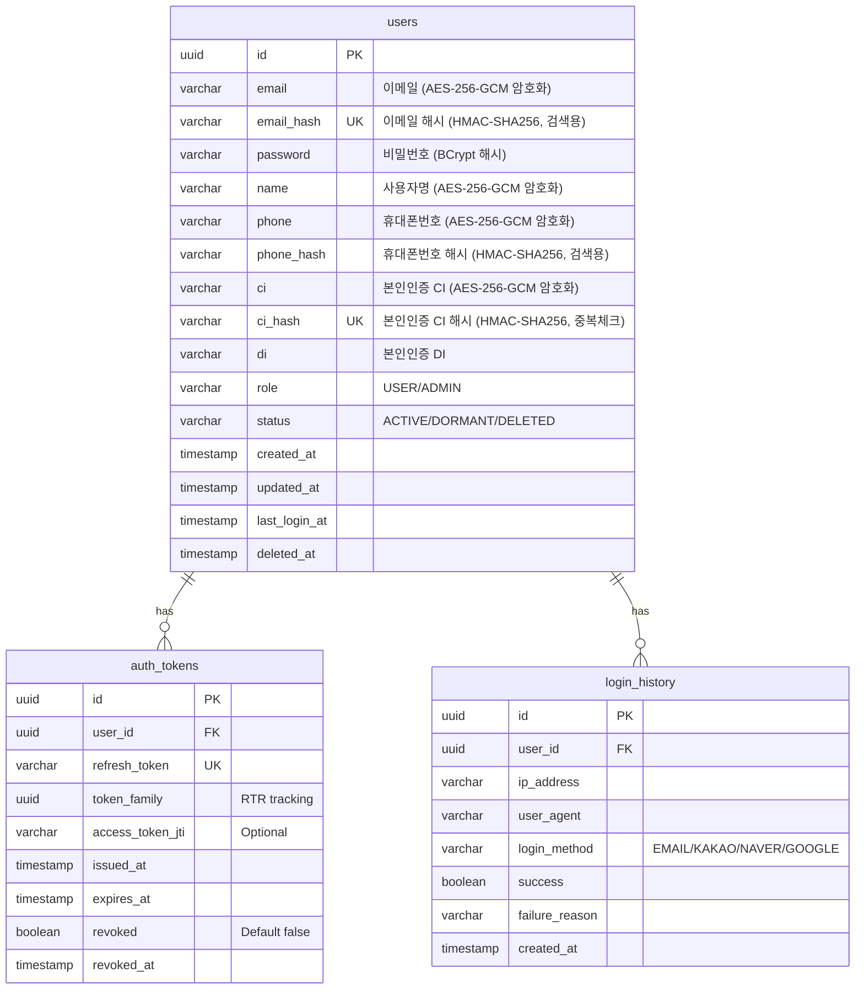
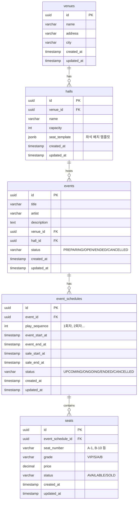
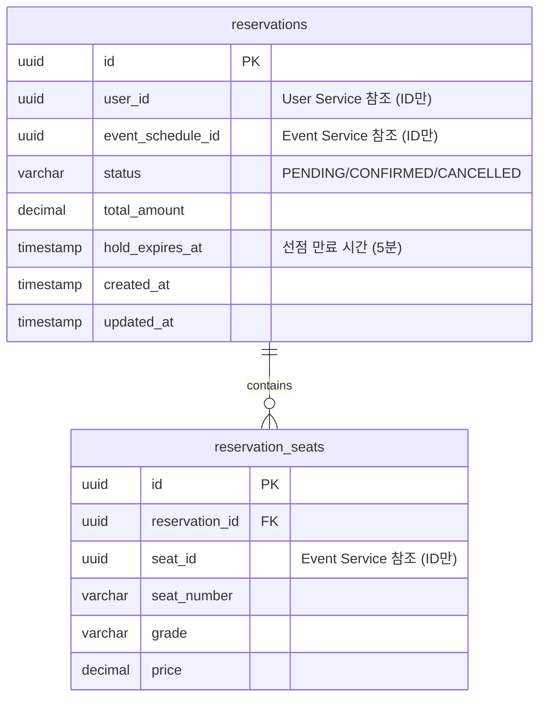
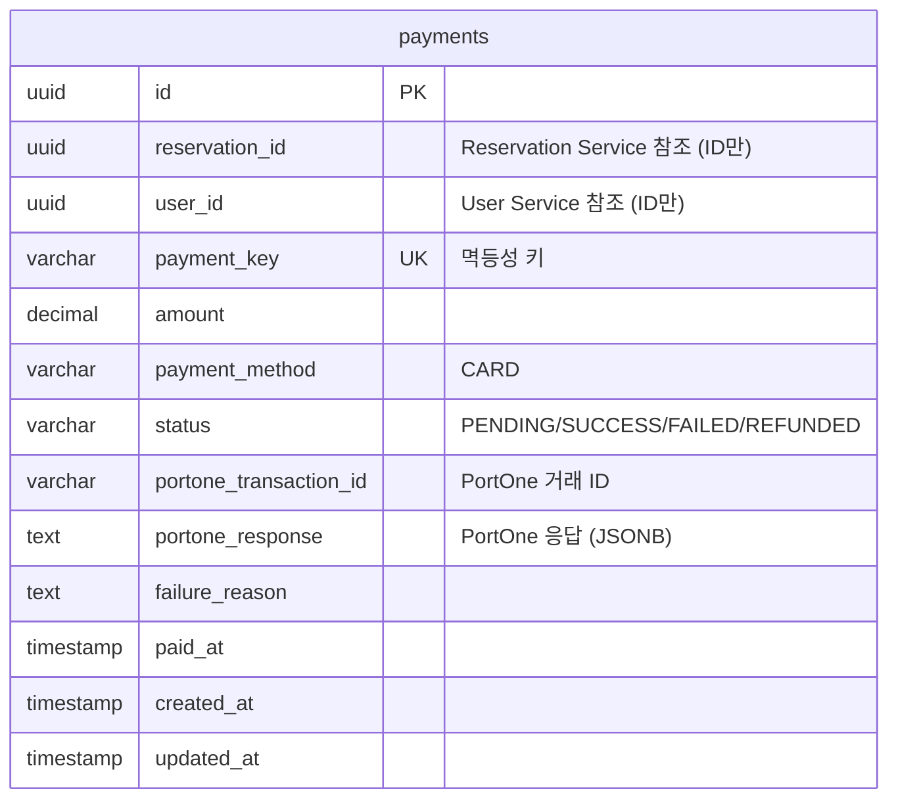
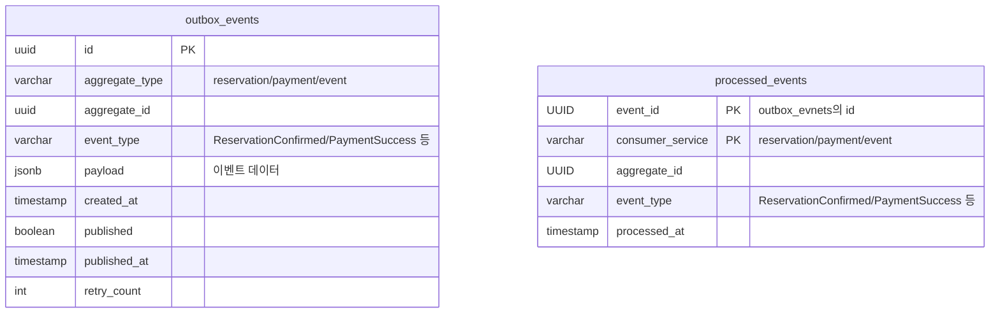

# 데이터 아키텍처

## 목차

- [1. 데이터 아키텍처](#1-데이터-아키텍처)
  - [1.1 데이터베이스 전략](#11-데이터베이스-전략)
    - [1.1.1 PostgreSQL 18 - 논리적 DB per Service + 물리적 통합](#111-postgresql-18---논리적-db-per-service--물리적-통합)
    - [1.1.2 스키마별 DB 사용자 및 권한](#112-스키마별-db-사용자-및-권한)
  - [1.2 ERD (Entity Relationship Diagram)](#12-erd-entity-relationship-diagram)
    - [1.2.1 User Service 스키마 ERD](#121-user-service-스키마-erd)
    - [1.2.2 Event Service 스키마 ERD](#122-event-service-스키마-erd)
    - [1.2.3 Reservation Service 스키마 ERD](#123-reservation-service-스키마-erd)
    - [1.2.4 Payment Service 스키마 ERD](#124-payment-service-스키마-erd)
    - [1.2.5 공통 스키마 (Transactional Outbox)](#125-공통-스키마-transactional-outbox)
  - [1.3 Redis 아키텍처](#13-redis-아키텍처)
    - [1.3.1 Redis 인스턴스 구성](#131-redis-인스턴스-구성)
    - [1.3.2 Redis 데이터 모델 설계](#132-redis-데이터-모델-설계)
    - [1.3.3 대기열 (Queue Service)](#133-대기열-queue-service)
    - [1.3.4 좌석 선점 (Reservation Service)](#134-좌석-선점-reservation-service)
    - [1.3.5 토큰 블랙리스트 (User Service)](#135-토큰-블랙리스트-user-service)
    - [1.3.6 캐싱 (Event Service)](#136-캐싱-event-service)
    - [1.3.7 API Rate Limiting (Gateway)](#137-api-rate-limiting-gateway)
    - [1.3.8 TTL 전략](#138-ttl-전략)
---

## 1. 데이터 아키텍처

### 1.1 데이터베이스 전략

#### 1.1.1 PostgreSQL 18 - 논리적 DB per Service + 물리적 통합

**선택 이유:**
- **비용 효율성**: 단일 RDS 인스턴스로 모든 서비스 지원 (무료티어 활용)
- **MSA 원칙 준수**: 스키마 분리로 서비스별 데이터 격리
- **확장 가능성**: 향후 트래픽 증가 시 물리적 분리 마이그레이션 용이
- **PostgreSQL 18 장점**: 성능 개선, JSON 처리 최적화, 파티셔닝 강화

**아키텍처 원칙:**
```
단일 PostgreSQL 인스턴스
├── user_service 스키마 (User Service 전용)
├── event_service 스키마 (Event Service 전용)
├── reservation_service 스키마 (Reservation Service 전용)
├── payment_service 스키마 (Payment Service 전용)
└── common 스키마 (공통: outbox_events)
```

**서비스 간 데이터 접근 제한:**
- 각 서비스는 자신의 스키마만 접근 가능 (DB 사용자 권한 분리)
- 서비스 간 데이터 필요 시 REST API 또는 Kafka 이벤트로만 통신
- **금지**: 서비스 A가 서비스 B의 스키마에 직접 쿼리

#### 1.1.2 스키마별 DB 사용자 및 권한

**사용자 생성 및 권한 부여:**
```sql
-- User Service 전용 사용자
CREATE USER user_svc_user WITH PASSWORD 'user_strong_password_here';
GRANT USAGE ON SCHEMA user_service TO user_svc_user;
GRANT ALL PRIVILEGES ON ALL TABLES IN SCHEMA user_service TO user_svc_user;
GRANT ALL PRIVILEGES ON ALL SEQUENCES IN SCHEMA user_service TO user_svc_user;
ALTER DEFAULT PRIVILEGES IN SCHEMA user_service GRANT ALL ON TABLES TO user_svc_user;

-- Event Service 전용 사용자
CREATE USER event_svc_user WITH PASSWORD 'event_strong_password_here';
GRANT USAGE ON SCHEMA event_service TO event_svc_user;
GRANT ALL PRIVILEGES ON ALL TABLES IN SCHEMA event_service TO event_svc_user;
GRANT ALL PRIVILEGES ON ALL SEQUENCES IN SCHEMA event_service TO event_svc_user;
ALTER DEFAULT PRIVILEGES IN SCHEMA event_service GRANT ALL ON TABLES TO event_svc_user;

-- Reservation Service 전용 사용자
CREATE USER reservation_svc_user WITH PASSWORD 'reservation_strong_password_here';
GRANT USAGE ON SCHEMA reservation_service TO reservation_svc_user;
GRANT ALL PRIVILEGES ON ALL TABLES IN SCHEMA reservation_service TO reservation_svc_user;
GRANT ALL PRIVILEGES ON ALL SEQUENCES IN SCHEMA reservation_service TO reservation_svc_user;
ALTER DEFAULT PRIVILEGES IN SCHEMA reservation_service GRANT ALL ON TABLES TO reservation_svc_user;

-- Payment Service 전용 사용자
CREATE USER payment_svc_user WITH PASSWORD 'payment_strong_password_here';
GRANT USAGE ON SCHEMA payment_service TO payment_svc_user;
GRANT ALL PRIVILEGES ON ALL TABLES IN SCHEMA payment_service TO payment_svc_user;
GRANT ALL PRIVILEGES ON ALL SEQUENCES IN SCHEMA payment_service TO payment_svc_user;
ALTER DEFAULT PRIVILEGES IN SCHEMA payment_service GRANT ALL ON TABLES TO payment_svc_user;

-- 모든 서비스가 common 스키마 접근 (Outbox)
GRANT USAGE ON SCHEMA common TO user_svc_user, event_svc_user, reservation_svc_user, payment_svc_user;
GRANT ALL PRIVILEGES ON ALL TABLES IN SCHEMA common TO user_svc_user, event_svc_user, reservation_svc_user, payment_svc_user;
```

**Spring Boot application.yml HikariCP 설정:**
- 6개 서비스 × 5 connections = 30개 (RDS t2.micro 무료티어 제한 고려)
- Auto Scaling 시 커넥션 고갈 방지
- 커넥션 누수 감지로 장기 트랜잭션 모니터링

### 1.2 ERD (Entity Relationship Diagram)

#### 1.2.1 User Service 스키마 ERD

**스키마: `user_service`**



**주요 테이블 설명:**

**`users` 테이블:**
- **id**: UUID Primary Key
- **email**: 이메일 원본 (AES-256-GCM 암호화)
- **email_hash**: 이메일 검색용 해시 (HMAC-SHA256, Unique)
- **password_hash**: 비밀번호 BCrypt 해시
- **name, phone**: 개인정보 (AES-256-GCM 암호화)
- **phone_hash**: 휴대폰번호 검색용 해시 (HMAC-SHA256)
- **ci**: 본인인증 CI (AES-256-GCM 암호화)
- **ci_hash**: CI 중복체크용 해시 (HMAC-SHA256, Unique)
- **di**: 본인인증 DI
- **role**: USER / ADMIN
- **status**: ACTIVE / DORMANT (휴면) / DELETED (탈퇴)
- **관련 요구사항**: REQ-AUTH-001, REQ-AUTH-014, REQ-AUTH-017, REQ-AUTH-018

**SQL Schema:**
```sql
-- 스키마 및 확장 생성
CREATE SCHEMA IF NOT EXISTS user_service;
CREATE EXTENSION IF NOT EXISTS "uuid-ossp";

-- users 테이블
CREATE TABLE user_service.users (
    id UUID PRIMARY KEY DEFAULT gen_random_uuid(),
    email VARCHAR(255) NOT NULL UNIQUE,     -- 평문 저장 (포트폴리오 범위)
    password_hash VARCHAR(255) NOT NULL,    -- BCrypt 해시
    name VARCHAR(255),
    phone VARCHAR(50),
    ci VARCHAR(512) UNIQUE,                 -- PortOne 본인인증 CI (Unique)
    di VARCHAR(64),                         -- PortOne DI
    role VARCHAR(10) NOT NULL DEFAULT 'USER',
    status VARCHAR(20) NOT NULL DEFAULT 'ACTIVE',
    created_at TIMESTAMP NOT NULL DEFAULT now(),
    updated_at TIMESTAMP NOT NULL DEFAULT now(),
    last_login_at TIMESTAMP,
    deleted_at TIMESTAMP,

    CONSTRAINT chk_users_role CHECK (role IN ('USER', 'ADMIN')),
    CONSTRAINT chk_users_status CHECK (status IN ('ACTIVE', 'DORMANT', 'DELETED'))
);

-- 인덱스
-- 이메일, CI는 Unique 제약조건으로 자동 인덱스 생성됨
CREATE INDEX idx_users_status_created ON user_service.users(status, created_at);
CREATE INDEX idx_users_last_login ON user_service.users(last_login_at) WHERE status = 'ACTIVE';

-- updated_at 자동 업데이트 트리거
CREATE OR REPLACE FUNCTION user_service.update_timestamp()
RETURNS TRIGGER AS $$
BEGIN
    NEW.updated_at = now();
    RETURN NEW;
END;
$$ LANGUAGE plpgsql;

CREATE TRIGGER trg_users_updated_at
BEFORE UPDATE ON user_service.users
FOR EACH ROW EXECUTE FUNCTION user_service.update_timestamp();

-- 테이블 코멘트
COMMENT ON TABLE user_service.users IS '회원 정보. Soft Delete 방식 사용 (deleted_at).';
COMMENT ON COLUMN user_service.users.ci IS 'PortOne 본인인증 CI. 1인 1계정 강제용 (Unique).';
COMMENT ON COLUMN user_service.users.email IS '이메일. 포트폴리오용으로 평문 저장.';
```

**데이터 보안 전략 (포트폴리오 범위):**
- **비밀번호**: BCrypt 단방향 해시 필수 적용.
- **개인정보**: 실제 상용 서비스에서는 AES-256 등의 컬럼 암호화나 RDS TDE가 필요하지만, 본 프로젝트에서는 아키텍처 검증에 집중하기 위해 **평문 저장**을 원칙으로 합니다.
- **접근 제어**: DB 접근은 내부망(Docker Network)으로 제한됩니다.

**`auth_tokens` 테이블:**
- **refresh_token**: Refresh Token (Unique, 7일 TTL)
- **token_family**: RTR (Refresh Token Rotation) 추적용 UUID - 로그인마다 발급됨
- **access_token_jti**: Access Token의 JTI (JWT ID) - 선택적 추적
- **issued_at**: 토큰 발급 시각
- **revoked**: 폐기 여부 (기본 false, 로그아웃 또는 RTR 시 true로 변경)
- **revoked_at**: 폐기 시각 (탈취 감지 시 token_family 전체 무효화)
- **Refresh Token Rotation (RTR) 필수 구현**
  - 매 토큰 갱신 시 신규 Refresh Token 발급 및 기존 토큰 폐기
  - 폐기된 토큰 재사용 시 해당 token_family 전체 무효화 (보안 강화)
- **관련 요구사항**: REQ-AUTH-009 (토큰 갱신), REQ-AUTH-012 (RTR)

**SQL Schema:**
```sql
-- auth_tokens 테이블
CREATE TABLE user_service.auth_tokens (
    id UUID PRIMARY KEY DEFAULT gen_random_uuid(),
    user_id UUID NOT NULL REFERENCES user_service.users(id) ON DELETE CASCADE,
    refresh_token VARCHAR(500) NOT NULL UNIQUE,
    token_family UUID NOT NULL,
    access_token_jti VARCHAR(100),
    issued_at TIMESTAMP NOT NULL DEFAULT now(),
    expires_at TIMESTAMP NOT NULL,
    revoked BOOLEAN DEFAULT false,
    revoked_at TIMESTAMP,

    CONSTRAINT chk_tokens_expires CHECK (expires_at > issued_at),
    CONSTRAINT chk_tokens_revoked CHECK (
        (revoked = false AND revoked_at IS NULL) OR
        (revoked = true AND revoked_at IS NOT NULL)
    )
);

-- 인덱스
CREATE INDEX idx_auth_tokens_user_revoked ON user_service.auth_tokens(user_id, revoked) WHERE revoked = false;
CREATE INDEX idx_auth_tokens_family ON user_service.auth_tokens(token_family);
CREATE INDEX idx_auth_tokens_expires ON user_service.auth_tokens(expires_at) WHERE revoked = false;

-- 테이블 코멘트
COMMENT ON TABLE user_service.auth_tokens IS 'Refresh Token 관리. RTR (Refresh Token Rotation) 지원.';
COMMENT ON COLUMN user_service.auth_tokens.token_family IS 'RTR 추적용 UUID. 동일 세션 토큰 그룹핑.';
```

**`login_history` 테이블 (선택):**
- 로그인 이력 추적
- 의심 접속 탐지용
- **관련 요구사항**: REQ-AUTH-020

**SQL Schema:**
```sql
-- login_history 테이블
CREATE TABLE user_service.login_history (
    id UUID PRIMARY KEY DEFAULT gen_random_uuid(),
    user_id UUID NOT NULL REFERENCES user_service.users(id) ON DELETE CASCADE,
    ip_address VARCHAR(45),  -- IPv6 지원 (최대 45자)
    user_agent TEXT,
    login_method VARCHAR(20) NOT NULL,
    success BOOLEAN NOT NULL,
    failure_reason VARCHAR(100),
    created_at TIMESTAMP NOT NULL DEFAULT now(),

    CONSTRAINT chk_login_method CHECK (login_method IN ('EMAIL', 'KAKAO', 'NAVER', 'GOOGLE'))
);

-- 인덱스
CREATE INDEX idx_login_history_user_created ON user_service.login_history(user_id, created_at DESC);
CREATE INDEX idx_login_history_ip ON user_service.login_history(ip_address, created_at DESC);
CREATE INDEX idx_login_history_created ON user_service.login_history(created_at DESC);

-- 테이블 코멘트
COMMENT ON TABLE user_service.login_history IS '로그인 이력. 의심 접속 탐지 및 보안 감사용.';

-- 파티셔닝 고려 (대용량 데이터 시)
COMMENT ON TABLE user_service.login_history IS '파티셔닝 고려: 월별 파티셔닝 (created_at 기준). 예: login_history_2026_01';
```

#### 1.2.2 Event Service 스키마 ERD

**스키마: `event_service`**



**트리거 함수:**
- `event_service.update_timestamp()`: 테이블 업데이트 시 `updated_at` 자동 갱신
- 스코프: Event Service 스키마 내에서만 사용 (MSA 원칙)

**주요 테이블 설명:**

**`venues` 테이블:**
- 공연장 정보
- **관련 요구사항**: REQ-EVT-010

**SQL Schema:**
```sql
-- 스키마 생성
CREATE SCHEMA IF NOT EXISTS event_service;

-- updated_at 자동 업데이트 트리거 함수 (Event Service 전용)
CREATE OR REPLACE FUNCTION event_service.update_timestamp()
RETURNS TRIGGER AS $$
BEGIN
    NEW.updated_at = now();
    RETURN NEW;
END;
$$ LANGUAGE plpgsql;

-- venues 테이블
CREATE TABLE event_service.venues (
    id UUID PRIMARY KEY DEFAULT gen_random_uuid(),
    name VARCHAR(200) NOT NULL,
    address TEXT NOT NULL,
    city VARCHAR(100),
    created_at TIMESTAMP NOT NULL DEFAULT now(),
    updated_at TIMESTAMP NOT NULL DEFAULT now()
);

-- 인덱스
CREATE INDEX idx_venues_city ON event_service.venues(city);
CREATE INDEX idx_venues_name ON event_service.venues(name);

-- updated_at 트리거
CREATE TRIGGER trg_venues_updated_at
BEFORE UPDATE ON event_service.venues
FOR EACH ROW EXECUTE FUNCTION event_service.update_timestamp();

-- 테이블 코멘트
COMMENT ON TABLE event_service.venues IS '공연장 정보. 위치 기반 검색 지원.';
```

**`halls` 테이블:**
- 공연장 내 홀 정보
- **seat_template (JSONB)**: 좌석 배치 템플릿 (행/열, 등급 매핑)
  ```json
  {
    "rows": ["A", "B", "C"],
    "seatsPerRow": 20,
    "gradeMapping": {
      "A": "VIP",
      "B": "S",
      "C": "A"
    }
  }
  ```
- **관련 요구사항**: REQ-EVT-013


**향후 개선 방향 (트래픽 안정화 후 검토):**

현재 `seat_template` JSONB 설계는 단순 공연장에 적합하나, 복잡한 좌석 배치(스탠딩, VIP 라운지, 장애인석 등)에는 한계가 있음.

**현재 제약사항:**
- 균일한 행/열 구조만 지원 (불규칙 배치 불가)
- 등급별 가격 차등이 행 단위로만 가능
- 좌석 예외 처리 어려움 (기둥, 시야 제한석 등)

1. **좌석 배치 정규화 (별도 테이블)**
```sql
CREATE TABLE event_service.seat_layouts (
    id UUID PRIMARY KEY,
    hall_id UUID NOT NULL REFERENCES halls(id),
    row_label VARCHAR(5) NOT NULL,
    seat_number INT NOT NULL,
    x_position INT,  -- 시각적 배치 좌표
    y_position INT,
    grade VARCHAR(10),
    accessible BOOLEAN DEFAULT false,  -- 장애인석
    view_restricted BOOLEAN DEFAULT false,
    UNIQUE (hall_id, row_label, seat_number)
);
```

2. **또는 더 유연한 JSONB 스키마**
```json
{
  "layout_type": "grid",  // or "irregular"
  "sections": [
    {
      "name": "VIP",
      "seats": [
        {"row": "A", "number": 1, "x": 100, "y": 50, "accessible": false}
      ]
    }
  ]
}
```

**SQL Schema:**
```sql
-- halls 테이블
CREATE TABLE event_service.halls (
    id UUID PRIMARY KEY DEFAULT gen_random_uuid(),
    venue_id UUID NOT NULL REFERENCES event_service.venues(id) ON DELETE RESTRICT,
    name VARCHAR(200) NOT NULL,
    capacity INT NOT NULL,
    seat_template JSONB NOT NULL,
    created_at TIMESTAMP NOT NULL DEFAULT now(),
    updated_at TIMESTAMP NOT NULL DEFAULT now(),

    CONSTRAINT chk_halls_capacity CHECK (capacity > 0),
    CONSTRAINT uk_halls_venue_name UNIQUE (venue_id, name)
);

-- 인덱스
CREATE INDEX idx_halls_venue ON event_service.halls(venue_id);
CREATE INDEX idx_halls_seat_template ON event_service.halls USING GIN (seat_template);

-- updated_at 트리거
CREATE TRIGGER trg_halls_updated_at
BEFORE UPDATE ON event_service.halls
FOR EACH ROW EXECUTE FUNCTION event_service.update_timestamp();

-- 테이블 코멘트
COMMENT ON TABLE event_service.halls IS '공연장 홀 정보. JSONB 좌석 템플릿 사용.';
COMMENT ON COLUMN event_service.halls.seat_template IS '좌석 배치 템플릿: {"rows": ["A","B"], "seatsPerRow": 20, "gradeMapping": {"A": "VIP"}}';
```

**`events` 테이블:**
- 공연 메타 정보 (일정 제외)
- **status**: 공연 전체 생명주기 관리 (PREPARING, OPEN, ENDED, CANCELLED)
- **관련 요구사항**: REQ-EVT-001, REQ-EVT-007

**SQL Schema:**
```sql
-- events 테이블
CREATE TABLE event_service.events (
    id UUID PRIMARY KEY DEFAULT gen_random_uuid(),
    title VARCHAR(300) NOT NULL,
    artist VARCHAR(200) NOT NULL,
    description TEXT,
    venue_id UUID NOT NULL REFERENCES event_service.venues(id) ON DELETE RESTRICT,
    hall_id UUID NOT NULL REFERENCES event_service.halls(id) ON DELETE RESTRICT,
    status VARCHAR(20) NOT NULL DEFAULT 'PREPARING',
    created_at TIMESTAMP NOT NULL DEFAULT now(),
    updated_at TIMESTAMP NOT NULL DEFAULT now(),

    CONSTRAINT chk_events_status CHECK (status IN ('PREPARING', 'OPEN', 'ENDED', 'CANCELLED'))
);

-- 인덱스
CREATE INDEX idx_events_status ON event_service.events(status);
CREATE INDEX idx_events_artist ON event_service.events(artist);
CREATE INDEX idx_events_venue ON event_service.events(venue_id);

-- 전문 검색 인덱스 (선택)
CREATE INDEX idx_events_fts ON event_service.events
    USING gin(to_tsvector('korean', title || ' ' || artist));

-- updated_at 트리거
CREATE TRIGGER trg_events_updated_at
BEFORE UPDATE ON event_service.events
FOR EACH ROW EXECUTE FUNCTION event_service.update_timestamp();

-- 테이블 코멘트
COMMENT ON TABLE event_service.events IS '공연 메타 정보. status는 공연 전체의 생명주기(노출 여부 등)를 관리.';
COMMENT ON COLUMN event_service.events.status IS 'PREPARING: 준비중(미노출), OPEN: 공개됨, ENDED: 전체 종료, CANCELLED: 전체 취소';
```

**`event_schedules` 테이블:**
- 공연 회차 및 일정 정보
- **play_sequence**: 1회차, 2회차 등 순번
- **status**: 회차별 판매/진행 상태
- **관련 요구사항**: REQ-EVT-001, REQ-EVT-007

**SQL Schema:**
```sql
-- event_schedules 테이블
CREATE TABLE event_service.event_schedules (
    id UUID PRIMARY KEY DEFAULT gen_random_uuid(),
    event_id UUID NOT NULL REFERENCES event_service.events(id) ON DELETE CASCADE,
    play_sequence INT NOT NULL DEFAULT 1,
    event_start_at TIMESTAMP NOT NULL,
    event_end_at TIMESTAMP NOT NULL,
    sale_start_at TIMESTAMP NOT NULL,
    sale_end_at TIMESTAMP NOT NULL,
    status VARCHAR(20) NOT NULL DEFAULT 'UPCOMING',
    created_at TIMESTAMP NOT NULL DEFAULT now(),
    updated_at TIMESTAMP NOT NULL DEFAULT now(),

    CONSTRAINT chk_schedules_status CHECK (status IN ('UPCOMING', 'ONGOING', 'ENDED', 'CANCELLED')),
    CONSTRAINT chk_schedules_time CHECK (event_start_at < event_end_at),
    CONSTRAINT chk_schedules_sale_time CHECK (sale_start_at < sale_end_at),
    CONSTRAINT uk_schedules_event_seq UNIQUE (event_id, play_sequence)
);

-- 인덱스
CREATE INDEX idx_schedules_status_sale_start ON event_service.event_schedules(status, sale_start_at);
CREATE INDEX idx_schedules_event_date ON event_service.event_schedules(event_id, event_start_at);
CREATE INDEX idx_schedules_sale_start ON event_service.event_schedules(sale_start_at) WHERE status = 'UPCOMING';

-- updated_at 트리거
CREATE TRIGGER trg_schedules_updated_at
BEFORE UPDATE ON event_service.event_schedules
FOR EACH ROW EXECUTE FUNCTION event_service.update_timestamp();

-- 테이블 코멘트
COMMENT ON TABLE event_service.event_schedules IS '공연 회차 및 판매 일정 정보. status는 회차별 티켓 판매 상태 관리.';
COMMENT ON COLUMN event_service.event_schedules.status IS 'UPCOMING: 판매 전, ONGOING: 판매 중, ENDED: 종료, CANCELLED: 취소';
```

**`seats` 테이블:**
- 회차별 좌석 정보
- **event_schedule_id**: 회차 ID 참조
- **status**: AVAILABLE / SOLD (HOLD는 Redis로 관리)
- **인덱스**: `idx_seats_schedule_status (event_schedule_id, status)`
- **관련 요구사항**: REQ-EVT-008, REQ-EVT-019

**SQL Schema:**
```sql
-- seats 테이블
CREATE TABLE event_service.seats (
    id UUID PRIMARY KEY DEFAULT gen_random_uuid(),
    event_schedule_id UUID NOT NULL REFERENCES event_service.event_schedules(id) ON DELETE CASCADE,
    seat_number VARCHAR(10) NOT NULL,  -- "A-1", "B-10" 등
    grade VARCHAR(10) NOT NULL,
    price DECIMAL(10, 0) NOT NULL,
    status VARCHAR(20) NOT NULL DEFAULT 'AVAILABLE',
    created_at TIMESTAMP NOT NULL DEFAULT now(),
    updated_at TIMESTAMP NOT NULL DEFAULT now(),

    CONSTRAINT chk_seats_grade CHECK (grade IN ('VIP', 'S', 'A', 'B')),
    CONSTRAINT chk_seats_status CHECK (status IN ('AVAILABLE', 'SOLD')),
    CONSTRAINT chk_seats_price CHECK (price >= 0),
    CONSTRAINT uk_seats_schedule_number UNIQUE (event_schedule_id, seat_number)
);

-- 핵심 인덱스 (조회 성능 최적화)
CREATE INDEX idx_seats_schedule_status ON event_service.seats(event_schedule_id, status);
CREATE INDEX idx_seats_grade_price ON event_service.seats(grade, price);

-- updated_at 트리거
CREATE TRIGGER trg_seats_updated_at
BEFORE UPDATE ON event_service.seats
FOR EACH ROW EXECUTE FUNCTION event_service.update_timestamp();

-- 테이블 코멘트
COMMENT ON TABLE event_service.seats IS '회차별 좌석 재고. HOLD 상태는 Redis로 관리 (seat:hold:{scheduleId}:{seatId}).';
COMMENT ON TABLE event_service.seats IS '파티셔닝 고려: event_schedule_id 기준 파티셔닝 검토.';
```

#### 1.2.3 Reservation Service 스키마 ERD

**스키마: `reservation_service`**



**트리거 함수:**
- `reservation_service.update_timestamp()`: 테이블 업데이트 시 `updated_at` 자동 갱신
- 스코프: Reservation Service 스키마 내에서만 사용 (MSA 원칙)

**주요 테이블 설명:**

**`reservations` 테이블:**
- 예매 정보
- **event_schedule_id**: 회차 ID (FK 없음, MSA 원칙)
- **status**:
  - PENDING: 좌석 선점 완료, 결제 대기
  - CONFIRMED: 결제 완료, 예매 확정
  - CANCELLED: 예매 취소
- **hold_expires_at**: 선점 만료 시간 (현재 시간 + 5분)
- **user_id, event_schedule_id**: 다른 서비스의 ID만 참조 (FK 없음, MSA 원칙)
- **관련 요구사항**: REQ-RSV-001, REQ-RSV-004, REQ-RSV-006

**SQL Schema:**
```sql
-- 스키마 생성
CREATE SCHEMA IF NOT EXISTS reservation_service;

-- updated_at 자동 업데이트 트리거 함수 (Reservation Service 전용)
CREATE OR REPLACE FUNCTION reservation_service.update_timestamp()
RETURNS TRIGGER AS $$
BEGIN
    NEW.updated_at = now();
    RETURN NEW;
END;
$$ LANGUAGE plpgsql;

-- reservations 테이블
CREATE TABLE reservation_service.reservations (
    id UUID PRIMARY KEY DEFAULT gen_random_uuid(),
    user_id UUID NOT NULL,  -- FK 없음 (MSA 원칙)
    event_schedule_id UUID NOT NULL,  -- FK 없음 (회차 ID)
    status VARCHAR(20) NOT NULL DEFAULT 'PENDING',
    total_amount DECIMAL(10, 0) NOT NULL,
    hold_expires_at TIMESTAMP NOT NULL,
    created_at TIMESTAMP NOT NULL DEFAULT now(),
    updated_at TIMESTAMP NOT NULL DEFAULT now(),

    CONSTRAINT chk_reservations_status CHECK (status IN ('PENDING', 'CONFIRMED', 'CANCELLED')),
    CONSTRAINT chk_reservations_amount CHECK (total_amount >= 0)
);

-- 인덱스
CREATE INDEX idx_reservations_user_status ON reservation_service.reservations(user_id, status);
CREATE INDEX idx_reservations_schedule_created ON reservation_service.reservations(event_schedule_id, created_at DESC);
CREATE INDEX idx_reservations_hold_expires ON reservation_service.reservations(hold_expires_at)
    WHERE status = 'PENDING';  -- 부분 인덱스 (만료 처리용)
CREATE INDEX idx_reservations_status_created ON reservation_service.reservations(status, created_at DESC);

-- updated_at 트리거
CREATE TRIGGER trg_reservations_updated_at
BEFORE UPDATE ON reservation_service.reservations
FOR EACH ROW EXECUTE FUNCTION reservation_service.update_timestamp();

-- 테이블 코멘트
COMMENT ON TABLE reservation_service.reservations IS '예매 정보. event_schedule_id는 회차 ID.';
COMMENT ON COLUMN reservation_service.reservations.hold_expires_at IS '선점 만료 시간 (현재 + 5분). 배치 작업으로 자동 취소.';
```

**만료 예매 자동 취소 배치:**
- Spring schedular 사용
- **실행 주기**: 1분마다
- **SQL**:
  ```sql
  UPDATE reservation_service.reservations
  SET status = 'CANCELLED', updated_at = now()
  WHERE status = 'PENDING' AND hold_expires_at < now()
  RETURNING id;  -- 취소된 ID 반환 → ReservationCancelled 이벤트 발행
  ```
- **Outbox 발행**: ReservationCancelled 이벤트 (seat 해제 트리거)

**`reservation_seats` 테이블:**
- 예매에 포함된 좌석 목록 (1회 최대 4장)
- 좌석 정보 스냅샷 (seat_number, grade, price) - 공연 정보 변경에도 예매 정보 유지
- **관련 요구사항**: REQ-RSV-005

**SQL Schema:**
```sql
-- reservation_seats 테이블
CREATE TABLE reservation_service.reservation_seats (
    id UUID PRIMARY KEY DEFAULT gen_random_uuid(),
    reservation_id UUID NOT NULL REFERENCES reservation_service.reservations(id) ON DELETE CASCADE,
    seat_id UUID NOT NULL,  -- Event Service 참조 (FK 없음)
    seat_number VARCHAR(10) NOT NULL,  -- 스냅샷
    grade VARCHAR(10) NOT NULL,  -- 스냅샷
    price DECIMAL(10, 0) NOT NULL,  -- 스냅샷

    CONSTRAINT chk_reservation_seats_price CHECK (price >= 0)
);

-- 인덱스
CREATE INDEX idx_reservation_seats_reservation ON reservation_service.reservation_seats(reservation_id);
CREATE INDEX idx_reservation_seats_seat ON reservation_service.reservation_seats(seat_id);

-- 테이블 코멘트
COMMENT ON TABLE reservation_service.reservation_seats IS '예매 좌석 스냅샷. 공연 정보 변경 시에도 예매 정보 유지.';
```

#### 1.2.4 Payment Service 스키마 ERD

**스키마: `payment_service`**



**트리거 함수:**
- `payment_service.update_timestamp()`: 테이블 업데이트 시 `updated_at` 자동 갱신
- 스코프: Payment Service 스키마 내에서만 사용 (MSA 원칙)

**주요 테이블 설명:**

**`payments` 테이블:**
- 결제 정보
- **payment_key**: 멱등성 키 (클라이언트 생성, Unique)
- **status**:
  - PENDING: 결제 요청 중
  - SUCCESS: 결제 성공
  - FAILED: 결제 실패
  - REFUNDED: 환불 완료
- **portone_transaction_id**: PortOne 거래 ID (결제 조회/취소용)
- **portone_response**: PortOne API 응답 전체 (JSONB, 디버깅/감사용)
- **관련 요구사항**: REQ-PAY-001, REQ-PAY-003, REQ-PAY-004, REQ-PAY-006

**SQL Schema:**
```sql
-- 스키마 생성
CREATE SCHEMA IF NOT EXISTS payment_service;

-- updated_at 자동 업데이트 트리거 함수 (Payment Service 전용)
CREATE OR REPLACE FUNCTION payment_service.update_timestamp()
RETURNS TRIGGER AS $$
BEGIN
    NEW.updated_at = now();
    RETURN NEW;
END;
$$ LANGUAGE plpgsql;

-- payments 테이블
CREATE TABLE payment_service.payments (
    id UUID PRIMARY KEY DEFAULT gen_random_uuid(),
    reservation_id UUID NOT NULL,  -- FK 없음 (MSA 원칙)
    user_id UUID NOT NULL,  -- FK 없음
    payment_key VARCHAR(200) NOT NULL UNIQUE,  -- 멱등성 키
    amount DECIMAL(10, 0) NOT NULL,
    payment_method VARCHAR(20) NOT NULL DEFAULT 'CARD',
    status VARCHAR(20) NOT NULL DEFAULT 'PENDING',
    portone_transaction_id VARCHAR(100),
    portone_response JSONB,
    failure_reason TEXT,
    paid_at TIMESTAMP,
    created_at TIMESTAMP NOT NULL DEFAULT now(),
    updated_at TIMESTAMP NOT NULL DEFAULT now(),

    CONSTRAINT chk_payments_status CHECK (status IN ('PENDING', 'SUCCESS', 'FAILED', 'REFUNDED')),
    CONSTRAINT chk_payments_amount CHECK (amount >= 0),
    CONSTRAINT chk_payments_method CHECK (payment_method IN ('CARD'))
);

-- 인덱스
CREATE UNIQUE INDEX idx_payments_payment_key ON payment_service.payments(payment_key);
CREATE INDEX idx_payments_reservation ON payment_service.payments(reservation_id);
CREATE INDEX idx_payments_user_created ON payment_service.payments(user_id, created_at DESC);
CREATE INDEX idx_payments_status_created ON payment_service.payments(status, created_at DESC);
CREATE INDEX idx_payments_portone_response ON payment_service.payments USING GIN (portone_response);

-- updated_at 트리거
CREATE TRIGGER trg_payments_updated_at
BEFORE UPDATE ON payment_service.payments
FOR EACH ROW EXECUTE FUNCTION payment_service.update_timestamp();

-- 테이블 코멘트
COMMENT ON TABLE payment_service.payments IS '결제 정보. payment_key로 멱등성 보장.';
COMMENT ON COLUMN payment_service.payments.payment_key IS '클라이언트 생성 멱등성 키. 중복 결제 방지.';
COMMENT ON COLUMN payment_service.payments.portone_response IS 'PortOne API 응답 전체 (JSONB). 디버깅 및 감사용.';
```

**PortOne 응답 저장 전략:**
- **보관 기간**: 7년 (금융 거래 기록 보관 의무)
- **JSONB 저장**: 전체 API 응답 저장 (감사 추적, 분쟁 해결)
- **쿼리 예시**:
  ```sql
  -- PortOne transaction_id 조회
  SELECT portone_response->>'transactionId' AS transaction_id
  FROM payment_service.payments
  WHERE id = :payment_id;

  -- 특정 응답 코드 검색
  SELECT * FROM payment_service.payments
  WHERE portone_response->>'code' = 'INSUFFICIENT_FUNDS';
  ```

#### 1.2.5 공통 스키마 (Transactional Outbox)

**스키마: `common`**



**주요 테이블 설명:**

**`outbox_events` 테이블:**
- Transactional Outbox 패턴 구현
- 비즈니스 로직과 동일 트랜잭션 내 INSERT
- Poller가 주기적으로 읽어 Kafka 발행 (여유가 있을 경우 Debezium(CDC)으로 개발)
- **aggregate_type**: 이벤트 발행 주체 (Reservation, Payment, Event)
- **aggregate_id**: 이벤트 발행 대상 ID
- **event_type**: 이벤트 타입 (ReservationConfirmed, PaymentSuccess, PaymentFailed 등)
- **payload (JSONB)**: 이벤트 데이터
  ```json
  {
    "reservationId": "uuid",
    "userId": "uuid",
    "eventScheduleId": "uuid",
    "seatIds": ["uuid1", "uuid2"],
    "totalAmount": 100000,
    "confirmedAt": "2026-01-11T10:00:00Z"
  }
  ```
- **published**: Kafka 발행 여부
- **retry_count**: 발행 실패 시 재시도 횟수
- **인덱스**: `idx_outbox_published_created (published, created_at)` - Poller 성능 최적화
- **관련 요구사항**: REQ-RSV-012, REQ-PAY-013

**SQL Schema:**
```sql
-- 스키마 생성
CREATE SCHEMA IF NOT EXISTS common;

-- outbox_events 테이블
CREATE TABLE common.outbox_events (
    id UUID PRIMARY KEY DEFAULT gen_random_uuid(),
    aggregate_type VARCHAR(50) NOT NULL,  -- Reservation, Payment, Event
    aggregate_id UUID NOT NULL,
    event_type VARCHAR(100) NOT NULL,
    payload JSONB NOT NULL,
    created_at TIMESTAMP NOT NULL DEFAULT now(),
    published BOOLEAN DEFAULT false,
    published_at TIMESTAMP,
    retry_count INT DEFAULT 0,
    last_error TEXT,

    CONSTRAINT chk_outbox_retry CHECK (retry_count >= 0 AND retry_count <= 10)
);

-- 성능 최적화 인덱스 (Poller용)
CREATE INDEX idx_outbox_published_created ON common.outbox_events(published, created_at)
    WHERE published = false AND retry_count < 3;
CREATE INDEX idx_outbox_aggregate ON common.outbox_events(aggregate_type, aggregate_id);

-- 테이블 코멘트
COMMENT ON TABLE common.outbox_events IS 'Transactional Outbox 패턴. 이벤트 발행 신뢰성 보장.';
COMMENT ON COLUMN common.outbox_events.payload IS '이벤트 데이터 (JSONB). 예: {"reservationId": "uuid", "userId": "uuid"}';
```

**Outbox 정리 배치 작업:**
- **실행 주기**: 매일 02:00 UTC
- **SQL**:
  ```sql
  -- 발행 완료된 오래된 이벤트 삭제 (7일 보관)
  DELETE FROM common.outbox_events
  WHERE published = true AND published_at < now() - INTERVAL '7 days';
  ```

**`processed_events` 테이블:**
- Kafka Consumer 멱등성 보장
- event_id 중복 시 DataIntegrityViolationException 발생
- **관련 요구사항**: REQ-PAY-004, REQ-PAY-010

**SQL Schema:**
```sql
-- processed_events 테이블
CREATE TABLE common.processed_events (
    event_id UUID NOT NULL,
    consumer_service VARCHAR(50) NOT NULL,  -- 'reservation', 'event', 'payment'
    aggregate_id UUID NOT NULL,
    event_type VARCHAR(100) NOT NULL,
    processed_at TIMESTAMP NOT NULL DEFAULT now(),

    PRIMARY KEY (event_id, consumer_service)
);

-- 인덱스
CREATE INDEX idx_processed_events_aggregate ON common.processed_events(aggregate_id, event_type);
CREATE INDEX idx_processed_events_processed_at ON common.processed_events(processed_at);

-- 테이블 코멘트
COMMENT ON TABLE common.processed_events IS 'Kafka Consumer 멱등성 보장. (event_id, consumer_service) 중복 시 Constraint Violation.';
```

**정리 배치 작업:**
- **실행 주기**: 매일 02:00 UTC
- **SQL**:
  ```sql
  -- 30일 이상 된 처리 기록 삭제
  DELETE FROM common.processed_events
  WHERE processed_at < now() - INTERVAL '30 days';
  ```

### 1.3 Redis 아키텍처

#### 1.3.1 Redis 인스턴스 구성

**로컬 개발:**
- Docker Redis 7.x 단일 인스턴스
- 포트: 6379
- Persistence: AOF(Append Only File) + RDB(Redis Database)  
    → 명령 로그와 스냅샷을 결합하여 데이터 안정성 및 빠른 복구 보장

**AWS 운영:**
- ElastiCache Redis 7.x
- 노드 타입: `cache.t2.micro` (무료티어) 또는 `cache.t3.micro`
- 클러스터 모드: 비활성화 (단일 노드)
- Multi-AZ: 비활성화 (초기), 향후 Replication 전환
- 백업: 비활성화 (비용 절감, 데이터 휘발성)

#### 1.3.2 Redis 데이터 모델 설계

**데이터 타입별 용도:**

| Key Pattern | 데이터 타입 | 용도 | TTL | 서비스 |
|-------------|------------|------|-----|--------|
| `queue:{scheduleId}` | Sorted Set | 대기열 (score: timestamp) | 없음 | Queue |
| `queue:token:{token}` | String | Queue Token (qr_xxx) | 10분 | Queue |
| `queue:active:{userId}` | String | 사용자 활성 대기열 (중복 방지) | 10분 | Queue |
| `queue:token:counter` | String (Integer) | 토큰 발급 일련번호 생성기 | 없음 | Queue |
| `rate:ip:{ip}` | String (Integer) | IP 기반 Rate Limiting (Token Bucket) | 1분 | Gateway |
| `rate:user:{userId}:{endpoint}` | String (Integer) | 사용자 기반 Rate Limiting | 1분 | Gateway |
| `seat:hold:{scheduleId}:{seatId}` | String | 좌석 선점 락 (userId) | 5분 | Reservation |
| `hold_seats:{scheduleId}` | Set | HOLD 좌석 ID 목록 (KEYS 대체) | 10분 | Reservation |
| `token:blacklist:{token}` | String | Access Token 블랙리스트 | 1시간 | User |
| `cache:event:list` | String (JSON) | 공연 목록 캐시 | 5분 | Event |
| `cache:event:{eventId}` | Hash | 공연 메타정보 캐시 | 5분 | Event |
| `cache:schedule:{scheduleId}` | Hash | 회차 상세정보 캐시 | 5분 | Event |
| `cache:seats:{scheduleId}` | Hash | 좌석 재고 통계 캐시 | 5분 | Event |
| `cache:layout:{hallId}` | String (JSON) | 좌석 배치도 (불변 데이터) | 24시간 | Event |

#### 1.3.3 대기열 (Queue Service)

**1. Sorted Set - 대기열**

**Key:** `queue:{scheduleId}`
**타입:** Sorted Set
**Score:** Unix Timestamp (진입 시각)
**Member:** `userId`

```redis
ZADD queue:schedule-001 1736582400 user-abc
ZADD queue:schedule-001 1736582401 user-def

# 순위 조회 (0-based)
ZRANK queue:schedule-001 user-abc  # 결과: 0 (1등)

# 대기열 크기
ZCARD queue:schedule-001

# 상위 10명 조회
ZRANGE queue:schedule-001 0 9 WITHSCORES

# 배치 승인 (Lua 스크립트)
EVAL "..." 1 queue:schedule-001 10
```

**2. String - Queue Token**

**Key:** `queue:token:{token}`
**Value:** JSON (userId, scheduleId, type, issuedAt)

```redis
SET queue:token:qr_abc123xyz '{"userId":"user-abc","scheduleId":"schedule-001","type":"RESERVATION","issuedAt":"2026-01-11T10:00:00Z"}' EX 600

# Token 검증
GET queue:token:qr_abc123xyz
```

**3. String - 중복 대기 방지**

**Key:** `queue:active:{userId}`
**Value:** `scheduleId`

```redis
SET queue:active:user-abc schedule-001 EX 600

# 중복 대기 확인
EXISTS queue:active:user-abc
```

**대기열 정리 배치 작업:**
- **실행 주기**: 매일 03:00 UTC
- **정리 조건**: 공연 회차 종료 + 24시간 경과
- **로직**:
  1. PostgreSQL에서 종료된 회차 조회 (`event_schedules.status = 'ENDED' AND event_end_at < now() - INTERVAL '24 hours'`)
  2. 해당 회차의 Redis 대기열 삭제 (`DEL queue:{scheduleId}`)
- **목적**: Redis 메모리 절약, 고아 데이터 제거

**관련 요구사항:** REQ-QUEUE-001, REQ-QUEUE-003, REQ-QUEUE-004, REQ-QUEUE-011

#### 1.3.4 좌석 선점 (Reservation Service)

**분산 락 - Redisson**

**Key:** `seat:hold:{scheduleId}:{seatId}`
**Value:** `userId`
**TTL:** 5분

```java
// Redisson 분산 락
RLock lock = redissonClient.getLock("seat:hold:schedule-001:seat-456");

boolean acquired = lock.tryLock(15, 300, TimeUnit.SECONDS);  // waitTime: 15초, leaseTime: 300초

if (acquired) {
    try {
        redisTemplate.opsForSet().add("hold_seats:schedule-001", "seat-456");

        // 좌석 선점 로직
        // 예매 정보 DB 저장 (PENDING)
    } finally {
        lock.unlock();
        redisTemplate.opsForSet().remove("hold_seats:schedule-001", "seat-456");
    }
} else {
    throw new SeatAlreadyHoldException();
}

// HOLD 상태 조회 (KEYS 대신 SET 사용)
Set<String> holdSeatIds = redisTemplate.opsForSet().members("hold_seats:schedule-001");
```

**수동 락 관리 (대안):**
```redis
# 락 획득 (NX: Not Exists)
SET seat:hold:schedule-001:seat-456 user-abc NX EX 300

# 락 해제
DEL seat:hold:schedule-001:seat-456
```

**HOLD 좌석 정리 배치 작업:**
- **실행 주기**: 5분마다
- **정리 조건**: `hold_seats:{scheduleId}` SET의 TTL 만료 또는 애플리케이션 비정상 종료로 인한 고아 데이터
- **로직**:
  1. PostgreSQL에서 회차별 SOLD 좌석 조회 (`event_service.seats WHERE status = 'SOLD'`)
  2. Redis `hold_seats:{scheduleId}` SET 조회
  3. SET에 있지만 DB에 SOLD가 아닌 좌석 → 예매 테이블 확인 (PENDING이면 유지, 없으면 삭제)
  4. 고아 데이터 제거 (`SREM hold_seats:{scheduleId} {seatId}`)
- **TTL 전략**: `hold_seats:{scheduleId}` SET에 10분 TTL 설정 (좌석 선점 시 갱신)
- **목적**: 애플리케이션 비정상 종료 시 좌석 락 해제 보장

**관련 요구사항:** REQ-RSV-001, REQ-RSV-007

#### 1.3.5 토큰 블랙리스트 (User Service)

**Key:** `token:blacklist:{token}`
**Value:** `1` (존재 여부만 확인)
**TTL:** Access Token 만료 시간 (1시간)

```redis
# 로그아웃 시 블랙리스트 등록
SET token:blacklist:eyJhbGciOiJIUzI1NiIsInR5cCI6IkpXVCJ9... 1 EX 3600

# 토큰 검증 시 블랙리스트 확인
EXISTS token:blacklist:eyJhbGciOiJIUzI1NiIsInR5cCI6IkpXVCJ9...
```

**관련 요구사항:** REQ-AUTH-008, REQ-AUTH-010

#### 1.3.6 캐싱 (Event Service)

**1. 공연 목록 캐시**

**Key:** `cache:event:list:{page}:{size}:{filters}`
**타입:** String (JSON)
**TTL:** 5분 (티켓팅 오픈 시 1분으로 단축)

```redis
SET cache:event:list:0:20:upcoming '[{"id":"event-123","title":"콘서트 A",...}]' EX 300
```

**2. 공연/회차 상세 캐시**

**Key:** `cache:event:{eventId}` / `cache:schedule:{scheduleId}`
**타입:** Hash
**TTL:** 5분

```redis
HSET cache:event:event-123 title "콘서트 A" artist "아티스트 A" ...
HSET cache:schedule:schedule-001 eventId "event-123" date "2026-06-01" ...
EXPIRE cache:event:event-123 300

# 조회
HGETALL cache:schedule:schedule-001
```

**3. 좌석 재고 통계 캐시**

**Key:** `cache:seats:{scheduleId}`
**타입:** Hash (grade별 그룹핑)
**TTL:** 5분

```redis
HSET cache:seats:schedule-001 VIP '{"available":50,"price":150000}' S '{"available":100,"price":100000}'
EXPIRE cache:seats:schedule-001 300
```

**4. 좌석 배치도 캐시 (Layout)**

**Key:** `cache:layout:{hallId}`
**타입:** String (JSON)
**TTL:** 24시간 (공연장 구조는 거의 변경되지 않음)

```redis
SET cache:layout:hall-123 '{"rows": [{"row": "A", "seats": [...]}, ...]}' EX 86400
```

**캐시 무효화 전략:**
- 공연/좌석 정보 변경 시 Kafka 이벤트 발행
- Event Service Consumer가 해당 캐시 삭제 (DEL)
- 다음 조회 시 DB에서 재구축 (Cache-Aside 패턴)

**관련 요구사항:** REQ-EVT-017, REQ-EVT-020

#### 1.3.7 API Rate Limiting (Gateway)

**1. IP 기반 Rate Limiting**

**Key:** `rate:ip:{ip}`
**Value:** 요청 횟수 (Integer)
**TTL:** 1분 (Window)

```redis
# 1분 동안 요청 수 증가
INCR rate:ip:192.168.1.1
EXPIRE rate:ip:192.168.1.1 60
```

**2. 사용자 기반 Rate Limiting**

**Key:** `rate:user:{userId}:{endpoint}`
**Value:** 요청 횟수 (Integer)
**TTL:** 1분 (Window)

```redis
# 특정 엔드포인트에 대한 사용자 요청 제한
INCR rate:user:user-abc:/queue/status
EXPIRE rate:user:user-abc:/queue/status 60
```

#### 1.3.8 TTL 전략

| 데이터 | TTL | 근거 | 관련 요구사항 |
|--------|-----|------|--------------|
| Queue Token | 10분 | 대기열 진입 후 충분한 대기 시간 | REQ-QUEUE-003 |
| 좌석 선점(HOLD) | 5분 | 선점 후 결제까지 여유 시간 | REQ-RSV-007 |
| HOLD 좌석 SET | 10분 | 선점 연장 시 갱신, 배치 작업 보완 | REQ-RSV-007 |
| Access Token 블랙리스트 | 1시간 | Access Token 만료 시간과 동일 | REQ-AUTH-010 |
| Rate Limiting (IP/User) | 1분 | 분당 요청 제한 (Sliding Window/Fixed Window) | REQ-GW-006 |
| 공연 목록/상세 캐시 | 5분 | 적절한 신선도, 오픈 시 1분으로 단축 | REQ-EVT-031 |
| 좌석 재고 통계 캐시 | 5분 | 실시간성 요구, 변경 빈도 고려 | REQ-EVT-017 |
| 좌석 배치도 캐시 | 24시간 | 변경 빈도가 매우 낮은 정적 데이터 (대용량) | REQ-EVT-017 |

---