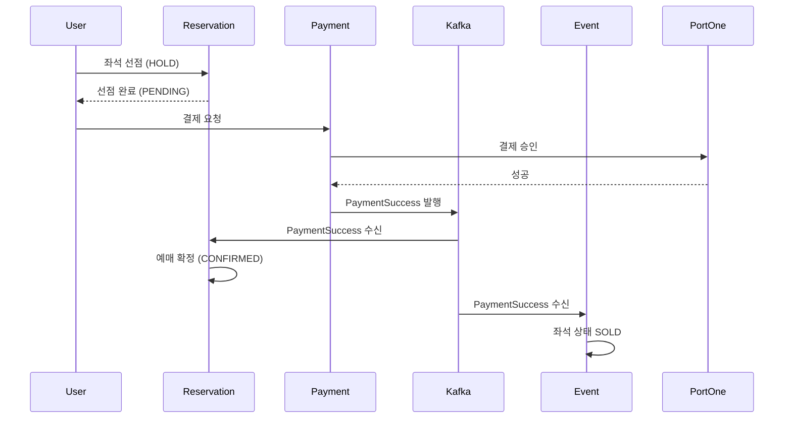
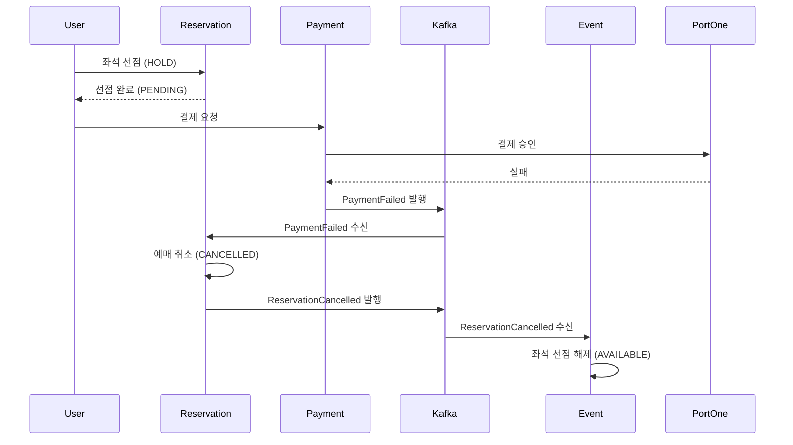

# Kafka 메시징 설계

## 1. 개요

### 1.1 Kafka 도입 목적

티켓팅 시스템에서 Kafka는 **서비스 간 느슨한 결합**과 **데이터 정합성 보장**을 위해 도입

| 목적 | 설명 | 해결하는 문제 |
|------|------|--------------|
| **비동기 통신** | 결제 완료 후 예매 확정, 좌석 상태 변경을 비동기로 처리 | 서비스 간 직접 호출 시 장애 전파 |
| **이벤트 소싱** | 비즈니스 이벤트를 영구 저장하여 추적 가능 | 분산 환경에서 상태 추적 어려움 |
| **보상 트랜잭션** | 결제 실패 시 예매 취소, 좌석 복구 자동화 | SAGA 패턴 구현을 위한 이벤트 전달 |

### 1.2 핵심 설계 결정

| 결정 사항 | 선택 | 근거 |
|----------|------|------|
| **전달 보장 수준** | At-least-once + Consumer 멱등성 | Exactly-once는 성능 저하 및 복잡도 증가. 멱등성 처리로 충분한 신뢰성 확보 |
| **파티션 키** | `userId` | 동일 사용자의 이벤트 순서 보장 (예: 결제 → 예매 확정 순서) |
| **Outbox 패턴** | 필수 적용 (Reservation, Payment) | DB 트랜잭션과 Kafka 발행의 원자성 보장 |
| **compensation.events 토픽** | 제외 | PaymentFailed가 보상 트리거 역할 수행 (YAGNI 원칙) |
| **seat.events 토픽** | 제외 | 현재 요구사항에서 Consumer 없음 |
| **커밋 모드** | 수동 커밋 (MANUAL_IMMEDIATE) | 처리 완료 후 명시적 커밋으로 메시지 손실 방지 |

---

## 2. 토픽 설계

### 2.1 네이밍 컨벤션

**패턴:** `{domain}.{type}`

| 구성 요소 | 규칙 | 예시 |
|----------|------|------|
| **domain** | 서비스 도메인 (소문자) | `reservation`, `payment` |
| **type** | 이벤트 유형 | `events`, `dlq` |


### 2.2 토픽 목록

| 토픽명 | 용도 | 파티션 | 보관 기간 | Producer | Consumer |
|--------|------|--------|----------|----------|----------|
| `reservation.events` | 예매 취소 → 좌석 복구 | 3 | 3일 | Reservation | Event |
| `payment.events` | 결제 성공/실패 → 예매 확정/취소, 좌석 SOLD | 3 | 3일 | Payment | Reservation, Event |

> **Note:** Replication Factor는 초기 단일 브로커 환경에서 1로 설정. 운영 환경 전환 시 3으로 증가 예정.

### 2.3 토픽별 상세

#### 2.3.1 reservation.events

| 항목 | 내용 |
|------|------|
| **Producer** | Reservation Service |
| **Consumer** | Event Service |
| **이벤트 타입** | `ReservationCancelled` |
| **발생 시점** | 사용자 취소 요청, 결제 실패 보상, 선점 타임아웃 |
| **Consumer 처리** | 좌석 상태 HOLD → AVAILABLE 복구 (Redis SET 정리) |
| **장애 시 영향** | 좌석이 HOLD 상태로 유지됨 (TTL 만료 시 자동 해제) |

#### 2.3.2 payment.events

| 항목 | 내용 |
|------|------|
| **Producer** | Payment Service |
| **Consumer** | Reservation Service, Event Service |
| **이벤트 타입** | `PaymentSuccess`, `PaymentFailed` |
| **발생 시점** | PortOne 결제 승인 성공/실패 시 |
| **Consumer 처리** | Reservation: 예매 확정(CONFIRMED) 또는 취소(CANCELLED) / Event: 좌석 상태 SOLD |
| **장애 시 영향** | 예매가 PENDING 상태로 유지됨 (hold_expires_at 기반 타임아웃 처리) |

#### 2.3.3 DLQ 토픽

| 토픽 | 이동 조건 | 처리 방법 |
|------|----------|----------|
| `dlq.reservation` | reservation.events 3회 재시도 실패 | 수동 원인 분석 후 원본 토픽 재발행 |
| `dlq.payment` | payment.events 3회 재시도 실패 | 수동 원인 분석 후 원본 토픽 재발행 |

---

## 3. 이벤트 스키마

### 3.1 공통 구조

모든 이벤트는 다음 공통 필드를 포함합니다:
<details>
<summary>공통 필드</summary>

```json
{
  "eventId": "uuid",
  "eventType": "PaymentSuccess | PaymentFailed | ReservationCancelled",
  "aggregateId": "uuid",
  "aggregateType": "Reservation | Payment",
  "version": "v1",
  "timestamp": "2026-01-20T10:00:00",
  "metadata": {
    "correlationId": "uuid",
    "causationId": "uuid",
    "userId": "uuid"
  },
  "payload": { }
}
```
</details>

| 필드 | 설명 | 용도 |
|------|------|------|
| `eventId` | 이벤트 고유 ID (UUID) | 멱등성 키로 사용 |
| `eventType` | 이벤트 타입 | Consumer 라우팅 |
| `aggregateId` | Aggregate ID (Reservation/Payment ID) | 파티션 키, 도메인 식별 |
| `aggregateType` | Aggregate 타입 | 도메인 구분 |
| `version` | 스키마 버전 | 하위 호환성 처리 |
| `timestamp` | 이벤트 발생 시각 | 순서 추적, 디버깅 |
| `metadata.correlationId` | 요청 추적 ID (Gateway에서 발급한 traceId) | 분산 추적 |
| `metadata.causationId` | 원인 이벤트 ID (최초인 경우 null) | 이벤트 체인 추적 |
| `metadata.userId` | 사용자 ID | 파티션 키 (순서 보장) |

### 3.2 이벤트별 Payload

#### 3.2.1 PaymentSuccess
<details>
<summary>Payload</summary>

```json
{
  "eventId": "550e8400-e29b-41d4-a716-446655440001",
  "eventType": "PaymentSuccess",
  "aggregateId": "payment-uuid-123",
  "aggregateType": "Payment",
  "version": "v1",
  "timestamp": "2026-01-20T10:00:00",
  "metadata": {
    "correlationId": "req-uuid-456",
    "causationId": null,
    "userId": "user-uuid-789"
  },
  "payload": {
    "paymentId": "payment-uuid-123",
    "paymentKey": "payment-key-abc",
    "reservationId": "reservation-uuid-321",
    "amount": 200000,
    "paidAt": "2026-01-20T10:00:00",
    "portoneTransactionId": "imp_123456"
  }
}
```
</details>

| Payload 필드 | 타입 | 설명 |
|--------------|------|------|
| `paymentId` | UUID | 결제 ID (aggregateId와 동일) |
| `paymentKey` | String | 결제 고유 키 (멱등성 키) |
| `reservationId` | UUID | 연관 예매 ID |
| `amount` | Integer | 결제 금액 (원) |
| `paidAt` | Timestamp | 결제 완료 시각 |
| `portoneTransactionId` | String | PortOne 거래 ID (API: transactionId) |

#### 3.2.2 PaymentFailed
<details>
<summary>Payload</summary>

```json
{
  "eventId": "550e8400-e29b-41d4-a716-446655440002",
  "eventType": "PaymentFailed",
  "aggregateId": "payment-uuid-456",
  "aggregateType": "Payment",
  "version": "v1",
  "timestamp": "2026-01-20T10:05:00",
  "metadata": {
    "correlationId": "req-uuid-789",
    "causationId": null,
    "userId": "user-uuid-012"
  },
  "payload": {
    "paymentId": "payment-uuid-456",
    "paymentKey": "payment-key-def",
    "reservationId": "reservation-uuid-654",
    "amount": 150000,
    "failureReason": "INSUFFICIENT_BALANCE",
    "failedAt": "2026-01-20T10:05:00"
  }
}
```
</details>

| Payload 필드 | 타입 | 설명 |
|--------------|------|------|
| `paymentId` | UUID | 결제 ID (aggregateId와 동일) |
| `paymentKey` | String | 결제 고유 키 (멱등성 키) |
| `reservationId` | UUID | 연관 예매 ID |
| `amount` | Integer | 시도된 결제 금액 (원) |
| `failureReason` | String | 실패 사유 코드 |
| `failedAt` | Timestamp | 실패 시각 |

#### 3.2.3 ReservationCancelled
<details>
<summary>Payload</summary>

```json
{
  "eventId": "550e8400-e29b-41d4-a716-446655440003",
  "eventType": "ReservationCancelled",
  "aggregateId": "reservation-uuid-789",
  "aggregateType": "Reservation",
  "version": "v1",
  "timestamp": "2026-01-20T10:10:00",
  "metadata": {
    "correlationId": "req-uuid-012",
    "causationId": "550e8400-e29b-41d4-a716-446655440002",
    "userId": "user-uuid-345"
  },
  "payload": {
    "scheduleId": "schedule-uuid-111",
    "seatIds": ["seat-uuid-001", "seat-uuid-002"],
    "cancelledAt": "2026-01-20T10:10:00",
    "reason": "PAYMENT_FAILED"
  }
}
```
</details>

| Payload 필드 | 타입 | 설명 |
|--------------|------|------|
| `scheduleId` | UUID | 회차 ID |
| `seatIds` | UUID[] | 취소된 좌석 ID 목록 |
| `cancelledAt` | Timestamp | 취소 시각 |
| `reason` | String | 취소 사유 (`USER_REQUEST`, `PAYMENT_FAILED`, `HOLD_TIMEOUT`) |


---

## 4. 서비스별 매핑

### 4.1 Producer 매핑

| 서비스 | 발행 토픽 | 이벤트 타입 | 발행 시점 | Outbox 적용 |
|--------|----------|------------|----------|:-----------:|
| Reservation | `reservation.events` | `ReservationCancelled` | 예매 취소 시 | O |
| Payment | `payment.events` | `PaymentSuccess` | PortOne 결제 승인 성공 시 | O |
| Payment | `payment.events` | `PaymentFailed` | PortOne 결제 승인 실패 시 | O |

### 4.2 Consumer Group 매핑

| Consumer Group ID | 서비스 | 구독 토픽 | 처리 내용 |
|-------------------|--------|----------|----------|
| `reservation-payment-consumer` | Reservation | `payment.events` | PaymentSuccess → 예매 확정 (CONFIRMED) |
| | | | PaymentFailed → 예매 취소 (CANCELLED) + ReservationCancelled 발행 |
| `event-payment-consumer` | Event | `payment.events` | PaymentSuccess → 좌석 상태 SOLD (RDB 업데이트) |
| `event-reservation-consumer` | Event | `reservation.events` | ReservationCancelled → 좌석 선점 해제 (Redis SREM + RDB AVAILABLE) |

### 4.3 이벤트 플로우 다이어그램

#### 4.3.1 성공 시나리오



#### 4.3.2 실패 시나리오 (보상 트랜잭션)



#### 4.3.3 보상 트랜잭션 체인

```
Payment Service (Orchestrator)
├─ PortOne 결제 실패
├─ PaymentFailed 이벤트 발행 (payment.events)
│
Reservation Service Consumer
├─ payment.events 구독
├─ PaymentFailed 수신
├─ 예매 상태: PENDING → CANCELLED
├─ ReservationCancelled 이벤트 발행 (reservation.events)
│
Event Service Consumer
├─ reservation.events 구독
├─ ReservationCancelled 수신
└─ 좌석 선점 해제: HOLD → AVAILABLE
    (Redis: SREM hold_seats:{scheduleId} {seatId})
```

**설계 장점:**
- 서비스별 단일 토픽 구독 (복잡도 감소)
- 명확한 보상 체인: Payment → Reservation → Event

---

## 5. 신뢰성 보장

### 5.1 Transactional Outbox 패턴

**문제:** DB 트랜잭션 성공 후 Kafka 발행 실패 시 데이터 불일치

**해결책:** 비즈니스 로직과 동일 트랜잭션 내에서 `outbox_events` 테이블에 이벤트 INSERT

```
┌─────────────────────────────────────────┐
│ 하나의 DB 트랜잭션                        │
│  1. 비즈니스 로직 (예: 결제 상태 변경)      │
│  2. outbox_events 테이블에 이벤트 INSERT   │
└─────────────────────────────────────────┘
          │
          ▼
┌─────────────────────────────────────────┐
│ Outbox Poller (별도 스레드)               │
│  1. 미발행 이벤트 조회                     │
│  2. Kafka 발행                           │
│  3. published = true 업데이트            │
└─────────────────────────────────────────┘
```

**Outbox 테이블 스키마 (`common.outbox_events`):**

| 컬럼 | 타입 | 설명 |
|------|------|------|
| `id` | UUID | PK |
| `aggregate_type` | VARCHAR(50) | Reservation, Payment |
| `aggregate_id` | UUID | Aggregate ID |
| `event_type` | VARCHAR(50) | PaymentSuccess, PaymentFailed 등 |
| `payload` | JSONB | 이벤트 전체 JSON |
| `published` | BOOLEAN | 발행 여부 (기본값: false) |
| `published_at` | TIMESTAMP | 발행 시각 |
| `retry_count` | INTEGER | 재시도 횟수 (기본값: 0) |
| `last_error` | TEXT | 마지막 에러 메시지 |
| `created_at` | TIMESTAMP | 생성 시각 |

**Outbox Poller 설정:**
- 폴링 주기: 1초
- 배치 크기: 100개
- 최대 재시도: 3회
- 재시도 실패 시: DLQ 이동

**적용 대상:** Reservation Service, Payment Service (P0 데이터 정합성)

### 5.2 Consumer 멱등성 보장

**문제:** At-least-once 전달로 동일 메시지 중복 수신 가능

**해결책 (권장):** `processed_events` 테이블의 Unique Constraint 활용

**processed_events 테이블 스키마 (`common.processed_events`):**

| 컬럼 | 타입 | 설명 |
|------|------|------|
| `event_id` | UUID | 복합 PK |
| `consumer_service` | VARCHAR(50) | 복합 PK (reservation, event, payment) |
| `aggregate_id` | UUID | Aggregate ID |
| `event_type` | VARCHAR(50) | 이벤트 타입 |
| `processed_at` | TIMESTAMP | 처리 시각 |

> **Note:** 동일 이벤트를 여러 Consumer 서비스가 각각 처리해야 하므로 `(event_id, consumer_service)` 복합 PK 사용

**멱등성 처리 로직:**

```
1. processed_events 테이블에 (event_id, consumer_service) INSERT 시도
2. 성공 → 비즈니스 로직 실행
3. DataIntegrityViolationException → 이미 처리된 이벤트로 판단, 종료
```

**장점:**
- DB가 원자적으로 중복 방지 (Race Condition 해결)
- 별도 조회 없이 INSERT 한 번으로 중복 체크
- 동일 이벤트의 다중 Consumer 처리 지원

**보조 방법:**
| 방법 | 용도 | 특징 |
|------|------|------|
| Redis SETNX | 빠른 조회 필요 시 | TTL 7일, 휘발성 |
| 도메인 키 (paymentKey) | 비즈니스 중복 체크 | 이미 존재하는 Unique 키 활용 |

### 5.3 DLQ 처리 전략

#### 5.3.1 예외 분류

| 분류 | 예외 타입 | 처리 방법 |
|------|----------|----------|
| **재시도 가능** | TimeoutException, KafkaException, QueryTimeoutException, PessimisticLockingFailureException, CircuitBreakerOpenException | 지수 백오프 재시도 (최대 3회) |
| **재시도 불가** | ValidationException, IllegalArgumentException, DataIntegrityViolationException, JsonProcessingException | 즉시 DLQ 이동 |

#### 5.3.2 재시도 정책

| 설정 | 값 | 설명 |
|------|------|------|
| 최대 재시도 횟수 | 3회 | 3회 실패 시 DLQ 이동 |
| 초기 대기 시간 | 1초 | 첫 재시도 전 대기 |
| 백오프 배수 | 2배 | 1초 → 2초 → 4초 |
| 최대 대기 시간 | 10초 | 대기 시간 상한 |

#### 5.3.3 DLQ 재처리 절차

1. **원인 분석:** DLQ 메시지 조회, 로그 및 예외 메시지 확인
2. **수정:** 데이터 수정 또는 코드 버그 수정
3. **재발행:** 수정된 메시지를 원본 토픽으로 재발행
4. **검증:** Consumer 로그에서 정상 처리 확인

---
