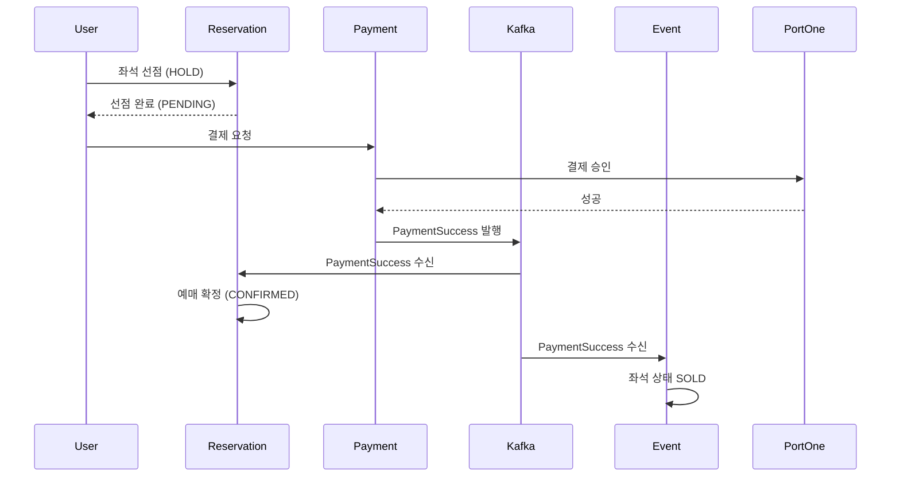
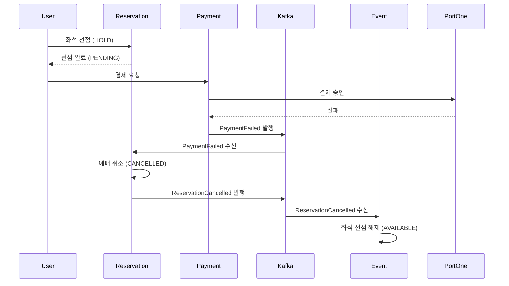

# 메시징 아키텍처 (Kafka)

## 1. 메시징 아키텍처

### 1.1 Kafka 클러스터 구성

#### 1.1.1 로컬 개발 환경

**Docker Compose 구성:**
```yaml
services:
  zookeeper:
    image: confluentinc/cp-zookeeper:7.5.0
    environment:
      ZOOKEEPER_CLIENT_PORT: 2181
      ZOOKEEPER_TICK_TIME: 2000
    ports:
      - "2181:2181"

  kafka:
    image: confluentinc/cp-kafka:7.5.0
    depends_on:
      - zookeeper
    ports:
      - "9092:9092"
    environment:
      KAFKA_BROKER_ID: 1
      KAFKA_ZOOKEEPER_CONNECT: zookeeper:2181
      KAFKA_ADVERTISED_LISTENERS: PLAINTEXT://localhost:9092
      KAFKA_OFFSETS_TOPIC_REPLICATION_FACTOR: 1
      KAFKA_TRANSACTION_STATE_LOG_MIN_ISR: 1
      KAFKA_TRANSACTION_STATE_LOG_REPLICATION_FACTOR: 1
      KAFKA_AUTO_CREATE_TOPICS_ENABLE: 'false'
```

**특징:**
- 단일 브로커 구성
- Replication Factor: 1
- 개발 편의를 위한 자동 토픽 생성 비활성화 (명시적 생성 권장)

#### 1.1.2 AWS 운영 환경

**옵션 분석:**

| 옵션 | 장점 | 단점 | 월 비용 |
|------|------|------|---------|
| Amazon MSK | 완전 관리형, 고가용성, 자동 패치 | 고비용 (최소 $200+) | $200+ |
| EC2 자체 Kafka | 비용 효율적, 완전 제어 | 운영 부담, 모니터링 직접 구축 | $15-50 |
| Amazon SNS/SQS | 완전 관리형, 무료티어 | 이벤트 스트리밍 기능 부족 | $0-10 |

**선택: EC2 자체 Kafka 클러스터**

**초기 구성 (비용 최소화):**
- 인스턴스: `t3.small` 1대 (단일 브로커)
- EBS: gp3 100GB
- 가용 영역: ap-northeast-2a (Single-AZ)
- Replication Factor: 1 (단일 브로커이므로)
- **월 비용**: $15-20

**성장 단계 구성 (고가용성):**
- 인스턴스: `t3.small` 3대 (3 브로커 클러스터)
- EBS: gp3 100GB per broker
- 가용 영역: ap-northeast-2a, 2b, 2c (Multi-AZ)
- Replication Factor: 2-3
- **월 비용**: $45-60

**Kafka 설치 및 설정:**
```bash
# EC2 인스턴스에 Kafka 설치
wget https://archive.apache.org/dist/kafka/3.6.0/kafka_2.13-3.6.0.tgz
tar -xzf kafka_2.13-3.6.0.tgz
cd kafka_2.13-3.6.0

# server.properties 설정
broker.id=1
listeners=PLAINTEXT://0.0.0.0:9092
advertised.listeners=PLAINTEXT://ec2-xx-xx-xx-xx.compute.amazonaws.com:9092
log.dirs=/data/kafka-logs
zookeeper.connect=localhost:2181
num.partitions=3
default.replication.factor=1  # 초기 단일 브로커
log.retention.hours=72  # 3일 보관
```

#### 1.1.3 Partition 전략

**기본 설정:**
- 토픽당 파티션 수: 3개
- 파티션 키: `aggregateId` (예: userId, reservationId, paymentId)

**파티션 수 결정 기준:**
- 초기 처리량: 최대 100 TPS (Transaction Per Second)
- 파티션당 처리량: 약 30-50 TPS
- 계산: 100 TPS ÷ 30 TPS = 3-4 파티션

**파티션 키 전략:**
```java
// 같은 userId의 이벤트는 같은 파티션으로 (순서 보장)
ProducerRecord<String, String> record = new ProducerRecord<>(
    "reservation.events",
    reservation.getUserId().toString(),  // Partition Key
    eventJson
);
```

**확장 계획:**
- 트래픽 증가 시 파티션 추가 (최대 10-20개)
- Consumer Group 병렬 처리로 처리량 향상

### 1.2 Topic 설계

#### 1.2.1 Topic 목록

| Topic 명 | Producer | Consumer | 파티션 수 | Replication | 보관 기간 |
|----------|----------|----------|----------|-------------|----------|
| `reservation.events` | Reservation | Event | 3 | 1 (초기) | 3일 |
| `payment.events` | Payment | Reservation, Event | 3 | 1 (초기) | 3일 |
| `seat.events` | Event | - (선택) | 3 | 1 (초기) | 3일 |
| `compensation.events` | Payment | Reservation | 3 | 1 (초기) | 3일 |
| `dlq.reservation` | - | Admin (수동) | 1 | 1 | 7일 |
| `dlq.payment` | - | Admin (수동) | 1 | 1 | 7일 |

#### 1.2.2 Topic 상세 설명

**1. `reservation.events` - 예매 이벤트**

**Producer:** Reservation Service
**Consumer:** Event Service
**용도:** 예매 취소 시 좌석 상태 복구

**이벤트 타입:**
- `ReservationCancelled`: 예매 취소 (사용자 또는 보상 트랜잭션)

**예제 메시지:**
```json
{
  "eventId": "uuid",
  "eventType": "ReservationCancelled",
  "aggregateId": "reservation-uuid",
  "userId": "user-uuid",
  "eventIdRef": "event-uuid",
  "seatIds": ["seat-uuid-1", "seat-uuid-2"],
  "cancelledAt": "2026-01-11T10:00:00Z",
  "reason": "USER_REQUEST"
}
```

**2. `payment.events` - 결제 이벤트**

**Producer:** Payment Service
**Consumer:** Reservation Service, Event Service
**용도:** 결제 성공/실패 시 예매 확정/취소, 좌석 상태 업데이트

**이벤트 타입:**
- `PaymentSuccess`: 결제 성공
- `PaymentFailed`: 결제 실패

**예제 메시지 (PaymentSuccess):**
```json
{
  "eventId": "uuid",
  "eventType": "PaymentSuccess",
  "aggregateId": "payment-uuid",
  "paymentKey": "payment-key-123",
  "reservationId": "reservation-uuid",
  "userId": "user-uuid",
  "amount": 200000,
  "paidAt": "2026-01-11T10:00:00Z",
  "portoneTransactionId": "imp_123456"
}
```

**예제 메시지 (PaymentFailed):**
```json
{
  "eventId": "uuid",
  "eventType": "PaymentFailed",
  "aggregateId": "payment-uuid",
  "paymentKey": "payment-key-123",
  "reservationId": "reservation-uuid",
  "userId": "user-uuid",
  "amount": 200000,
  "failureReason": "INSUFFICIENT_BALANCE",
  "failedAt": "2026-01-11T10:00:00Z"
}
```

**3. `seat.events` - 좌석 이벤트 (선택)**

**Producer:** Event Service
**Consumer:** 없음 (모니터링/감사용)
**용도:** 좌석 상태 변경 이력 추적 (선택 사항)

**설계 결정:** compensation.events 토픽은 제외됨
- **이유:** payment.events의 PaymentFailed 이벤트가 이미 보상 트랜잭션을 트리거함
- **현재 플로우:** PaymentFailed → Reservation Consumer → 예매 취소 (CANCELLED) → ReservationCancelled 이벤트 발행 → Event Consumer → 좌석 복구
- **판단:** 명시적 보상 토픽은 중복이며 복잡도만 증가시킴 (YAGNI 원칙)

#### 1.2.3 Topic 생성 스크립트

```bash
# reservation.events
kafka-topics.sh --create \
  --bootstrap-server localhost:9092 \
  --topic reservation.events \
  --partitions 3 \
  --replication-factor 1 \
  --config retention.ms=259200000  # 3일 (72시간)

# payment.events
kafka-topics.sh --create \
  --bootstrap-server localhost:9092 \
  --topic payment.events \
  --partitions 3 \
  --replication-factor 1 \
  --config retention.ms=259200000

# DLQ
kafka-topics.sh --create \
  --bootstrap-server localhost:9092 \
  --topic dlq.reservation \
  --partitions 1 \
  --replication-factor 1 \
  --config retention.ms=604800000  # 7일
```

### 1.3 Producer/Consumer 매핑

#### 1.3.1 서비스별 Producer

| 서비스 | 발행 Topic | 발행 시점 | 비고 |
|--------|-----------|----------|------|
| Reservation | `reservation.events` | 예매 취소 시 | Outbox 패턴 |
| Payment | `payment.events` | 결제 성공/실패 시 | Outbox 패턴 |

#### 1.3.2 서비스별 Consumer

| 서비스 | 구독 Topic | 처리 내용 | Consumer Group |
|--------|-----------|----------|----------------|
| Reservation | `payment.events` | 결제 성공 → 예매 확정, 결제 실패 → 예매 취소 | `reservation-payment-consumer` |
| Event | `payment.events` | 결제 성공 → 좌석 상태 SOLD | `event-payment-consumer` |
| Event | `reservation.events` | 예매 취소 → 좌석 상태 AVAILABLE | `event-reservation-consumer` |

#### 1.3.3 이벤트 플로우 다이어그램

**성공 시나리오:**


**실패 시나리오 (보상 트랜잭션):**


### 1.3.4 보상 트랜잭션 플로우 (Payment Failed)

**결정: Event Service는 reservation.events만 구독**

```
Payment Service (Orchestrator)
├─ PortOne 결제 실패
├─ PaymentFailed 이벤트 발행 (payment.events)
│
Reservation Service Consumer
├─ payment.events 구독
├─ PaymentFailed 수신
├─ 예매 상태: PENDING → CANCELLED
├─ ReservationCancelled 이벤트 발행 (reservation.events)
│
Event Service Consumer
├─ reservation.events 구독 (단일 토픽)
├─ ReservationCancelled 수신
└─ 좌석 선점 해제: HOLD → AVAILABLE
    (Redis: SREM held_seats:{eventId} {seatId})
```

**장점:**
- 서비스별 단일 토픽 구독 (복잡도 감소)
- 보상 체인: Payment → Reservation → Event (명확한 책임)

**단점:**
- 3-hop 레이턴시 (예상: 100-300ms)

### 1.4 Event Schema 정의

#### 1.4.1 공통 이벤트 구조

모든 이벤트는 다음 공통 필드를 포함합니다:

```json
{
  "eventId": "uuid",             // 이벤트 고유 ID (멱등성 키)
  "eventType": "string",         // 이벤트 타입
  "aggregateId": "uuid",         // Aggregate ID (Reservation/Payment)
  "aggregateType": "string",     // Aggregate 타입 ("Reservation", "Payment")
  "version": "string",           // 이벤트 스키마 버전 (v1, v2)
  "timestamp": "ISO8601",        // 이벤트 발생 시각
  "metadata": {
    "correlationId": "uuid",     // 요청 추적 ID
    "causationId": "uuid",       // 원인 이벤트 ID
    "userId": "uuid"             // 사용자 ID
  },
  "payload": {}
}
```

#### 1.4.2 이벤트 버전 관리

**전략:** Semantic Versioning (v1, v2, v3)

**하위 호환성 유지:**
- 필드 추가: 호환 가능 (Consumer는 무시)
- 필드 삭제: 호환 불가 (새 버전 발행, v1 → v2)
- 필드 타입 변경: 호환 불가 (새 버전 발행)

**Consumer 버전 처리:**
```java
@KafkaListener(topics = "payment.events")
public void handlePaymentEvent(String message) {
    JsonNode event = objectMapper.readTree(message);
    String version = event.get("version").asText();

    switch (version) {
        case "v1":
            handlePaymentEventV1(event);
            break;
        case "v2":
            handlePaymentEventV2(event);
            break;
        default:
            throw new UnsupportedVersionException(version);
    }
}
```

**관련 요구사항:** REQ-PAY-013, REQ-RSV-011

### 1.5 Dead Letter Queue (DLQ) 처리

#### 1.5.1 DLQ 사용 시나리오

**Consumer 처리 실패 시 DLQ로 이동:**
- 비즈니스 로직 예외 (데이터 무결성 오류 등)
- 일시적 오류 아님 (재시도해도 실패)
- 3회 재시도 후에도 실패

**일시적 오류는 재시도:**
- DB 커넥션 타임아웃
- 네트워크 오류
- 재시도 가능한 예외

#### 1.5.2 DLQ 구현

**Spring Kafka ErrorHandler:**
```java
@Configuration
public class KafkaConsumerConfig {

    @Bean
    public DefaultErrorHandler errorHandler(KafkaTemplate<String, String> kafkaTemplate) {
        // 재시도 정책: 지수 백오프
        BackOff backOff = new ExponentialBackOffWithMaxRetries(3);
        backOff.setInitialInterval(1000);  // 1초
        backOff.setMultiplier(2.0);        // 2배씩 증가
        backOff.setMaxInterval(10000);     // 최대 10초

        DefaultErrorHandler errorHandler = new DefaultErrorHandler(
            (record, exception) -> {
                // 3회 재시도 후 DLQ로 이동
                String dlqTopic = "dlq." + record.topic().split("\\.")[0];
                kafkaTemplate.send(dlqTopic, record.key(), record.value());
                log.error("메시지를 DLQ로 이동: {}", dlqTopic, exception);
            },
            backOff
        );

        // ✅ Fixed: Expanded exception classification for production reliability

        // 재시도 가능한 예외 (Transient errors)
        errorHandler.addRetryableExceptions(
            // Infrastructure/Network
            TimeoutException.class,
            KafkaException.class,
            TemporaryDataAccessException.class,
            QueryTimeoutException.class,
            PessimisticLockingFailureException.class,
            CannotAcquireLockException.class,

            // Circuit Breaker
            CircuitBreakerOpenException.class
        );

        // 재시도 불가능한 예외 (Permanent errors → immediate DLQ)
        errorHandler.addNotRetryableExceptions(
            // Business Logic
            ValidationException.class,
            IllegalArgumentException.class,
            ReservationNotFoundException.class,
            InvalidPaymentStatusException.class,

            // Data Integrity
            DataIntegrityViolationException.class,
            ConstraintViolationException.class,

            // Serialization
            JsonProcessingException.class,
            SerializationException.class
        );

        return errorHandler;
    }
}
```

#### 1.5.3 DLQ 모니터링 및 재처리

**DLQ 모니터링:**
- CloudWatch Metric: DLQ 메시지 수
- 알람: DLQ 메시지 10개 이상 시 알림

**재처리 프로세스:**
1. DLQ 메시지 조회 (Kafka Consumer 또는 CLI)
2. 원인 분석 (로그, 예외 메시지)
3. 데이터 수정 또는 코드 수정
4. 수동 재발행 (원본 토픽으로)

**재발행 스크립트 예시:**
```bash
# DLQ 메시지 읽기
kafka-console-consumer.sh \
  --bootstrap-server localhost:9092 \
  --topic dlq.payment \
  --from-beginning \
  --max-messages 10 > dlq_messages.txt

# 수정 후 원본 토픽으로 재발행
kafka-console-producer.sh \
  --bootstrap-server localhost:9092 \
  --topic payment.events < fixed_messages.txt
```

**관련 요구사항:** REQ-EVT-024

### 1.6 멱등성 보장 메커니즘

#### 1.6.1 Producer 멱등성

**Kafka Producer 설정:**
```java
@Configuration
public class KafkaProducerConfig {
    @Bean
    public ProducerFactory<String, String> producerFactory() {
        Map<String, Object> config = new HashMap<>();
        config.put(ProducerConfig.BOOTSTRAP_SERVERS_CONFIG, "localhost:9092");
        config.put(ProducerConfig.KEY_SERIALIZER_CLASS_CONFIG, StringSerializer.class);
        config.put(ProducerConfig.VALUE_SERIALIZER_CLASS_CONFIG, StringSerializer.class);

        // 멱등성 활성화
        config.put(ProducerConfig.ENABLE_IDEMPOTENCE_CONFIG, true);
        config.put(ProducerConfig.ACKS_CONFIG, "all");
        config.put(ProducerConfig.RETRIES_CONFIG, Integer.MAX_VALUE);
        config.put(ProducerConfig.MAX_IN_FLIGHT_REQUESTS_PER_CONNECTION, 5);

        return new DefaultKafkaProducerFactory<>(config);
    }
}
```

**특징:**
- 네트워크 오류로 재전송해도 중복 메시지 방지
- Broker가 자동으로 중복 감지 (Producer ID + Sequence Number)

#### 1.6.2 Consumer 멱등성

**문제:** Kafka는 At-least-once 전달 보장 → Consumer가 동일 메시지 중복 수신 가능

**해결책: 이벤트 ID 기반 중복 처리 방지**

**방법 1: DB Unique Constraint (권장)**
```java
@Entity
@Table(name = "processed_events")
public class ProcessedEvent {
    @Id
    @Column(name = "event_id")
    private UUID eventId;  // Unique

    @Column(name = "event_type")
    private String eventType;

    @Column(name = "processed_at")
    private Instant processedAt;
}

@KafkaListener(topics = "payment.events")
@Transactional
public void handlePaymentSuccess(PaymentSuccessEvent event) {
    // ✅ Fixed: Insert idempotency key FIRST (atomic check)
    try {
        processedEventRepository.save(new ProcessedEvent(event.getEventId(), event.getEventType()));
    } catch (DataIntegrityViolationException e) {
        log.info("이미 처리된 이벤트: {}", event.getEventId());
        return;  // Already processed by another consumer
    }

    // Safe to execute business logic (guaranteed single execution)
    Reservation reservation = reservationRepository.findById(event.getReservationId())
        .orElseThrow(() -> new ReservationNotFoundException(event.getReservationId()));
    reservation.confirm();
    reservationRepository.save(reservation);

    log.info("예매 확정 완료: {}", event.getReservationId());
}
```

**멱등성 보장 원리:**
- `processed_events.event_id`에 Unique Constraint 존재
- 동시 처리 시도 시 두 번째 INSERT는 Constraint Violation 발생
- DB가 원자적으로 중복 방지 (Race Condition 해결)

**방법 2: Redis Set (빠른 조회)**
```java
@KafkaListener(topics = "payment.events")
public void handlePaymentSuccess(PaymentSuccessEvent event) {
    String key = "processed:event:" + event.getEventId();

    // Redis SETNX (Set if Not Exists)
    Boolean isNew = redisTemplate.opsForValue().setIfAbsent(key, "1", Duration.ofDays(7));

    if (Boolean.FALSE.equals(isNew)) {
        log.info("이미 처리된 이벤트: {}", event.getEventId());
        return;
    }

    // 비즈니스 로직
    // ...
}
```

**방법 3: paymentKey/reservationId 기반 (도메인 키)**
```java
@KafkaListener(topics = "payment.events")
@Transactional
public void handlePaymentSuccess(PaymentSuccessEvent event) {
    // paymentKey로 중복 처리 방지
    if (paymentRepository.existsByPaymentKey(event.getPaymentKey())) {
        log.info("이미 처리된 결제: {}", event.getPaymentKey());
        return;
    }

    // 비즈니스 로직
    // ...
}
```

**관련 요구사항:** REQ-PAY-004, REQ-PAY-010

### 1.7 At-least-once vs Exactly-once 전달 보장

#### 1.7.1 Kafka 전달 보장 수준

| 전달 보장 | 설명 | 장점 | 단점 | 적용 |
|----------|------|------|------|------|
| At-most-once | 메시지 손실 가능, 중복 없음 | 빠름 | 데이터 손실 | 비적용 |
| At-least-once | 중복 가능, 손실 없음 | 신뢰성 | 멱등성 처리 필요 | **적용** |
| Exactly-once | 중복 없음, 손실 없음 | 완벽한 신뢰성 | 복잡도 높음, 성능 저하 | 선택 |

#### 1.7.2 현재 아키텍처: At-least-once + Consumer 멱등성

**선택 이유:**
- Exactly-once는 Kafka Streams 또는 트랜잭션 API 필요 (복잡도 증가)
- At-least-once + Consumer 멱등성으로 충분한 신뢰성 확보
- 성능과 복잡도의 균형

**Consumer 설정:**
```yaml
spring:
  kafka:
    consumer:
      enable-auto-commit: false  # 수동 커밋
      isolation-level: read_committed
    listener:
      ack-mode: MANUAL_IMMEDIATE
```

**수동 커밋 예시:**
```java
@KafkaListener(topics = "payment.events")
public void handlePaymentSuccess(ConsumerRecord<String, String> record, Acknowledgment ack) {
    try {
        PaymentSuccessEvent event = objectMapper.readValue(record.value(), PaymentSuccessEvent.class);

        // 멱등성 체크 + 비즈니스 로직
        handlePaymentSuccessIdempotent(event);

        // 처리 완료 후 커밋
        ack.acknowledge();
    } catch (Exception e) {
        log.error("이벤트 처리 실패, 재시도 예정", e);
        // 커밋하지 않음 → 재시도
    }
}
```

#### 1.7.3 Exactly-once 전환 계획 (향후)

**전환 시점:**
- 데이터 정합성 이슈 빈번 발생
- 멱등성 처리 복잡도 증가
- 트랜잭션 보장 필수 요구사항 추가

**Kafka Transactional API 사용:**
```java
// Producer
@Bean
public ProducerFactory<String, String> transactionalProducerFactory() {
    Map<String, Object> config = new HashMap<>();
    // ... 기본 설정
    config.put(ProducerConfig.TRANSACTIONAL_ID_CONFIG, "payment-producer");
    return new DefaultKafkaProducerFactory<>(config);
}

// Consumer
@Transactional("kafkaTransactionManager")
@KafkaListener(topics = "payment.events")
public void handlePaymentSuccess(PaymentSuccessEvent event) {
    // DB 트랜잭션 + Kafka 커밋이 원자적으로 처리
}
```

**트레이드오프:**
- 장점: Exactly-once 보장
- 단점: 성능 10-30% 저하, 설정 복잡도 증가

```