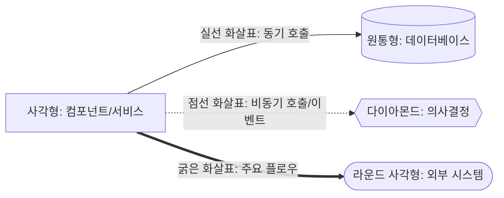

# 부록 및 기타

## 1. 기술 부채 및 개선 사항

### 1.1 알려진 제약사항

1. **단일 RDS 인스턴스:**
   - 서비스별 물리적 DB 분리 미구현
   - 향후 트래픽 증가 시 병목 가능

2. **Single-AZ 배포:**
   - AZ 장애 시 서비스 중단
   - 초기 비용 절감을 위한 선택

3. **Kafka 단일 브로커:**
   - 브로커 다운 시 이벤트 처리 중단
   - 향후 3 브로커 클러스터로 확장 필요

4. **수동 스케일링:**
   - Auto Scaling 미적용 (비용 절감)
   - 트래픽 예측 필요

### 1.2 향후 개선 계획

**Phase 1 (6개월):**
- Multi-AZ 전환 (RDS, Redis, Kafka)
- Auto Scaling 적용
- Read Replica 추가

**Phase 2 (1년):**
- 서비스별 물리적 DB 분리
- ElasticSearch 도입 (예매 내역 검색)
- CDN 최적화 (정적 리소스)

**Phase 3 (2년):**
- Multi-Region 배포
- Serverless 전환 검토 (Lambda, Aurora Serverless)
- AI 기반 부정 예매 탐지

### 1.3 기술 검토 항목

| 항목 | 현재 | 검토 사항 | 우선순위 |
|------|------|----------|---------|
| CQRS 패턴 | 부분 적용 (Redis 캐싱) | 전면 적용 검토 | Medium |
| Event Sourcing | 미적용 | 이벤트 히스토리 추적 | Low |
| GraphQL | 미적용 | REST API 대체 검토 | Low |
| gRPC | 미적용 | 서비스 간 통신 성능 향상 | Medium |
| Kubernetes | ECS/EC2 | 오케스트레이션 개선 | Low |
| Service Mesh | 미적용 | Istio, Linkerd 검토 | Low |

---

## 2. 부록

### 2.1 용어 정의 (Glossary)

| 용어 | 정의 |
|------|------|
| MSA | Microservices Architecture, 마이크로서비스 아키텍처 |
| SAGA | 분산 트랜잭션 패턴, 오케스트레이션 또는 코레오그래피 방식 |
| Outbox Pattern | 이벤트 발행 신뢰성을 보장하는 패턴, DB 트랜잭션과 메시지 발행을 원자적으로 처리 |
| CI/DI | 본인인증 정보, Connecting Information / Duplication Information |
| Queue Token | 대기열 통과 인증 토큰, Reservation Token (qr_xxx), Payment Token (qp_xxx) |
| Sorted Set | Redis 자료구조, Score 기반 정렬된 집합 |
| Redisson | Redis 기반 Java 클라이언트, 분산 락, 분산 자료구조 지원 |
| PortOne | 결제 PG (Payment Gateway), 구 아임포트 |
| reCAPTCHA | Google의 봇 차단 서비스 |
| LocalStack | AWS 서비스 로컬 에뮬레이터 |
| CloudWatch | AWS 모니터링 및 로깅 서비스 |
| ElastiCache | AWS 관리형 Redis/Memcached 서비스 |
| RDS | AWS 관리형 관계형 데이터베이스 서비스 |
| P95 | 95th Percentile, 전체 요청 중 95%가 해당 시간 이내 응답 |
| TPS | Transactions Per Second, 초당 트랜잭션 수 |
| SLA | Service Level Agreement, 서비스 수준 협약 |
| SLO | Service Level Objective, 서비스 수준 목표 |
| RTO | Recovery Time Objective, 목표 복구 시간 |
| RPO | Recovery Point Objective, 목표 복구 시점 (데이터 손실 허용 범위) |

### 2.2 참고 문서 및 링크

**요구사항 명세서:**
- [REQUIREMENTS.md](../REQUIREMENTS.md) - 111개 요구사항 정의

**기술 문서:**
- Spring Cloud Gateway: https://spring.io/projects/spring-cloud-gateway
- Spring Boot 3.x: https://spring.io/projects/spring-boot
- PostgreSQL 18: https://www.postgresql.org/docs/18/
- Redis 7.x: https://redis.io/docs/
- Apache Kafka 3.x: https://kafka.apache.org/documentation/
- Redisson: https://redisson.org/
- Resilience4j: https://resilience4j.readme.io/

**외부 서비스:**
- PortOne: https://portone.io/
- Google reCAPTCHA: https://www.google.com/recaptcha/
- Vercel: https://vercel.com/docs

**AWS 문서:**
- RDS PostgreSQL: https://docs.aws.amazon.com/rds/
- ElastiCache Redis: https://docs.aws.amazon.com/elasticache/
- ECS: https://docs.aws.amazon.com/ecs/
- CloudWatch: https://docs.aws.amazon.com/cloudwatch/
- LocalStack: https://docs.localstack.cloud/

**패턴 및 아키텍처:**
- SAGA 패턴: https://microservices.io/patterns/data/saga.html
- Transactional Outbox: https://microservices.io/patterns/data/transactional-outbox.html
- Event-Driven Architecture: https://martinfowler.com/articles/201701-event-driven.html

### 2.3 아키텍처 결정 기록 (ADR)

**ADR-001: PostgreSQL 단일 인스턴스 + 스키마 분리 선택**
- **날짜:** 2026-01-11
- **상태:** 승인됨
- **컨텍스트:** 비용 최소화하면서 MSA 원칙 준수
- **결정:** 논리적 DB per Service + 물리적 통합
- **결과:** 무료티어 활용, 향후 물리적 분리 가능
- **대안:** 서비스별 독립 RDS (비용 $170+/월)

**ADR-002: EC2 기반 Kafka 선택**
- **날짜:** 2026-01-11
- **상태:** 승인됨
- **컨텍스트:** MSK는 최소 월 $200+로 고비용
- **결정:** EC2 자체 Kafka 클러스터 구축
- **결과:** 월 $15-60, 운영 부담 증가
- **대안:** Amazon SNS/SQS (이벤트 스트리밍 기능 부족), MSK (고비용)

**ADR-003: At-least-once + Consumer 멱등성 선택**
- **날짜:** 2026-01-11
- **상태:** 승인됨
- **컨텍스트:** Exactly-once는 복잡도 증가
- **결정:** At-least-once 전달 보장 + Consumer 멱등성 처리
- **결과:** 신뢰성 확보, 구현 단순
- **대안:** Kafka Transactional API (성능 10-30% 저하)

**ADR-004: Redisson 분산 락 선택**
- **날짜:** 2026-01-11
- **상태:** 승인됨
- **컨텍스트:** 좌석 선점 동시성 제어 필요
- **결정:** Redisson RLock 사용
- **결과:** 안정적인 분산 락, Pub/Sub로 대기 최적화
- **대안:** Redis SET NX (수동 구현, Watch Dog 없음), ZooKeeper (과도한 의존성)

### 2.4 다이어그램 범례 및 표기법

**Mermaid 다이어그램 범례:**

**시퀀스 다이어그램 표기:**
- `→`: 동기 호출 (Request-Response)
- `-->>`: 비동기 응답
- `-->|메시지|`: 호출 시 메시지

**ERD 표기:**
- `PK`: Primary Key
- `FK`: Foreign Key
- `UK`: Unique Key
- `||--o{`: One-to-Many 관계
- `||--||`: One-to-One 관계

**상태 다이어그램 표기:**
- 원: 상태
- 화살표: 전이 (이벤트/조건)
