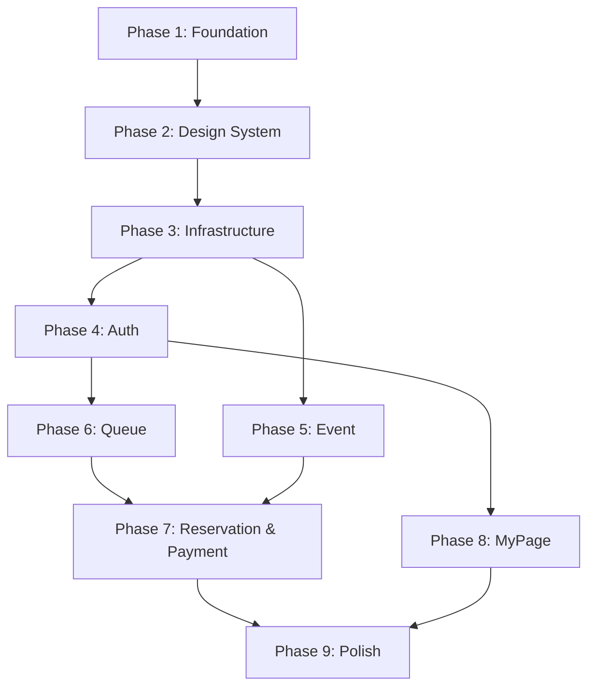

# 프론트엔드 GitHub Issue 사전 계획

> **목적**: 프론트엔드 개발에 필요한 GitHub Issue들을 사전 계획하여, 개발 순서와 의존성을 명확히 합니다.
> **기반 문서**: `docs/frontend/00_overview.md` ~ `docs/frontend/07_performance.md` (8개 설계 문서)
> **Issue 양식**: `.github/ISSUE_TEMPLATE/feature_request.md`

---

## 전체 개발 플로우



**총 Issue 개수**: 20개
**Phase 개수**: 9개
**사용 Label**: `frontend`, `feature`, `enhancement`, `infra`, `user`, `event`, `queue`, `reservation`, `payment`

---

## 개발 순서 및 의존성 체인

```
#1 → #2 → #3 → #4 → #5 → #6 → #7 → #8 → #10 → #11
                                  ↘ #9 → #10       ↘
                                  ↘ #12 → #13 → #14 → #15 → #16 → #17 → #18 → #20
                                                 #8 → #19 ──────────────────────↗
```

**병렬 가능한 작업**:
- #9, #12는 #6 완료 후 #7~#8과 병렬 가능
- #19(마이페이지)는 #8 완료 후 #15~#18과 병렬 가능

---

## Phase 1: Foundation (프로젝트 초기화)

### Issue #1: 프로젝트 초기화 및 기본 설정

**Labels**: `frontend`, `infra`

#### 🚀 기능
Next.js 16+ 프로젝트를 초기화하고, TypeScript, TailwindCSS 4.0, pnpm을 기반으로 한 개발 환경을 구축합니다.

#### ✅ 작업내용
- [ ] Next.js 16+ 프로젝트 생성 (`npx create-next-app@latest`)
  - App Router 사용
  - TypeScript 활성화
  - TailwindCSS 4.0 설정
  - pnpm 패키지 매니저 사용
- [ ] `tsconfig.json` 설정
  - Path Alias 설정 (`@/` → `src/`)
  - Strict 모드 활성화
- [ ] `tailwind.config.ts` 설정
  - 디자인 토큰 정의 (색상, 간격, 폰트)
  - 커스텀 브레이크포인트 설정
- [ ] `next.config.mjs` 설정
  - 이미지 도메인 설정
  - 환경 변수 설정
- [ ] `.env.local` 템플릿 파일 생성
  - `NEXT_PUBLIC_API_BASE_URL`
  - `NEXT_PUBLIC_RECAPTCHA_SITE_KEY`
  - `NEXT_PUBLIC_PORTONE_IMP_CODE`
- [ ] 디렉토리 구조 생성
  - `src/app/`, `src/components/`, `src/hooks/`, `src/lib/`, `src/stores/`, `src/types/`, `src/styles/`
- [ ] `package.json` 스크립트 설정
  - `dev`, `build`, `start`, `lint`, `type-check`

#### 🔗 참고사항
- 문서: `docs/frontend/00_overview.md` (2. 기술 스택, 4. 프로젝트 구조)
- 문서: `docs/frontend/00_overview.md` (5. 환경 변수 설정)

---

### Issue #2: 개발 도구 및 코드 품질 설정

**Labels**: `frontend`, `infra`

#### 🚀 기능
ESLint, Prettier, Husky를 설정하여 코드 품질을 관리하고, Jest/Playwright로 테스트 환경을 구축합니다.

#### ✅ 작업내용
- [ ] ESLint 설정
  - Next.js 권장 규칙 적용
  - TypeScript 린팅 규칙
  - 커스텀 규칙 추가 (React Hooks, a11y)
- [ ] Prettier 설정
  - 코드 포맷팅 규칙 정의
  - `.prettierrc.json` 파일 생성
  - `.prettierignore` 파일 생성
- [ ] Husky 설정
  - Git Hooks 설정 (pre-commit, pre-push)
  - `lint-staged` 설정으로 커밋 전 자동 린팅
- [ ] Jest 설정 (단위 테스트)
  - `jest.config.ts` 파일 생성
  - 테스트 헬퍼 함수 작성
- [ ] Playwright 설정 (E2E 테스트)
  - `playwright.config.ts` 파일 생성
  - 테스트 시나리오 템플릿 작성
- [ ] CI/CD 준비
  - GitHub Actions 워크플로우 (선택)

#### 🔗 참고사항
- 문서: `docs/frontend/00_overview.md` (2.4 개발 도구)

---

## Phase 2: Design System (디자인 시스템)

### Issue #3: 디자인 시스템 토큰 및 TailwindCSS 설정

**Labels**: `frontend`, `feature`

#### 🚀 기능
디자인 시스템의 기반이 되는 색상 팔레트, 타이포그래피, 간격, Border Radius 등 디자인 토큰을 TailwindCSS로 정의합니다.

#### ✅ 작업내용
- [ ] `tailwind.config.ts`에 색상 팔레트 정의
  - Primary, Secondary, Success, Warning, Danger, Background, Text
- [ ] 타이포그래피 설정
  - Font Family, Font Size, Font Weight, Line Height
  - H1, H2, H3, Body, Caption 스타일
- [ ] Spacing (간격) 토큰 정의
  - xs, sm, md, lg, xl
- [ ] Border Radius 토큰 정의
  - sm, md, lg, full
- [ ] 브레이크포인트 설정
  - Mobile (< 640px), Tablet (640px ~ 1024px), Desktop (1024px ~)
- [ ] 글로벌 CSS 파일 작성 (`src/styles/globals.css`)
  - TailwindCSS Base, Components, Utilities
  - 커스텀 CSS 변수 정의

#### 🔗 참고사항
- 문서: `docs/frontend/02_components.md` (4. 디자인 시스템 기초)

---

### Issue #4: 공통 UI 프리미티브 컴포넌트 구현

**Labels**: `frontend`, `feature`

#### 🚀 기능
Button, Input, Modal, Toast, Card, Badge, Spinner 등 재사용 가능한 기본 UI 컴포넌트를 shadcn/ui 기반으로 구축합니다.

#### ✅ 작업내용
- [ ] `Button` 컴포넌트
  - variant: primary, secondary, outline, ghost, danger
  - size: sm, md, lg
  - loading, disabled 상태 지원
- [ ] `Input` 컴포넌트
  - label, error 메시지 표시
  - type: text, email, password, tel
- [ ] `Modal` 컴포넌트
  - Radix UI Dialog 기반
  - 접근성 준수 (ESC 키, Focus Trap)
- [ ] `Toast` 컴포넌트
  - type: success, error, info, warning
  - 자동 닫힘 (duration 설정 가능)
- [ ] `Card` 컴포넌트
  - 기본 카드 스타일 (border, shadow)
- [ ] `Badge` 컴포넌트
  - variant: default, success, warning, danger
- [ ] `Spinner` 컴포넌트
  - 로딩 인디케이터
- [ ] `Checkbox` 컴포넌트
  - Radix UI Checkbox 기반

#### 🔗 참고사항
- 문서: `docs/frontend/02_components.md` (2. 공통 UI 컴포넌트)

---

### Issue #5: 레이아웃 컴포넌트 구현 (Header, Footer, Navigation)

**Labels**: `frontend`, `feature`

#### 🚀 기능
Header, Footer, Navigation 등 레이아웃 컴포넌트를 구현하여 공통 UI 구조를 제공합니다.

#### ✅ 작업내용
- [ ] `Header` 컴포넌트
  - 로고, 네비게이션 메뉴, 사용자 메뉴
  - 로그인/로그아웃 상태 표시
  - 반응형 디자인 (모바일 햄버거 메뉴)
- [ ] `Footer` 컴포넌트
  - 저작권, 링크, SNS 아이콘
- [ ] `Navigation` 컴포넌트
  - 메인 메뉴 (홈, 공연 목록, 마이페이지)
  - 현재 페이지 강조 표시
- [ ] `Sidebar` 컴포넌트 (선택)
  - 모바일 사이드바 메뉴
- [ ] 접근성 (a11y)
  - 키보드 네비게이션 지원
  - ARIA 속성 적용

#### 🔗 참고사항
- 문서: `docs/frontend/02_components.md` (1. 컴포넌트 분류 - layout)

---

## Phase 3: Infrastructure (인프라 및 공통 기능)

### Issue #6: App Router 레이아웃 및 Provider 설정

**Labels**: `frontend`, `feature`

#### 🚀 기능
Next.js App Router의 루트 레이아웃, 라우트 그룹 레이아웃(`(auth)`, `(main)`)을 설정하고, React Query Provider, Zustand 초기화를 구성합니다.

#### ✅ 작업내용
- [ ] 루트 레이아웃 (`app/layout.tsx`)
  - HTML 구조 (html, body)
  - 전역 스타일 적용
  - Provider 컴포넌트 래핑
- [ ] Providers 컴포넌트 작성 (`src/providers.tsx`)
  - React Query QueryClientProvider
  - Zustand 스토어 초기화
  - Toast Provider
- [ ] 인증 레이아웃 (`app/(auth)/layout.tsx`)
  - 로고 중앙 배치, 심플한 레이아웃
- [ ] 메인 레이아웃 (`app/(main)/layout.tsx`)
  - Header, Footer 포함
- [ ] 페이지 구조 생성
  - `app/page.tsx` (홈 페이지)
  - `app/(auth)/login/page.tsx`, `app/(auth)/signup/page.tsx`
  - `app/(main)/events/page.tsx`, 기타 페이지 플레이스홀더

#### 🔗 참고사항
- 문서: `docs/frontend/01_pages.md` (2. App Router 구조, 3. 라우트 그룹별 레이아웃 계층)

---

### Issue #7: Axios 인스턴스 및 API 인프라 구축

**Labels**: `frontend`, `feature`

#### 🚀 기능
Axios 인스턴스를 설정하고, Request/Response Interceptor를 구현하여 Access Token 자동 추가, Refresh Token 자동 갱신, 에러 처리를 표준화합니다.

#### ✅ 작업내용
- [ ] Axios 인스턴스 생성 (`lib/api/axios.ts`)
  - baseURL: `NEXT_PUBLIC_API_BASE_URL`
  - timeout: 30초
  - 기본 헤더 설정
- [ ] Request Interceptor
  - Access Token 자동 추가 (Authorization 헤더)
  - Queue Token 자동 추가 (X-Queue-Token 헤더)
- [ ] Response Interceptor
  - 401 에러 시 Refresh Token 자동 갱신
  - 에러 타입별 처리 (400, 403, 404, 409, 429, 503)
  - Toast 알림 표시
- [ ] API 함수 작성 (`lib/api/`)
  - `auth.ts`: 로그인, 회원가입, 로그아웃, 토큰 갱신
  - `events.ts`: 공연 목록, 상세, 좌석 정보
  - `queue.ts`: 대기열 진입, 상태 조회, 이탈
  - `reservations.ts`: 좌석 선점, 예매 내역, 취소
  - `payments.ts`: 결제 요청, 결제 승인
- [ ] React Query 설정 (`lib/react-query/queryClient.ts`)
  - QueryClient 생성 (retry, staleTime, gcTime 설정)
  - Query Keys 정의 (`lib/react-query/queryKeys.ts`)

#### 🔗 참고사항
- 문서: `docs/frontend/03_state_data.md` (2. Server State 관리, 4. API 호출 패턴)
- API 명세: `docs/specification/00_overview.md`, `01_user_service.md` ~ `05_payment_service.md`

---

### Issue #8: 인증 스토어, 쿠키 유틸, 미들웨어 구현

**Labels**: `frontend`, `feature`, `user`

#### 🚀 기능
Zustand 인증 스토어, 쿠키 유틸리티, Next.js 미들웨어를 구현하여 JWT 토큰 관리 및 인증 가드 기능을 제공합니다.

#### ✅ 작업내용
- [ ] Zustand 인증 스토어 (`stores/authStore.ts`)
  - user, accessToken, isAuthenticated 상태 관리
  - setUser, setAccessToken, logout 액션
  - persist 미들웨어 (localStorage에 user만 저장)
- [ ] Zustand 대기열 스토어 (`stores/queueStore.ts`)
  - queueToken, scheduleId, position 상태 관리
- [ ] Zustand 예매 스토어 (`stores/reservationStore.ts`)
  - selectedSeats, totalPrice 상태 관리
  - addSeat, removeSeat, clearSeats 액션
- [ ] 쿠키 유틸리티 (`lib/auth/cookies.ts`)
  - setAccessToken, setRefreshToken, setQueueToken
  - clearTokens
  - httpOnly, Secure, SameSite=Strict 설정
- [ ] JWT 검증 유틸 (`lib/auth/jwt.ts`)
  - verifyAccessToken, verifyQueueToken
- [ ] Next.js 미들웨어 (`src/middleware.ts`)
  - 공개 경로 vs 인증 필요 경로 분리
  - Access Token 검증
  - Queue Token 검증 (예매/결제 페이지)
  - 401 리디렉션 (로그인 페이지 또는 대기열 페이지)

#### 🔗 참고사항
- 문서: `docs/frontend/03_state_data.md` (3. Client State 관리)
- 문서: `docs/frontend/04_auth_security.md` (1. JWT 토큰 저장 전략, 5. Next.js 미들웨어 기반 인증 가드)
- 문서: `docs/frontend/01_pages.md` (4. 미들웨어)

---

### Issue #9: 에러 바운더리, 404 페이지, 로딩 UI 구현

**Labels**: `frontend`, `feature`

#### 🚀 기능
전역 에러 바운더리, 404 페이지, 로딩 Spinner/Skeleton UI를 구현하여 안정적인 사용자 경험을 제공합니다.

#### ✅ 작업내용
- [ ] 전역 에러 바운더리 (`app/error.tsx`)
  - React Error Boundary 적용
  - 에러 메시지 표시
  - "다시 시도" 버튼
- [ ] React Query 에러 바운더리 (`components/ErrorBoundary.tsx`)
  - QueryErrorResetBoundary 적용
- [ ] 404 페이지 (`app/not-found.tsx`)
  - "페이지를 찾을 수 없습니다" 메시지
  - "홈으로 돌아가기" 버튼
- [ ] 로딩 UI (`app/loading.tsx`)
  - 전역 로딩 Spinner
- [ ] Skeleton UI 컴포넌트
  - EventListSkeleton, EventDetailSkeleton
  - QueueSkeleton, SeatMapSkeleton
  - PaymentSummarySkeleton
- [ ] 에러 핸들러 유틸 (`lib/errors/errorHandler.ts`)
  - 에러 타입별 메시지 매핑
  - Toast 알림 표시

#### 🔗 참고사항
- 문서: `docs/frontend/01_pages.md` (7. 에러 페이지 전략)
- 문서: `docs/frontend/03_state_data.md` (5. 에러/로딩 상태 처리 전략)

---

## Phase 4: Auth (인증 및 회원가입)

### Issue #10: 로그인 페이지 및 인증 Hooks 구현

**Labels**: `frontend`, `feature`, `user`

#### 🚀 기능
로그인 페이지, reCAPTCHA 연동, 로그인 Mutation을 구현하여 사용자 인증 기능을 제공합니다.

#### ✅ 작업내용
- [ ] 로그인 페이지 (`app/(auth)/login/page.tsx`)
- [ ] LoginForm 컴포넌트 (`components/domain/auth/LoginForm.tsx`)
  - React Hook Form + Zod 스키마 검증
  - 이메일, 비밀번호 입력 필드
  - reCAPTCHA 위젯 통합
  - 로그인 버튼 (로딩 상태 표시)
- [ ] reCAPTCHA 위젯 컴포넌트 (`components/domain/auth/RecaptchaWidget.tsx`)
  - `react-google-recaptcha` 라이브러리 사용
  - NEXT_PUBLIC_RECAPTCHA_SITE_KEY 환경 변수
- [ ] Zod 스키마 (`lib/validation/authSchemas.ts`)
  - loginSchema, signupSchema
- [ ] useLogin Hook (`hooks/useLogin.ts`)
  - useMutation으로 로그인 API 호출
  - 성공 시: Cookie에 토큰 저장, Zustand에 사용자 정보 저장, 홈 페이지 리디렉트
  - 실패 시: 에러 메시지 Toast 표시
- [ ] useLogout Hook (`hooks/useLogout.ts`)
  - 로그아웃 API 호출
  - Cookie 삭제, Zustand 상태 초기화
  - 로그인 페이지로 리디렉트

#### 🔗 참고사항
- 문서: `docs/frontend/04_auth_security.md` (2.1 로그인 플로우, 3. reCAPTCHA 연동, 7. 로그아웃)
- API 명세: `docs/specification/01_user_service.md` (1.1 로그인, 1.3 로그아웃)

---

### Issue #11: 회원가입 4단계 위저드 및 PortOne 본인인증

**Labels**: `frontend`, `feature`, `user`

#### 🚀 기능
회원가입 4단계 위저드 (약관동의 → CAPTCHA → 본인인증 → 정보입력)를 구현하고, PortOne SDK를 연동하여 본인인증(CI/DI) 기능을 제공합니다.

#### ✅ 작업내용
- [ ] 회원가입 페이지 (`app/(auth)/signup/page.tsx`)
  - 4단계 위저드 상태 관리 (useState)
  - 진행 상황 표시 (ProgressBar)
- [ ] TermsStep 컴포넌트 (`components/domain/auth/signup/TermsStep.tsx`)
  - 서비스 이용약관, 개인정보 수집 동의 체크박스
  - "다음" 버튼
- [ ] CaptchaStep 컴포넌트 (`components/domain/auth/signup/CaptchaStep.tsx`)
  - reCAPTCHA 위젯
  - 검증 토큰 저장 후 다음 단계
- [ ] VerifyStep 컴포넌트 (`components/domain/auth/signup/VerifyStep.tsx`)
  - PortOne 본인인증 버튼
  - CI/DI 수집 후 다음 단계
- [ ] InfoStep 컴포넌트 (`components/domain/auth/signup/InfoStep.tsx`)
  - React Hook Form + Zod 스키마 검증
  - 이메일, 비밀번호, 비밀번호 확인, 이름, 전화번호 입력
  - 회원가입 완료 버튼
- [ ] PortOne SDK 초기화 (`lib/portone/init.ts`)
  - 스크립트 로딩 (https://cdn.iamport.kr/v1/iamport.js)
- [ ] usePortOne Hook (`hooks/usePortOne.ts`)
  - requestCertification 함수 (본인인증 요청)
  - imp_uid를 백엔드로 전송하여 CI/DI 수집
- [ ] useSignup Hook (`hooks/useSignup.ts`)
  - useMutation으로 회원가입 API 호출
  - 성공 시: 로그인 페이지로 리디렉트
  - 실패 시: 에러 메시지 Toast 표시

#### 🔗 참고사항
- 문서: `docs/frontend/04_auth_security.md` (2.2 회원가입 플로우, 4. 본인인증 연동 흐름)
- 문서: `docs/frontend/02_components.md` (3.2 회원가입 페이지)
- API 명세: `docs/specification/01_user_service.md` (1.2 회원가입, 1.4 본인인증 검증)

---

## Phase 5: Event (공연 관련 페이지)

### Issue #12: 홈 페이지 (SSR) 구현

**Labels**: `frontend`, `feature`, `event`

#### 🚀 기능
홈 페이지를 SSR로 구현하여 공연 목록 및 검색 기능을 제공하고, SEO를 최적화합니다.

#### ✅ 작업내용
- [ ] 홈 페이지 (`app/page.tsx`)
  - Server Component로 구현
  - 공연 목록 SSR 데이터 페칭
  - 메타 태그 설정 (title, description)
- [ ] EventList 컴포넌트 (`components/domain/event/EventList.tsx`)
  - Server Component
  - 공연 카드 그리드 레이아웃
- [ ] EventCard 컴포넌트 (`components/domain/event/EventCard.tsx`)
  - 공연 포스터 이미지 (next/image)
  - 공연 제목, 날짜, 장소
  - 클릭 시 공연 상세 페이지로 이동
- [ ] Hero Banner 섹션 (선택)
  - 메인 배너 이미지, 슬로건
- [ ] SEO 최적화
  - 메타 태그 (title, description, keywords)
  - OG 태그 (og:title, og:description, og:image)

#### 🔗 참고사항
- 문서: `docs/frontend/01_pages.md` (5. 페이지별 SSR/CSR 전략)
- 문서: `docs/frontend/07_performance.md` (1. 페이지별 렌더링 전략, 5. SEO 메타 태그 전략)
- API 명세: `docs/specification/02_event_service.md` (1.1 공연 목록 조회)

---

### Issue #13: 공연 목록 페이지 (SSR + 필터/페이지네이션)

**Labels**: `frontend`, `feature`, `event`

#### 🚀 기능
공연 목록 페이지를 SSR로 구현하고, 필터링, 정렬, 검색, 페이지네이션 기능을 제공합니다.

#### ✅ 작업내용
- [ ] 공연 목록 페이지 (`app/(main)/events/page.tsx`)
  - Server Component로 구현
  - searchParams로 페이지, 검색어, 정렬 기준 받기
  - SSR 데이터 페칭
- [ ] EventFilter 컴포넌트 (`components/domain/event/EventFilter.tsx`)
  - Client Component
  - 검색 입력 필드 (키워드)
  - 정렬 기준 Select (최신순, 인기순)
  - 적용 버튼 (URL 쿼리 파라미터 업데이트)
- [ ] Pagination 컴포넌트 (`components/ui/Pagination.tsx`)
  - 이전/다음 페이지 버튼
  - 페이지 번호 표시
  - URL 쿼리 파라미터 업데이트
- [ ] EventList, EventCard 재사용
- [ ] SEO 최적화
  - 메타 태그, OG 태그

#### 🔗 참고사항
- 문서: `docs/frontend/02_components.md` (3.3 공연 목록 페이지)
- API 명세: `docs/specification/02_event_service.md` (1.1 공연 목록 조회)

---

### Issue #14: 공연 상세 페이지 (SSR + SEO + JSON-LD)

**Labels**: `frontend`, `feature`, `event`

#### 🚀 기능
공연 상세 페이지를 SSR로 구현하고, 회차 목록, 좌석 정보를 표시하며, SEO를 위한 OG 태그 및 JSON-LD Structured Data를 추가합니다.

#### ✅ 작업내용
- [ ] 공연 상세 페이지 (`app/(main)/events/[id]/page.tsx`)
  - Server Component로 구현
  - generateMetadata 함수로 동적 메타 태그 생성
  - SSR 데이터 페칭 (공연 상세, 회차 목록, 좌석 정보)
- [ ] EventDetail 컴포넌트 (`components/domain/event/EventDetail.tsx`)
  - 공연 포스터 이미지 (next/image, priority)
  - 공연 제목, 설명, 장르, 러닝타임
  - 공연장 정보
- [ ] ScheduleList 컴포넌트 (`components/domain/event/ScheduleList.tsx`)
  - 회차 카드 목록
  - 회차별 날짜, 시간, 잔여석, "예매하기" 버튼
- [ ] SeatInfo 컴포넌트 (`components/domain/event/SeatInfo.tsx`)
  - 좌석 등급별 가격 표시
- [ ] EventStructuredData 컴포넌트 (`components/domain/event/EventStructuredData.tsx`)
  - JSON-LD 스키마 생성 (Event, Place, Offer)
  - <script type="application/ld+json"> 태그 삽입
- [ ] SEO 최적화
  - 메타 태그, OG 태그, Twitter 카드
  - Canonical URL
  - JSON-LD Structured Data

#### 🔗 참고사항
- 문서: `docs/frontend/02_components.md` (3.4 공연 상세 페이지)
- 문서: `docs/frontend/07_performance.md` (1.3 SSR + OG 태그, 5.3 Structured Data)
- API 명세: `docs/specification/02_event_service.md` (1.2 공연 상세 조회, 1.3 좌석 정보 조회)

---

## Phase 6: Queue (대기열)

### Issue #15: 대기열 페이지 (폴링, 타이머, 자동 리디렉트)

**Labels**: `frontend`, `feature`, `queue`

#### 🚀 기능
대기열 페이지를 CSR로 구현하고, 5초 폴링, 대기 순서/예상 시간 표시, Queue Token 발급 시 자동 리디렉트, 10분 TTL 타이머를 제공합니다.

#### ✅ 작업내용
- [ ] 대기열 페이지 (`app/(main)/queue/[scheduleId]/page.tsx`)
  - Client Component
  - useQueueStatus Hook으로 5초 폴링
- [ ] QueueStatus 컴포넌트 (`components/domain/queue/QueueStatus.tsx`)
  - 대기 상태에 따른 UI 표시 (WAITING, APPROVED, EXPIRED)
  - APPROVED 시 좌석 선택 페이지로 자동 리디렉트
  - EXPIRED 시 공연 상세 페이지로 리디렉트
- [ ] QueuePosition 컴포넌트 (`components/domain/queue/QueuePosition.tsx`)
  - 현재 대기 순서 숫자 표시 (예: 1,234번째)
- [ ] EstimatedTime 컴포넌트 (`components/domain/queue/EstimatedTime.tsx`)
  - 예상 대기 시간 (분/시간 단위)
- [ ] QueueProgress 컴포넌트 (`components/domain/queue/QueueProgress.tsx`)
  - 진행 바 (Progress Bar)
  - 진행률 퍼센트 표시
- [ ] QueueTimer 컴포넌트 (`components/domain/queue/QueueTimer.tsx`)
  - 10분 타이머 (MM:SS 형식)
  - 2분 미만 시 경고 색상/깜빡임
  - 타이머 만료 시 공연 상세 페이지로 리디렉트
- [ ] QueueInfo 컴포넌트 (안내 메시지)
- [ ] LeaveQueueButton 컴포넌트 (`components/domain/queue/LeaveQueueButton.tsx`)
  - "대기열 나가기" 버튼
  - 확인 다이얼로그
- [ ] useQueueStatus Hook (`hooks/useQueueStatus.ts`)
  - useQuery로 5초 폴링 (refetchInterval: 5000)
  - staleTime: 0 (항상 최신 데이터 요청)
- [ ] useLeaveQueue Hook (`hooks/useLeaveQueue.ts`)
  - useMutation으로 대기열 이탈 API 호출
- [ ] 에러 처리
  - QueueError 컴포넌트 (QUEUE_FULL, ALREADY_IN_QUEUE 등)

#### 🔗 참고사항
- 문서: `docs/frontend/05_queue_ux.md` (1. 대기열 진입 → 대기 → 승인 화면 전환 흐름, 2. 폴링 전략, 3. 대기 순서/예상 시간 UI, 5. 타이머 UI)
- 문서: `docs/frontend/02_components.md` (3.5 대기열 페이지)
- API 명세: `docs/specification/03_queue_service.md` (1.1 대기열 진입, 1.2 대기열 상태 조회, 1.3 대기열 이탈)

---

## Phase 7: Reservation & Payment (좌석 선택 및 결제)

### Issue #16: 좌석 선택 페이지 (SeatMap, 선점, Hold 타이머)

**Labels**: `frontend`, `feature`, `reservation`

#### 🚀 기능
좌석 선택 페이지를 CSR로 구현하고, 실시간 좌석 상태 조회, 좌석 선점 (최대 4장), 선점 5분 타이머를 제공합니다.

#### ✅ 작업내용
- [ ] 좌석 선택 페이지 (`app/(main)/reservation/[scheduleId]/page.tsx`)
  - Client Component
  - Queue Token 필수 (미들웨어로 검증)
  - useSeats Hook으로 좌석 상태 조회 (10초 폴링)
- [ ] SeatMap 컴포넌트 (`components/domain/reservation/SeatMap.tsx`)
  - 좌석 그리드 레이아웃
  - 무대 표시
  - 좌석 클릭 이벤트 핸들러
- [ ] SeatButton 컴포넌트 (`components/domain/reservation/SeatButton.tsx`)
  - 좌석 상태별 색상 (AVAILABLE, HOLD, SOLD)
  - 선택된 좌석 강조 표시
  - 클릭 시 선택/해제
- [ ] SeatLegend 컴포넌트 (`components/domain/reservation/SeatLegend.tsx`)
  - 좌석 상태 범례 (선택 가능, 선택됨, 임시 선점, 판매 완료)
- [ ] ReservationSummary 컴포넌트 (`components/domain/reservation/ReservationSummary.tsx`)
  - 선택한 좌석 목록 표시
  - 총 금액 계산
  - "결제하기" 버튼 (좌석 선점 API 호출)
- [ ] HoldTimer 컴포넌트 (`components/domain/reservation/HoldTimer.tsx`)
  - 5분 타이머 (MM:SS 형식)
  - 1분 미만 시 경고 색상
  - 타이머 만료 시 좌석 선택 페이지로 리디렉트
- [ ] useSeats Hook (`hooks/useSeats.ts`)
  - useQuery로 좌석 상태 조회 (refetchInterval: 10000)
- [ ] useHoldSeat Hook (`hooks/useHoldSeat.ts`)
  - useMutation으로 좌석 선점 API 호출
  - 성공 시: 결제 페이지로 리디렉트
  - 실패 시: 에러 메시지 Toast (SEAT_ALREADY_HELD, MAX_SEATS_EXCEEDED)
- [ ] Zustand 예매 스토어 활용
  - selectedSeats, totalPrice 상태 관리
- [ ] 에러 처리
  - 좌석 선점 실패 시 좌석 선택 초기화

#### 🔗 참고사항
- 문서: `docs/frontend/06_payment_ux.md` (2. 좌석 선택 페이지, 4. 좌석 선점 타이머)
- 문서: `docs/frontend/02_components.md` (3.6 좌석 선택 페이지)
- API 명세: `docs/specification/04_reservation_service.md` (1.1 실시간 좌석 상태 조회, 1.2 좌석 선점)

---

### Issue #17: 결제 페이지 (PortOne SDK, 3단계 결제 플로우)

**Labels**: `frontend`, `feature`, `payment`

#### 🚀 기능
결제 페이지를 CSR로 구현하고, PortOne SDK를 연동하여 3단계 결제 플로우 (결제 요청 → PortOne 위젯 → 결제 승인)를 제공합니다.

#### ✅ 작업내용
- [ ] 결제 페이지 (`app/(main)/payment/[reservationId]/page.tsx`)
  - Client Component
  - Queue Token 필수 (미들웨어로 검증)
  - useReservationDetail Hook으로 예매 정보 조회
- [ ] PaymentSummary 컴포넌트 (`components/domain/payment/PaymentSummary.tsx`)
  - 공연 정보 (제목, 날짜, 시간)
  - 좌석 정보 (좌석 번호, 등급)
  - 총 결제 금액
  - HoldTimer 표시 (5분 타이머)
- [ ] PaymentWidget 컴포넌트 (`components/domain/payment/PaymentWidget.tsx`)
  - "결제하기" 버튼
  - 클릭 시 3단계 플로우 실행:
    1. 결제 요청 생성 (백엔드)
    2. PortOne 결제 위젯 열기
    3. 결제 승인 (백엔드)
  - 성공 시: 결제 완료 페이지로 리디렉트
  - 실패 시: 에러 메시지 Toast
- [ ] usePayment Hook (`hooks/usePayment.ts`)
  - useMutation으로 결제 요청 API 호출
- [ ] useConfirmPayment Hook (`hooks/useConfirmPayment.ts`)
  - useMutation으로 결제 승인 API 호출
- [ ] usePortOne Hook 확장 (결제 위젯)
  - requestPayment 함수 (결제 위젯 열기)
  - imp_uid 반환
- [ ] 에러 처리
  - PAYMENT_FAILED, RESERVATION_EXPIRED 에러 케이스별 UX

#### 🔗 참고사항
- 문서: `docs/frontend/06_payment_ux.md` (5. 결제 페이지, 6. PortOne SDK 연동, 7. 결제 상태 처리)
- 문서: `docs/frontend/02_components.md` (3.7 결제 페이지)
- API 명세: `docs/specification/05_payment_service.md` (1.1 결제 요청, 1.2 결제 승인)

---

### Issue #18: 결제 완료/실패 페이지

**Labels**: `frontend`, `feature`, `payment`

#### 🚀 기능
결제 완료 페이지와 결제 실패 페이지를 구현하여, 결제 결과에 따른 안내 메시지 및 다음 액션 버튼을 제공합니다.

#### ✅ 작업내용
- [ ] 결제 완료 페이지 (`app/(main)/payment/complete/page.tsx`)
  - Client Component
  - 성공 아이콘, 메시지
  - "예매 내역 확인" 버튼 (마이페이지로 이동)
  - "홈으로 돌아가기" 버튼
- [ ] PaymentFailed 컴포넌트 (`components/domain/payment/PaymentFailed.tsx`)
  - 실패 아이콘, 메시지
  - "다시 시도하기" 버튼 (결제 페이지로 돌아가기)
- [ ] 사용자 경험 최적화
  - 명확한 안내 메시지
  - 다음 액션 버튼 강조

#### 🔗 참고사항
- 문서: `docs/frontend/06_payment_ux.md` (7. 결제 상태 처리)

---

## Phase 8: MyPage (마이페이지)

### Issue #19: 마이페이지 (프로필, 예매 내역)

**Labels**: `frontend`, `feature`, `user`

#### 🚀 기능
마이페이지를 CSR로 구현하고, 사용자 프로필 요약, 예매 내역 목록, 프로필 관리 기능을 제공합니다.

#### ✅ 작업내용
- [ ] 마이페이지 메인 (`app/(main)/mypage/page.tsx`)
  - Client Component
  - 사용자 프로필 요약
  - 예매 내역 목록 (최근 5건)
  - 네비게이션 메뉴 (프로필 관리, 예매 내역)
- [ ] UserProfile 컴포넌트 (`components/domain/mypage/UserProfile.tsx`)
  - 아바타, 이름, 이메일 표시
- [ ] ReservationList 컴포넌트 (`components/domain/mypage/ReservationList.tsx`)
  - 예매 카드 목록
  - 공연 정보, 좌석 정보, 예매 상태 (CONFIRMED, CANCELLED)
  - "상세 보기" 버튼
- [ ] ReservationCard 컴포넌트 (`components/domain/mypage/ReservationCard.tsx`)
  - 예매 카드 UI
- [ ] 예매 내역 페이지 (`app/(main)/mypage/reservations/page.tsx`)
  - 전체 예매 내역 목록 (페이지네이션)
- [ ] 프로필 관리 페이지 (`app/(main)/mypage/profile/page.tsx`)
  - 정보 수정 폼 (이름, 전화번호)
  - 비밀번호 변경 폼
- [ ] useProfile Hook (`hooks/useProfile.ts`)
  - useQuery로 사용자 프로필 조회
- [ ] useReservations Hook (`hooks/useReservations.ts`)
  - useQuery로 예매 내역 조회
- [ ] useUpdateProfile Hook (`hooks/useUpdateProfile.ts`)
  - useMutation으로 프로필 수정 API 호출
- [ ] useChangePassword Hook (`hooks/useChangePassword.ts`)
  - useMutation으로 비밀번호 변경 API 호출

#### 🔗 참고사항
- 문서: `docs/frontend/02_components.md` (3.8 마이페이지)
- API 명세: `docs/specification/01_user_service.md` (2.1 내 프로필 조회, 2.2 프로필 수정)
- API 명세: `docs/specification/04_reservation_service.md` (1.3 예매 내역 조회)

---

## Phase 9: Polish (성능 최적화 및 마무리)

### Issue #20: 성능 최적화, SEO 마무리, 번들 분석

**Labels**: `frontend`, `enhancement`

#### 🚀 기능
프론트엔드 성능 최적화 (이미지, 번들 사이즈, Core Web Vitals), SEO 최종 점검, 번들 분석을 수행하여 프로덕션 배포 준비를 완료합니다.

#### ✅ 작업내용
- [ ] **이미지 최적화**
  - 모든 이미지를 `next/image`로 교체
  - WebP/AVIF 포맷 지원 확인
  - `priority` 속성 LCP 이미지에 적용
  - `placeholder="blur"` 적용
- [ ] **코드 스플리팅**
  - PortOne SDK, 차트 라이브러리 등 무거운 라이브러리 Dynamic Import
  - React.lazy + Suspense 활용
- [ ] **번들 사이즈 분석**
  - `@next/bundle-analyzer` 설치 및 실행
  - First Load JS < 200KB 목표
  - 불필요한 의존성 제거
- [ ] **Core Web Vitals 측정**
  - Vercel Analytics 설치
  - LCP < 2.5s, FID < 100ms, CLS < 0.1 목표
  - Lighthouse CI 설정 (선택)
- [ ] **SEO 최종 점검**
  - 모든 페이지 메타 태그 확인
  - Sitemap 생성 (`public/sitemap.xml`)
  - robots.txt 설정 (`public/robots.txt`)
  - Google Search Console 등록 (선택)
- [ ] **폰트 최적화**
  - next/font로 폰트 로딩 최적화
  - font-display: swap 설정
- [ ] **타입 체크 및 린팅**
  - `pnpm type-check` 실행 (에러 0개)
  - `pnpm lint` 실행 (에러 0개)
- [ ] **E2E 테스트 작성** (선택)
  - Playwright로 주요 플로우 테스트 (로그인, 예매, 결제)
- [ ] **Vercel 배포 설정**
  - 환경 변수 설정 (Production, Preview)
  - GitHub 연동 확인
  - PR 프리뷰 URL 자동 생성 확인
- [ ] **성능 개선 문서 작성**
  - 최적화 전후 비교 (번들 사이즈, Core Web Vitals)

#### 🔗 참고사항
- 문서: `docs/frontend/07_performance.md` (2. 이미지 최적화, 3. 번들 사이즈 최적화, 4. Core Web Vitals 목표, 5. SEO 메타 태그 전략, 6. Vercel 배포 최적화, 8. 성능 체크리스트)

---

## 전체 Issue 목록 요약

| # | Issue 제목 | Labels | Phase | 의존성 |
|---|-----------|--------|-------|--------|
| 1 | 프로젝트 초기화 및 기본 설정 | `frontend`, `infra` | 1. Foundation | - |
| 2 | 개발 도구 및 코드 품질 설정 | `frontend`, `infra` | 1. Foundation | #1 |
| 3 | 디자인 시스템 토큰 및 TailwindCSS 설정 | `frontend`, `feature` | 2. Design System | #2 |
| 4 | 공통 UI 프리미티브 컴포넌트 구현 | `frontend`, `feature` | 2. Design System | #3 |
| 5 | 레이아웃 컴포넌트 구현 (Header, Footer, Navigation) | `frontend`, `feature` | 2. Design System | #4 |
| 6 | App Router 레이아웃 및 Provider 설정 | `frontend`, `feature` | 3. Infrastructure | #5 |
| 7 | Axios 인스턴스 및 API 인프라 구축 | `frontend`, `feature` | 3. Infrastructure | #6 |
| 8 | 인증 스토어, 쿠키 유틸, 미들웨어 구현 | `frontend`, `feature`, `user` | 3. Infrastructure | #7 |
| 9 | 에러 바운더리, 404 페이지, 로딩 UI 구현 | `frontend`, `feature` | 3. Infrastructure | #6 |
| 10 | 로그인 페이지 및 인증 Hooks 구현 | `frontend`, `feature`, `user` | 4. Auth | #8, #9 |
| 11 | 회원가입 4단계 위저드 및 PortOne 본인인증 | `frontend`, `feature`, `user` | 4. Auth | #10 |
| 12 | 홈 페이지 (SSR) 구현 | `frontend`, `feature`, `event` | 5. Event | #6 |
| 13 | 공연 목록 페이지 (SSR + 필터/페이지네이션) | `frontend`, `feature`, `event` | 5. Event | #12 |
| 14 | 공연 상세 페이지 (SSR + SEO + JSON-LD) | `frontend`, `feature`, `event` | 5. Event | #13 |
| 15 | 대기열 페이지 (폴링, 타이머, 자동 리디렉트) | `frontend`, `feature`, `queue` | 6. Queue | #8, #14 |
| 16 | 좌석 선택 페이지 (SeatMap, 선점, Hold 타이머) | `frontend`, `feature`, `reservation` | 7. Reservation & Payment | #15 |
| 17 | 결제 페이지 (PortOne SDK, 3단계 결제 플로우) | `frontend`, `feature`, `payment` | 7. Reservation & Payment | #16 |
| 18 | 결제 완료/실패 페이지 | `frontend`, `feature`, `payment` | 7. Reservation & Payment | #17 |
| 19 | 마이페이지 (프로필, 예매 내역) | `frontend`, `feature`, `user` | 8. MyPage | #8 |
| 20 | 성능 최적화, SEO 마무리, 번들 분석 | `frontend`, `enhancement` | 9. Polish | #18, #19 |

---

## 다음 단계

1. **GitHub Issue 생성**: 이 문서를 기반으로 GitHub Issue를 수동으로 생성하거나, 스크립트로 자동 생성합니다.
2. **개발 시작**: Issue #1부터 순차적으로 진행하며, 병렬 가능한 작업은 동시에 수행합니다.
3. **검증**: 각 Issue 완료 시 체크리스트를 확인하고, PR을 생성하여 코드 리뷰를 진행합니다.
4. **배포**: 모든 Issue 완료 후 Vercel에 배포하여 프로덕션 환경에서 테스트합니다.

---

**작성일**: 2026-02-10
**버전**: Draft 1.0.0
