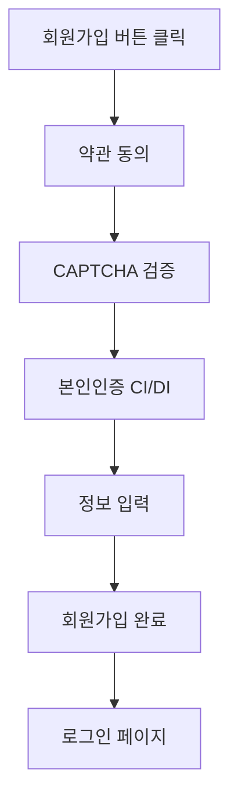
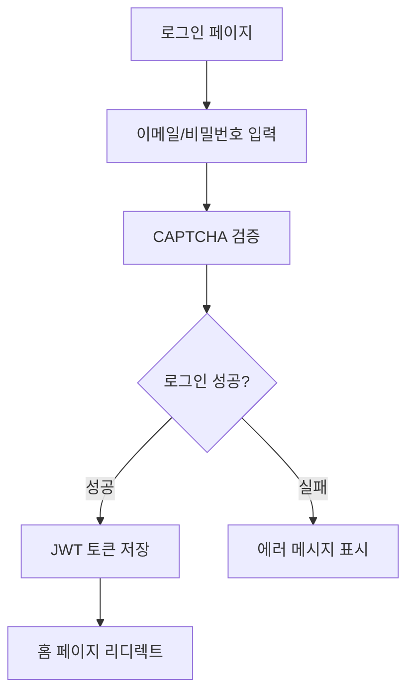
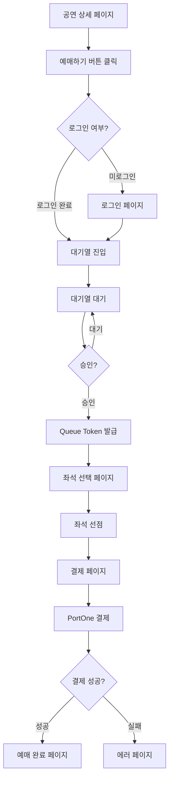

# 📄 페이지 구조 및 라우팅

## 1. 전체 페이지 목록

| 경로 | 페이지명 | 설명 | 인증 필요 | Queue Token 필요 |
|------|---------|------|:--------:|:----------------:|
| `/` | 홈 | 공연 목록 및 검색 | - | - |
| `/login` | 로그인 | 이메일/비밀번호 로그인 | - | - |
| `/signup` | 회원가입 | 약관동의 → CAPTCHA → 본인인증 → 정보입력 | - | - |
| `/events` | 공연 목록 | 페이징, 필터링, 검색 | - | - |
| `/events/[id]` | 공연 상세 | 공연 정보, 회차 목록, 좌석 정보 | - | - |
| `/queue/[scheduleId]` | 대기열 | 대기열 진입 및 상태 조회 | O | - |
| `/reservation/[scheduleId]` | 좌석 선택 | 실시간 좌석 상태 조회 및 선점 | O | O |
| `/payment/[reservationId]` | 결제 | PortOne 결제 위젯 | O | O |
| `/payment/complete` | 결제 완료 | 예매 완료 확인 | O | - |
| `/mypage` | 마이페이지 | 예매 내역, 프로필 관리 | O | - |
| `/mypage/reservations` | 예매 내역 | 나의 예매 목록 | O | - |
| `/mypage/profile` | 프로필 관리 | 정보 수정, 비밀번호 변경 | O | - |

---

## 2. App Router 구조

Next.js 15의 App Router를 사용하며, 라우트 그룹으로 레이아웃을 분리합니다.

### 2.1 디렉토리 구조

```
src/app/
├── layout.tsx                 # 루트 레이아웃 (공통 헤더/푸터)
├── page.tsx                   # 홈 페이지 (/)
├── error.tsx                  # 전역 에러 바운더리
├── loading.tsx                # 전역 로딩 UI
├── not-found.tsx              # 404 페이지
│
├── (auth)/                    # 인증 라우트 그룹
│   ├── layout.tsx             # 인증 레이아웃 (로고만 있는 심플한 레이아웃)
│   ├── login/
│   │   └── page.tsx
│   └── signup/
│       ├── page.tsx
│       ├── terms/page.tsx     # 약관 동의
│       ├── captcha/page.tsx   # CAPTCHA 검증
│       ├── verify/page.tsx    # 본인인증
│       └── info/page.tsx      # 정보 입력
│
├── (main)/                    # 메인 라우트 그룹
│   ├── layout.tsx             # 메인 레이아웃 (헤더, 푸터 포함)
│   ├── events/
│   │   ├── page.tsx           # 공연 목록
│   │   └── [id]/
│   │       └── page.tsx       # 공연 상세
│   ├── queue/
│   │   └── [scheduleId]/
│   │       └── page.tsx       # 대기열
│   ├── reservation/
│   │   └── [scheduleId]/
│   │       └── page.tsx       # 좌석 선택
│   ├── payment/
│   │   ├── [reservationId]/
│   │   │   └── page.tsx       # 결제
│   │   └── complete/
│   │       └── page.tsx       # 결제 완료
│   └── mypage/
│       ├── page.tsx           # 마이페이지 메인
│       ├── reservations/
│       │   └── page.tsx       # 예매 내역
│       └── profile/
│           └── page.tsx       # 프로필 관리
│
└── api/                       # API 라우트 (선택)
    └── auth/
        └── refresh/
            └── route.ts       # Refresh Token 갱신
```

---

## 3. 라우트 그룹별 레이아웃 계층

### 3.1 루트 레이아웃 (`app/layout.tsx`)

**책임**:
- HTML 구조 (html, body)
- 전역 스타일 적용
- React Query Provider
- Zustand 스토어 초기화
- 전역 에러 바운더리

**적용 범위**: 모든 페이지

```tsx
// app/layout.tsx
export default function RootLayout({ children }: { children: React.ReactNode }) {
  return (
    <html lang="ko">
      <body>
        <Providers>
          {children}
        </Providers>
      </body>
    </html>
  )
}
```

### 3.2 인증 레이아웃 (`app/(auth)/layout.tsx`)

**책임**:
- 로고 중앙 배치
- 심플한 레이아웃 (헤더/푸터 없음)
- 인증 플로우 진행 상황 표시 (회원가입 단계 표시)

**적용 범위**: `/login`, `/signup` 하위 페이지

```tsx
// app/(auth)/layout.tsx
export default function AuthLayout({ children }: { children: React.ReactNode }) {
  return (
    <div className="min-h-screen flex flex-col items-center justify-center">
      <Logo />
      <div className="w-full max-w-md">
        {children}
      </div>
    </div>
  )
}
```

### 3.3 메인 레이아웃 (`app/(main)/layout.tsx`)

**책임**:
- 헤더 (로고, 네비게이션, 사용자 메뉴)
- 푸터 (저작권, 링크)
- 네비게이션 메뉴
- 로그인 상태 표시

**적용 범위**: `/events`, `/queue`, `/reservation`, `/payment`, `/mypage` 하위 페이지

```tsx
// app/(main)/layout.tsx
export default function MainLayout({ children }: { children: React.ReactNode }) {
  return (
    <div className="min-h-screen flex flex-col">
      <Header />
      <main className="flex-1">
        {children}
      </main>
      <Footer />
    </div>
  )
}
```

---

## 4. 미들웨어 (인증 체크, 리디렉트)

Next.js 미들웨어를 사용하여 인증 및 Queue Token 검증을 수행합니다.

### 4.1 `middleware.ts`

```typescript
// src/middleware.ts
import { NextResponse } from 'next/server'
import type { NextRequest } from 'next/server'
import { verifyAccessToken } from '@/lib/auth/jwt'
import { verifyQueueToken } from '@/lib/auth/queue'

const PUBLIC_PATHS = ['/', '/login', '/signup', '/events']
const QUEUE_TOKEN_REQUIRED_PATHS = ['/reservation', '/payment']

export async function middleware(request: NextRequest) {
  const { pathname } = request.nextUrl

  // 1. 공개 경로는 통과
  if (PUBLIC_PATHS.some(path => pathname.startsWith(path))) {
    return NextResponse.next()
  }

  // 2. 인증 필요 경로 체크
  const accessToken = request.cookies.get('accessToken')?.value

  if (!accessToken) {
    // 로그인 페이지로 리디렉트
    return NextResponse.redirect(new URL('/login', request.url))
  }

  try {
    await verifyAccessToken(accessToken)
  } catch (error) {
    // Access Token 만료 또는 유효하지 않음
    return NextResponse.redirect(new URL('/login', request.url))
  }

  // 3. Queue Token 필요 경로 체크
  if (QUEUE_TOKEN_REQUIRED_PATHS.some(path => pathname.startsWith(path))) {
    const queueToken = request.cookies.get('queueToken')?.value

    if (!queueToken) {
      // 대기열 페이지로 리디렉트
      return NextResponse.redirect(new URL('/queue', request.url))
    }

    try {
      await verifyQueueToken(queueToken)
    } catch (error) {
      // Queue Token 만료 또는 유효하지 않음
      return NextResponse.redirect(new URL('/queue', request.url))
    }
  }

  return NextResponse.next()
}

export const config = {
  matcher: [
    '/((?!api|_next/static|_next/image|favicon.ico).*)',
  ],
}
```

---

## 5. 페이지별 SSR/CSR 전략

> **CSR-First 설계 원칙**: 프론트엔드는 CSR(Client-Side Rendering)을 기본으로 하며, SSR은 SEO가 필수적인 공개 페이지에만 적용합니다. 이는 (1) 백엔드 부하 분산 - SSR은 서버 측 API 호출을 유발하므로 불필요한 오버헤드 방지, (2) API 흐름 투명화 - 브라우저 → Gateway → 백엔드 경로가 명확하게 유지됨, (3) 개발 리소스 집중 - 프로젝트의 핵심인 대기열/분산 락/SAGA 패턴 등 백엔드 기술 검증에 집중하기 위한 전략입니다.

| 페이지 | 렌더링 전략 | 이유 |
|--------|------------|------|
| `/` (홈) | SSR | SEO, 초기 로딩 속도 |
| `/login` | CSR | 인증 플로우, SEO 불필요 |
| `/signup` | CSR | 인증 플로우, SEO 불필요 |
| `/events` | SSR | SEO, 공연 목록 크롤링 |
| `/events/[id]` | SSR | SEO, 공연 상세 OG 태그 |
| `/queue/[scheduleId]` | CSR | 실시간 폴링, SEO 불필요 |
| `/reservation/[scheduleId]` | CSR | 실시간 좌석 상태, SEO 불필요 |
| `/payment/[reservationId]` | CSR | 결제 위젯, SEO 불필요 |
| `/payment/complete` | CSR | 결제 완료, SEO 불필요 |
| `/mypage` | CSR | 사용자 데이터, SEO 불필요 |

### 5.1 SSR 예시 (`/events`)

```tsx
// app/(main)/events/page.tsx
import { getEvents } from '@/lib/api/events'

export default async function EventsPage() {
  const events = await getEvents() // Server-side fetch

  return (
    <div>
      <h1>공연 목록</h1>
      <EventList events={events} />
    </div>
  )
}
```

### 5.2 CSR 예시 (`/queue/[scheduleId]`)

```tsx
// app/(main)/queue/[scheduleId]/page.tsx
'use client'

import { useQueueStatus } from '@/hooks/useQueueStatus'

export default function QueuePage({ params }: { params: { scheduleId: string } }) {
  const { data, isLoading } = useQueueStatus(params.scheduleId)

  if (isLoading) return <LoadingSpinner />

  return (
    <div>
      <h1>대기열</h1>
      <QueueStatus data={data} />
    </div>
  )
}
```

---

## 6. 화면 흐름도

### 6.1 회원가입 플로우



### 6.2 로그인 플로우



### 6.3 티켓팅 플로우



---

## 7. 에러 페이지 전략

### 7.1 `error.tsx` (에러 바운더리)

```tsx
// app/error.tsx
'use client'

export default function Error({
  error,
  reset,
}: {
  error: Error & { digest?: string }
  reset: () => void
}) {
  return (
    <div className="flex flex-col items-center justify-center min-h-screen">
      <h2>문제가 발생했습니다</h2>
      <p>{error.message}</p>
      <button onClick={() => reset()}>다시 시도</button>
    </div>
  )
}
```

### 7.2 `not-found.tsx` (404 페이지)

```tsx
// app/not-found.tsx
export default function NotFound() {
  return (
    <div className="flex flex-col items-center justify-center min-h-screen">
      <h2>404 - 페이지를 찾을 수 없습니다</h2>
      <Link href="/">홈으로 돌아가기</Link>
    </div>
  )
}
```

---

## 8. 참조 문서

- **컴포넌트 설계**: [02_components.md](./02_components.md)
- **상태 관리**: [03_state_data.md](./03_state_data.md)
- **인증/인가**: [04_auth_security.md](./04_auth_security.md)
- **백엔드 API**: [`docs/specification/`](../specification/)
