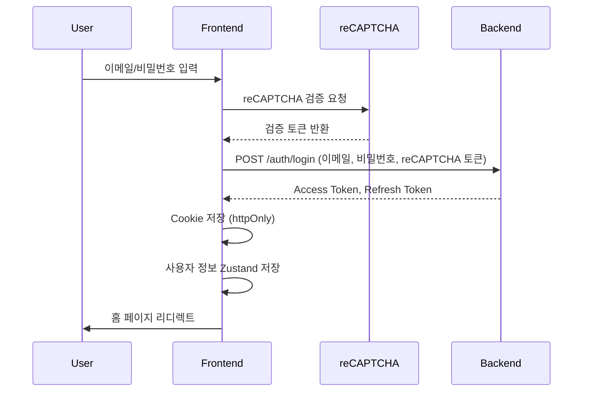
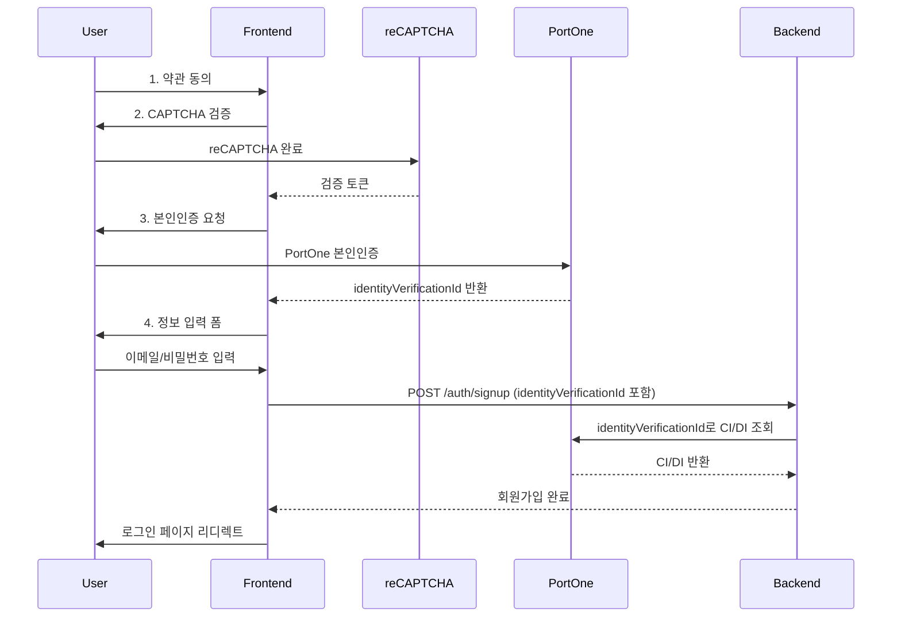
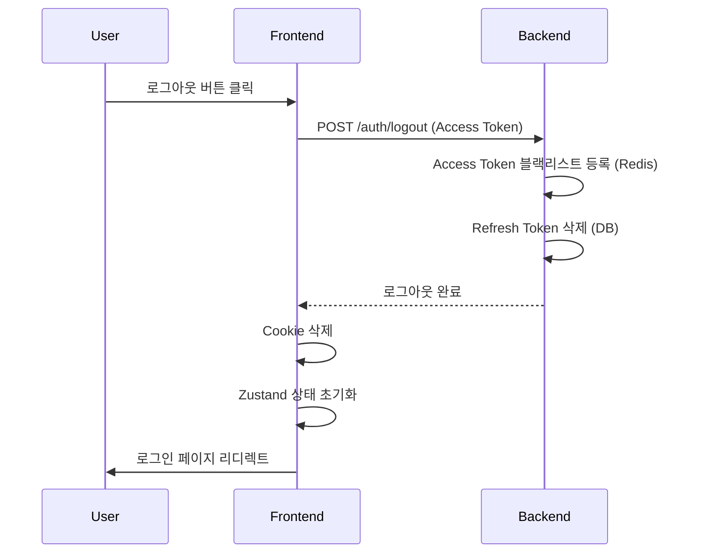

# 🔐 인증/인가 흐름

## 1. JWT 토큰 저장 전략

### 1.1 저장 위치

| 토큰 타입 | 저장 위치 | 설정 | 이유 |
|----------|----------|------|------|
| **Access Token** | httpOnly Cookie | Secure, SameSite=Strict | XSS 공격 방지 |
| **Refresh Token** | httpOnly Cookie | Secure, SameSite=Strict, HttpOnly | XSS/CSRF 공격 방지 |
| **Queue Token** | httpOnly Cookie | Secure, SameSite=Strict, TTL 10분 | 대기열 통과 후 발급 |

### 1.2 Cookie 설정

```typescript
// lib/auth/cookies.ts
export function setAccessToken(token: string) {
  document.cookie = `accessToken=${token}; Secure; SameSite=Strict; Path=/; Max-Age=3600` // 1시간
}

export function setRefreshToken(token: string) {
  document.cookie = `refreshToken=${token}; Secure; SameSite=Strict; HttpOnly; Path=/; Max-Age=604800` // 7일
}

export function setQueueToken(token: string) {
  document.cookie = `queueToken=${token}; Secure; SameSite=Strict; Path=/; Max-Age=600` // 10분
}

export function clearTokens() {
  document.cookie = 'accessToken=; Max-Age=0; Path=/'
  document.cookie = 'refreshToken=; Max-Age=0; Path=/'
  document.cookie = 'queueToken=; Max-Age=0; Path=/'
}
```

### 1.3 토큰 검증

```typescript
// lib/auth/jwt.ts
import { jwtVerify } from 'jose'

export async function verifyAccessToken(token: string) {
  const secret = new TextEncoder().encode(process.env.JWT_SECRET)

  try {
    const { payload } = await jwtVerify(token, secret)
    return payload
  } catch (error) {
    throw new Error('Invalid or expired token')
  }
}
```

---

## 2. 로그인/회원가입 화면 흐름

### 2.1 로그인 플로우



#### 2.1.1 로그인 컴포넌트

```typescript
// components/domain/auth/LoginForm.tsx
'use client'

import { useForm } from 'react-hook-form'
import { zodResolver } from '@hookform/resolvers/zod'
import { z } from 'zod'
import { useLogin } from '@/hooks/useLogin'
import ReCAPTCHA from 'react-google-recaptcha'

const loginSchema = z.object({
  email: z.string().email('올바른 이메일 형식이 아닙니다'),
  password: z.string().min(8, '비밀번호는 최소 8자 이상입니다'),
})

type LoginFormData = z.infer<typeof loginSchema>

export default function LoginForm() {
  const { register, handleSubmit, formState: { errors } } = useForm<LoginFormData>({
    resolver: zodResolver(loginSchema),
  })
  const [recaptchaToken, setRecaptchaToken] = useState<string | null>(null)
  const loginMutation = useLogin()

  const onSubmit = (data: LoginFormData) => {
    if (!recaptchaToken) {
      toast.error('reCAPTCHA를 완료해주세요.')
      return
    }

    loginMutation.mutate({
      ...data,
      recaptchaToken,
    })
  }

  return (
    <form onSubmit={handleSubmit(onSubmit)}>
      <Input
        label="이메일"
        type="email"
        {...register('email')}
        error={errors.email?.message}
      />

      <Input
        label="비밀번호"
        type="password"
        {...register('password')}
        error={errors.password?.message}
      />

      <ReCAPTCHA
        sitekey={process.env.NEXT_PUBLIC_RECAPTCHA_SITE_KEY!}
        onChange={(token) => setRecaptchaToken(token)}
      />

      <Button
        type="submit"
        variant="primary"
        loading={loginMutation.isPending}
      >
        로그인
      </Button>
    </form>
  )
}
```

#### 2.1.2 로그인 Mutation

```typescript
// hooks/useLogin.ts
import { useMutation } from '@tanstack/react-query'
import { useRouter } from 'next/navigation'
import { login } from '@/lib/api/auth'
import { useAuthStore } from '@/stores/authStore'
import { setAccessToken, setRefreshToken } from '@/lib/auth/cookies'

export function useLogin() {
  const router = useRouter()
  const { setUser, setAccessToken: storeAccessToken } = useAuthStore()

  return useMutation({
    mutationFn: login,
    onSuccess: (data) => {
      // Cookie에 토큰 저장
      setAccessToken(data.accessToken)
      setRefreshToken(data.refreshToken)

      // Zustand에 사용자 정보 저장
      setUser(data.user)
      storeAccessToken(data.accessToken)

      toast.success('로그인에 성공했습니다.')
      router.push('/')
    },
    onError: (error) => {
      if (error.response?.status === 401) {
        toast.error('이메일 또는 비밀번호가 올바르지 않습니다.')
      } else {
        toast.error('로그인에 실패했습니다. 다시 시도해주세요.')
      }
    },
  })
}
```

### 2.2 회원가입 플로우



#### 2.2.1 회원가입 단계별 컴포넌트

**1단계: 약관 동의**

```typescript
// components/domain/auth/signup/TermsStep.tsx
'use client'

export default function TermsStep({ onNext }: { onNext: () => void }) {
  const [serviceTerms, setServiceTerms] = useState(false)
  const [privacyTerms, setPrivacyTerms] = useState(false)

  const canProceed = serviceTerms && privacyTerms

  return (
    <div>
      <h2>약관 동의</h2>

      <Checkbox
        checked={serviceTerms}
        onChange={setServiceTerms}
        label="서비스 이용약관 (필수)"
      />

      <Checkbox
        checked={privacyTerms}
        onChange={setPrivacyTerms}
        label="개인정보 수집 및 이용 동의 (필수)"
      />

      <Button
        onClick={onNext}
        disabled={!canProceed}
      >
        다음
      </Button>
    </div>
  )
}
```

**2단계: reCAPTCHA 검증**

```typescript
// components/domain/auth/signup/CaptchaStep.tsx
'use client'

import ReCAPTCHA from 'react-google-recaptcha'

export default function CaptchaStep({ onNext }: { onNext: (token: string) => void }) {
  const [token, setToken] = useState<string | null>(null)

  return (
    <div>
      <h2>자동 가입 방지</h2>

      <ReCAPTCHA
        sitekey={process.env.NEXT_PUBLIC_RECAPTCHA_SITE_KEY!}
        onChange={(token) => setToken(token)}
      />

      <Button
        onClick={() => token && onNext(token)}
        disabled={!token}
      >
        다음
      </Button>
    </div>
  )
}
```

**3단계: 본인인증 (PortOne Identity Verification)**

```typescript
// components/domain/signup/VerifyStep.tsx
'use client'

import { useState } from 'react'
import { toast } from 'sonner'
import { ShieldCheckIcon } from 'lucide-react'
import { Button } from '@/components/ui/button'
import { requestIdentityVerification } from '@/lib/portone/identity-verification'

interface VerifyStepProps {
  onNext: (identityVerificationId: string) => void
  onBack: () => void
}

export function VerifyStep({ onNext, onBack }: VerifyStepProps) {
  const [isPending, setIsPending] = useState(false)
  const [verified, setVerified] = useState(false)

  async function handleVerify() {
    setIsPending(true)
    try {
      const identityVerificationId = await requestIdentityVerification()
      setVerified(true)
      onNext(identityVerificationId)
    } catch (err) {
      const message =
        err instanceof Error ? err.message : '본인인증에 실패했습니다.'
      toast.error(message)
    } finally {
      setIsPending(false)
    }
  }

  return (
    <div className="space-y-6">
      <div>
        <h2 className="text-lg font-semibold text-foreground">본인인증</h2>
        <p className="text-sm text-muted-foreground mt-1">
          안전한 서비스 이용을 위해 본인인증이 필요합니다.
        </p>
      </div>

      <div className="flex flex-col items-center gap-4 py-6 rounded-lg border bg-muted/30">
        <ShieldCheckIcon
          className={`w-12 h-12 ${verified ? 'text-primary' : 'text-muted-foreground'}`}
        />
        <p className="text-sm text-muted-foreground text-center">
          {verified
            ? '본인인증이 완료되었습니다.'
            : '아래 버튼을 클릭하여 본인인증을 진행해주세요.'}
        </p>
        {!verified && (
          <Button
            variant="outline"
            onClick={handleVerify}
            loading={isPending}
            disabled={isPending}
          >
            본인인증하기
          </Button>
        )}
      </div>

      <Button variant="outline" className="w-full" onClick={onBack}>
        이전
      </Button>
    </div>
  )
}
```

**4단계: 정보 입력**

```typescript
// components/domain/auth/signup/InfoStep.tsx
'use client'

import { useForm } from 'react-hook-form'
import { zodResolver } from '@hookform/resolvers/zod'
import { z } from 'zod'
import { useSignup } from '@/hooks/useSignup'

const signupSchema = z.object({
  email: z.string().email('올바른 이메일 형식이 아닙니다'),
  password: z.string()
    .min(8, '비밀번호는 최소 8자 이상입니다')
    .regex(/^(?=.*[a-z])(?=.*[A-Z])(?=.*\d)(?=.*[@$!%*?&])/, '영문 대소문자, 숫자, 특수문자를 포함해야 합니다'),
  passwordConfirm: z.string(),
  name: z.string().min(2, '이름은 최소 2자 이상입니다'),
  phone: z.string().regex(/^010-\d{4}-\d{4}$/, '올바른 전화번호 형식이 아닙니다'),
}).refine((data) => data.password === data.passwordConfirm, {
  message: '비밀번호가 일치하지 않습니다',
  path: ['passwordConfirm'],
})

type SignupFormData = z.infer<typeof signupSchema>

export default function InfoStep({
  recaptchaToken,
  identityVerificationId,
}: {
  recaptchaToken: string
  identityVerificationId: string
}) {
  const { register, handleSubmit, formState: { errors } } = useForm<SignupFormData>({
    resolver: zodResolver(signupSchema),
  })
  const signupMutation = useSignup()

  const onSubmit = (data: SignupFormData) => {
    signupMutation.mutate({
      ...data,
      recaptchaToken,
      identityVerificationId,
    })
  }

  return (
    <form onSubmit={handleSubmit(onSubmit)}>
      <Input
        label="이메일"
        type="email"
        {...register('email')}
        error={errors.email?.message}
      />

      <Input
        label="비밀번호"
        type="password"
        {...register('password')}
        error={errors.password?.message}
      />

      <Input
        label="비밀번호 확인"
        type="password"
        {...register('passwordConfirm')}
        error={errors.passwordConfirm?.message}
      />

      <Input
        label="이름"
        {...register('name')}
        error={errors.name?.message}
      />

      <Input
        label="전화번호"
        placeholder="010-1234-5678"
        {...register('phone')}
        error={errors.phone?.message}
      />

      <Button
        type="submit"
        variant="primary"
        loading={signupMutation.isPending}
      >
        가입완료
      </Button>
    </form>
  )
}
```

---

## 3. reCAPTCHA 연동

### 3.1 reCAPTCHA v2 설정

```typescript
// components/domain/auth/RecaptchaWidget.tsx
'use client'

import ReCAPTCHA from 'react-google-recaptcha'

interface RecaptchaWidgetProps {
  onVerify: (token: string) => void
}

export default function RecaptchaWidget({ onVerify }: RecaptchaWidgetProps) {
  return (
    <ReCAPTCHA
      sitekey={process.env.NEXT_PUBLIC_RECAPTCHA_SITE_KEY!}
      onChange={(token) => token && onVerify(token)}
      theme="light"
      size="normal"
    />
  )
}
```

### 3.2 백엔드 검증 플로우

1. 프론트엔드: reCAPTCHA 위젯 완료 → 토큰 발급
2. 프론트엔드 → 백엔드: 토큰 포함하여 로그인/회원가입 요청
3. 백엔드: Google reCAPTCHA API로 토큰 검증
4. 백엔드: 검증 성공 시 로그인/회원가입 진행

---

## 4. 본인인증 (PortOne CI/DI) 연동 흐름

### 4.1 PortOne 본인인증 유틸리티

PortOne V2 SDK는 CDN 스크립트 대신 npm 패키지(`@portone/browser-sdk/v2`)로 import합니다.
환경변수는 `NEXT_PUBLIC_PORTONE_IMP_CODE` 대신 `NEXT_PUBLIC_PORTONE_STORE_ID`와 `NEXT_PUBLIC_PORTONE_CHANNEL_KEY`를 사용합니다.

```typescript
// lib/portone/identity-verification.ts
import PortOne from '@portone/browser-sdk/v2'

export async function requestIdentityVerification(): Promise<string> {
  const storeId = process.env.NEXT_PUBLIC_PORTONE_STORE_ID
  if (!storeId) {
    throw new Error('PortOne Store ID가 설정되지 않았습니다.')
  }

  const channelKey = process.env.NEXT_PUBLIC_PORTONE_CHANNEL_KEY
  if (!channelKey) {
    throw new Error('PortOne Channel Key가 설정되지 않았습니다.')
  }

  const identityVerificationId = `identity-${crypto.randomUUID()}`

  const response = await PortOne.requestIdentityVerification({
    storeId,
    identityVerificationId,
    channelKey,
  })

  if (response?.code !== undefined) {
    if (response.code === 'IDENTITY_VERIFICATION_CANCELLED') {
      throw new Error('본인인증이 취소되었습니다.')
    }
    throw new Error(response.message ?? '본인인증에 실패했습니다.')
  }

  return identityVerificationId
}
```

### 4.2 본인인증 함수 사용

`requestIdentityVerification()`은 Hook이 아닌 순수 비동기 함수로, `VerifyStep` 컴포넌트에서 직접 호출합니다.
함수는 성공 시 `identityVerificationId` 문자열을 반환하며, 이 값을 회원가입 API 요청에 포함합니다.

```typescript
// 사용 예시 (VerifyStep에서 직접 호출)
const identityVerificationId = await requestIdentityVerification()
onNext(identityVerificationId) // 다음 단계(InfoStep)로 전달
```

### 4.3 백엔드 CI/DI 수집 흐름

프론트엔드에서 별도의 CI/DI 수집 API를 호출하지 않습니다. 대신 다음 흐름으로 처리됩니다:

1. 프론트엔드: `requestIdentityVerification()` 호출 → `identityVerificationId` 반환
2. 프론트엔드: 회원가입 요청(`POST /auth/signup`)에 `identityVerificationId` 포함
3. 백엔드(User Service): PortOne 서버 API를 직접 호출하여 `identityVerificationId`로 CI/DI 조회
4. 백엔드: CI Hash로 1인 1계정 중복 검사 후 회원 저장

이 방식은 V1의 `/auth/verify-certification` 엔드포인트를 제거하고, 회원가입 단일 요청으로 본인인증 검증을 완료합니다.

---

## 5. Next.js 미들웨어 기반 인증 가드

### 5.1 미들웨어 구현

```typescript
// src/middleware.ts
import { NextResponse } from 'next/server'
import type { NextRequest } from 'next/server'
import { verifyAccessToken } from '@/lib/auth/jwt'

const PUBLIC_PATHS = ['/', '/login', '/signup', '/events']

export async function middleware(request: NextRequest) {
  const { pathname } = request.nextUrl

  // 공개 경로는 통과
  if (PUBLIC_PATHS.some(path => pathname.startsWith(path))) {
    return NextResponse.next()
  }

  // Access Token 확인
  const accessToken = request.cookies.get('accessToken')?.value

  if (!accessToken) {
    // 로그인 페이지로 리디렉트
    return NextResponse.redirect(new URL('/login', request.url))
  }

  try {
    await verifyAccessToken(accessToken)
    return NextResponse.next()
  } catch (error) {
    // Access Token 만료 또는 유효하지 않음
    return NextResponse.redirect(new URL('/login', request.url))
  }
}

export const config = {
  matcher: [
    '/((?!api|_next/static|_next/image|favicon.ico).*)',
  ],
}
```

---

## 6. 토큰 갱신 (Refresh) 자동화

### 6.1 Axios Interceptor로 자동 갱신

```typescript
// lib/api/axios.ts (Response Interceptor 부분)
apiClient.interceptors.response.use(
  (response) => response,
  async (error) => {
    const originalRequest = error.config

    // Access Token 만료 시 (401)
    if (error.response?.status === 401 && !originalRequest._retry) {
      originalRequest._retry = true

      try {
        // Refresh Token으로 Access Token 갱신
        const { data } = await axios.post(
          `${process.env.NEXT_PUBLIC_API_BASE_URL}/auth/refresh`,
          {},
          { withCredentials: true } // Refresh Token은 httpOnly Cookie
        )

        // 새로운 Access Token 저장
        setAccessToken(data.accessToken)
        useAuthStore.getState().setAccessToken(data.accessToken)

        // 원래 요청 재시도
        originalRequest.headers.Authorization = `Bearer ${data.accessToken}`
        return apiClient(originalRequest)
      } catch (refreshError) {
        // Refresh Token도 만료된 경우 로그아웃
        useAuthStore.getState().logout()
        clearTokens()
        window.location.href = '/login'
        return Promise.reject(refreshError)
      }
    }

    return Promise.reject(error)
  }
)
```

### 6.2 Refresh Token Rotation (RTR)

백엔드에서 토큰 갱신 시 신규 Refresh Token 발급 및 기존 토큰 폐기:

```
1. 클라이언트: POST /auth/refresh (Refresh Token in Cookie)
2. 백엔드: Refresh Token 검증
3. 백엔드: 신규 Access Token + 신규 Refresh Token 발급
4. 백엔드: 기존 Refresh Token 삭제 (DB)
5. 클라이언트: 새로운 토큰 저장
```

---

## 7. 로그아웃

### 7.1 로그아웃 Hook

```typescript
// hooks/useLogout.ts
import { useMutation } from '@tanstack/react-query'
import { useRouter } from 'next/navigation'
import { logout } from '@/lib/api/auth'
import { useAuthStore } from '@/stores/authStore'
import { clearTokens } from '@/lib/auth/cookies'

export function useLogout() {
  const router = useRouter()
  const { logout: clearAuthState } = useAuthStore()

  return useMutation({
    mutationFn: logout,
    onSuccess: () => {
      // Zustand 상태 초기화
      clearAuthState()

      // Cookie 삭제
      clearTokens()

      toast.success('로그아웃되었습니다.')
      router.push('/login')
    },
  })
}
```

### 7.2 로그아웃 플로우



---

## 8. 참조 문서

- **백엔드 인증 API**: [`docs/specification/01_user_service.md`](../specification/01_user_service.md)
- **페이지 구조**: [01_pages.md](./01_pages.md)
- **상태 관리**: [03_state_data.md](./03_state_data.md)
