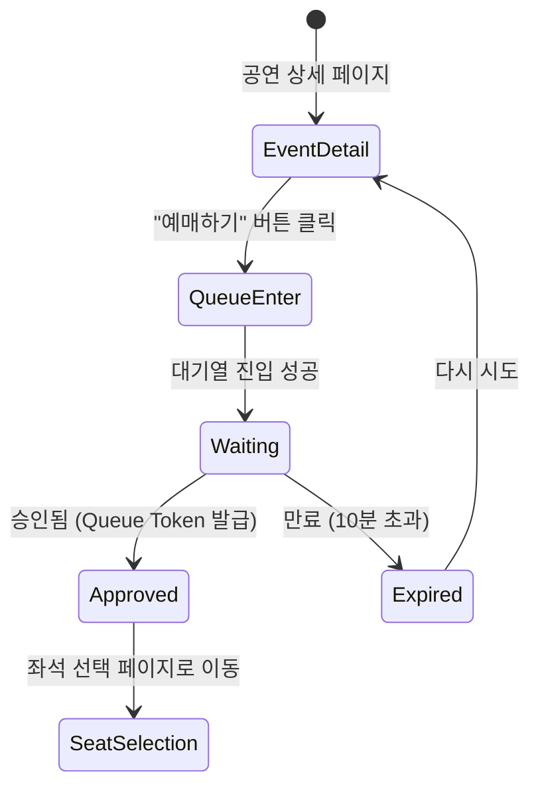

# ⏱️ 대기열 UX 설계

## 1. 대기열 진입 → 대기 → 승인 화면 전환 흐름

### 1.1 전체 플로우



### 1.2 화면별 상세 흐름

#### 1.2.1 공연 상세 페이지 (`/events/[id]`)

**상태**:
- 사용자가 "예매하기" 버튼 클릭
- 로그인 여부 확인

**UX**:
```tsx
<Button
  variant="primary"
  size="lg"
  onClick={handleReservation}
>
  예매하기
</Button>
```

**로직**:
```typescript
const handleReservation = async () => {
  // 1. 로그인 확인
  if (!isAuthenticated) {
    router.push('/login')
    return
  }

  // 2. 대기열 진입
  try {
    await enterQueue(scheduleId)
    router.push(`/queue/${scheduleId}`)
  } catch (error) {
    if (error.code === 'QUEUE_FULL') {
      toast.error('대기열이 가득 찼습니다. 잠시 후 다시 시도해주세요.')
    } else {
      toast.error('대기열 진입에 실패했습니다.')
    }
  }
}
```

#### 1.2.2 대기열 페이지 (`/queue/[scheduleId]`)

**상태**:
- `WAITING`: 대기 중
- `APPROVED`: 승인됨 (Queue Token 발급)
- `EXPIRED`: 만료됨 (10분 초과)

**UX 구성 요소**:
1. 현재 대기 순서
2. 예상 대기 시간
3. 진행 바 (Progress Bar)
4. 타이머 (TTL 10분)
5. 안내 메시지

---

## 2. 폴링 전략 (5초 간격 REST 폴링)

### 2.1 React Query를 활용한 폴링

```typescript
// hooks/useQueueStatus.ts
import { useQuery } from '@tanstack/react-query'
import { queryKeys } from '@/lib/react-query/queryKeys'
import { getQueueStatus } from '@/lib/api/queue'

export function useQueueStatus(scheduleId: string) {
  return useQuery({
    queryKey: queryKeys.queue.status(scheduleId),
    queryFn: () => getQueueStatus(scheduleId),
    refetchInterval: 5000, // 5초마다 폴링
    staleTime: 0, // 항상 최신 데이터 요청
    enabled: !!scheduleId,
    retry: 3, // 실패 시 3회 재시도
  })
}
```

### 2.2 폴링 응답 처리

```typescript
// components/domain/queue/QueueStatus.tsx
'use client'

import { useQueueStatus } from '@/hooks/useQueueStatus'
import { useRouter } from 'next/navigation'
import { useEffect } from 'react'

export default function QueueStatus({ scheduleId }: { scheduleId: string }) {
  const { data, isLoading, error } = useQueueStatus(scheduleId)
  const router = useRouter()

  useEffect(() => {
    if (data?.status === 'APPROVED') {
      // Queue Token 발급됨 → 좌석 선택 페이지로 이동
      toast.success('대기열을 통과했습니다! 10분 안에 좌석을 선택해주세요.')
      router.push(`/reservation/${scheduleId}`)
    } else if (data?.status === 'EXPIRED') {
      // 만료됨 → 공연 상세 페이지로 이동
      toast.error('대기 시간이 만료되었습니다. 다시 시도해주세요.')
      router.push(`/events/${data.eventId}`)
    }
  }, [data?.status])

  if (isLoading) return <QueueSkeleton />
  if (error) return <QueueError error={error} />

  return (
    <div className="flex flex-col items-center justify-center min-h-screen p-6">
      <QueueProgress position={data.position} totalInQueue={data.totalInQueue} />
      <QueuePosition position={data.position} />
      <EstimatedTime estimatedTime={data.estimatedTime} />
      <QueueTimer expiresAt={data.expiresAt} />
      <QueueInfo />
    </div>
  )
}
```

---

## 3. 대기 순서/예상 시간 UI

### 3.1 대기 순서 표시

```typescript
// components/domain/queue/QueuePosition.tsx
interface QueuePositionProps {
  position: number
}

export default function QueuePosition({ position }: QueuePositionProps) {
  return (
    <div className="text-center">
      <h2 className="text-6xl font-bold text-primary">
        {position.toLocaleString()}
        <span className="text-2xl">번째</span>
      </h2>
      <p className="text-lg text-gray-600 mt-2">현재 대기 순서입니다</p>
    </div>
  )
}
```

### 3.2 예상 대기 시간 표시

```typescript
// components/domain/queue/EstimatedTime.tsx
interface EstimatedTimeProps {
  estimatedTime: number // 분 단위
}

export default function EstimatedTime({ estimatedTime }: EstimatedTimeProps) {
  const formatTime = (minutes: number) => {
    if (minutes < 60) {
      return `약 ${minutes}분`
    }
    const hours = Math.floor(minutes / 60)
    const mins = minutes % 60
    return `약 ${hours}시간 ${mins}분`
  }

  return (
    <div className="text-center mt-6">
      <p className="text-xl text-gray-700">
        예상 대기 시간: <span className="font-semibold">{formatTime(estimatedTime)}</span>
      </p>
      <p className="text-sm text-gray-500 mt-1">
        * 예상 시간은 실시간으로 변경될 수 있습니다.
      </p>
    </div>
  )
}
```

### 3.3 진행 바 (Progress Bar)

```typescript
// components/domain/queue/QueueProgress.tsx
interface QueueProgressProps {
  position: number
  totalInQueue: number
}

export default function QueueProgress({ position, totalInQueue }: QueueProgressProps) {
  const progressPercentage = ((totalInQueue - position) / totalInQueue) * 100

  return (
    <div className="w-full max-w-md mb-8">
      <div className="h-4 bg-gray-200 rounded-full overflow-hidden">
        <div
          className="h-full bg-primary transition-all duration-500"
          style={{ width: `${progressPercentage}%` }}
        />
      </div>
      <p className="text-sm text-gray-600 mt-2 text-center">
        {progressPercentage.toFixed(1)}% 진행됨
      </p>
    </div>
  )
}
```

---

## 4. Queue Token 만료 시 UX (401 → 대기열 페이지 리디렉션)

### 4.1 만료 시나리오

| 시나리오 | 상태 | 프론트엔드 동작 |
|---------|------|----------------|
| **대기열 대기 중 만료** | `EXPIRED` (10분 초과) | 공연 상세 페이지로 리디렉트 + 에러 메시지 |
| **좌석 선택 중 Queue Token 만료** | 401 Unauthorized | 대기열 페이지로 리디렉트 + 에러 메시지 |
| **결제 중 Queue Token 만료** | 401 Unauthorized | 에러 메시지 (결제는 Reservation 기반으로 진행) |

### 4.2 Axios Interceptor로 401 처리

```typescript
// lib/api/axios.ts (Response Interceptor)
apiClient.interceptors.response.use(
  (response) => response,
  async (error) => {
    if (error.response?.status === 401) {
      const errorCode = error.response?.data?.code

      if (errorCode === 'QUEUE_TOKEN_EXPIRED') {
        // Queue Token 만료
        toast.error('대기열 토큰이 만료되었습니다. 다시 대기열에 진입해주세요.')

        // 현재 scheduleId 가져오기 (URL에서 추출)
        const scheduleId = extractScheduleIdFromPath(window.location.pathname)

        if (scheduleId) {
          window.location.href = `/queue/${scheduleId}`
        } else {
          window.location.href = '/events'
        }
      } else if (errorCode === 'INVALID_ACCESS_TOKEN') {
        // Access Token 만료 → Refresh Token 갱신 로직 (이미 구현됨)
        // ...
      }
    }

    return Promise.reject(error)
  }
)
```

### 4.3 만료 안내 메시지

```typescript
// components/domain/queue/QueueExpired.tsx
export default function QueueExpired() {
  return (
    <div className="flex flex-col items-center justify-center min-h-screen p-6">
      <div className="text-center">
        <svg className="w-24 h-24 mx-auto text-warning" /* 경고 아이콘 */ />
        <h2 className="text-2xl font-bold mt-4">대기 시간이 만료되었습니다</h2>
        <p className="text-gray-600 mt-2">
          10분 내에 좌석을 선택하지 않아 대기열이 만료되었습니다.
        </p>
        <p className="text-gray-600">
          다시 대기열에 진입해주세요.
        </p>

        <Button
          variant="primary"
          size="lg"
          className="mt-6"
          onClick={() => router.push(`/events/${eventId}`)}
        >
          공연 페이지로 돌아가기
        </Button>
      </div>
    </div>
  )
}
```

---

## 5. 타이머 UI (10분 TTL 시각화)

### 5.1 타이머 컴포넌트

```typescript
// components/domain/queue/QueueTimer.tsx
'use client'

import { useState, useEffect } from 'react'

interface QueueTimerProps {
  expiresAt: string // ISO 8601 형식
}

export default function QueueTimer({ expiresAt }: QueueTimerProps) {
  const [remainingTime, setRemainingTime] = useState<number>(0)

  useEffect(() => {
    const calculateRemainingTime = () => {
      const now = new Date().getTime()
      const expiry = new Date(expiresAt).getTime()
      const diff = Math.max(0, expiry - now)
      return Math.floor(diff / 1000) // 초 단위
    }

    setRemainingTime(calculateRemainingTime())

    const interval = setInterval(() => {
      const time = calculateRemainingTime()
      setRemainingTime(time)

      if (time === 0) {
        clearInterval(interval)
      }
    }, 1000)

    return () => clearInterval(interval)
  }, [expiresAt])

  const minutes = Math.floor(remainingTime / 60)
  const seconds = remainingTime % 60

  const isWarning = remainingTime < 120 // 2분 미만

  return (
    <div className={`text-center mt-8 p-4 border-2 rounded-lg ${
      isWarning ? 'border-warning bg-warning-light' : 'border-gray-300'
    }`}>
      <p className="text-sm text-gray-600 mb-1">남은 시간</p>
      <div className="text-4xl font-mono font-bold">
        {String(minutes).padStart(2, '0')}:{String(seconds).padStart(2, '0')}
      </div>
      {isWarning && (
        <p className="text-sm text-warning mt-2">
          ⚠️ 시간이 얼마 남지 않았습니다!
        </p>
      )}
    </div>
  )
}
```

### 5.2 타이머 시각적 효과

**색상 변화**:
- **10분 ~ 3분**: 파란색 (정상)
- **3분 ~ 1분**: 노란색 (경고)
- **1분 미만**: 빨간색 (위험)

**애니메이션**:
- 1분 미만일 때 깜빡이는 효과

```css
/* styles/timer.css */
@keyframes blink {
  0%, 50%, 100% { opacity: 1; }
  25%, 75% { opacity: 0.5; }
}

.timer-danger {
  animation: blink 1s infinite;
}
```

---

## 6. 대기열 이탈 (Leave Queue)

### 6.1 이탈 버튼

```typescript
// components/domain/queue/LeaveQueueButton.tsx
'use client'

import { useLeaveQueue } from '@/hooks/useLeaveQueue'
import { useRouter } from 'next/navigation'

export default function LeaveQueueButton({ scheduleId }: { scheduleId: string }) {
  const leaveQueueMutation = useLeaveQueue()
  const router = useRouter()

  const handleLeave = async () => {
    const confirmed = confirm('정말 대기열을 나가시겠습니까? 다시 진입하면 순서가 초기화됩니다.')

    if (!confirmed) return

    try {
      await leaveQueueMutation.mutateAsync(scheduleId)
      toast.success('대기열에서 나갔습니다.')
      router.push(`/events/${eventId}`)
    } catch (error) {
      toast.error('대기열 이탈에 실패했습니다.')
    }
  }

  return (
    <Button
      variant="outline"
      onClick={handleLeave}
      loading={leaveQueueMutation.isPending}
    >
      대기열 나가기
    </Button>
  )
}
```

---

## 7. 대기열 에러 처리

### 7.1 에러 타입별 UX

| 에러 코드 | 메시지 | 액션 |
|----------|--------|------|
| `QUEUE_FULL` | 대기열이 가득 찼습니다. 잠시 후 다시 시도해주세요. | 공연 상세 페이지로 이동 |
| `ALREADY_IN_QUEUE` | 이미 대기열에 진입하셨습니다. | 대기열 페이지로 이동 |
| `MULTIPLE_QUEUE_NOT_ALLOWED` | 동시에 여러 공연의 대기열에 진입할 수 없습니다. | 현재 대기 중인 공연 표시 |
| `QUEUE_TOKEN_EXPIRED` | 대기열 토큰이 만료되었습니다. | 대기열 재진입 |
| `SCHEDULE_NOT_FOUND` | 해당 회차를 찾을 수 없습니다. | 공연 목록으로 이동 |

### 7.2 에러 컴포넌트

```typescript
// components/domain/queue/QueueError.tsx
export default function QueueError({ error }: { error: any }) {
  const errorCode = error.response?.data?.code

  const getErrorMessage = (code: string) => {
    switch (code) {
      case 'QUEUE_FULL':
        return {
          title: '대기열이 가득 찼습니다',
          message: '잠시 후 다시 시도해주세요.',
          action: '공연 페이지로 돌아가기',
        }
      case 'ALREADY_IN_QUEUE':
        return {
          title: '이미 대기 중입니다',
          message: '현재 대기 중인 공연이 있습니다.',
          action: '대기열 확인하기',
        }
      default:
        return {
          title: '대기열 오류',
          message: '알 수 없는 오류가 발생했습니다.',
          action: '홈으로 돌아가기',
        }
    }
  }

  const { title, message, action } = getErrorMessage(errorCode)

  return (
    <div className="flex flex-col items-center justify-center min-h-screen p-6">
      <h2 className="text-2xl font-bold">{title}</h2>
      <p className="text-gray-600 mt-2">{message}</p>
      <Button
        variant="primary"
        className="mt-6"
        onClick={() => router.push('/')}
      >
        {action}
      </Button>
    </div>
  )
}
```

---

## 8. 참조 문서

- **백엔드 대기열 API**: [`docs/specification/03_queue_service.md`](../specification/03_queue_service.md)
- **페이지 구조**: [01_pages.md](./01_pages.md)
- **상태 관리**: [03_state_data.md](./03_state_data.md)
