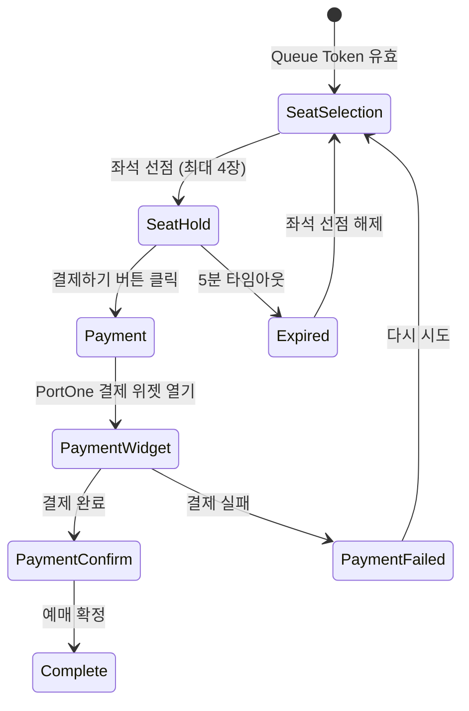

# 💳 결제 UX 설계

## 1. 좌석 선택 → 결제 → 완료 화면 흐름

### 1.1 전체 플로우



---

## 2. 좌석 선택 페이지 (`/reservation/[scheduleId]`)

### 2.1 좌석 맵 UI

```typescript
// components/domain/reservation/SeatMap.tsx
'use client'

import { useSeats } from '@/hooks/useSeats'
import { useReservationStore } from '@/stores/reservationStore'

export default function SeatMap({ scheduleId }: { scheduleId: string }) {
  const { data: seats, isLoading } = useSeats(scheduleId)
  const { selectedSeats, addSeat, removeSeat } = useReservationStore()

  if (isLoading) return <SeatMapSkeleton />

  const handleSeatClick = (seat: Seat) => {
    if (seat.status === 'SOLD' || seat.status === 'HOLD') {
      toast.error('이미 선점된 좌석입니다.')
      return
    }

    const isSelected = selectedSeats.some(s => s.id === seat.id)

    if (isSelected) {
      removeSeat(seat.id)
    } else {
      if (selectedSeats.length >= 4) {
        toast.error('최대 4장까지만 선택할 수 있습니다.')
        return
      }
      addSeat(seat)
    }
  }

  return (
    <div className="seat-map">
      <div className="stage">무대</div>

      <div className="seats-grid">
        {seats.map((seat) => (
          <SeatButton
            key={seat.id}
            seat={seat}
            isSelected={selectedSeats.some(s => s.id === seat.id)}
            onClick={() => handleSeatClick(seat)}
          />
        ))}
      </div>

      <SeatLegend />
    </div>
  )
}
```

### 2.2 좌석 상태 표시

```typescript
// components/domain/reservation/SeatButton.tsx
interface SeatButtonProps {
  seat: Seat
  isSelected: boolean
  onClick: () => void
}

export default function SeatButton({ seat, isSelected, onClick }: SeatButtonProps) {
  const getSeatColor = () => {
    if (isSelected) return 'bg-primary text-white'

    switch (seat.status) {
      case 'AVAILABLE':
        return 'bg-gray-200 hover:bg-gray-300 cursor-pointer'
      case 'HOLD':
        return 'bg-yellow-200 cursor-not-allowed'
      case 'SOLD':
        return 'bg-gray-400 cursor-not-allowed'
      default:
        return 'bg-gray-200'
    }
  }

  const isDisabled = seat.status === 'HOLD' || seat.status === 'SOLD'

  return (
    <button
      className={`seat-button ${getSeatColor()}`}
      onClick={onClick}
      disabled={isDisabled}
      aria-label={`${seat.row}열 ${seat.number}번 좌석, ${seat.grade} 등급`}
    >
      {seat.row}{seat.number}
    </button>
  )
}
```

### 2.3 좌석 범례 (Legend)

```typescript
// components/domain/reservation/SeatLegend.tsx
export default function SeatLegend() {
  return (
    <div className="flex gap-4 justify-center mt-6">
      <div className="flex items-center gap-2">
        <div className="w-6 h-6 bg-gray-200 border" />
        <span>선택 가능</span>
      </div>

      <div className="flex items-center gap-2">
        <div className="w-6 h-6 bg-primary border" />
        <span>선택됨</span>
      </div>

      <div className="flex items-center gap-2">
        <div className="w-6 h-6 bg-yellow-200 border" />
        <span>임시 선점</span>
      </div>

      <div className="flex items-center gap-2">
        <div className="w-6 h-6 bg-gray-400 border" />
        <span>판매 완료</span>
      </div>
    </div>
  )
}
```

---

## 3. 좌석 선점 및 예매 요약

### 3.1 선택한 좌석 요약

```typescript
// components/domain/reservation/ReservationSummary.tsx
'use client'

import { useReservationStore } from '@/stores/reservationStore'
import { useHoldSeat } from '@/hooks/useHoldSeat'
import { useRouter } from 'next/navigation'

export default function ReservationSummary({ scheduleId }: { scheduleId: string }) {
  const { selectedSeats, totalPrice, clearSeats } = useReservationStore()
  const holdSeatMutation = useHoldSeat()
  const router = useRouter()

  const handleHold = async () => {
    if (selectedSeats.length === 0) {
      toast.error('좌석을 선택해주세요.')
      return
    }

    try {
      const result = await holdSeatMutation.mutateAsync({
        scheduleId,
        seatIds: selectedSeats.map(s => s.id),
      })

      toast.success('좌석 선점에 성공했습니다. 5분 안에 결제를 완료해주세요.')
      router.push(`/payment/${result.reservationId}`)
    } catch (error) {
      if (error.code === 'SEAT_ALREADY_HELD') {
        toast.error('이미 선점된 좌석이 포함되어 있습니다. 다시 선택해주세요.')
        clearSeats()
      } else if (error.code === 'MAX_SEATS_EXCEEDED') {
        toast.error('최대 4장까지만 예매할 수 있습니다.')
      } else {
        toast.error('좌석 선점에 실패했습니다.')
      }
    }
  }

  return (
    <div className="reservation-summary">
      <h3 className="text-xl font-bold mb-4">선택한 좌석</h3>

      {selectedSeats.length === 0 ? (
        <p className="text-gray-500">좌석을 선택해주세요</p>
      ) : (
        <>
          <ul className="space-y-2 mb-4">
            {selectedSeats.map((seat) => (
              <li key={seat.id} className="flex justify-between">
                <span>{seat.row}열 {seat.number}번 ({seat.grade})</span>
                <span>{seat.price.toLocaleString()}원</span>
              </li>
            ))}
          </ul>

          <div className="border-t pt-4">
            <div className="flex justify-between text-lg font-bold">
              <span>총 금액</span>
              <span>{totalPrice.toLocaleString()}원</span>
            </div>
            <p className="text-sm text-gray-500 mt-1">
              선택한 좌석: {selectedSeats.length}장
            </p>
          </div>

          <Button
            variant="primary"
            size="lg"
            className="w-full mt-6"
            onClick={handleHold}
            loading={holdSeatMutation.isPending}
          >
            결제하기
          </Button>
        </>
      )}
    </div>
  )
}
```

---

## 4. 좌석 선점 타이머 (5분 TTL)

### 4.1 타이머 컴포넌트

```typescript
// components/domain/reservation/HoldTimer.tsx
'use client'

import { useState, useEffect } from 'react'
import { useRouter } from 'next/navigation'

interface HoldTimerProps {
  holdExpiresAt: string // ISO 8601 형식
  scheduleId: string
}

export default function HoldTimer({ holdExpiresAt, scheduleId }: HoldTimerProps) {
  const [remainingTime, setRemainingTime] = useState<number>(0)
  const router = useRouter()

  useEffect(() => {
    const calculateRemainingTime = () => {
      const now = new Date().getTime()
      const expiry = new Date(holdExpiresAt).getTime()
      const diff = Math.max(0, expiry - now)
      return Math.floor(diff / 1000) // 초 단위
    }

    setRemainingTime(calculateRemainingTime())

    const interval = setInterval(() => {
      const time = calculateRemainingTime()
      setRemainingTime(time)

      if (time === 0) {
        clearInterval(interval)
        toast.error('좌석 선점 시간이 만료되었습니다.')
        router.push(`/reservation/${scheduleId}`)
      }
    }, 1000)

    return () => clearInterval(interval)
  }, [holdExpiresAt])

  const minutes = Math.floor(remainingTime / 60)
  const seconds = remainingTime % 60

  const isWarning = remainingTime < 60 // 1분 미만

  return (
    <div className={`hold-timer ${isWarning ? 'timer-warning' : ''}`}>
      <p className="text-sm text-gray-600">남은 시간</p>
      <div className="text-3xl font-mono font-bold">
        {String(minutes).padStart(2, '0')}:{String(seconds).padStart(2, '0')}
      </div>
      {isWarning && (
        <p className="text-sm text-warning mt-1">
          ⚠️ 시간이 얼마 남지 않았습니다!
        </p>
      )}
    </div>
  )
}
```

---

## 5. 결제 페이지 (`/payment/[reservationId]`)

### 5.1 결제 정보 요약

```typescript
// components/domain/payment/PaymentSummary.tsx
'use client'

import { useReservationDetail } from '@/hooks/useReservationDetail'

export default function PaymentSummary({ reservationId }: { reservationId: string }) {
  const { data: reservation, isLoading } = useReservationDetail(reservationId)

  if (isLoading) return <PaymentSummarySkeleton />

  return (
    <div className="payment-summary">
      <h3 className="text-xl font-bold mb-4">예매 정보</h3>

      <div className="space-y-4">
        <div>
          <h4 className="font-semibold">공연 정보</h4>
          <p>{reservation.event.title}</p>
          <p className="text-sm text-gray-600">
            {reservation.schedule.date} {reservation.schedule.time}
          </p>
        </div>

        <div>
          <h4 className="font-semibold">좌석 정보</h4>
          <ul>
            {reservation.seats.map((seat) => (
              <li key={seat.id}>
                {seat.row}열 {seat.number}번 ({seat.grade})
              </li>
            ))}
          </ul>
        </div>

        <div className="border-t pt-4">
          <div className="flex justify-between text-lg font-bold">
            <span>총 결제 금액</span>
            <span>{reservation.totalPrice.toLocaleString()}원</span>
          </div>
        </div>
      </div>

      <HoldTimer
        holdExpiresAt={reservation.holdExpiresAt}
        scheduleId={reservation.scheduleId}
      />
    </div>
  )
}
```

### 5.2 결제 위젯

```typescript
// components/domain/payment/PaymentWidget.tsx
'use client'

import { usePayment } from '@/hooks/usePayment'
import { usePortOne } from '@/hooks/usePortOne'

export default function PaymentWidget({ reservationId }: { reservationId: string }) {
  const paymentMutation = usePayment()
  const { requestPayment } = usePortOne()

  const handlePayment = async () => {
    try {
      // 1. 결제 요청 생성 (백엔드)
      const paymentData = await paymentMutation.mutateAsync({
        reservationId,
        paymentMethod: 'CARD',
      })

      // 2. PortOne 결제 위젯 열기
      const result = await requestPayment({
        paymentId: paymentData.paymentId,
        amount: paymentData.amount,
        orderName: paymentData.orderName,
      })

      // 3. 결제 승인 (백엔드)
      await confirmPayment({
        paymentId: paymentData.paymentId,
        impUid: result.imp_uid,
      })

      toast.success('결제가 완료되었습니다!')
      router.push('/payment/complete')
    } catch (error) {
      if (error.code === 'PAYMENT_FAILED') {
        toast.error('결제에 실패했습니다. 다시 시도해주세요.')
      } else if (error.code === 'RESERVATION_EXPIRED') {
        toast.error('좌석 선점 시간이 만료되었습니다.')
        router.push(`/reservation/${scheduleId}`)
      } else {
        toast.error('결제 중 오류가 발생했습니다.')
      }
    }
  }

  return (
    <Button
      variant="primary"
      size="lg"
      className="w-full"
      onClick={handlePayment}
      loading={paymentMutation.isPending}
    >
      결제하기
    </Button>
  )
}
```

---

## 6. PortOne SDK 연동

### 6.1 PortOne 초기화

```typescript
// lib/portone/init.ts
export function initPortOne() {
  const script = document.createElement('script')
  script.src = 'https://cdn.iamport.kr/v1/iamport.js'
  script.async = true
  document.body.appendChild(script)
}
```

### 6.2 결제 요청 Hook

```typescript
// hooks/usePortOne.ts
'use client'

export function usePortOne() {
  useEffect(() => {
    initPortOne()
  }, [])

  const requestPayment = ({
    paymentId,
    amount,
    orderName,
  }: {
    paymentId: string
    amount: number
    orderName: string
  }) => {
    return new Promise<{ imp_uid: string }>((resolve, reject) => {
      const IMP = window.IMP
      IMP.init(process.env.NEXT_PUBLIC_PORTONE_IMP_CODE!)

      IMP.request_pay(
        {
          pg: 'html5_inicis', // PG사
          pay_method: 'card',
          merchant_uid: paymentId,
          name: orderName,
          amount,
          buyer_email: user?.email,
          buyer_name: user?.name,
          buyer_tel: user?.phone,
        },
        (response) => {
          if (response.success) {
            resolve({ imp_uid: response.imp_uid })
          } else {
            reject(new Error(response.error_msg))
          }
        }
      )
    })
  }

  return { requestPayment }
}
```

---

## 7. 결제 상태 처리

### 7.1 결제 성공

```typescript
// app/(main)/payment/complete/page.tsx
'use client'

export default function PaymentCompletePage() {
  return (
    <div className="flex flex-col items-center justify-center min-h-screen p-6">
      <div className="text-center">
        <svg className="w-24 h-24 mx-auto text-success" /* 체크 아이콘 */ />

        <h2 className="text-3xl font-bold mt-4">예매가 완료되었습니다!</h2>
        <p className="text-gray-600 mt-2">
          예매 내역은 마이페이지에서 확인하실 수 있습니다.
        </p>

        <div className="mt-8 space-x-4">
          <Button
            variant="primary"
            onClick={() => router.push('/mypage/reservations')}
          >
            예매 내역 확인
          </Button>

          <Button
            variant="outline"
            onClick={() => router.push('/')}
          >
            홈으로 돌아가기
          </Button>
        </div>
      </div>
    </div>
  )
}
```

### 7.2 결제 실패

```typescript
// components/domain/payment/PaymentFailed.tsx
export default function PaymentFailed({ error }: { error: any }) {
  return (
    <div className="flex flex-col items-center justify-center min-h-screen p-6">
      <div className="text-center">
        <svg className="w-24 h-24 mx-auto text-danger" /* X 아이콘 */ />

        <h2 className="text-3xl font-bold mt-4">결제에 실패했습니다</h2>
        <p className="text-gray-600 mt-2">
          {error.message || '결제 중 오류가 발생했습니다.'}
        </p>

        <Button
          variant="primary"
          className="mt-8"
          onClick={() => router.back()}
        >
          다시 시도하기
        </Button>
      </div>
    </div>
  )
}
```

---

## 8. 에러 케이스별 UX

| 에러 케이스 | 메시지 | 액션 |
|------------|--------|------|
| **좌석 선점 시간 만료** | 좌석 선점 시간이 만료되었습니다. | 좌석 선택 페이지로 리디렉트 |
| **결제 실패** | 결제에 실패했습니다. 다시 시도해주세요. | 결제 페이지 유지 (재시도 가능) |
| **결제 타임아웃** | 결제 시간이 초과되었습니다. | 좌석 선택 페이지로 리디렉트 |
| **이미 선점된 좌석** | 이미 선점된 좌석이 포함되어 있습니다. | 좌석 선택 초기화 + 재선택 |
| **최대 매수 초과** | 최대 4장까지만 예매할 수 있습니다. | 좌석 선택 제한 |
| **Queue Token 만료** | 대기열 토큰이 만료되었습니다. | 대기열 페이지로 리디렉트 |

---

## 9. 참조 문서

- **백엔드 예매 API**: [`docs/specification/04_reservation_service.md`](../specification/04_reservation_service.md)
- **백엔드 결제 API**: [`docs/specification/05_payment_service.md`](../specification/05_payment_service.md)
- **페이지 구조**: [01_pages.md](./01_pages.md)
- **상태 관리**: [03_state_data.md](./03_state_data.md)
